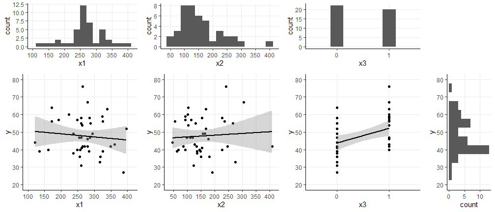
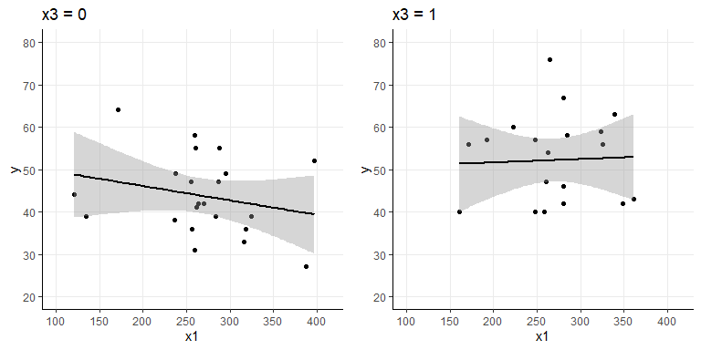

BIOST 2049 - Data Analysis #1
================
Matthew Ragoza
1/25/2022

-   [Prediction of HDL cholesterol in blood
    samples](#prediction-of-hdl-cholesterol-in-blood-samples)
    -   [Data visualization](#data-visualization)
    -   [Part a. Simple linear
        regression](#part-a.-simple-linear-regression)
    -   [Part b. Multiple linear
        regression](#part-b.-multiple-linear-regression)
    -   [Part c. Testing additional
        variable](#part-c.-testing-additional-variable)
    -   [Part d. Testing for
        interactions](#part-d.-testing-for-interactions)
    -   [Part e. Testing for
        confounding](#part-e.-testing-for-confounding)
    -   [Part f. Multiple linear models in one
        statement](#part-f.-multiple-linear-models-in-one-statement)
    -   [Part g. Estimating multiple linear
        equations](#part-g.-estimating-multiple-linear-equations)
    -   [Part h. Plotting multiple linear
        equations](#part-h.-plotting-multiple-linear-equations)
    -   [Part i. Test coincidence of fitted lines
        from f.](#part-i.-test-coincidence-of-fitted-lines-from-f.)
    -   [j. Test for parallelism of fitted lines
        from f.](#j.-test-for-parallelism-of-fitted-lines-from-f.)

# Prediction of HDL cholesterol in blood samples

The data set used in this analysis contains quantitative measures based
on 42 individual blood samples. The outcome variable of interest is the
level of high-density lipoprotein (HDL, *y*), commonly referred to as
“good” cholesterol. The covariates we will use to predict HDL levels are
total cholesterol level (*x*<sub>1</sub>), total triglyceride level
(*x*<sub>2</sub>), and a binary indicator called sinking pre-beta
(*x*<sub>3</sub>).

``` r
library('dplyr')
library('ggplot2')
library('gridExtra')

setwd('C:\\Users\\mtr22\\Code\\BIOST2049\\module-1\\data-analysis')
data <- read.csv('DA1.csv')
#data$x3 <- factor(data$x3)
data
```

    ##     y  x1  x2 x3
    ## 1  47 287 111  0
    ## 2  38 236 135  0
    ## 3  47 255  98  0
    ## 4  39 135  63  0
    ## 5  44 121  46  0
    ## 6  64 171 103  0
    ## 7  58 260 227  0
    ## 8  49 237 157  0
    ## 9  57 192 115  1
    ## 10 42 349 408  1
    ## 11 54 263 103  1
    ## 12 60 223 102  1
    ## 13 33 316 274  0
    ## 14 55 288 130  0
    ## 15 36 256 149  0
    ## 16 36 318 180  0
    ## 17 55 261 266  0
    ## 18 52 397 167  0
    ## 19 49 295 164  0
    ## 20 47 261 119  1
    ## 21 40 258 145  1
    ## 22 42 280 247  1
    ## 23 63 339 168  1
    ## 24 40 161  68  1
    ## 25 59 324  92  1
    ## 26 56 171  56  1
    ## 27 76 265 240  1
    ## 28 67 280 306  1
    ## 29 57 248  93  1
    ## 30 42 270 134  0
    ## 31 41 262 154  0
    ## 32 42 264  86  0
    ## 33 39 325 148  0
    ## 34 27 388 191  0
    ## 35 31 260 123  0
    ## 36 39 284 135  0
    ## 37 56 326 236  1
    ## 38 40 248  92  1
    ## 39 58 285 153  1
    ## 40 43 361 126  1
    ## 41 40 248 226  1
    ## 42 46 280 176  1

## Data visualization

``` r
blank <- ggplot() + theme_void()

# axes scales
y_limits = c(20, 80)
x1_limits = c(100, 415)
x2_limits = c(35, 415)
x3_limits = c(-0.5, 1.5)

y_ticks = seq(20, 80, 10)
x1_ticks = seq(0, 500, 50)
x2_ticks = seq(0, 500, 50)
x3_ticks = seq(0, 1, 1)

# histograms

plot_y <- data %>%
  ggplot(aes(y=y)) +
  geom_histogram(binwidth=5) +
  theme_classic() +
  theme(panel.grid.major=element_line()) +
  scale_y_continuous(breaks=y_ticks, limits=y_limits)

plot_x1 <- data %>%
  ggplot(aes(x=x1)) +
  geom_histogram(binwidth=20) +
  theme_classic() +
  theme(panel.grid.major=element_line()) +
  scale_x_continuous(breaks=x1_ticks, limits=x1_limits)

plot_x2 <- data %>%
  ggplot(aes(x=x2)) +
  geom_histogram(binwidth=25) +
  theme_classic() +
  theme(panel.grid.major=element_line()) +
  scale_x_continuous(breaks=x2_ticks, limits=x2_limits)

plot_x3 <- data %>%
  ggplot(aes(x=x3)) +
  geom_histogram(binwidth=0.25) +
  theme_classic() +
  theme(panel.grid.major=element_line()) +
  scale_x_continuous(breaks=x3_ticks, limits=x3_limits)

# scatter plots

plot_yx1 <- data %>%
  ggplot(aes(x=x1, y=y)) +
  geom_point() +
  geom_smooth(method='lm', color='black') +
  theme_classic() +
  theme(panel.grid.major=element_line()) +
  scale_y_continuous(breaks=y_ticks, limits=y_limits) +
  scale_x_continuous(breaks=x1_ticks, limits=x1_limits)

plot_yx2 <- data %>%
  ggplot(aes(x=x2, y=y)) +
  geom_point() +
  geom_smooth(method='lm', color='black') +
  theme_classic() +
  theme(panel.grid.major=element_line()) +
  scale_y_continuous(breaks=y_ticks, limits=y_limits) +
  scale_x_continuous(breaks=x2_ticks, limits=x2_limits)

plot_yx3 <- data %>%
  ggplot(aes(x=x3, y=y)) +
  geom_point() +
  geom_smooth(method='lm', color='black') +
  theme_classic() +
  theme(panel.grid.major=element_line()) +
  scale_y_continuous(breaks=y_ticks, limits=y_limits) +
  scale_x_continuous(breaks=x3_ticks, limits=x3_limits)

# arrange plots on grid

grid.arrange(
  plot_x1,  plot_x2,  plot_x3,  blank,
  plot_yx1, plot_yx2, plot_yx3, plot_y,
  nrow=2, heights=c(1.5, 3),
  ncol=4, widths=c(3, 3, 3, 1.5)
)
```

<!-- -->

## Part a. Simple linear regression

First, we would like to determine whether each of the covariates is a
significant predictor of HDL levels, ignoring the other covariates. We
can fit three simple linear regression models where each predicts the
outcome variable using a single covariate. Then, we can test whether the
resulting regression coefficients represent statistically significant
associations between the covariate and the outcome. We will test the
regression coefficients using two-sided t tests at a significance level
of *α* = 0.05. For each covariate, the null hypothesis is that the
regression coefficient is zero, while the alternative hypothesis is that
the coefficient is nonzero, implying a linear relationship with HDL
level.

``` r
model1 <- lm(y ~ x1, data=data)
summary(model1)
```

    ## 
    ## Call:
    ## lm(formula = y ~ x1, data = data)
    ## 
    ## Residuals:
    ##     Min      1Q  Median      3Q     Max 
    ## -18.649  -8.066  -1.267   7.827  28.189 
    ## 
    ## Coefficients:
    ##             Estimate Std. Error t value Pr(>|t|)    
    ## (Intercept) 52.47018    7.58057   6.922 2.41e-08 ***
    ## x1          -0.01758    0.02763  -0.636    0.528    
    ## ---
    ## Signif. codes:  0 '***' 0.001 '**' 0.01 '*' 0.05 '.' 0.1 ' ' 1
    ## 
    ## Residual standard error: 10.69 on 40 degrees of freedom
    ## Multiple R-squared:  0.01002,    Adjusted R-squared:  -0.01473 
    ## F-statistic: 0.4049 on 1 and 40 DF,  p-value: 0.5282

The first model was fit using *x*<sub>1</sub>, which is the total
cholesterol level. We will use the regression summary above to test
whether total cholesterol is a significant predictor of HDL level. The t
statistic indicates that the observed regression coefficient is -0.636
standard errors from the null hypothesis value of 0. The p-value of
0.528 means that we would have a 52.8% probability of observing a
coefficient this extreme if the null hypothesis were true. Therefore, we
do not reject the null hypothesis. We do not have evidence of a
significant linear relationship between total cholesterol level and HDL
level.

``` r
model2 <- lm(y ~ x2, data=data)
summary(model2)
```

    ## 
    ## Call:
    ## lm(formula = y ~ x2, data = data)
    ## 
    ## Residuals:
    ##     Min      1Q  Median      3Q     Max 
    ## -21.114  -7.812  -1.188   8.776  27.407 
    ## 
    ## Coefficients:
    ##              Estimate Std. Error t value Pr(>|t|)    
    ## (Intercept) 46.245193   3.887115  11.897 1.03e-14 ***
    ## x2           0.009782   0.022690   0.431    0.669    
    ## ---
    ## Signif. codes:  0 '***' 0.001 '**' 0.01 '*' 0.05 '.' 0.1 ' ' 1
    ## 
    ## Residual standard error: 10.71 on 40 degrees of freedom
    ## Multiple R-squared:  0.004625,   Adjusted R-squared:  -0.02026 
    ## F-statistic: 0.1859 on 1 and 40 DF,  p-value: 0.6687

The second model was fit using *x*<sub>2</sub>, which is the level of
blood triglycerides. Again, we refer to the regression summary to test
whether triglyceride level is a significant predictor of HDL level. The
t value indicates that the observed regression coefficient is 0.431
standard errors above the null hypothesis value of zero. The p-value of
0.669 implies that we would have a 66.9% probability of obtaining a test
statistic this drastic if the null hypothesis were true. Therefore, we
do not reject the null hypothesis, as we do not have evidence of a
significant linear relationship between total triglyceride level and HDL
level.

``` r
model3 <- lm(y ~ x3, data=data)
summary(model3)
```

    ## 
    ## Call:
    ## lm(formula = y ~ x3, data = data)
    ## 
    ## Residuals:
    ##      Min       1Q   Median       3Q      Max 
    ## -16.7727  -7.7727  -0.7727   5.6943  23.8500 
    ## 
    ## Coefficients:
    ##             Estimate Std. Error t value Pr(>|t|)    
    ## (Intercept)   43.773      2.099  20.851  < 2e-16 ***
    ## x3             8.377      3.042   2.754  0.00882 ** 
    ## ---
    ## Signif. codes:  0 '***' 0.001 '**' 0.01 '*' 0.05 '.' 0.1 ' ' 1
    ## 
    ## Residual standard error: 9.847 on 40 degrees of freedom
    ## Multiple R-squared:  0.1594, Adjusted R-squared:  0.1383 
    ## F-statistic: 7.583 on 1 and 40 DF,  p-value: 0.008822

The third model was fit using *x*<sub>3</sub>, which is the indicator of
sinking pre-beta. We repeat the procedure once more by using the
regression summary to test the regression coefficient. The test
statistic of 2.754 means that the observed coefficient on the sinking
pre-beta covariate is 2.754 standard errors above zero, the null
hypothesis value. The p-value of 0.00882 means that we would have less
than 1% chance of computing a test statistic this extreme if the null
hypothesis were true. Therefore, we reject the null hypothesis at a 5%
significance level. We have strong evidence of a linear relationship
between sinking pre-beta and HDL levels. The coefficient value of 8.377
can be interpreted as saying that the expected HDL levels of individuals
who have the sinking pre-beta indicator is 8.377 higher than those who
do not.

## Part b. Multiple linear regression

We now move on to test whether the combination of all three covariates
significantly predicts the HDL cholesterol level. To evaluate this, we
must first fit a multiple regression model using all three covariates as
predictors. For now we will assume there are no interactions between the
covariates. Then, we can perform an overall F test on the regression
model to check whether the set of covariates explains a significant
amount of the variance in the outcome variable.

``` r
model123 <- lm(y ~ x1 + x2 + x3, data=data)
summary(model123)
```

    ## 
    ## Call:
    ## lm(formula = y ~ x1 + x2 + x3, data = data)
    ## 
    ## Residuals:
    ##     Min      1Q  Median      3Q     Max 
    ## -14.140  -7.065  -1.226   6.284  22.616 
    ## 
    ## Coefficients:
    ##             Estimate Std. Error t value Pr(>|t|)    
    ## (Intercept) 48.86453    7.24985   6.740 5.54e-08 ***
    ## x1          -0.02731    0.03015  -0.906   0.3707    
    ## x2           0.01504    0.02485   0.605   0.5486    
    ## x3           8.14831    3.11224   2.618   0.0126 *  
    ## ---
    ## Signif. codes:  0 '***' 0.001 '**' 0.01 '*' 0.05 '.' 0.1 ' ' 1
    ## 
    ## Residual standard error: 9.992 on 38 degrees of freedom
    ## Multiple R-squared:  0.1777, Adjusted R-squared:  0.1128 
    ## F-statistic: 2.737 on 3 and 38 DF,  p-value: 0.05682

We will again use the regression summary to perform the overall F test.
The null hypothesis is that all of the covariates, taken together, do
not explain the variation in the outcome variable. In other words, all
of the regression coefficients on the covariates are simultaneously
zero. The alternative hypothesis is that the covariates do explain a
significant amount of variation in the outcome, or that at least one
regression coefficient is nonzero. The F-statistic indicates that the
observed MSR is 2.737 times the MSE. The p-value of 0.05682 indicates
that we would have a 5.682% probability of seeing an F-statistic this
extreme if the null hypothesis were true. At a 5% significance level, we
do not reject the null hypothesis. We do not have sufficient evidence to
conclude that the set of all three covariates explains a significant
proportion of the total variance in HDL levels.

## Part c. Testing additional variable

We would like to test whether sinking pre-beta is associated with HDL
levels after taking into account the combined contribution of the other
two covariates (total cholesterol and total triglyceride levels). To
investigate this question, we must first fit a regression model on the
two covariates we want to account for, then compare this reduced model
to the full model which contains all three covariates. We can then
evaluate the contribution of the additional covariate by applying a
single partial F test. The null hypothesis is that sinking pre-beta does
not significantly improve the ability to predict HDL levels in a model
that includes total cholesterol and triglyceride levels. The alternative
hypothesis is that it does improve the predictive ability in the full
model.

``` r
model12 <- lm(y ~ x1 + x2, data=data)
anova(model12, model123)
```

    ## Analysis of Variance Table
    ## 
    ## Model 1: y ~ x1 + x2
    ## Model 2: y ~ x1 + x2 + x3
    ##   Res.Df    RSS Df Sum of Sq      F  Pr(>F)  
    ## 1     39 4478.2                              
    ## 2     38 3793.9  1    684.37 6.8547 0.01263 *
    ## ---
    ## Signif. codes:  0 '***' 0.001 '**' 0.01 '*' 0.05 '.' 0.1 ' ' 1

We will use the ANOVA table above to perform the test. The p-value of
0.01263 indicates that we would have a 1.263% probability of obtaining
an F statistic this large if the null hypothesis were true. Therefore,
we reject the null hypothesis at a 5% significance level. This counts as
evidence that sinking pre-beta is associated with HDL levels after
taking into account total cholesterol and triglyceride levels, and that
including this additional covariate in the model improves the ability to
predict the outcome.

Since the partial F test is equivalent to a t test on the regression
coefficient, an alternative interpretation is that there is a nonzero
linear relationship between the covariate and the outcome in the full
model. The coefficient on sinking pre-beta in the full model is 8.148,
which implies that individuals who have this indicator tend to have
higher HDL levels by 8.148 than those who do not, after adjusting for
their total cholesterol and triglyceride levels.

## Part d. Testing for interactions

Next, we will investigate whether there are two different interactions
between the covariates when predicting HDL levels. We will fit a
multiple regression model that includes all three covariates, as well as
two additional terms. The two interaction terms we will consider are 1)
total cholesterol levels with sinking pre-beta and 2) total triglyceride
levels with sinking pre-beta. The interaction model can be expressed as:

*y* = *β*<sub>0</sub> + *β*<sub>1</sub>*x*<sub>1</sub> + *β*<sub>2</sub>*x*<sub>2</sub> + *β*<sub>3</sub>*x*<sub>3</sub> + *β*<sub>13</sub>*x*<sub>1</sub>*x*<sub>3</sub> + *β*<sub>23</sub>*x*<sub>2</sub>*x*<sub>3</sub> + *ϵ*
After fitting the interaction model, we will test whether the addition
of the interaction terms contributed significantly to the ability to
predict HDL levels. This will involve running a multiple partial F test
that compares the interaction model to a reduced model (the one with all
three covariates, but no interaction terms). The null hypothesis of this
test is that the interaction model does not explain significantly more
of the variance in HDL levels than the model with no interaction terms.
The alternative hypothesis is that the interaction model explains more
of the variance in the outcome, due to at least one significant
interaction between sinking pre-beta and the other covariates.

``` r
model_int <- lm(y ~ x1 + x2 + x3 + x1*x3 + x2*x3, data=data)
anova(model123, model_int)
```

    ## Analysis of Variance Table
    ## 
    ## Model 1: y ~ x1 + x2 + x3
    ## Model 2: y ~ x1 + x2 + x3 + x1 * x3 + x2 * x3
    ##   Res.Df    RSS Df Sum of Sq      F Pr(>F)
    ## 1     38 3793.9                           
    ## 2     36 3719.1  2     74.82 0.3621 0.6987

The ANOVA table above displays the results of the multiple partial F
test. The p-value of 0.6987 implies that we would have a 69.87% chance
of seeing an F statistic of this magnitude if the null hypothesis were
true. This means that we do not reject the null hypothesis, so we do not
have evidence of an interaction between sinking pre-beta and the other
covariates. In other words, the relationship between HDL levels and
total cholesterol or triglyceride levels does not depend on the presence
of sinking pre-beta.

## Part e. Testing for confounding

We would now like to consider whether total cholesterol and triglyceride
levels are confounding variables in the relationship between HDL levels
and sinking pre-beta. To investigate this question, we can compare the
regression model that predicts HDL levels from sinking pre-beta alone to
the one that includes sinking pre-beta, total cholesterol, and total
triglyceride levels. Specifically, we can check whether the regression
coefficient on sinking pre-beta changes when we include the potential
confounding variables in the model.

``` r
summary(model3)
```

    ## 
    ## Call:
    ## lm(formula = y ~ x3, data = data)
    ## 
    ## Residuals:
    ##      Min       1Q   Median       3Q      Max 
    ## -16.7727  -7.7727  -0.7727   5.6943  23.8500 
    ## 
    ## Coefficients:
    ##             Estimate Std. Error t value Pr(>|t|)    
    ## (Intercept)   43.773      2.099  20.851  < 2e-16 ***
    ## x3             8.377      3.042   2.754  0.00882 ** 
    ## ---
    ## Signif. codes:  0 '***' 0.001 '**' 0.01 '*' 0.05 '.' 0.1 ' ' 1
    ## 
    ## Residual standard error: 9.847 on 40 degrees of freedom
    ## Multiple R-squared:  0.1594, Adjusted R-squared:  0.1383 
    ## F-statistic: 7.583 on 1 and 40 DF,  p-value: 0.008822

``` r
summary(model123)
```

    ## 
    ## Call:
    ## lm(formula = y ~ x1 + x2 + x3, data = data)
    ## 
    ## Residuals:
    ##     Min      1Q  Median      3Q     Max 
    ## -14.140  -7.065  -1.226   6.284  22.616 
    ## 
    ## Coefficients:
    ##             Estimate Std. Error t value Pr(>|t|)    
    ## (Intercept) 48.86453    7.24985   6.740 5.54e-08 ***
    ## x1          -0.02731    0.03015  -0.906   0.3707    
    ## x2           0.01504    0.02485   0.605   0.5486    
    ## x3           8.14831    3.11224   2.618   0.0126 *  
    ## ---
    ## Signif. codes:  0 '***' 0.001 '**' 0.01 '*' 0.05 '.' 0.1 ' ' 1
    ## 
    ## Residual standard error: 9.992 on 38 degrees of freedom
    ## Multiple R-squared:  0.1777, Adjusted R-squared:  0.1128 
    ## F-statistic: 2.737 on 3 and 38 DF,  p-value: 0.05682

When we predict HDL levels solely based on sinking pre-beta, we arrive
at a regression coefficient of 8.377. When we include total cholesterol
and triglyceride levels in the model, the sinking pre-beta coefficient
decreases to 8.148. This is a 2.734% decrease in the effect of sinking
pre-beta. If we use 10% as a rule of thumb for detection of confounding,
this change in effect should not be considered evidence that total
cholesterol and triglyceride levels are confounding variables.

## Part f. Multiple linear models in one statement

It is possible to represent multiple linear equations in one model
statement by making use of interaction terms with dummy variables. For
instance, if we wanted to represent different linear relationships
between HDL (*y*) and total cholesterol level (*x*<sub>1</sub>)
depending on sinking pre-beta (*x*<sub>3</sub>), we could use the
following model:
*y* = *β*<sub>0</sub> + *β*<sub>1</sub>*x*<sub>1</sub> + *β*<sub>3</sub>*x*<sub>3</sub> + *β*<sub>13</sub>*x*<sub>1</sub>*x*<sub>3</sub>

Depending on the value of *x*<sub>3</sub>, this model changes into two
different linear equations relating *y* and *x*<sub>1</sub>:

$$
\\begin{align}
y\_{x_3=0} &= \\beta_0 + \\beta_1 x_1 \\\\
y\_{x_3=1} &= (\\beta_0 + \\beta_3) + (\\beta_1 + \\beta\_{13}) x_1
\\end{align}
$$

In this way, we can represent different linear relationships between HDL
cholesterol and total cholesterol using the dummy variable.

## Part g. Estimating multiple linear equations

We would now like to test out this theory by fitting the model described
above. We are fitting a multiple linear regression model that predicts
HDL levels based on total cholesterol level, sinking pre-beta, and the
interaction between total cholesterol and sinking pre-beta. We would
then like to verify that different linear equations are represented in
one model by extracting out the regression coefficients and plugging
them into the model statement for different values of *x*<sub>3</sub>.

``` r
model_two <- lm(y ~ x1 + x3 + x1*x3, data=data)
model_two
```

    ## 
    ## Call:
    ## lm(formula = y ~ x1 + x3 + x1 * x3, data = data)
    ## 
    ## Coefficients:
    ## (Intercept)           x1           x3        x1:x3  
    ##    52.88315     -0.03405     -2.86205      0.04199

After fitting the regression model, we have *β*<sub>0</sub> = 52.9,
*β*<sub>1</sub> =  − 0.0341, *β*<sub>3</sub> =  − 2.86, and
*β*<sub>13</sub> = 0.042. Thus, we can discover the two different linear
equations that are represented in this single model. First, we have the
following equation when sinking pre-beta is absent:

$$
\\begin{align}
y\_{x_3=0} &= \\beta_0 + \\beta_1 x_1 \\\\
y\_{x_3=0} &= 52.9 - 0.0341 x_1 \\\\
\\end{align}
$$

And we have this second equation when sinking pre-beta is present:

$$
\\begin{align}
y\_{x_3=1} &= (\\beta_0 + \\beta_3) + (\\beta_1 + \\beta\_{13}) x_1 \\\\
y\_{x_3=1} &= (52.9 - 2.86) + (-0.0341 + 0.042) x_1 \\\\
y\_{x_3=1} &= 50.04 + 0.0079 x_1
\\end{align}
$$

## Part h. Plotting multiple linear equations

We will now plot the observed HDL and total cholesterol data along with
the two linear equations that we fit depending on the presence or
absence of sinking pre-beta. The plots can be seen below.

``` r
plot0 <- data %>%
  filter(x3==0) %>%
  ggplot(aes(x=x1, y=y)) +
  geom_point() +
  geom_smooth(method='lm', color='black') +
  theme_classic() +
  theme(panel.grid.major=element_line()) +
  scale_y_continuous(breaks=y_ticks, limits=y_limits) +
  scale_x_continuous(breaks=x1_ticks, limits=x1_limits) +
  labs(title="x3 = 0")

plot1 <- data %>%
  filter(x3==1) %>%
  ggplot(aes(x=x1, y=y)) +
  geom_point() +
  geom_smooth(method='lm', color='black') +
  theme_classic() +
  theme(panel.grid.major=element_line()) +
  scale_y_continuous(breaks=y_ticks, limits=y_limits) +
  scale_x_continuous(breaks=x1_ticks, limits=x1_limits) +
  labs(title="x3 = 1")

grid.arrange(
  plot0, plot1, ncol=2
)
```

<!-- -->

On the left is the scatter plot and fitted line for the case where there
is an absense of sinking pre-beta. On the right is the scatter plot and
fitted line in the presence of sinking pre-beta. There are some
qualitative differences between the two fitted lines. The one on the
left has a negative slope, while the one on the right is nearly flat or
has positive slope. The y-intercept on the left is higher than the one
on the right. These visual differences are in line with the equations
that we produced using the coefficients of the fitted interaction model.

## Part i. Test coincidence of fitted lines from f.

To statistically analyze the two lines we fitted in a single model, we
can begin by testing for coincidence. This checks whether the two lines
are identical. If the two lines were identical, then the coefficients on
the terms involving the dummy variable *x*<sub>3</sub> would be
negligible. Therefore, we can test for coincidence by comparing the full
model to a model that was fit solely to *x*<sub>1</sub> without the
*x*<sub>3</sub> or *x*<sub>1</sub>*x*<sub>3</sub> terms, and check
whether the addition of these terms significantly increases the amount
of explained variance. This translates to a multiple partial F test. The
null hypothesis is that the coefficients on *x*<sub>1</sub> and
*x*<sub>1</sub>*x*<sub>3</sub> do not significantly contribute to
explaining the outcome variable (i.e. they are zero). The alternative
hypothesis is that at least on of those coefficients does significantly
improve the predictive performance and has a nonzero coefficient,
resulting in different lines for the different values of
*x*<sub>3</sub>.

``` r
anova(model1, model_two)
```

    ## Analysis of Variance Table
    ## 
    ## Model 1: y ~ x1
    ## Model 2: y ~ x1 + x3 + x1 * x3
    ##   Res.Df    RSS Df Sum of Sq      F  Pr(>F)  
    ## 1     40 4567.4                              
    ## 2     38 3768.0  2    799.36 4.0307 0.02585 *
    ## ---
    ## Signif. codes:  0 '***' 0.001 '**' 0.01 '*' 0.05 '.' 0.1 ' ' 1

The ANOVA table above shows the results of F test for coincidence. The
p-value of 0.02585 indicates that if the null hypothesis were true, we
would have a 2.59% probability of getting an F statistic this large. We
reject the null hypothesis at the significance level of 5%. This
constitutes evidence that the two lines represented in the model are not
identical, because at least one of the coefficients involving the
sinking pre-beta variable is nonzero.

## j. Test for parallelism of fitted lines from f.

Now that we know that the lines are not identical, we can investigate
them a step further by testing for parallelism. In this type of test, we
ask whether the slope of the model changes based on the interaction
term, ignoring whether the intercept changes. In order for the slope to
change, the coefficient on the interaction term
*x*<sub>1</sub>*x*<sub>3</sub> must be nonzero. Therefore, we can test
for parallelism by comparing the full model to a reduced model that does
not contain the interaction term, but still retains the *x*<sub>3</sub>
term to allow for different intercepts. We perform a single partial F
test to evaluate whether the additional term allowing for different
slopes significantly improves the ability to predict the outcome. The
null hypothesis is that the interaction term does not improve the amount
of explained variance in the outcome. The alternative hypothesis is that
the interaction term does increase the amount of explained variance.

``` r
model13 <- lm(y ~ x1 + x3, data=data)
anova(model13, model_two)
```

    ## Analysis of Variance Table
    ## 
    ## Model 1: y ~ x1 + x3
    ## Model 2: y ~ x1 + x3 + x1 * x3
    ##   Res.Df    RSS Df Sum of Sq      F Pr(>F)
    ## 1     39 3830.4                           
    ## 2     38 3768.0  1    62.425 0.6295 0.4324

The ANOVA table above contains the results of the partial F test for
parallelism. The p-value of 0.432 indicates that we would expect a 43.2%
probability of seeing an F statistic this large if the null hypothesis
were true. Therefore, we do not reject the null hypothesis, and we do
not have evidence that the linear relationship between HDL level and
total cholesterol has different slopes depending on the presence of
sinking pre-beta.
