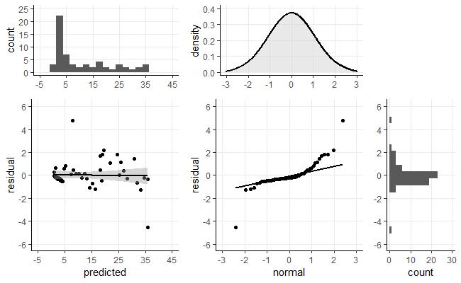

BIOST 2049 - Data Analysis #2
================
Matthew Ragoza
2/5/2022

-   [Animal study of toluene levels in blood after
    exposure](#animal-study-of-toluene-levels-in-blood-after-exposure)
    -   [Part a. Descriptive
        statistics](#part-a.-descriptive-statistics)
        -   [Quantitative variables](#quantitative-variables)
        -   [Categorical variables](#categorical-variables)
        -   [Data visualization](#data-visualization)
    -   [Part b. Exposure concentration and blood
        concentration](#part-b.-exposure-concentration-and-blood-concentration)
        -   [Simple linear regression](#simple-linear-regression)
        -   [Residual diagnostics](#residual-diagnostics)
    -   [Part c. Multiple linear
        regression](#part-c.-multiple-linear-regression)
        -   [Confounding variables](#confounding-variables)
        -   [Interaction terms](#interaction-terms)
    -   [Part d. Collinearity](#part-d.-collinearity)
        -   [Variance inflation factors](#variance-inflation-factors)
    -   [Part e. Model selection](#part-e.-model-selection)
    -   [Part f. Sensitivity to
        outliers](#part-f.-sensitivity-to-outliers)
        -   [Outlier detection](#outlier-detection)
        -   [Sensitivity analysis](#sensitivity-analysis)
    -   [Part g. Robust regression](#part-g.-robust-regression)
        -   [Quantitative comparison](#quantitative-comparison)
        -   [Visual comparison](#visual-comparison)
    -   [Part h. Potential data
        transformations](#part-h.-potential-data-transformations)

# Animal study of toluene levels in blood after exposure

The data used in this analysis are from a study of toluene levels in
blood after a 3-hour inhalation exposure in rats. In addition to the
level of toluene in blood (`bloodtol`, in ppm), the researchers measured
the concentration of toluene in the air during the exposure period
(renamed from `newppm` to `expostol`, in ppm), the age of the rat
(`age`, in days), the weight of the rat (`weight`, in grams), and an
indicator of snout size (`snoutsize`, either long or short).

``` r
library('dplyr')
library('tidyverse')
library('reshape2')
library('ggplot2')
library('gridExtra')
library('scales')
library('car')
library('MASS')

setwd('C:\\Users\\mtr22\\Code\\BIOST2049\\module-2\\data-analysis')
data <- read.csv('DA2.csv')
names(data)[5] <- 'expostol' # rename exposure concentration of toluene
data$snoutsize <- factor(data$snoutsize, levels=c(1, 2), labels=c('short', 'long'), ordered=TRUE)
data
```

    ##    rat bloodtol weight age    expostol snoutsize
    ## 1    1    5.553    393  90   24.000000      long
    ## 2    2    2.494    378  95    3.571429      long
    ## 3    3    0.609    450  85    7.142857      long
    ## 4    4    0.763    439  70   10.714286      long
    ## 5    5    0.420    397  75   14.285714      long
    ## 6    6    0.397    301  84   17.857143     short
    ## 7    7    0.503    406  80   21.428572      long
    ## 8    8    0.534    302  75   25.000000     short
    ## 9    9    0.531    382  74   28.571428      long
    ## 10  10    0.384    355  80   32.142857      long
    ## 11  11    0.215    700  75   35.714287      long
    ## 12  12    0.552    405  70   39.285713      long
    ## 13  13    0.420    387  85   42.857143      long
    ## 14  14    0.324    358  85   46.428570      long
    ## 15  15    0.387    311  85   48.759991     short
    ## 16  16    1.036    355  86   51.349873      long
    ## 17  17    1.065    440  86   53.571430      long
    ## 18  18    1.084    421  76   57.142857      long
    ## 19  19    0.944    370  86   60.714287      long
    ## 20  20    0.994    375  86   64.285713      long
    ## 21  21    1.146    368  83   67.857140      long
    ## 22  22    1.167    321  90   71.428574     short
    ## 23  23    0.833    359  83   75.000000      long
    ## 24  24    0.630    367  83   78.571426      long
    ## 25  25    0.955    363  73   82.142860      long
    ## 26  26    0.687    388  76   85.714287      long
    ## 27  27    0.723    404  86   89.285713      long
    ## 28  28    0.705    454  86   92.857140      long
    ## 29  29    0.696    389  86   96.428574      long
    ## 30  30    0.868    352  86   99.000000      long
    ## 31  31    8.223    367  83  110.000000      long
    ## 32  32   10.604    406  83  128.571430      long
    ## 33  33   12.085    371  83 1000.000000      long
    ## 34  34    7.936    408  83  185.714280      long
    ## 35  35   11.164    305  83  214.285720     short
    ## 36  36   10.289    391  84  242.857150      long
    ## 37  37   11.140    100  84  271.428560     short
    ## 38  38    9.647    347  84  300.000000     short
    ## 39  39   13.343    372  84  328.571440      long
    ## 40  40   11.292    331  84  357.142850     short
    ## 41  41    7.524    365  85  385.714290      long
    ## 42  42   10.783    348  85  414.285710     short
    ## 43  43    8.595    416  80  442.857150      long
    ## 44  44   15.616    344  75  510.000000     short
    ## 45  45   20.956    398  85  500.000000      long
    ## 46  46   30.274    417  93  520.000000      long
    ## 47  47   32.923    351  93  535.714290      long
    ## 48  48   28.619    378  93  500.000000      long
    ## 49  49   28.761    338  93  607.142880     short
    ## 50  50   25.402    433  93  700.000000      long
    ## 51  51   35.464    342  75  678.571410     short
    ## 52  52   32.706    319  85  714.285710     short
    ## 53  53   29.347    440  85  750.000000      long
    ## 54  54   26.481    363  85  785.714290      long
    ## 55  55   33.401    336  85  200.000000     short
    ## 56  56   39.541    378  86  857.142880      long
    ## 57  57   28.155    420  86  892.857120      long
    ## 58  58   25.629    346  86  928.571410     short
    ## 59  59   33.188    413  86  964.285710      long
    ## 60  60   33.505    600  75 1000.000000      long

## Part a. Descriptive statistics

We can begin to investigate the data using numerical and visual
descriptions of the covariates and their relationship to toluene levels
in blood after inhalation exposure.

### Quantitative variables

The table below displays measures of center and spread for each of the
quantitative variables in the data set. The mean blood toluene level was
11.00 ppm with a standard deviation of 12.62 ppm. The median of 6.54 ppm
was about 50% less than the mean, implying a highly right-skewed
distribution. The distributions of weight (mean = 380.55 g, std = 72.71
g) and age (mean = 83.40 days, std = 5.70 days) were more symmetric, as
seen by their similar means and medians (median weight = 373.50 g,
median age = 85 days). The mean exposure concentration was 292.48 ppm
with a standard deviation of 311.99 ppm. This distribution was also
highly right-skewed, as indicated by the lower median of 104.50 ppm.

``` r
data %>%
  group_by(rat) %>%
  select_if(is.numeric) %>%
  melt(id.vars='rat') %>%
  group_by(variable) %>%
  summarize(
    count=n(),
    mean=mean(value),
    std=sd(value),
    min=min(value),
    Q1=quantile(value, 0.25),
    Q2=quantile(value, 0.50),
    Q3=quantile(value, 0.75),
    max=max(value)
  ) %>%
  mutate_if(is.double, round, digits=2)
```

    ## # A tibble: 4 x 9
    ##   variable count  mean   std    min    Q1     Q2    Q3    max
    ##   <fct>    <int> <dbl> <dbl>  <dbl> <dbl>  <dbl> <dbl>  <dbl>
    ## 1 bloodtol    60  11    12.6   0.22   0.7   6.54  22.1   39.5
    ## 2 weight      60 381.   72.7 100    350.  374.   406    700  
    ## 3 age         60  83.4   5.7  70     82.2  85     86     95  
    ## 4 expostol    60 292.  312.    3.57  50.7 104.   502.  1000

### Categorical variables

The table below shows the counts and proportions of rats with each snout
size in the data set. Out of the 60 total rats in the study, 45 (75%)
had long snouts while 15 (25%) had short snouts.

``` r
data %>%
  group_by(rat) %>%
  select_if(is.factor) %>%
  melt(id.vars='rat') %>%
  group_by(variable, value) %>%
  summarize(
    .groups='drop_last',
    count=n()
  ) %>%
  mutate(
    proportion=count/sum(count)
  ) %>%
  ungroup() %>%
  mutate_if(is.double, label_percent())
```

    ## # A tibble: 2 x 4
    ##   variable  value count proportion
    ##   <fct>     <chr> <int> <chr>     
    ## 1 snoutsize long     45 75%       
    ## 2 snoutsize short    15 25%

### Data visualization

We can further analyze each variable by plotting their distributions as
histograms, which can be seen below. The histograms of each quantitative
variable match our expectations given the descriptive statistics: the
distributions of exposure concentration and blood concentration are
right-skewed, while the distributions of weight and age are roughly
symmetric.

We can also consider the joint distribution of each covariate with blood
toluene levels using scatter plots. Blood toluene levels appear to have
a strong positive association with exposure concentration, a weak
positive association with age, and a weak negative assoiation with snout
size (long snouts have lower blood toluene). Weight does not appear to
be linearly associated with blood toluene level, but there could be some
outliers in the extremes of the weight distribution that affect the
perception of this relationship.

``` r
blank <- ggplot() + theme_void()

# axes scales
y_limits  = c(0, 41) # bloodtol
x1_limits = c(75, 727) # weight
x2_limits = c(68, 97) # age
x3_limits = c(0, 1000) # expostol
x4_limits = c(0.5, 2.5) # snoutsize

# axes ticks
y_ticks  = seq(0, 40, 10)
x1_ticks = seq(100, 700, 150)
x2_ticks = seq(70, 100, 5)
x3_ticks = seq(0, 1000, 250)
x4_ticks = seq(1, 2, 1)

# bin widths
y_binwidth = (y_limits[2] - y_limits[1])/20
x1_binwidth = (x1_limits[2] - x1_limits[1])/20
x2_binwidth = (x2_limits[2] - x2_limits[1])/20
x3_binwidth = (x3_limits[2] - x3_limits[1])/20
x4_binwidth = (x4_limits[2] - x4_limits[1])/10

# histograms

plot_y <- data %>%
  ggplot(aes(y=bloodtol)) +
  geom_histogram(binwidth=y_binwidth) +
  theme_classic() +
  theme(panel.grid.major=element_line()) +
  scale_y_continuous(breaks=y_ticks, limits=y_limits) +
  scale_x_continuous(breaks=seq(0, 10, 5), limits=c(0, 10)) + 
  ylab(NULL)

plot_x1 <- data %>%
  ggplot(aes(x=weight)) +
  geom_histogram(binwidth=x1_binwidth) +
  theme_classic() +
  theme(panel.grid.major=element_line()) +
  scale_x_continuous(breaks=x1_ticks, limits=x1_limits) + 
  scale_y_continuous(breaks=seq(0, 25, 5), limits=c(0, 25)) + 
  xlab(NULL)

plot_x2 <- data %>%
  ggplot(aes(x=age)) +
  geom_histogram(binwidth=x2_binwidth) +
  theme_classic() +
  theme(panel.grid.major=element_line()) +
  scale_x_continuous(breaks=x2_ticks, limits=x2_limits) + 
  scale_y_continuous(breaks=seq(0, 25, 5), limits=c(0, 25)) + 
  ylab(NULL) + 
  xlab(NULL)

plot_x3 <- data %>%
  ggplot(aes(x=expostol)) +
  geom_histogram(binwidth=x3_binwidth) +
  theme_classic() +
  theme(panel.grid.major=element_line()) +
  scale_x_continuous(breaks=x3_ticks, limits=x3_limits) + 
  scale_y_continuous(breaks=seq(0, 25, 5), limits=c(0, 25)) + 
  ylab(NULL) + 
  xlab(NULL)

plot_x4 <- data %>%
  mutate(snoutsize=as.numeric(snoutsize)) %>%
  ggplot(aes(x=snoutsize)) +
  geom_histogram(binwidth=x4_binwidth) +
  theme_classic() +
  theme(panel.grid.major=element_line()) +
  scale_x_continuous(breaks=x4_ticks, limits=x4_limits, labels=levels(data$snoutsize)) + 
  scale_y_continuous(breaks=seq(0, 50, 25), limits=c(0, 50)) + 
  ylab(NULL) + 
  xlab(NULL)

# scatter plots

plot_yx1 <- data %>%
  ggplot(aes(x=weight, y=bloodtol)) +
  geom_point() +
  geom_smooth(method='lm', color='black') +
  theme_classic() +
  theme(panel.grid.major=element_line()) +
  scale_y_continuous(breaks=y_ticks, limits=y_limits) +
  scale_x_continuous(breaks=x1_ticks, limits=x1_limits)

plot_yx2 <- data %>%
  ggplot(aes(x=age, y=bloodtol)) +
  geom_point() +
  geom_smooth(method='lm', color='black') +
  theme_classic() +
  theme(panel.grid.major=element_line()) +
  scale_y_continuous(breaks=y_ticks, limits=y_limits) +
  scale_x_continuous(breaks=x2_ticks, limits=x2_limits) + 
  ylab(NULL)

plot_yx3 <- data %>%
  ggplot(aes(x=expostol, y=bloodtol)) +
  geom_point() +
  geom_smooth(method='lm', color='black') +
  theme_classic() +
  theme(panel.grid.major=element_line()) +
  scale_y_continuous(breaks=y_ticks, limits=y_limits) +
  scale_x_continuous(breaks=x3_ticks, limits=x3_limits) + 
  ylab(NULL)

plot_yx4 <- data %>%
  mutate(snoutsize=as.numeric(snoutsize)) %>%
  ggplot(aes(x=snoutsize, y=bloodtol)) +
  geom_point() +
  geom_smooth(method='lm', color='black') +
  theme_classic() +
  theme(panel.grid.major=element_line()) +
  scale_y_continuous(breaks=y_ticks, limits=y_limits) +
  scale_x_continuous(breaks=x4_ticks, limits=x4_limits, labels=levels(data$snoutsize)) + 
  ylab(NULL)

# arrange plots on grid

grid.arrange(
  plot_x1,  plot_x2,  plot_x3,  plot_x4,  blank,
  plot_yx1, plot_yx2, plot_yx3, plot_yx4, plot_y,
  nrow=2, heights=c(1.15, 2.35),
  ncol=5, widths=c(2.35, 2.20, 2.20, 2.20, 1.20)
)
```

<!-- -->

## Part b. Exposure concentration and blood concentration

The primary research question is whether there is a linear relationship
between levels of toluene in the blood and level of inhalation exposure.
From the scatter plot above, it appears that the expected concentration
of blood toluene increases linearly with the exposure concentration,
which is a key assumption of linear regression.

### Simple linear regression

We can fit a simple linear regression model to evaluate this
relationship, with the summary displayed below. The null hypothesis of
the F test is that the covariate (exposure concentration) does not
explain a significant amount of the variance in the outcome (blood
concentration). With the p-value of 2.2e-16, we reject the null
hypothesis at a significance level of *α* = 0.05. Therefore, we have
very strong evidence that toluene exposure concentration explains a
significant amount of the variance in blood concentration of toluene.
The *R*<sup>2</sup> of 0.7492 means that about 75% of the variance in
blood concentration of toluene is explained by exposure level.

``` r
model <- lm(bloodtol ~ expostol, data)
summary(model)
```

    ## 
    ## Call:
    ## lm(formula = bloodtol ~ expostol, data = data)
    ## 
    ## Residuals:
    ##     Min      1Q  Median      3Q     Max 
    ## -23.688  -2.340  -1.550   1.208  25.635 
    ## 
    ## Coefficients:
    ##             Estimate Std. Error t value Pr(>|t|)    
    ## (Intercept)  0.76422    1.13233   0.675    0.502    
    ## expostol     0.03501    0.00266  13.163   <2e-16 ***
    ## ---
    ## Signif. codes:  0 '***' 0.001 '**' 0.01 '*' 0.05 '.' 0.1 ' ' 1
    ## 
    ## Residual standard error: 6.374 on 58 degrees of freedom
    ## Multiple R-squared:  0.7492, Adjusted R-squared:  0.7449 
    ## F-statistic: 173.3 on 1 and 58 DF,  p-value: < 2.2e-16

### Residual diagnostics

As a follow-up check on the normality assumption of linear regression,
we can plot the residuals of the regression model below. On the left are
the Jack knife residuals plotted against the predicted values. The
fitted line has nearly zero slope, which suggests that the conditional
mean of the residuals is zero for all predicted values. There are no
systematic changes in residual variance with respect to the predicted
values, either. On the right is a Q-Q plot showing the residual
quantiles compared to the quantiles of a normal distribution. Most of
the points follow a roughly linear pattern, except for two prominent
outlier residuals. Overall, it does not appear that the normality
assumption of linear regression was violated.

``` r
data$predicted <- fitted(model)
data$residual <- studres(model)
normal <- qnorm(ppoints(60)[order(data$residual)])

# axes scales
r_limits = c(-6, 6)
p_limits = c(-5, 45)
n_limits = c(-3, 3)

# axes ticks
r_ticks = seq(r_limits[1], r_limits[2], 2)
p_ticks = seq(p_limits[1], p_limits[2], 10)
n_ticks = seq(n_limits[1], n_limits[2], 1)

# bin widths
r_binwidth = (r_limits[2] - r_limits[1])/20
p_binwidth = (p_limits[2] - p_limits[1])/20
n_binwidth = (n_limits[2] - n_limits[1])/20

# histogram
plot_r <- data %>%
  ggplot(aes(y=residual)) +
  geom_histogram(binwidth=r_binwidth) +
  theme_classic() +
  theme(panel.grid.major=element_line()) +
  scale_y_continuous(breaks=r_ticks, limits=r_limits) + 
  scale_x_continuous(limits=c(0, 30)) +
  ylab(NULL)

plot_p <- data %>%
  ggplot(aes(x=predicted)) +
  geom_histogram(binwidth=p_binwidth) +
  theme_classic() +
  theme(panel.grid.major=element_line()) +
  scale_x_continuous(breaks=p_ticks, limits=p_limits) + 
  scale_y_continuous(limits=c(0, 25)) +
  xlab(NULL)

plot_n <- data %>%
  ggplot(aes(x=normal)) +
  geom_density(size=0.8, fill='lightgray', alpha=1/2) +
  theme_classic() +
  theme(panel.grid.major=element_line()) +
  scale_x_continuous(breaks=n_ticks, limits=n_limits) +
  scale_y_continuous(limits=c(0, 0.4)) + 
  xlab(NULL)

plot_pr <- data %>%
  ggplot(aes(x=predicted, y=residual)) +
  geom_point() +
  geom_smooth(method='lm', color='black') +
  theme_classic() +
  theme(panel.grid.major=element_line()) +
  scale_y_continuous(breaks=r_ticks, limits=r_limits) +
  scale_x_continuous(breaks=p_ticks, limits=p_limits)

# Q-Q plot
plot_rn <- data %>%
  ggplot(aes(sample=residual)) +
  geom_qq_line(distribution=qnorm, size=1) +
  geom_qq(distribution=qnorm) +
  theme_classic() +
  theme(panel.grid.major=element_line()) +
  scale_y_continuous(breaks=r_ticks, limits=r_limits) +
  scale_x_continuous(breaks=n_ticks, limits=n_limits) +
  xlab('normal') + 
  ylab('residual')

# arrange plots on grid

grid.arrange(
  plot_p, plot_n, blank,
  plot_pr, plot_rn, plot_r,
  nrow=2, heights=c(1.5, 3),
  ncol=3, widths=c(3, 3, 1.5)
)
```

<!-- -->

## Part c. Multiple linear regression

We would now like to include the other covariates into our model to
assess their influence on the relationship between inhalation exposure
to toluene and blood concentration.

### Confounding variables

We will fit a multiple linear regression model that includes each
covariate, comparing this full model to the previous reduced model in
order to check for confounding. The summary of the full multivariate
model is shown below. The regression coefficient on the exposure
concentration in the multivariate model is 0.0331, compared to 0.0350 in
the single variable model. This is a decrease of 5.42%, which is not
suggestive of confounding on the part of the added variables. Out of all
of the regression coefficients, the only signifncant associations in the
multivariate model are exposure level (p=2e-16) and age (p=0.0430). At a
5% significance level, we reject the null hypothesis that there is no
linear association between these covariates and blood toluene levels,
but we do not reject the null hypothesis for the weight and snout size
covariates.

``` r
multi_model <- lm(bloodtol ~ expostol + age + weight + snoutsize, data)
summary(multi_model)
```

    ## 
    ## Call:
    ## lm(formula = bloodtol ~ expostol + age + weight + snoutsize, 
    ##     data = data)
    ## 
    ## Residuals:
    ##      Min       1Q   Median       3Q      Max 
    ## -21.2982  -2.5936  -0.6433   2.0629  22.7613 
    ## 
    ## Coefficients:
    ##               Estimate Std. Error t value Pr(>|t|)    
    ## (Intercept) -26.889386  14.588417  -1.843   0.0707 .  
    ## expostol      0.033114   0.002732  12.122   <2e-16 ***
    ## age           0.312591   0.150875   2.072   0.0430 *  
    ## weight        0.007849   0.013948   0.563   0.5759    
    ## snoutsize.L  -2.402393   1.608226  -1.494   0.1409    
    ## ---
    ## Signif. codes:  0 '***' 0.001 '**' 0.01 '*' 0.05 '.' 0.1 ' ' 1
    ## 
    ## Residual standard error: 6.201 on 55 degrees of freedom
    ## Multiple R-squared:  0.7749, Adjusted R-squared:  0.7585 
    ## F-statistic: 47.32 on 4 and 55 DF,  p-value: < 2.2e-16

As a further check for the importance of the added covariates, we can
perform a multiple partial F test, which is shown in the ANOVA table
below. The null hypothesis is that adding age, weight, and snout size
into a model that predicts blood concentration of toluene from exposure
concentration does not explain more of the outcome variance. The
alternative hypothesis is that the model with these additional
covariates explains significantly more variance than the univariate
model. The resulting p-value of 0.112 indicates that we would have an
11.2% probability of observing an F statistic this large if the null
hypothesis were true. Therefore, we do not reject the null hypothesis at
the 5% significance level, and we do not have evidence that the added
variables explain more of the outcome variance than exposure
concentration alone.

``` r
anova(model, multi_model) %>%
  mutate_if(is.double, round, digits=3)
```

    ## Analysis of Variance Table
    ## 
    ## Model 1: bloodtol ~ expostol
    ## Model 2: bloodtol ~ expostol + age + weight + snoutsize
    ##   Res.Df    RSS Df Sum of Sq    F Pr(>F)
    ## 1     58 2356.1                         
    ## 2     55 2115.1  3    241.07 2.09  0.112

### Interaction terms

We will now add interaction terms to the multivariate model to check
whether any of the covariates has an interaction effect with inhalation
exposure. To check for the presence of interactions, we can perform a
multiple partial F test comparing the interaction model with the model
with all covariates, but no interaction terms. The null hypothesis is
that the model with interactions terms does not explain more of the
variance in blood toluene levels than the model without interaction
terms. The results of the test are seen in the ANOVA table below. The
p-value of 0.551 implies that we would have a 55.1% chance of obtaining
an F statistic this large if the null hypothesis were true. We do not
reject the null hypothesis at a 5% significance level, so there is no
evidence of an interaction between exposure concentration and the other
covariates.

``` r
inter_model <- lm(
  bloodtol ~ expostol + age + weight + snoutsize + 
    expostol*age + expostol*weight + expostol*snoutsize,
  data
)
anova(multi_model, inter_model) %>%
  mutate_if(is.double, round, digits=3)
```

    ## Analysis of Variance Table
    ## 
    ## Model 1: bloodtol ~ expostol + age + weight + snoutsize
    ## Model 2: bloodtol ~ expostol + age + weight + snoutsize + expostol * age + 
    ##     expostol * weight + expostol * snoutsize
    ##   Res.Df    RSS Df Sum of Sq     F Pr(>F)
    ## 1     55 2115.1                          
    ## 2     52 2032.0  3    83.092 0.709  0.551

## Part d. Collinearity

We can begin to investigate collinearity by creating a correlation
matrix of the covariates. The strongest correlation coefficient is 0.543
between snoutsize and weight and the second largest is 0.210 between age
and exposure level. There is a weak negative correlation of -0.207
between age and weight. There is essentially no correlation between
snoutsize and age or exposure level.

``` r
data %>%
  dplyr::select(c('expostol', 'age', 'weight', 'snoutsize')) %>%
  mutate(snoutsize=as.numeric(snoutsize)) %>%
  cor() %>%
  data.frame() %>%
  mutate_if(is.double, round, digits=3)
```

    ##           expostol    age weight snoutsize
    ## expostol     1.000  0.210  0.065    -0.121
    ## age          0.210  1.000 -0.207    -0.014
    ## weight       0.065 -0.207  1.000     0.543
    ## snoutsize   -0.121 -0.014  0.543     1.000

### Variance inflation factors

Correlations are insufficient to detect all forms of collinearity in a
multiple regression model, so we can calculate the variance inflation
factors (VIFs) as well. The VIFs for each covariate in the multiple
regression model are shown below. The largest VIF is on the weight
variable, with a value of 1.58. However, this is not large enough to
raise concerns about collinearity affecting our model. We can conclude
that multicollinearity is not an issue in this data set.

``` r
multi_model %>%
  vif() %>%
  data.frame() %>%
  rename(VIF='.') %>%
  mutate_if(is.numeric, round, digits=2)
```

    ##            VIF
    ## expostol  1.11
    ## age       1.14
    ## weight    1.58
    ## snoutsize 1.51

## Part e. Model selection

So far, we have found that toluene exposure concentration is strongly
correlated with levels of toluene in the blood, and age is weakly
correlated with this outcome. However, the multivariate regression model
did not explain more variance in the outcome than the univariate model.
We did not detect a significant association between blood toluene levels
and weight or snout size, and there was no evidence of confounding on
the part of these variables. Furthermore, there was no evidence of an
interaction between exposure level and any other covariate. Therefore,
the best model for fitting this data set is the one that predicts blood
toluene only from exposure level.

Let *ŷ* be the predicted blood concentration of toluene and *x* be the
level of inhalation exposure to toluene, both in ppm. Then the selected
regression model is described by the following equation:

*ŷ* = 0.03501*x* + 0.76422

``` r
best_model <- model
best_model
```

    ## 
    ## Call:
    ## lm(formula = bloodtol ~ expostol, data = data)
    ## 
    ## Coefficients:
    ## (Intercept)     expostol  
    ##     0.76422      0.03501

## Part f. Sensitivity to outliers

From the previous residual diagnostics, it seems that the simple linear
regression model could be affected by outliers. In particular, there
were two likely outliers that showed up in the residual vs. predicted
values plot and the Q-Q plot.

### Outlier detection

We can test whether these are truly outliers by performing t tests on
the Jack knife residuals using a Bonferroni correction. For each
residual, the null hypothesis is that the residual is zero. I computed
the p-value of each residual under the null hypothesis, then I displayed
the data rows for which the p-value was less than the significance level
of 5%. The detected outliers are shown in the table below. As expected,
two data points were detected as outliers. Rat 33 is an outlier because
it has a relatively low blood concentration of toluene despite having
the maximum exposure concentration. Rat 55 is an outlier for the
opposite reason: it has a high blood concentration despite its lower
exposure level.

``` r
n = 60
k = 4
alpha = 0.05/n # Bonferroni correction
data$residual_p <- pt(1 - abs(data$residual), df=n-k-2)
data[data$residual_p < alpha/2,]
```

    ##    rat bloodtol weight age expostol snoutsize predicted  residual   residual_p
    ## 33  33   12.085    371  83     1000      long 35.772769 -4.541938 0.0004137724
    ## 55  55   33.401    336  85      200     short  7.765929  4.755701 0.0002125420

### Sensitivity analysis

To determine whether these outliers are influential points, we can
perform a sensitivity analysis. For each detected outlier, this involves
comparing a model fit without that outlier in the data set to the
original model fit to the full data set. We will compare the models
visually using the scatter plots and fitted lines shown below. When rat
33 was removed from the data, the slope of the fitted line increased
very slightly. There was almost no change whatsoever in the fitted line
when rat 55 was dropped from the data. There was a slight narrowing of
the standard error of the fitted lines when either outlier were dropped.
Overall, neither of these outliers had a strong influence one fitted
regression model.

``` r
rat33 <- data[data$rat == 33,]
rat55 <- data[data$rat == 55,]
data_no33 <- data[data$rat != 33,]
data_no55 <- data[data$rat != 55,]
model_no33 <- lm(bloodtol ~ expostol, data_no33)
model_no55 <- lm(bloodtol ~ expostol, data_no55)

# scatter plots

plot_yx3 <- data %>%
  ggplot(aes(x=expostol, y=bloodtol)) +
  geom_point() +
  geom_smooth(method='lm', color='black') +
  theme_classic() +
  theme(panel.grid.major=element_line()) +
  scale_y_continuous(breaks=y_ticks, limits=y_limits) +
  scale_x_continuous(breaks=x3_ticks, limits=x3_limits) +
  ggtitle('full data')

plot_yx3_no33 <- data_no33 %>%
  ggplot(aes(x=expostol, y=bloodtol)) +
  geom_point() +
  geom_smooth(method='lm', color='black') +
  geom_point(aes(x=rat33$expostol, y=rat33$bloodtol), color='red', shape=4) +
  theme_classic() +
  theme(panel.grid.major=element_line()) +
  scale_y_continuous(breaks=y_ticks, limits=y_limits) +
  scale_x_continuous(breaks=x3_ticks, limits=x3_limits) + 
  ylab(NULL) +
  ggtitle('no rat 33')

plot_yx3_no55 <- data_no55 %>%
  ggplot(aes(x=expostol, y=bloodtol)) +
  geom_point() +
  geom_smooth(method='lm', color='black') +
  geom_point(aes(x=rat55$expostol, y=rat55$bloodtol), color='red', shape=4) +
  theme_classic() +
  theme(panel.grid.major=element_line()) +
  scale_y_continuous(breaks=y_ticks, limits=y_limits) +
  scale_x_continuous(breaks=x3_ticks, limits=x3_limits) + 
  ylab(NULL) +
  ggtitle('no rat 55')

# arrange plots on grid

grid.arrange(
  plot_yx3, plot_yx3_no33, plot_yx3_no55,
  nrow=1, heights=c(3),
  ncol=3, widths=c(3, 3, 3)
)
```

<!-- -->

## Part g. Robust regression

As an alternative to ordinary least squares, we can fit a linear
regression model using robust regression. These methods are less
sensitive to outliers than standard least squares approaches.

### Quantitative comparison

After fitting the same model statement as before but using robust
regression, we can compare to the simple linear regression model. The
regression coefficient on exposure concentration of toluene was 0.0362
using robust regression, which is 3.34% higher than in the simple model.
There is a near-perfect correlation between the predictions of the
robust model and the simple model. Although the coefficient estimates
and predictions are not all that different, the standard error on the
coefficients is about half the size in the robust model as the simple
model.

``` r
robust_model <- rlm(bloodtol ~ expostol, data)
summary(robust_model)
```

    ## 
    ## Call: rlm(formula = bloodtol ~ expostol, data = data)
    ## Residuals:
    ##      Min       1Q   Median       3Q      Max 
    ## -23.7854  -1.6624  -0.5817   1.9762  26.4578 
    ## 
    ## Coefficients:
    ##             Value   Std. Error t value
    ## (Intercept) -0.2886  0.6104    -0.4727
    ## expostol     0.0362  0.0014    25.2191
    ## 
    ## Residual standard error: 2.629 on 58 degrees of freedom

``` r
cor(fitted(model), fitted(robust_model))
```

    ## [1] 1

### Visual comparison

In the scatter plots below, we compare lines fit to the full data set
either with the simple method or robust regression. The lines are nearly
identical between the two methods, but it is evident that the standard
error on the linear model is lower when using robust regression. One
side effect of outliers is to increase the standard error on the
regression coefficients. Therefore, the decreased standard error in the
robust model can be viewed as a reduction in outlier sensitivity, even
though the parameter estimates are similar.

``` r
# scatter plots

plot_yx3 <- data %>%
  ggplot(aes(x=expostol, y=bloodtol)) +
  geom_point() +
  geom_smooth(method='lm', color='black') +
  theme_classic() +
  theme(panel.grid.major=element_line()) +
  scale_y_continuous(breaks=y_ticks, limits=y_limits) +
  scale_x_continuous(breaks=x3_ticks, limits=x3_limits) +
  ggtitle('simple')

plot_yx3_robust <- data %>%
  ggplot(aes(x=expostol, y=bloodtol)) +
  geom_point() +
  geom_smooth(method='rlm', color='black') +
  theme_classic() +
  theme(panel.grid.major=element_line()) +
  scale_y_continuous(breaks=y_ticks, limits=y_limits) +
  scale_x_continuous(breaks=x3_ticks, limits=x3_limits) + 
  ylab(NULL) +
  ggtitle('robust')

# arrange plots on grid

grid.arrange(
  plot_yx3, plot_yx3_robust,
  nrow=1, heights=c(3),
  ncol=2, widths=c(3, 3)
)
```

<!-- -->

## Part h. Potential data transformations

Based on the right-skewness of the distributions of blood concentration
and exposure concentration of toluene, a data transformation could be
applicable. A log transformation of both variables could potentially
reduce their skewness, and would not require a preliminary shift
transformation since the data are confined to positive values. The log
transformation would change the interpretation of the model towards
relative changes in the concentration of toluene. This is not an unusual
way to talk about concentrations of pollutants or pharmacologically
active ingredients. However, the reduction in model interpretability and
robustness to outliers might outweight the benefits that could be
attained by applying the transformation.

\_
