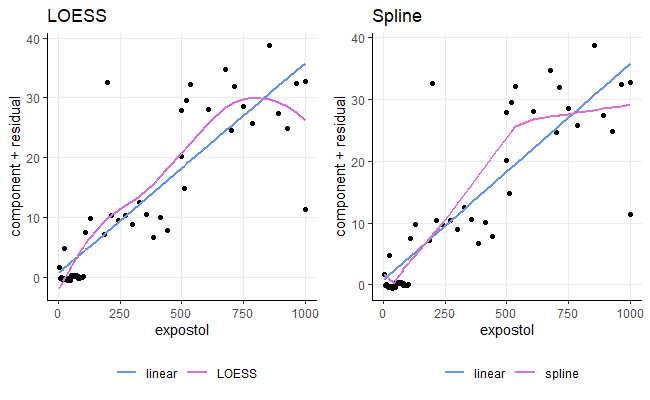
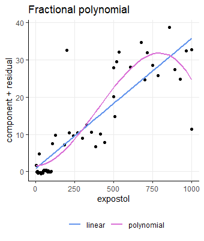
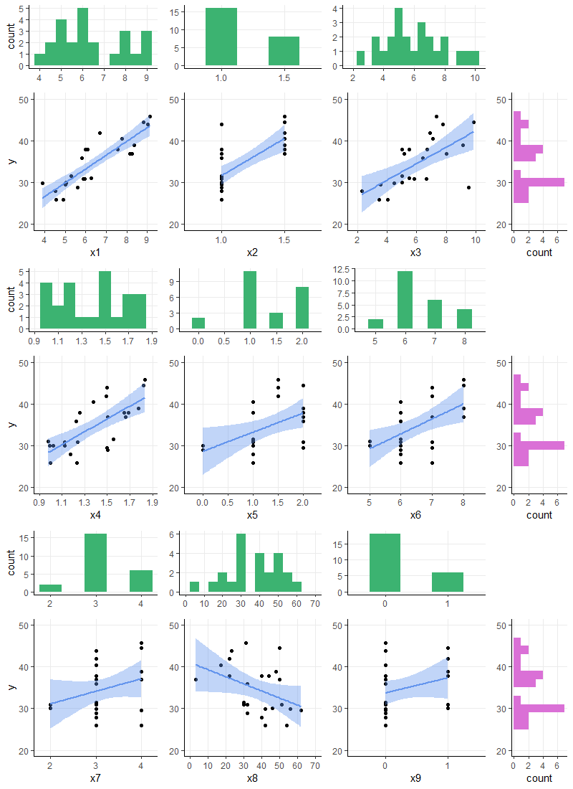
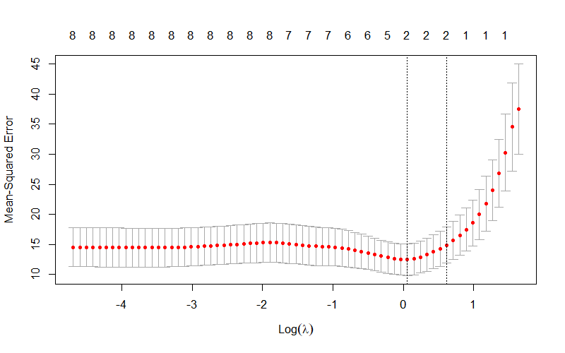
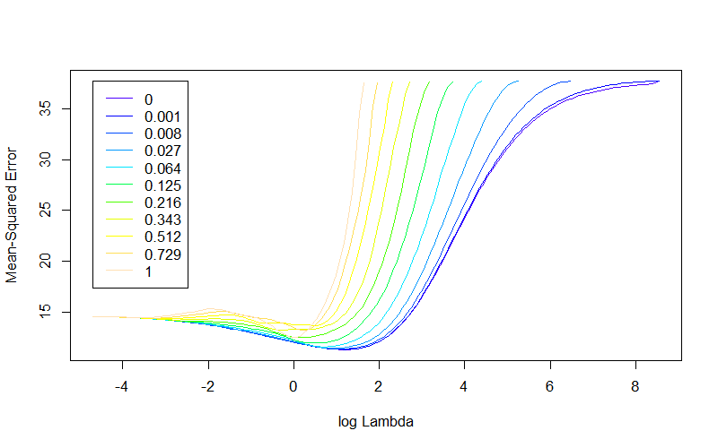
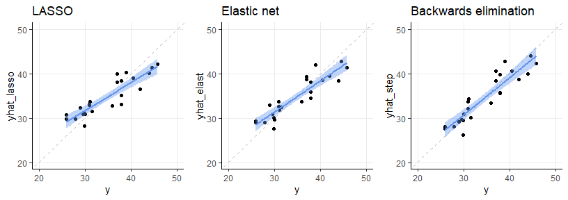

BIOST 2049 - Data Analysis #3
================
Matthew Ragoza
2/22/2022

-   [Toluene levels in blood after exposure,
    cont.](#toluene-levels-in-blood-after-exposure-cont.)
    -   [LOESS smoother and linear
        splines](#loess-smoother-and-linear-splines)
    -   [Fractional polynomial model](#fractional-polynomial-model)
    -   [Model selection](#model-selection)
-   [Predicting home prices in Erie,
    PA](#predicting-home-prices-in-erie-pa)
    -   [Taxes, number of rooms, and age of
        home](#taxes-number-of-rooms-and-age-of-home)
    -   [Comparison to taxes-only
        model](#comparison-to-taxes-only-model)
    -   [Full model with all
        covariates](#full-model-with-all-covariates)
        -   [Detecting collinearity](#detecting-collinearity)
        -   [Fixing collinearity issue](#fixing-collinearity-issue)
    -   [Variable selection strategies](#variable-selection-strategies)
        -   [Strategy 1: LASSO](#strategy-1-lasso)
        -   [Strategy 2: Elastic net](#strategy-2-elastic-net)
        -   [Strategy 3: Backwards
            elimination](#strategy-3-backwards-elimination)

# Toluene levels in blood after exposure, cont.

In the first part of this analysis, we will reuse the data set from the
previous analysis. The study was on toluene levels in blood after a
3-hour inhalation exposure in rats. The researchers measured toluene
levels in blood (`bloodtol`, in ppm), concentration of toluene in the
air during the exposure period (renamed from `newppm` to `expostol`, in
ppm), the age of the rat (`age`, in days), the weight of the rat
(`weight`, in grams), and an indicator of snout size (`snoutsize`,
either long or short).

``` r
library('dplyr')
library('tidyverse')
library('reshape2')
library('ggplot2')
library('gridExtra')
library('scales')
library('stats')
library('lspline')
library('mfp')
library('car')
library('glmnet')
library('glmnetUtils')

setwd('C:\\Users\\mtr22\\Code\\BIOST2049\\module-3\\data-analysis')
data <- read.csv('DA2.csv')
names(data)[5] <- 'expostol' # rename exposure concentration of toluene
data$snoutsize <- factor(data$snoutsize, levels=c(1, 2), labels=c('short', 'long'), ordered=TRUE)
```

## LOESS smoother and linear splines

I created three models of varying types that each predict the blood
toluene levels from exposure level. The first is a simple linear
regression model, which is treated as the baseline. Next is a
locally-weighted scatterplot smoothing (LOESS) model, which is a
nonparametric approach to regression that fits locally weighted
polynomial models to consecutive neighborhoods of data points. The third
model is a linear model that includes linear spline terms, allowing the
overall predictive model to follow a piecewise linear shape rather than
a simple line.

``` r
model_lm <-    lm(bloodtol ~ expostol, data)
model_lo <- loess(bloodtol ~ expostol, data)
model_sp <-    lm(bloodtol ~ qlspline(expostol, q=5, marginal=TRUE), data)
model_lo
```

    ## Call:
    ## loess(formula = bloodtol ~ expostol, data = data)
    ## 
    ## Number of Observations: 60 
    ## Equivalent Number of Parameters: 4.47 
    ## Residual Standard Error: 5.646

After fitting each of these models, I compared them in the component
plus residual plots below. These plots show the shape of the nonlinear
models compared to the baseline linear model and the underlying partial
residuals of the linear model.

``` r
component = coef(model_lm)['expostol'] * data$expostol
residual = residuals(model_lm)

yhat_lm = fitted(model_lm)
yhat_lo = fitted(model_lo)
yhat_sp = fitted(model_sp)

plot_lo <- data %>%
    ggplot(aes(x=expostol)) +
    geom_point(aes(y=component+residual)) +
    geom_line(aes(y=yhat_lm, color='linear'), size=1) +
    geom_line(aes(y=yhat_lo, color='LOESS'), size=1) +
    scale_color_manual("", 
        breaks=c("linear", "LOESS"),
        values=c("cornflowerblue", "orchid")
    ) +
    labs(title='LOESS') + 
    theme_classic() +
    theme(
        panel.grid.major=element_line(),
        legend.position='bottom'
    )

plot_sp <- data %>%
    ggplot(aes(x=expostol)) +
    geom_point(aes(y=component+residual)) +
    geom_line(aes(y=yhat_lm, color='linear'), size=1) +
    geom_line(aes(y=yhat_sp, color='spline'), size=1) +
    scale_color_manual("", 
        breaks=c("linear", "spline"),
        values=c("cornflowerblue", "orchid")
    ) +
    labs(title='Spline') + 
    theme_classic() +
    theme(
        panel.grid.major=element_line(),
        legend.position='bottom'
    ) 

grid.arrange(
  plot_lo, plot_sp,
  nrow=1, ncol=2
)
```

<!-- -->

It is clear from these plots that the LOESS and spline models are
nonlinear, since their shape and direction changes with respect to
different levels of the exposure concentration variable. Both of the
nonlinear models have a higher initial slope that starts ito decline in
the exposure level range of 500 to 750 ppm. In the case of the LOESS
model, the curvature completely inverts by around 750 ppm, implying that
continuing increases in the exposure concentration are predicted to
result in lower blood concentration. This is a surprising and physically
improbable prediction, which leads me to believe that the LOESS model is
not better than the baseline model.

## Fractional polynomial model

Next, I created a 2nd degree fractional polynomial model that predicts
blood concentration of toluene from exposure level. I enabled verbose
output so that the variable selection procedure can be investigated and
insights gained about the resulting model.

``` r
model_fp <- mfp(bloodtol ~ fp(expostol, df=4), data=data, verbose=TRUE)
```

    ## 
    ##  Variable    Deviance    Power(s)
    ## ------------------------------------------------
    ## Cycle 1
    ##  expostol             
    ##              9394.672     
    ##              2356.143    1
    ##              2176.33     0.5
    ##              1818.989    2 3
    ## 
    ## 
    ## Tansformation
    ##          shift scale
    ## expostol     0   100
    ## 
    ## Fractional polynomials
    ##          df.initial select alpha df.final power1 power2
    ## expostol          4      1  0.05        4      2      3
    ## 
    ## 
    ## Transformations of covariates:
    ##                                          formula
    ## expostol I((expostol/100)^2)+I((expostol/100)^3)
    ## 
    ## 
    ## Deviance table:
    ##           Resid. Dev
    ## Null model    9394.672
    ## Linear model  2356.143
    ## Final model   1818.989

As seen in the model fitting output, there were four different models
compared in the selection procedure. Their model statements are as
follows:
$$
\\begin{align}
    y &= \\beta_0 + \\epsilon \\\\
    y &= \\beta_0 + \\beta_1x + \\epsilon \\\\
    y &= \\beta_0 + \\beta_1\\sqrt{x} + \\epsilon \\\\
    y &= \\beta_0 + \\beta_1 x^2 + \\beta_2 x^2 + \\epsilon
\\end{align}
$$
The null model (consisting of only an intercept term) had deviance 9394.
The linear model had deviance 2356. The square root model had deviance
of 2176. The final model, which had a quadratic term and a cubic term,
had deviance of 1818, which is why it was selected as the final model.
The final model predictions compared to the linear model are shown in
the scatter plot below.

``` r
yhat_fp = fitted(model_fp)

plot_fp <- data %>%
    ggplot(aes(x=expostol)) +
    geom_point(aes(y=component+residual)) +
    geom_line(aes(y=yhat_lm, color='linear'), size=1) +
    geom_line(aes(y=yhat_fp, color='polynomial'), size=1) +
    scale_color_manual("", 
        breaks=c("linear", "polynomial"),
        values=c("cornflowerblue", "orchid")
    ) +
    labs(title='Fractional polynomial') + 
    theme_classic() +
    theme(
        panel.grid.major=element_line(),
        legend.position='bottom'
    )

grid.arrange(
  plot_fp,
  nrow=1, ncol=1
)
```

<!-- -->

The plot of the fractional polynomial model shows that it is very
nonlinear. Similar to the LOESS model, the predicted trend completely
changes in direction around an exposure concentration level of 750 ppm.
This is not a physically plausible prediction, so it seems that the
fractional polynomial method has overfit the data set.

## Model selection

Out of the four models that I fit so far- linear, LOESS, spline, and
fractional polynomial- I would rule out the LOESS and fractional
polynomial models first, because their change in curvature represents a
physically unrealistic prediction about the relationship between
exposure to toluene and its concentration in the blood. The spline model
does not change directions, but merely levels off at the higher exposure
concentrations. Therefore, it is slightly more credible than the other
nonlinear models. However, I don’t think any of the plots of the
nonlinear models are credible enough to warrant their use in place of
the linear model. I think that the nonlinear models were simply more
affected by outliers in the data, and they would probably have less
generalizability than the linear model. Therefore I would select the
linear model for this data set.

# Predicting home prices in Erie, PA

The second half of this analysis deals with a data set of property
listings in Erie, PA. We would like to fit a regression model that
accurately predicts the sales price (*y*) based on the following
covariates: taxes in thousands of dollars (*x*<sub>1</sub>), number of
bathrooms (*x*<sub>2</sub>), lot size (*x*<sub>3</sub>), living space
(*x*<sub>4</sub>), garage size (*x*<sub>5</sub>), number of rooms
(*x*<sub>6</sub>), number of bedrooms (*x*<sub>7</sub>), age of home in
years (*x*<sub>8</sub>), and number of fireplaces (*x*<sub>9</sub>).

``` r
data <- read.csv('DA3.csv')

data %>%
  mutate(id=row_number()) %>%
  group_by(id) %>%
  select_if(is.numeric) %>%
  melt(id.vars='id') %>%
  group_by(variable) %>%
  summarize(
    count=n(),
    mean=mean(value),
    std=sd(value),
    min=min(value),
    Q1=quantile(value, 0.25),
    Q2=quantile(value, 0.50),
    Q3=quantile(value, 0.75),
    max=max(value)
  ) %>%
  mutate_if(is.double, round, digits=2)
```

    ## # A tibble: 10 x 9
    ##    variable count  mean   std   min    Q1    Q2    Q3   max
    ##    <fct>    <int> <dbl> <dbl> <dbl> <dbl> <dbl> <dbl> <dbl>
    ##  1 x1          24  6.4   1.58  3.89  5.06  5.97  7.87  9.14
    ##  2 x2          24  1.17  0.24  1     1     1     1.5   1.5 
    ##  3 x3          24  6.03  1.96  2.28  4.85  5.68  7.16  9.89
    ##  4 x4          24  1.38  0.28  0.98  1.16  1.43  1.58  1.83
    ##  5 x5          24  1.31  0.6   0     1     1     2     2   
    ##  6 x6          24  6.5   0.88  5     6     6     7     8   
    ##  7 x7          24  3.17  0.56  2     3     3     3.25  4   
    ##  8 x8          24 37.5  14.0   3    30    40    48.5  62   
    ##  9 x9          24  0.25  0.44  0     0     0     0.25  1   
    ## 10 y           24 34.6   6.01 25.9  29.9  33.7  38.2  45.8

``` r
blank <- ggplot() + theme_void()

# axes scales
x1_limits = c(3.75, 9.25)
x2_limits = c(0.75, 1.75)
x3_limits = c(1.75, 10.25)
x4_limits = c(0.9, 1.9)
x5_limits = c(-0.25, 2.25)
x6_limits = c(4.5, 8.5)
x7_limits = c(1.75, 4.25)
x8_limits = c(0, 70)
x9_limits = c(-0.5, 1.5)
y_limits  = c(20, 50)

# axes ticks
x1_ticks = seq(3, 10, 1)
x2_ticks = seq(0.5, 2.0, 0.5)
x3_ticks = seq(2, 10, 2)
x4_ticks = seq(0.5, 2.5, 0.2)
x5_ticks = seq(0, 2.5, 0.5)
x6_ticks = seq(0, 10, 1)
x7_ticks = seq(0, 10, 1)
x8_ticks = seq(0, 70, 10)
x9_ticks = seq(0, 5, 1)
y_ticks  = seq(20, 50, 10)

# bin widths
x1_binwidth = 0.5
x2_binwidth = 0.25
x3_binwidth = 0.5
x4_binwidth = 0.1
x5_binwidth = 0.25
x6_binwidth = 0.5
x7_binwidth = 0.5
x8_binwidth = 5
x9_binwidth = 0.5
y_binwidth  = 2

# histograms

plot_x1 <- data %>%
  ggplot(aes(x=x1)) +
  geom_histogram(binwidth=x1_binwidth, fill='mediumseagreen') +
  theme_classic() +
  theme(panel.grid.major=element_line()) +
  scale_x_continuous(breaks=x1_ticks, limits=x1_limits) +
  xlab(NULL)

plot_x2 <- data %>%
  ggplot(aes(x=x2)) +
  geom_histogram(binwidth=x2_binwidth, fill='mediumseagreen') +
  theme_classic() +
  theme(panel.grid.major=element_line()) +
  scale_x_continuous(breaks=x2_ticks, limits=x2_limits) +
  xlab(NULL) +
  ylab(NULL)

plot_x3 <- data %>%
  ggplot(aes(x=x3)) +
  geom_histogram(binwidth=x3_binwidth, fill='mediumseagreen') +
  theme_classic() +
  theme(panel.grid.major=element_line()) +
  scale_x_continuous(breaks=x3_ticks, limits=x3_limits) +
  xlab(NULL) +
  ylab(NULL)

plot_x4 <- data %>%
  ggplot(aes(x=x4)) +
  geom_histogram(binwidth=x4_binwidth, fill='mediumseagreen') +
  theme_classic() +
  theme(panel.grid.major=element_line()) +
  scale_x_continuous(breaks=x4_ticks, limits=x4_limits) +
  xlab(NULL)

plot_x5 <- data %>%
  ggplot(aes(x=x5)) +
  geom_histogram(binwidth=x5_binwidth, fill='mediumseagreen') +
  theme_classic() +
  theme(panel.grid.major=element_line()) +
  scale_x_continuous(breaks=x5_ticks, limits=x5_limits) +
  xlab(NULL) +
  ylab(NULL)

plot_x6 <- data %>%
  ggplot(aes(x=x6)) +
  geom_histogram(binwidth=x6_binwidth, fill='mediumseagreen') +
  theme_classic() +
  theme(panel.grid.major=element_line()) +
  scale_x_continuous(breaks=x6_ticks, limits=x6_limits) +
  xlab(NULL) +
  ylab(NULL)

plot_x7 <- data %>%
  ggplot(aes(x=x7)) +
  geom_histogram(binwidth=x7_binwidth, fill='mediumseagreen') +
  theme_classic() +
  theme(panel.grid.major=element_line()) +
  scale_x_continuous(breaks=x7_ticks, limits=x7_limits) +
  xlab(NULL)

plot_x8 <- data %>%
  ggplot(aes(x=x8)) +
  geom_histogram(binwidth=x8_binwidth, fill='mediumseagreen') +
  theme_classic() +
  theme(panel.grid.major=element_line()) +
  scale_x_continuous(breaks=x8_ticks, limits=x8_limits) +
  xlab(NULL) +
  ylab(NULL)

plot_x9 <- data %>%
  ggplot(aes(x=x9)) +
  geom_histogram(binwidth=x9_binwidth, fill='mediumseagreen') +
  theme_classic() +
  theme(panel.grid.major=element_line()) +
  scale_x_continuous(breaks=x9_ticks, limits=x9_limits) +
  xlab(NULL) +
  ylab(NULL)

plot_y <- data %>%
  ggplot(aes(y=y)) +
  geom_histogram(binwidth=y_binwidth, fill='orchid') +
  theme_classic() +
  theme(panel.grid.major=element_line()) +
  scale_y_continuous(breaks=y_ticks, limits=y_limits) +
  ylab(NULL)

# scatter plots

plot_yx1 <- data %>%
  ggplot(aes(x=x1, y=y)) +
  geom_point() +
  geom_smooth(method='lm', color='cornflowerblue', fill='cornflowerblue') +
  theme_classic() +
  theme(panel.grid.major=element_line()) +
  scale_y_continuous(breaks=y_ticks,  limits=y_limits) +
  scale_x_continuous(breaks=x1_ticks, limits=x1_limits)

plot_yx2 <- data %>%
  ggplot(aes(x=x2, y=y)) +
  geom_point() +
  geom_smooth(method='lm', color='cornflowerblue', fill='cornflowerblue') +
  theme_classic() +
  theme(panel.grid.major=element_line()) +
  scale_y_continuous(breaks=y_ticks,  limits=y_limits) +
  scale_x_continuous(breaks=x2_ticks, limits=x2_limits) +
  ylab(NULL)

plot_yx3 <- data %>%
  ggplot(aes(x=x3, y=y)) +
  geom_point() +
  geom_smooth(method='lm', color='cornflowerblue', fill='cornflowerblue') +
  theme_classic() +
  theme(panel.grid.major=element_line()) +
  scale_y_continuous(breaks=y_ticks,  limits=y_limits) +
  scale_x_continuous(breaks=x3_ticks, limits=x3_limits) +
  ylab(NULL)

plot_yx4 <- data %>%
  ggplot(aes(x=x4, y=y)) +
  geom_point() +
  geom_smooth(method='lm', color='cornflowerblue', fill='cornflowerblue') +
  theme_classic() +
  theme(panel.grid.major=element_line()) +
  scale_y_continuous(breaks=y_ticks,  limits=y_limits) +
  scale_x_continuous(breaks=x4_ticks, limits=x4_limits)

plot_yx5 <- data %>%
  ggplot(aes(x=x5, y=y)) +
  geom_point() +
  geom_smooth(method='lm', color='cornflowerblue', fill='cornflowerblue') +
  theme_classic() +
  theme(panel.grid.major=element_line()) +
  scale_y_continuous(breaks=y_ticks,  limits=y_limits) +
  scale_x_continuous(breaks=x5_ticks, limits=x5_limits) +
  ylab(NULL)

plot_yx6 <- data %>%
  ggplot(aes(x=x6, y=y)) +
  geom_point() +
  geom_smooth(method='lm', color='cornflowerblue', fill='cornflowerblue') +
  theme_classic() +
  theme(panel.grid.major=element_line()) +
  scale_y_continuous(breaks=y_ticks,  limits=y_limits) +
  scale_x_continuous(breaks=x6_ticks, limits=x6_limits) +
  ylab(NULL)

plot_yx7 <- data %>%
  ggplot(aes(x=x7, y=y)) +
  geom_point() +
  geom_smooth(method='lm', color='cornflowerblue', fill='cornflowerblue') +
  theme_classic() +
  theme(panel.grid.major=element_line()) +
  scale_y_continuous(breaks=y_ticks,  limits=y_limits) +
  scale_x_continuous(breaks=x7_ticks, limits=x7_limits)

plot_yx8 <- data %>%
  ggplot(aes(x=x8, y=y)) +
  geom_point() +
  geom_smooth(method='lm', color='cornflowerblue', fill='cornflowerblue') +
  theme_classic() +
  theme(panel.grid.major=element_line()) +
  scale_y_continuous(breaks=y_ticks,  limits=y_limits) +
  scale_x_continuous(breaks=x8_ticks, limits=x8_limits) +
  ylab(NULL)

plot_yx9 <- data %>%
  ggplot(aes(x=x9, y=y)) +
  geom_point() +
  geom_smooth(method='lm', color='cornflowerblue', fill='cornflowerblue') +
  theme_classic() +
  theme(panel.grid.major=element_line()) +
  scale_y_continuous(breaks=y_ticks,  limits=y_limits) +
  scale_x_continuous(breaks=x9_ticks, limits=x9_limits) +
  ylab(NULL)

# arrange plots on grid

grid.arrange(
    plot_x1,  plot_x2,  plot_x3,  blank,
    plot_yx1, plot_yx2, plot_yx3, plot_y,
    plot_x4,  plot_x5,  plot_x6,  blank,
    plot_yx4, plot_yx5, plot_yx6, plot_y,
    plot_x7,  plot_x8,  plot_x9,  blank,
    plot_yx7, plot_yx8, plot_yx9, plot_y,
    ncol=4, widths=c(2, 2, 2, 1),
    nrow=6, heights=c(1, 2, 1, 2, 1, 2)
)
```

<!-- -->

## Taxes, number of rooms, and age of home

A hypothetical real estate agent suggested that home prices can be
predicted solely based on taxes, number of rooms, and the age of the
home. I fit this regression model and displayed the summary below.

``` r
model168 <- lm(y ~ x1 + x6 + x8, data)
summary(model168)
```

    ## 
    ## Call:
    ## lm(formula = y ~ x1 + x6 + x8, data = data)
    ## 
    ## Residuals:
    ##     Min      1Q  Median      3Q     Max 
    ## -3.7486 -2.4082 -0.3594  2.1378  6.5353 
    ## 
    ## Coefficients:
    ##              Estimate Std. Error t value Pr(>|t|)    
    ## (Intercept) 14.796013   4.971105   2.976 0.007462 ** 
    ## x1           3.489464   0.729368   4.784 0.000113 ***
    ## x6          -0.415515   1.182263  -0.351 0.728921    
    ## x8           0.004923   0.063597   0.077 0.939062    
    ## ---
    ## Signif. codes:  0 '***' 0.001 '**' 0.01 '*' 0.05 '.' 0.1 ' ' 1
    ## 
    ## Residual standard error: 3.123 on 20 degrees of freedom
    ## Multiple R-squared:  0.7655, Adjusted R-squared:  0.7303 
    ## F-statistic: 21.76 on 3 and 20 DF,  p-value: 1.653e-06

The regression output shows that the model has an *R*<sup>2</sup> of
0.7655 (adjusted *R*<sup>2</sup> 0.7303), meaning that this set of
covariates explains 76.55% of the variance in home prices. However, only
one of the three covariates has a statistically significant linear
relationship with home prices, which is the tax cost.

## Comparison to taxes-only model

As a follow-up, we can assess the claim that the home price can be
predicted based only on the tax cost, and then compare this reduced
model to the larger model proposed by the real estate agent by using
ANOVA.

``` r
model1 <- lm(y ~ x1, data)
summary(model1)
```

    ## 
    ## Call:
    ## lm(formula = y ~ x1, data = data)
    ## 
    ## Residuals:
    ##     Min      1Q  Median      3Q     Max 
    ## -3.8445 -2.3340 -0.3841  1.9689  6.3005 
    ## 
    ## Coefficients:
    ##             Estimate Std. Error t value Pr(>|t|)    
    ## (Intercept)  13.3553     2.5955   5.146 3.71e-05 ***
    ## x1            3.3215     0.3939   8.433 2.44e-08 ***
    ## ---
    ## Signif. codes:  0 '***' 0.001 '**' 0.01 '*' 0.05 '.' 0.1 ' ' 1
    ## 
    ## Residual standard error: 2.988 on 22 degrees of freedom
    ## Multiple R-squared:  0.7637, Adjusted R-squared:  0.753 
    ## F-statistic: 71.11 on 1 and 22 DF,  p-value: 2.435e-08

The reduced model has an *R*<sup>2</sup> of 0.7637 and an adjusted
*R*<sup>2</sup> of 0.753, which means that it explains nearly the same
amount of variance in home prices as the previous model but has the
advantage of being more parsimonious.

``` r
anova(model1, model168)
```

    ## Analysis of Variance Table
    ## 
    ## Model 1: y ~ x1
    ## Model 2: y ~ x1 + x6 + x8
    ##   Res.Df    RSS Df Sum of Sq      F Pr(>F)
    ## 1     22 196.47                           
    ## 2     20 195.02  2    1.4487 0.0743 0.9287

The ANOVA table above compares the two models to test whether the
additional covariates (number of rooms and age of home) explain
significantly more variance in home prices than taxes alone. The null
hypothesis is that they do not explain more variance in the home price.
The p-value of 0.9287 implies that we would have a 92.87% chance of
obtaining an F statistic this high if the null hypothesis were true, so
we fail to reject the null hypothesis at a 5% significance level. There
is no evidence that including the number of rooms and age of the home
improves the ability to predict home prices over using only the taxes
paid on the house.

## Full model with all covariates

So far, it appears that property tax is a strong predictor of the price
of a home, but that doesn’t necessarily mean it is the single best
predictor or that no other covariates can improve the model. To assess
this, we need to pursue a model building strategy starting with the full
model containing all nine covariates, then try to reduce this model by
omitting unnecessary predictors. I fit the full model and displayed its
summary below.

``` r
model_full <- lm(y ~ x1+x2+x3+x4+x5+x6+x7+x8+x9, data)
summary(model_full)
```

    ## 
    ## Call:
    ## lm(formula = y ~ x1 + x2 + x3 + x4 + x5 + x6 + x7 + x8 + x9, 
    ##     data = data)
    ## 
    ## Residuals:
    ##     Min      1Q  Median      3Q     Max 
    ## -3.7729 -1.9801 -0.0868  1.6615  4.2618 
    ## 
    ## Coefficients:
    ##             Estimate Std. Error t value Pr(>|t|)  
    ## (Intercept) 15.31044    5.96093   2.568   0.0223 *
    ## x1           1.95413    1.03833   1.882   0.0808 .
    ## x2           6.84552    4.33529   1.579   0.1367  
    ## x3           0.13761    0.49436   0.278   0.7848  
    ## x4           2.78144    4.39482   0.633   0.5370  
    ## x5           2.05076    1.38457   1.481   0.1607  
    ## x6          -0.55590    2.39791  -0.232   0.8200  
    ## x7          -1.24516    3.42293  -0.364   0.7215  
    ## x8          -0.03800    0.06726  -0.565   0.5810  
    ## x9           1.70446    1.95317   0.873   0.3976  
    ## ---
    ## Signif. codes:  0 '***' 0.001 '**' 0.01 '*' 0.05 '.' 0.1 ' ' 1
    ## 
    ## Residual standard error: 2.973 on 14 degrees of freedom
    ## Multiple R-squared:  0.8512, Adjusted R-squared:  0.7555 
    ## F-statistic: 8.898 on 9 and 14 DF,  p-value: 0.0002015

The full model has a multiple *R*<sup>2</sup> of 0.8512 (adjusted
*R*<sup>2</sup> 0.7555) indicating that 85.12% of the variance in home
price is explained by the combination of all nine covariates. However,
the fact that no covariate has a statistically significant regression
coefficient at the 5% significance level is a potential sign of
multicollinearity.

### Detecting collinearity

We can investigate the collinearity using variance inflation factors and
a correlation matrix. The variance inflation factors for the predictors
in the full model are displayed below.

``` r
model_full %>%
  vif() %>%
  data.frame() %>%
  rename(VIF='.') %>%
  mutate_if(is.numeric, round, digits=2)
```

    ##      VIF
    ## x1  7.02
    ## x2  2.84
    ## x3  2.45
    ## x4  3.84
    ## x5  1.82
    ## x6 11.71
    ## x7  9.72
    ## x8  2.32
    ## x9  1.94

A few covariates have high variance inflation factors, which supports
the theory that there is multicollinearity in the full model. In
particular, the two highest variance inflation factors are for the
number of rooms (*x*<sub>6</sub>, VIF=11.71) and the number of bedrooms
(*x*<sub>7</sub>, VIF=9.72), which are both close to or above the
threshold of 10 that is commonly used to detect collinearity.

To further understand the source of the problem, we consider the
correlation matrix between the variables.

``` r
data %>%
  cor() %>%
  data.frame() %>%
  mutate_if(is.double, round, digits=3)
```

    ##        x1     x2     x3     x4     x5    x6    x7     x8    x9      y
    ## x1  1.000  0.651  0.689  0.734  0.459 0.641 0.367 -0.437 0.147  0.874
    ## x2  0.651  1.000  0.413  0.729  0.224 0.510 0.426 -0.101 0.204  0.710
    ## x3  0.689  0.413  1.000  0.572  0.205 0.392 0.152 -0.353 0.306  0.648
    ## x4  0.734  0.729  0.572  1.000  0.359 0.679 0.574 -0.139 0.107  0.708
    ## x5  0.459  0.224  0.205  0.359  1.000 0.589 0.541 -0.020 0.102  0.461
    ## x6  0.641  0.510  0.392  0.679  0.589 1.000 0.870  0.124 0.222  0.528
    ## x7  0.367  0.426  0.152  0.574  0.541 0.870 1.000  0.314 0.000  0.282
    ## x8 -0.437 -0.101 -0.353 -0.139 -0.020 0.124 0.314  1.000 0.226 -0.397
    ## x9  0.147  0.204  0.306  0.107  0.102 0.222 0.000  0.226 1.000  0.267
    ## y   0.874  0.710  0.648  0.708  0.461 0.528 0.282 -0.397 0.267  1.000

We see from the correlation matrix above that the highest correlation
between any two covariates is the correlation between *x*<sub>6</sub>
and *x*<sub>7</sub> of 0.870. This makes sense, given that the number of
rooms in a home includes the number of bedrooms and typically scales
proportionately.

### Fixing collinearity issue

We likely do not need both of these variables in the model, so we should
drop one of them. I chose to drop *x*<sub>7</sub>, the total number of
rooms, since it is less strongly correlated with the home price. Now we
can fit the fixed model and check whether the collinearity was resolved.

``` r
model_fixed <- lm(y ~ x1+x2+x3+x4+x5+x6+x8+x9, data)
summary(model_fixed)
```

    ## 
    ## Call:
    ## lm(formula = y ~ x1 + x2 + x3 + x4 + x5 + x6 + x8 + x9, data = data)
    ## 
    ## Residuals:
    ##    Min     1Q Median     3Q    Max 
    ## -3.884 -1.953 -0.133  1.909  4.390 
    ## 
    ## Coefficients:
    ##             Estimate Std. Error t value Pr(>|t|)   
    ## (Intercept) 16.31386    5.12921   3.181  0.00621 **
    ## x1           2.12327    0.90115   2.356  0.03249 * 
    ## x2           6.39283    4.03095   1.586  0.13361   
    ## x3           0.12892    0.47929   0.269  0.79161   
    ## x4           2.52832    4.21201   0.600  0.55729   
    ## x5           1.90714    1.28813   1.481  0.15942   
    ## x6          -1.28932    1.25997  -1.023  0.32239   
    ## x8          -0.04438    0.06304  -0.704  0.49224   
    ## x9           2.08626    1.59886   1.305  0.21161   
    ## ---
    ## Signif. codes:  0 '***' 0.001 '**' 0.01 '*' 0.05 '.' 0.1 ' ' 1
    ## 
    ## Residual standard error: 2.886 on 15 degrees of freedom
    ## Multiple R-squared:  0.8498, Adjusted R-squared:  0.7697 
    ## F-statistic: 10.61 on 8 and 15 DF,  p-value: 6.174e-05

After dropping the total number of rooms, the *R*<sup>2</sup> of the
fixed model is 0.8498 (adjusted *R*<sup>2</sup> 0.7697). This is
reassuring because the adjusted *R*<sup>2</sup> increased, meaning our
model became simpler while retaining its predictive performance.
Furthermore, we have again detected a significant effect from the tax
cost predictor, which we expect based on the simpler models we trained
earlier in the analysis.

``` r
anova(model_full, model_fixed)
```

    ## Analysis of Variance Table
    ## 
    ## Model 1: y ~ x1 + x2 + x3 + x4 + x5 + x6 + x7 + x8 + x9
    ## Model 2: y ~ x1 + x2 + x3 + x4 + x5 + x6 + x8 + x9
    ##   Res.Df    RSS Df Sum of Sq      F Pr(>F)
    ## 1     14 123.73                           
    ## 2     15 124.90 -1   -1.1695 0.1323 0.7215

The ANOVA table above compares the full model to the fixed model in
terms of the amount of explained variance in home prices. The null
hypothesis is that the model with the number of rooms covariate explains
more variance than the one without. The p-value of 0.7215 indicates that
we would have a 72.15% probability of seeing an F statistic this high if
the null hypothesis were true, so we fail to reject the null hypothesis
at 5% significance level. This supports our choice in dropping the
number of rooms covariate from the model, as it did not improve the
model’s predictive ability over the set of the other covariates.

``` r
model_fixed %>%
  vif() %>%
  data.frame() %>%
  rename(VIF='.') %>%
  mutate_if(is.numeric, round, digits=2)
```

    ##     VIF
    ## x1 5.61
    ## x2 2.60
    ## x3 2.45
    ## x4 3.74
    ## x5 1.68
    ## x6 3.43
    ## x8 2.16
    ## x9 1.38

Finally, we can check the variance inflation factors of the fixed model
to confirm that the collinearity was addressed. We can see that none of
the covariates now have VIFs above the chosen threshold of 10, so we do
not consider there to be any remaining collinearity in the model. The
removal of the redundant covariate has fixed the problem.

## Variable selection strategies

Now we want to further simplify our model using a principled variable
selection strategy. We will compare three different strategies for doing
this: LASSO, elastic net, and backwards elimination. For the LASSO and
elastic net methods, we will select the *λ* and *α* parameters using
leave-one-out cross validation. Then we will choose the values of these
hyperparameters that result in the lowest mean squared error in order to
define the final models and variable subsets from each approach.

### Strategy 1: LASSO

The first variable selection strategy is LASSO, which uses an
*L*<sub>1</sub> regularization term to shrink the absolute values of the
model coefficients. I fit LASSO models using leave-one-out cross
validation to identify the optimal regularization parameter *λ*. I
plotted the mean squared error with respect to the *λ* value in the plot
below.

``` r
# perform leave-one-out CV on LASSO models
model_lasso <- cv.glmnet(y ~ x1+x2+x3+x4+x5+x6+x8+x9, data, nfolds=nrow(data), grouped=F, alpha=1)
model_lasso
```

    ## Call:
    ## cv.glmnet.formula(formula = y ~ x1 + x2 + x3 + x4 + x5 + x6 + 
    ##     x8 + x9, data = data, alpha = 1, nfolds = nrow(data), grouped = F)
    ## 
    ## Model fitting options:
    ##     Sparse model matrix: FALSE
    ##     Use model.frame: FALSE
    ##     Number of crossvalidation folds: 24
    ##     Alpha: 1
    ##     Deviance-minimizing lambda: 1.057857  (+1 SE): 1.848635

``` r
# identify optimal LASSO lambda
plot(model_lasso)
```

<!-- -->

``` r
lambda_lasso <- model_lasso$lambda.min

# print optimized LASSO metrics
n = nrow(data)
k = 2
lasso_idx <- which(model_lasso$lambda == model_lasso$lambda.min)
lasso_r2 <- model_lasso$glmnet.fit$dev.ratio[lasso_idx]
lasso_ar2 <- 1 - ((1-lasso_r2)*(n-1))/(n-k-1)
lasso_mse <- model_lasso$cvm[lasso_idx]

cat(sprintf(
    'lambda.min = %.3f (MSE = %.3f)\nR^2 = %.3f (adjusted R^2 = %.3f)\n',
    lambda_lasso, lasso_mse, lasso_r2, lasso_ar2
))
```

    ## lambda.min = 1.058 (MSE = 12.471)
    ## R^2 = 0.759 (adjusted R^2 = 0.736)

From the plot, we see that very low values of *λ* have little effect on
the model. However, the mean squared error starts to decrease when *λ*
is above 0.01 and reaches a minimum around 1. Then the mean squared
error begins to increase again rapidly when *λ* is over 10. The value of
*λ* that minimizes the mean squared error is 1.058. The MSE of the
optimal model is 12.471, while the *R*<sup>2</sup> is 0.759 (adjusted
*R*<sup>2</sup> = 0.736).

``` r
coef(model_lasso, s='lambda.min')
```

    ## 9 x 1 sparse Matrix of class "dgCMatrix"
    ##                    s1
    ## (Intercept) 15.931973
    ## x1           2.303721
    ## x2           3.378984
    ## x3           .       
    ## x4           .       
    ## x5           .       
    ## x6           .       
    ## x8           .       
    ## x9           .

The coefficients of the optimal LASSO model are shown above. The only
two covariates with nonzero coefficients are *x*<sub>1</sub> (tax cost
of the home) and *x*<sub>2</sub> (number of bathrooms), meaning that the
*L*<sub>1</sub> regularization pushed the other six regression
coefficients to zero.

### Strategy 2: Elastic net

The next variable selection procedure we will apply is elastic net,
which combines the *L*<sub>1</sub> penalty of LASSO with the
*L*<sub>2</sub> penalty of ridge regression. The amount and type of
regularization are controlled by *λ* and *α* parameters which we will
again choose using leave-one-out cross validation. The mean squared
error of the elastic net model is plotted with respect to the different
hyperparameter values below.

``` r
# fit elastic net models using leave one out CV
model_elast <- cva.glmnet(y ~ x1+x2+x3+x4+x5+x6+x8+x9, data, nfolds=nrow(data), grouped=F)
model_elast
```

    ## Call:
    ## cva.glmnet.formula(formula = y ~ x1 + x2 + x3 + x4 + x5 + x6 + 
    ##     x8 + x9, data = data, nfolds = nrow(data), grouped = F)
    ## 
    ## Model fitting options:
    ##     Sparse model matrix: FALSE
    ##     Use model.frame: FALSE
    ##     Alpha values: 0 0.001 0.008 0.027 0.064 0.125 0.216 0.343 0.512 0.729 1
    ##     Number of crossvalidation folds for lambda: 24

``` r
# select optimal alpha and lambda
plot(model_elast)
```

<!-- -->

``` r
n_alpha = length(model_elast$alpha)
elast_mse <- 1e9
for (i in 1:n_alpha) { # for each alpha value,
    
    # get the minimum MSE across lambda values
    model_elast_a <- model_elast$modlist[[i]]
    elast_a_idx <- which(model_elast_a$lambda == model_elast_a$lambda.min)
    elast_a_mse <- model_elast_a$cvm[elast_a_idx]
    
    # if we found a new best MSE,
    if (elast_a_mse < elast_mse) {
        
        # update the best values
        elast_mse <- elast_a_mse
        alpha_idx <- i
        alpha_elast <- model_elast$alpha[alpha_idx]
        lambda_elast_idx <- elast_a_idx
        lambda_elast <- model_elast_a$lambda[lambda_elast_idx]
    }
}

# print optimized elastic net metrics
n = nrow(data)
k = 8
model_elast_a <- model_elast$modlist[[alpha_idx]]
elast_idx <- which(model_elast_a$lambda == model_elast_a$lambda.min)
elast_r2 <- model_elast_a$glmnet.fit$dev.ratio[elast_idx]
elast_ar2 <- 1 - ((1-elast_r2)*(n-1))/(n-k-1)
elast_mse <- model_elast_a$cvm[elast_idx]

cat(sprintf(
    'alpha = %.3f, lambda.min = %.3f (MSE = %.3f)\nR^2 = %.3f (adjusted R^2 = %.3f)\n',
    alpha_elast, lambda_elast, elast_mse, elast_r2, elast_ar2
))
```

    ## alpha = 0.000, lambda.min = 3.307 (MSE = 11.306)
    ## R^2 = 0.805 (adjusted R^2 = 0.702)

The elastic net procedure optimizes the two parameters simultaneously,
so the plot above shows the MSE across different values of each
parameter. The curves for different *α* values ranging from 0 (only
*L*<sub>2</sub> regularization) to 1 (only *L*<sub>1</sub>
regularization) are shown in different colors. Each curve has a roughly
similar shape, where low values of *λ* have little effect on the MSE,
but increasing it causes MSE to decline to a minimum and then sharply
increase as the parameter becomes too large. The overall minimum MSE is
reached when *α* = 0 and *λ* = 3.307. This means that the optimal
elastic net model was equivalent to a ridge regression model and had a
higher *λ* parameter than the previous LASSO model. The optimized model
had a MSE of 11.306 and *R*<sup>2</sup> of 0.805 (adjusted
*R*<sup>2</sup> of 0.702).

``` r
coef(model_elast_a)
```

    ## 9 x 1 sparse Matrix of class "dgCMatrix"
    ##                      s1
    ## (Intercept) 18.91246118
    ## x1           0.63027081
    ## x2           3.31657928
    ## x3           0.32500893
    ## x4           2.40614714
    ## x5           0.81277569
    ## x6           0.41786097
    ## x8          -0.03871119
    ## x9           0.75189776

The coefficients of the optimal elastic net model are shown above. Since
it had no *L*<sub>1</sub> regularization, none of the regression
coefficients were set at exactly zero, but many of them have very small
values. The covariates with the largest regression coefficients were
*x*<sub>2</sub> (number of bathrooms) and *x*<sub>4</sub> (living
space).

### Strategy 3: Backwards elimination

The third variable selection strategy I tried is backwards stepwise
elimination. This automated procedure uses partial F tests to determine
through successive iterations which covariates do not contribute
significantly to the predictive performance. At each step, it drops all
the variables for which the F statistic is not statistically significant
when they are removed from the model. The procedure stops when the
Akaike information criterion (AIC) ceases to improve at a given step.
The output of the procedure and the summary of the final model are
displayed below.

``` r
model_step <- step(
    lm(y ~ x1+x2+x3+x4+x5+x6+x8+x9, data),
    direction='backward',
    scope=list(lower=~1, upper=~x1+x2+x3+x4+x5+x6+x8+x9)
)
```

    ## Start:  AIC=57.59
    ## y ~ x1 + x2 + x3 + x4 + x5 + x6 + x8 + x9
    ## 
    ##        Df Sum of Sq    RSS    AIC
    ## - x3    1     0.602 125.50 55.703
    ## - x4    1     3.000 127.90 56.157
    ## - x8    1     4.126 129.03 56.367
    ## - x6    1     8.719 133.62 57.207
    ## <none>              124.90 57.587
    ## - x9    1    14.177 139.08 58.167
    ## - x5    1    18.252 143.15 58.861
    ## - x2    1    20.943 145.84 59.307
    ## - x1    1    46.226 171.13 63.144
    ## 
    ## Step:  AIC=55.7
    ## y ~ x1 + x2 + x4 + x5 + x6 + x8 + x9
    ## 
    ##        Df Sum of Sq    RSS    AIC
    ## - x4    1     4.236 129.74 54.499
    ## - x8    1     4.619 130.12 54.570
    ## - x6    1     9.147 134.65 55.391
    ## <none>              125.50 55.703
    ## - x5    1    17.669 143.17 56.864
    ## - x9    1    19.386 144.89 57.150
    ## - x2    1    20.428 145.93 57.322
    ## - x1    1    59.724 185.23 63.045
    ## 
    ## Step:  AIC=54.5
    ## y ~ x1 + x2 + x5 + x6 + x8 + x9
    ## 
    ##        Df Sum of Sq    RSS    AIC
    ## - x8    1     4.422 134.16 53.304
    ## - x6    1     6.175 135.91 53.615
    ## <none>              129.74 54.499
    ## - x5    1    16.343 146.08 55.347
    ## - x9    1    17.103 146.84 55.471
    ## - x2    1    37.403 167.14 58.579
    ## - x1    1    74.144 203.88 63.348
    ## 
    ## Step:  AIC=53.3
    ## y ~ x1 + x2 + x5 + x6 + x9
    ## 
    ##        Df Sum of Sq    RSS    AIC
    ## <none>              134.16 53.304
    ## - x9    1    13.764 147.92 53.648
    ## - x5    1    16.167 150.33 54.034
    ## - x6    1    17.088 151.25 54.181
    ## - x2    1    33.864 168.02 56.705
    ## - x1    1   188.863 323.02 72.392

``` r
step_summary <- summary(model_step)
step_r2 <- step_summary$r.squared
step_ar2 <- step_summary$adj.r.squared
step_mse <- mean(model_step$residuals^2)
step_summary
```

    ## 
    ## Call:
    ## lm(formula = y ~ x1 + x2 + x5 + x6 + x9, data = data)
    ## 
    ## Residuals:
    ##     Min      1Q  Median      3Q     Max 
    ## -3.8426 -1.7651 -0.1518  2.1684  3.9660 
    ## 
    ## Coefficients:
    ##             Estimate Std. Error t value Pr(>|t|)    
    ## (Intercept)  15.5107     4.6365   3.345   0.0036 ** 
    ## x1            2.7756     0.5514   5.034 8.63e-05 ***
    ## x2            6.9159     3.2445   2.132   0.0471 *  
    ## x5            1.7682     1.2006   1.473   0.1581    
    ## x6           -1.4616     0.9653  -1.514   0.1474    
    ## x9            1.8072     1.3299   1.359   0.1910    
    ## ---
    ## Signif. codes:  0 '***' 0.001 '**' 0.01 '*' 0.05 '.' 0.1 ' ' 1
    ## 
    ## Residual standard error: 2.73 on 18 degrees of freedom
    ## Multiple R-squared:  0.8387, Adjusted R-squared:  0.7938 
    ## F-statistic: 18.71 on 5 and 18 DF,  p-value: 1.445e-06

The following covariates were eliminated in the listed order:
*x*<sub>3</sub> (lot size), *x*<sub>4</sub> (living space),
*x*<sub>8</sub> (age of home). This resulted in a model containing the
covariates: *x*<sub>1</sub> (taxes), *x*<sub>2</sub> (number of
bathrooms), *x*<sub>5</sub> (garage size), *x*<sub>6</sub> (number of
rooms), and *x*<sub>9</sub> (number of fireplaces). The selected
variables are a superset of the ones selected by LASSO, but there are
fewer than the full model or elastic net model. It is also noteworthy
that the only regression coefficients in the final stepwise model that
are statistically significant are the coefficients that were selected by
the LASSO method (taxes and number of bathrooms). The elimination
procedure achieved a final MSE of 5.59 and an *R*<sup>2</sup> of 0.8387
(adjusted *R*<sup>2</sup> of 0.7938).

``` r
method <- c('LASSO', 'Elastic net', 'Backwards elimination')
lambda <- c(lambda_lasso, lambda_elast, NA)
alpha <- c(NA, alpha_elast, NA)
n_vars <- c(2, 8, 5)
MSE <- c(lasso_mse, elast_mse, step_mse)
R2 <- c(lasso_r2, elast_r2, step_r2)
adjusted_R2 <- c(lasso_ar2, elast_ar2, step_ar2)

data.frame(method, lambda, alpha, n_vars, MSE, R2, adjusted_R2) %>%
    mutate_if(is.numeric, round, 3)
```

    ##                    method lambda alpha n_vars    MSE    R2 adjusted_R2
    ## s17                 LASSO  1.058    NA      2 12.471 0.759       0.736
    ## s79           Elastic net  3.307     0      8 11.306 0.805       0.702
    ##     Backwards elimination     NA    NA      5  5.590 0.839       0.794

The hyperparameters, number of predictors, mean squared error,
*R*<sup>2</sup>, and adjusted *R*<sup>2</sup> for the models built by
each of the three variable selection methods are shown side-by-side in
the table above. Backwards elimination resulted in the best-performing
model across all three of the evaluation metrics. We can plot the
predictions of the models against the true home prices as scatterplots,
seen below.

``` r
data$yhat_lasso <- predict(model_lasso, newdata=data, s='lambda.min')
data$yhat_elast <- predict(model_elast, newdata=data, alpha=alpha_elast, s='lambda.min')
data$yhat_step  <- fitted(model_step)

id = c(0, 100)

plot_lasso <- data %>%
  ggplot(aes(x=y, y=yhat_lasso)) +
  geom_abline(color='gray', size=0.5, linetype='dashed') + 
  geom_point() +
  geom_smooth(method='lm', formula=y~x, color='cornflowerblue', fill='cornflowerblue') +
  theme_classic() +
  theme(panel.grid.major=element_line()) +
  scale_y_continuous(breaks=y_ticks,  limits=y_limits) +
  scale_x_continuous(breaks=y_ticks,  limits=y_limits) +
  labs(title='LASSO')

plot_elast <- data %>%
  ggplot(aes(x=y, y=yhat_elast)) +
  geom_abline(color='gray', size=0.5, linetype='dashed') + 
  geom_point() +
  geom_smooth(method='lm', formula=y~x, color='cornflowerblue', fill='cornflowerblue') +
  theme_classic() +
  theme(panel.grid.major=element_line()) +
  scale_y_continuous(breaks=y_ticks,  limits=y_limits) +
  scale_x_continuous(breaks=y_ticks,  limits=y_limits) +
  labs(title='Elastic net')

plot_step <- data %>%
  ggplot(aes(x=y, y=yhat_step)) +
  geom_abline(color='gray', size=0.5, linetype='dashed') + 
  geom_point() +
  geom_smooth(method='lm', formula=y~x, color='cornflowerblue', fill='cornflowerblue') +
  theme_classic() +
  theme(panel.grid.major=element_line()) +
  scale_y_continuous(breaks=y_ticks,  limits=y_limits) +
  scale_x_continuous(breaks=y_ticks,  limits=y_limits) +
  labs(title='Backwards elimination')

# arrange plots on grid

grid.arrange(
  plot_lasso, plot_elast, plot_step,
  nrow=1, ncol=3
)
```

<!-- -->

These plots confirm that the backwards elimination model is superior.
This can be seen by the comparison of each of the lines of best fit with
the dashed identity line. The predictions of the backwards elimination
model are closest to a one-to-one relationship with the true home
prices. As a result, I would choose the model produced by the stepwise
procedure as the ideal choice for predicting home prices.

As a final note, it must be pointed out that without validation on an
independent test set, these results are only applicable for the current
data set. It is possible that one of the regularization-based models are
less overfit and therefore would perform better on new data. Without
conducting this analysis, we can only choose between the models based on
performance on the data at hand

\_
