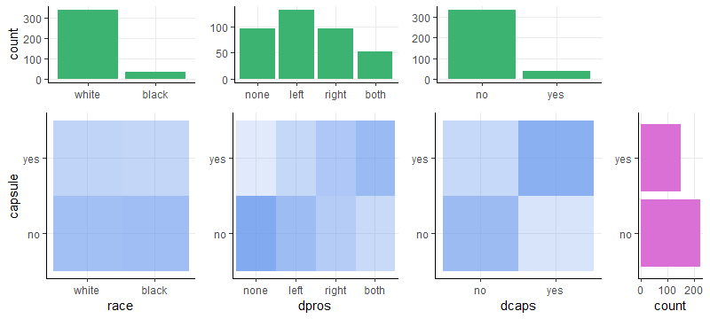
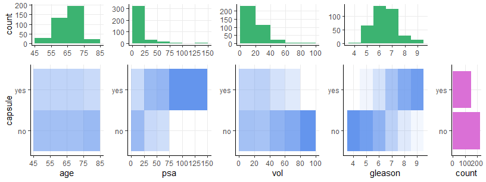
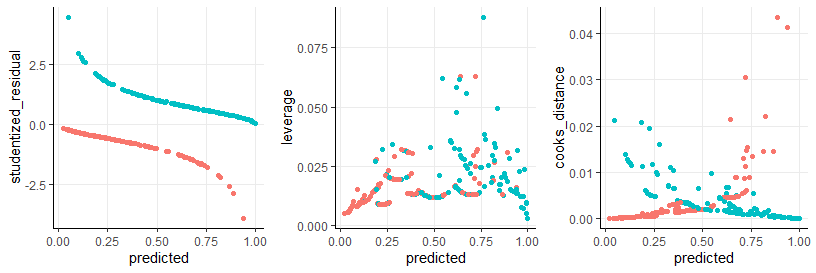

BIOST 2049 - Data Analysis #4
================
Matthew Ragoza
3/15/2022

-   [Prostate cancer study](#prostate-cancer-study)
    -   [Categorical variables](#categorical-variables)
    -   [Quantitative variables](#quantitative-variables)
-   [Part 1 - Model building](#part-1---model-building)
    -   [Centering the covariates](#centering-the-covariates)
    -   [Fitting logistic regression](#fitting-logistic-regression)
    -   [Model selection](#model-selection)
    -   [Interpretation of
        coefficients](#interpretation-of-coefficients)
    -   [Predicted probability](#predicted-probability)
-   [Part 2 - Model diagnostics](#part-2---model-diagnostics)
    -   [Overall model fit](#overall-model-fit)
    -   [Patients with high residuals](#patients-with-high-residuals)
    -   [Patients with high leverage](#patients-with-high-leverage)
    -   [Influential patients](#influential-patients)
    -   [Conclusion](#conclusion)

# Prostate cancer study

This data set used in this analysis originated from a study at an
academic cancer center on the penetration of the prostatic capsule among
patients with prostate cancer. The study involved 374 patients with
prostate cancer, 151 of whom had tumors that penetrated the prostatic
capsule.

``` r
library('dplyr')
library('tidyverse')
library('reshape2')
library('ggplot2')
library('gridExtra')
library('scales')
library('stats')
library('lmtest')
library('performance')

setwd('C:\\Users\\mtr22\\Code\\BIOST2049\\module-4\\data-analysis')
data <- read.csv('DA4.csv')

convert_factors = function(data) {
  data$capsule = factor(data$capsule, levels=0:1, labels=c('no', 'yes'), ordered=FALSE)
  data$race = factor(data$race, levels=1:2, labels=c('white', 'black'), ordered=FALSE)
  data$dpros = factor(data$dpros, levels=1:4, labels=c('none', 'left', 'right', 'both'), ordered=FALSE)
  data$dcaps = factor(data$dcaps, levels=1:2, labels=c('no', 'yes'), ordered=FALSE)
  return(data)
}

data = convert_factors(data)
data
```

    ##      id capsule age  race dpros dcaps    psa   vol gleason
    ## 1     1      no  65 white  left    no   1.40  0.00       6
    ## 2     2      no  72 white right   yes   6.70  0.00       7
    ## 3     3      no  70 white  none   yes   4.90  0.00       6
    ## 4     4      no  76 black  left    no  51.20 20.00       7
    ## 5     5      no  69 white  none    no  12.30 55.90       6
    ## 6     6     yes  71 white right   yes   3.30  0.00       8
    ## 7     7      no  68 black  both   yes  31.90  0.00       7
    ## 8     8      no  61 black  both   yes  66.70 27.20       7
    ## 9     9      no  69 white  none    no   3.90 24.00       7
    ## 10   10      no  68 black  none   yes  13.00  0.00       6
    ## 11   11     yes  68 black  both   yes   4.00  0.00       7
    ## 12   12     yes  72 white  left   yes  21.20  0.00       7
    ## 13   13     yes  72 white  both   yes  22.70  0.00       9
    ## 14   14     yes  65 white  both   yes  39.00  0.00       7
    ## 15   15      no  75 white  none    no   7.50  0.00       5
    ## 16   16      no  73 white  left    no   2.60  0.00       5
    ## 17   17      no  75 black  none    no   2.50  0.00       5
    ## 18   18      no  70 white  left    no   2.60 11.80       5
    ## 19   19      no  54 white  none   yes   2.80  0.00       6
    ## 20   20     yes  67 black right   yes   8.60 25.50       7
    ## 21   21     yes  58 white  left    no   3.10  0.00       7
    ## 22   23     yes  74 white right    no  12.70 27.50       7
    ## 23   24      no  73 white  none    no  12.30 47.30       7
    ## 24   25     yes  77 white  none    no  61.10 58.00       7
    ## 25   26      no  77 white  none    no   8.80  0.00       5
    ## 26   27      no  67 white  left    no   2.80 25.60       7
    ## 27   28      no  73 white right    no   2.90 14.10       5
    ## 28   29      no  64 white right    no   5.60 34.10       5
    ## 29   30      no  58 white  both    no   5.60 22.80       6
    ## 30   31     yes  54 white right    no   8.40 18.30       6
    ## 31   32      no  72 white  left    no   6.50 22.50       7
    ## 32   33      no  77 white  both    no  11.00  0.00       8
    ## 33   34     yes  60 white right   yes   9.50  0.00       7
    ## 34   35      no  65 white  left    no  11.10 17.70       6
    ## 35   36      no  71 white  left    no   7.30 20.00       7
    ## 36   37      no  54 white  left    no   1.00  0.00       6
    ## 37   38     yes  78 white  none   yes  27.20  0.00       8
    ## 38   39     yes  63 white  left    no  35.10 18.70       7
    ## 39   40     yes  73 white right    no   4.50 26.40       7
    ## 40   41     yes  66 white right    no   7.90 20.80       7
    ## 41   42      no  71 white  none    no   2.00  0.00       6
    ## 42   43     yes  71 white  left    no   7.50  0.00       6
    ## 43   44      no  72 white  left    no   5.30  0.00       7
    ## 44   45     yes  65 black right    no  83.70 32.00       9
    ## 45   47      no  69 black  left    no   6.70 59.80       6
    ## 46   48      no  68 white  left    no  12.30 16.30       8
    ## 47   49      no  70 white  left    no   0.40 17.10       5
    ## 48   50      no  67 white  left    no   5.80 14.50       6
    ## 49   51      no  76 white  none    no   7.60  3.70       6
    ## 50   52     yes  72 white  both   yes 124.00 38.60       8
    ## 51   53      no  66 white right    no   8.80 39.90       6
    ## 52   54     yes  61 white right    no  67.60  0.00       7
    ## 53   55      no  70 white right    no  13.90 13.00       7
    ## 54   56     yes  57 white right    no   7.40 18.30       7
    ## 55   57      no  74 white  left    no  23.10  5.90       7
    ## 56   58     yes  70 white right    no  19.30  0.00       7
    ## 57   59      no  60 white right    no   3.00 16.50       6
    ## 58   60      no  58 white right    no   3.70 29.90       6
    ## 59   61      no  59 white  left    no   0.70 96.00       5
    ## 60   62     yes  71 white  left    no   6.00 31.00       6
    ## 61   63      no  76 white  left    no   9.50 14.40       7
    ## 62   64      no  66 white right    no   2.60  0.00       7
    ## 63   65     yes  59 white  both    no  30.70  0.00       7
    ## 64   66     yes  65 white  left    no  10.80  0.00       7
    ## 65   67      no  54 white  left    no  10.50  0.00       6
    ## 66   68      no  78 white  none    no   6.50  0.00       7
    ## 67   69      no  65 white  left    no   1.30  6.80       5
    ## 68   70     yes  68 black right    no   9.60 32.00       6
    ## 69   71      no  68 white  left    no   0.30  0.00       6
    ## 70   72      no  71 white right    no   8.30 17.50       5
    ## 71   73      no  60 white right    no   3.20  0.00       7
    ## 72   74      no  65 white right    no   6.90 23.30       5
    ## 73   75      no  68 white  none    no  11.00  0.00       7
    ## 74   76      no  54 black  none    no  64.30  0.00       7
    ## 75   77      no  73 white right    no   1.60 17.10       6
    ## 76   78     yes  62 white  left    no   1.90  0.00       6
    ## 77   79      no  60 white  left    no   7.90  0.00       5
    ## 78   80     yes  66 white  none    no  25.70 39.10       9
    ## 79   81      no  76 white right    no   4.90  0.00       6
    ## 80   82      no  62 white  none    no  22.10  0.00       7
    ## 81   83      no  74 white  left    no  31.50  0.00       7
    ## 82   84      no  75 white  left    no  11.00 35.00       7
    ## 83   85      no  75 white  none    no   9.90 15.40       7
    ## 84   86     yes  75 white right    no   3.70  0.00       6
    ## 85   87     yes  68 white  both   yes  51.30 47.00       9
    ## 86   88     yes  71 white  left   yes  89.00 24.00       8
    ## 87   89      no  68 white  both    no  17.10 35.00       9
    ## 88   90      no  70 white right    no  12.30 10.30       7
    ## 89   91      no  68 white  none    no   4.40 39.00       6
    ## 90   92      no  66 white  none    no   8.00  0.00       5
    ## 91   93     yes  70 white right    no  15.00  0.00       7
    ## 92   94     yes  65 white right   yes  35.80 29.00       9
    ## 93   95      no  71 white  none    no  13.40 44.20       7
    ## 94   96     yes  75 white  none    no  16.00 18.70       7
    ## 95   97      no  70 white right    no  11.20  0.00       7
    ## 96   98      no  58 white  none    no   7.00  0.00       6
    ## 97   99      no  64 white  none    no  29.10  0.00       6
    ## 98  100     yes  66 white right    no   9.50 28.10       7
    ## 99  101      no  64 white  left    no   6.10  0.00       6
    ## 100 102     yes  72 white right    no   6.30 34.00       7
    ## 101 103      no  62 white  none    no   2.80 44.00       6
    ## 102 104      no  75 white right    no  25.70 87.60       5
    ## 103 105     yes  68 white  left    no   5.70  0.00       7
    ## 104 106      no  56 white right   yes   2.70 37.00       6
    ## 105 107     yes  69 white  none    no   6.00  0.00       7
    ## 106 108      no  67 white right    no  40.40  0.00       7
    ## 107 109      no  66 white right    no  13.20 23.60       6
    ## 108 110     yes  69 white right    no  15.20  0.00       7
    ## 109 111      no  74 white  none    no   8.80  0.00       7
    ## 110 112     yes  79 white right    no   7.80  0.00       6
    ## 111 113     yes  65 white right    no   6.90  4.60       7
    ## 112 114      no  71 white  left    no  17.20 65.60       8
    ## 113 115     yes  57 white right   yes  64.00  0.00       8
    ## 114 116     yes  47 white  none    no  28.00  0.00       9
    ## 115 117     yes  66 black  both    no  45.30  0.00       6
    ## 116 118      no  64 white  left    no  32.80 22.60       6
    ## 117 119      no  74 white  left    no   3.20 44.80       6
    ## 118 120      no  56 white  left    no   5.60 20.20       8
    ## 119 121     yes  77 white  none    no  16.40  0.00       7
    ## 120 122      no  66 white  none    no   6.80 54.50       5
    ## 121 123      no  67 black  both    no  25.20 21.70       7
    ## 122 124     yes  70 white  left    no  12.50  0.00       9
    ## 123 125     yes  70 white  both    no   3.60 21.70       7
    ## 124 126      no  65 white  left    no  11.00 16.00       6
    ## 125 127      no  63 white  left    no   8.10 20.30       6
    ## 126 128      no  59 white  left    no   2.30  0.00       5
    ## 127 129      no  75 white  left    no   1.40  0.00       6
    ## 128 130      no  70 white  none    no   6.70 29.40       6
    ## 129 131      no  73 white  none    no   1.00  0.00       5
    ## 130 132      no  72 white  left    no   4.50 29.90       8
    ## 131 133      no  67 white  left    no   6.20  0.00       5
    ## 132 134     yes  60 white  both    no   4.60 26.30       7
    ## 133 135      no  66 white  none    no   8.90 43.50       7
    ## 134 136      no  63 white  left    no   8.20 17.80       6
    ## 135 137      no  68 white  left    no   5.00  0.00       6
    ## 136 138     yes  66 white  both    no  91.90  0.00       8
    ## 137 139     yes  69 white  both   yes  94.00  0.00       7
    ## 138 140      no  67 white  none    no  13.40  0.00       7
    ## 139 141      no  72 white  none    no   9.10  0.00       6
    ## 140 142     yes  56 black  left    no  41.90  0.00       8
    ## 141 143      no  74 white  left    no  21.60 52.00       7
    ## 142 144     yes  66 white  both   yes  37.70  0.00       8
    ## 143 145      no  61 white  none    no   9.40 34.60       6
    ## 144 146      no  62 black  none    no   9.10 33.10       6
    ## 145 147     yes  68 white  both   yes  55.60  0.00       8
    ## 146 148      no  63 white right    no   3.60 38.00       6
    ## 147 149      no  55 white  both    no   6.20 29.20       6
    ## 148 150      no  70 white  left    no   6.30  0.00       7
    ## 149 151      no  65 black  left    no   4.60  0.00       5
    ## 150 152     yes  66 white  none    no   4.90 16.10       6
    ## 151 153      no  68 white  none    no   2.60 12.80       6
    ## 152 154     yes  55 white  left    no  16.30 21.20       7
    ## 153 155     yes  55 white  left    no   4.39  0.00       6
    ## 154 156      no  76 white  left    no   8.90 87.30       5
    ## 155 157     yes  58 white  left    no  21.20 26.80       7
    ## 156 158     yes  75 white  left    no   7.90  0.00       7
    ## 157 159     yes  70 white  none    no  44.40  0.00       6
    ## 158 160     yes  59 white  left    no  16.10 23.00       7
    ## 159 161     yes  63 black  left    no  26.00 21.30       7
    ## 160 162     yes  62 white right    no   8.80  0.00       6
    ## 161 163     yes  58 white  left    no  20.60  0.00       7
    ## 162 164     yes  62 white right    no  26.70  0.00       6
    ## 163 165      no  69 white right    no   3.50  0.00       5
    ## 164 166     yes  62 white  left   yes  14.80 22.20       7
    ## 165 167     yes  70 white  left    no  11.90 35.50       6
    ## 166 168      no  76 white  both    no   5.70 40.00       6
    ## 167 169     yes  64 white  both    no   2.40  0.00       6
    ## 168 170     yes  73 white  left    no  42.80  0.00       8
    ## 169 171     yes  74 white right    no   7.00  0.00       6
    ## 170 172     yes  71 white right    no   3.30  0.00       6
    ## 171 173     yes  60 white  both    no   7.30  0.00       7
    ## 172 174     yes  62 white  left    no  17.20  0.00       7
    ## 173 175      no  71 white  left    no   3.80 19.00       6
    ## 174 176      no  67 white right    no   5.70 15.40       6
    ## 175 177     yes  68 white  both    no  31.60 18.00       7
    ## 176 178      no  69 white  none    no   5.40 37.30       6
    ## 177 179      no  67 white  none    no  15.00 35.10       7
    ## 178 180     yes  70 white  left    no  22.00  0.00       8
    ## 179 181     yes  68 white right   yes  23.40  0.00       7
    ## 180 182     yes  70 white  none    no  51.90 20.10       8
    ## 181 183     yes  70 white  none    no  20.40 35.00       7
    ## 182 184     yes  60 white  left    no  18.70 23.40       7
    ## 183 185     yes  61 white right    no  12.70 33.40       7
    ## 184 186     yes  57 white right    no  20.10 30.30       8
    ## 185 187     yes  68 white  none    no  85.40 10.00       7
    ## 186 188      no  75 black  left    no   9.30 23.20       6
    ## 187 189     yes  69 white right   yes   8.00 31.20       6
    ## 188 190      no  64 white  both    no   7.50 11.40       6
    ## 189 191      no  62 white right    no   5.00  0.00       6
    ## 190 192      no  61 white  both    no  61.60 21.20       6
    ## 191 193      no  59 white  none    no   8.50 38.30       5
    ## 192 194      no  71 white  none    no  10.00 15.09       6
    ## 193 195     yes  72 white  left    no  12.70  0.00       6
    ## 194 196     yes  73 white right    no  12.30 30.10       8
    ## 195 197      no  66 black  both    no  11.00  0.00       5
    ## 196 198     yes  69 white right    no  17.70 21.00       5
    ## 197 199      no  69 white  left    no   3.90  0.00       6
    ## 198 200      no  70 white right    no   5.00 21.60       7
    ## 199 201      no  57 white  none    no  10.20  0.00       6
    ## 200 202     yes  68 white right    no  19.20  0.00       8
    ## 201 203     yes  61 white  left    no   2.90  0.00       6
    ## 202 204      no  71 white  left    no   1.70  0.00       6
    ## 203 205      no  62 white  left    no   9.00  0.00       6
    ## 204 206     yes  76 white  both   yes  11.70 28.50       7
    ## 205 207      no  65 white  none    no   8.00 54.00       6
    ## 206 208      no  53 white  left    no   9.90 27.00       5
    ## 207 209      no  65 white  left    no  14.70 15.00       7
    ## 208 210      no  57 white right    no   1.50  0.00       5
    ## 209 211      no  62 white  left    no  13.70 33.40       5
    ## 210 212     yes  68 white  left    no   8.60  0.00       8
    ## 211 213     yes  66 white  both    no  45.80  0.00       8
    ## 212 214      no  50 white right    no   1.80  8.70       5
    ## 213 215      no  67 white  left    no   8.00 20.70       7
    ## 214 216      no  56 white  none    no   5.00 29.60       6
    ## 215 217     yes  69 white  both    no  53.90  0.00       6
    ## 216 218     yes  68 white  both   yes  18.80 27.30       9
    ## 217 219      no  68 white right    no   2.40 20.80       6
    ## 218 220      no  74 white  left    no   1.20 21.60       6
    ## 219 221     yes  51 white  left    no   7.40  0.00       6
    ## 220 222     yes  69 white right    no  38.00 32.80       7
    ## 221 223      no  65 white  none    no   9.40 38.40       5
    ## 222 224     yes  58 white right    no   3.10  0.00       7
    ## 223 225      no  71 white  none    no   1.29  0.00       7
    ## 224 226      no  68 white  left    no  12.70  0.00       7
    ## 225 227      no  56 white  none    no   7.30 15.70       6
    ## 226 228      no  59 white  both    no   3.80 13.80       6
    ## 227 229      no  67 white  none    no  10.20  0.00       7
    ## 228 230     yes  54 white right    no   7.00 29.00       6
    ## 229 231     yes  69 black right    no  24.10 24.50       7
    ## 230 232     yes  54 white right    no   9.40 36.80       6
    ## 231 233     yes  68 white right   yes  25.00 20.00       7
    ## 232 234     yes  59 black  both    no 126.00 20.30       8
    ## 233 235     yes  53 black  left    no  16.80 16.90       7
    ## 234 236     yes  68 white  left    no   8.20 38.20       6
    ## 235 237      no  73 white  left    no   3.10 21.90       6
    ## 236 238      no  66 white  left    no  11.00 36.60       6
    ## 237 239      no  71 white  both    no   4.90 15.20       6
    ## 238 240      no  69 black  none    no  15.60 17.90       6
    ## 239 241     yes  68 white  none    no   6.70 16.70       6
    ## 240 242     yes  74 white right    no   8.70 20.40       6
    ## 241 243     yes  58 black  both   yes  20.70  0.00       8
    ## 242 244      no  67 white  none    no   2.10  0.00       6
    ## 243 245      no  70 white  none    no   8.00  0.00       7
    ## 244 246     yes  70 black  both    no  13.20 25.60       7
    ## 245 247      no  66 white  none    no   2.30  0.00       5
    ## 246 248     yes  57 black  none    no  63.30 73.40       7
    ## 247 249      no  62 white  none    no  13.70  0.00       5
    ## 248 250      no  50 white right    no  13.20  0.00       7
    ## 249 251      no  61 white  left   yes   8.40  0.00       6
    ## 250 253     yes  74 white  left    no  17.70  0.00       7
    ## 251 254      no  78 white  left    no   5.90 32.50       6
    ## 252 255      no  65 white  left    no  22.00 60.00       7
    ## 253 256     yes  57 white  left   yes  15.10  0.00       9
    ## 254 257      no  71 white  both   yes  25.10 14.90       7
    ## 255 258      no  70 white  none    no  24.80 16.10       6
    ## 256 259     yes  55 white  left    no   6.70  0.00       6
    ## 257 260      no  71 white  none    no  11.30 32.00       6
    ## 258 261      no  63 white  left    no  17.50 31.20       5
    ## 259 262     yes  62 white  left    no   8.30  0.00       6
    ## 260 263     yes  71 white  left    no   4.80  0.00       7
    ## 261 264      no  59 white  left    no   1.70 17.20       6
    ## 262 265     yes  64 white right    no   7.50 13.70       7
    ## 263 266      no  67 white right    no  20.00 17.50       5
    ## 264 267     yes  65 white right    no   3.40 14.30       7
    ## 265 268      no  62 white  left    no  10.60 42.40       5
    ## 266 269     yes  65 white right    no  18.00 19.30       7
    ## 267 270     yes  71 white  both    no  18.70 21.00       5
    ## 268 271      no  61 white  none    no   5.40 27.50       6
    ## 269 272      no  59 white  none    no   4.60 29.60       5
    ## 270 273     yes  60 white  left    no  28.50  0.00       9
    ## 271 274     yes  59 white  none    no  11.20  0.00       6
    ## 272 275     yes  70 white  none    no   8.90 24.00       6
    ## 273 276     yes  70 white  left    no   1.70 33.80       6
    ## 274 277      no  59 white  left    no   1.40  0.00       6
    ## 275 278     yes  70 white  left    no   8.40 21.80       5
    ## 276 279      no  54 white right    no   8.60  0.00       5
    ## 277 280      no  64 white  left    no  10.90 24.80       6
    ## 278 281      no  62 white right    no  20.10  0.00       7
    ## 279 283      no  66 black  left    no   8.00  0.00       5
    ## 280 284      no  71 white  none    no   2.00  0.00       5
    ## 281 285      no  61 white  left    no  13.10  0.00       7
    ## 282 286     yes  58 white right    no   5.40 55.00       6
    ## 283 287     yes  76 white  left    no   4.10  0.00       8
    ## 284 288     yes  53 white right    no   6.50  0.00       7
    ## 285 289      no  65 white  none    no   6.10 28.90       7
    ## 286 290      no  69 white  none    no   6.20 26.30       5
    ## 287 291      no  64 white right    no   3.80 19.10       5
    ## 288 292     yes  61 white  none    no   6.80 24.60       5
    ## 289 293      no  62 white  left    no   9.50 26.60       6
    ## 290 294     yes  63 white  both    no  20.40  0.00       7
    ## 291 295      no  61 white right    no   4.80  0.00       6
    ## 292 296     yes  63 white  both    no   9.80 17.50       8
    ## 293 297     yes  73 white  both   yes   7.90  0.00       8
    ## 294 298      no  72 white  none    no  22.10  0.00       5
    ## 295 299      no  52 white  left    no   5.50  0.00       5
    ## 296 300      no  73 white  none    no  17.40 14.20       5
    ## 297 301      no  70 white  both    no  10.00 73.80       5
    ## 298 302      no  70 white  left    no   5.80 20.00       6
    ## 299 303     yes  67 white  both   yes 135.00  0.00       7
    ## 300 304      no  64 white  left    no   8.50  0.00       7
    ## 301 305      no  51 white  left    no  13.00  0.00       6
    ## 302 306      no  64 white  none    no   7.20 10.90       6
    ## 303 307      no  68 white right    no  11.80  0.00       5
    ## 304 308     yes  66 white right    no   4.80  8.80       7
    ## 305 309      no  69 white  none    no  14.30 67.10       4
    ## 306 310      no  67 white right    no  18.10  0.00       8
    ## 307 311      no  78 white  none    no   5.20 29.10       5
    ## 308 312     yes  75 white  both    no   9.90 16.30       5
    ## 309 313     yes  59 white right   yes  12.90  0.00       6
    ## 310 314      no  64 white  none    no  22.00  0.00       5
    ## 311 315     yes  74 white right    no   9.00 41.80       7
    ## 312 316     yes  73 white  both    no  14.00  0.00       7
    ## 313 317     yes  57 black right    no   7.80 38.90       7
    ## 314 318      no  71 white  none    no   4.80 14.00       7
    ## 315 319     yes  66 white  left    no  58.60  0.00       7
    ## 316 320      no  64 white  left    no   2.00  0.00       6
    ## 317 321      no  64 white right    no   8.70 17.20       7
    ## 318 322     yes  62 white  both    no   4.60  0.00       6
    ## 319 323      no  63 white right    no   0.70 18.60       5
    ## 320 324     yes  64 white  both    no  24.10  0.00       6
    ## 321 325      no  70 white  none    no   5.30 73.70       5
    ## 322 327     yes  75 white  none    no   4.80 26.30       7
    ## 323 328      no  52 white  left    no   2.20 11.50       6
    ## 324 329      no  62 white  left    no   7.40  0.00       6
    ## 325 330      no  71 white  left    no   4.60 48.70       5
    ## 326 331     yes  60 white  left   yes  11.40  0.00       7
    ## 327 332     yes  68 white right    no  13.70  1.92       7
    ## 328 333      no  73 black  left    no   7.90 18.00       6
    ## 329 334      no  51 white right    no   8.90  0.00       6
    ## 330 335      no  57 black right    no   3.40 30.80       6
    ## 331 336      no  65 white  both    no   6.30  0.00       6
    ## 332 337      no  61 white right    no   1.50  0.00       5
    ## 333 338     yes  56 white  left   yes  58.00  0.00       6
    ## 334 339     yes  72 white  left    no   1.40 24.20       6
    ## 335 340     yes  54 white  left    no  18.00 43.00       9
    ## 336 341     yes  62 white  left    no   7.30  0.00       7
    ## 337 342      no  63 black right    no  14.30 16.00       7
    ## 338 343      no  68 white  none    no   5.40 34.00       5
    ## 339 344      no  65 white right    no   8.40 26.20       6
    ## 340 345     yes  66 white  left    no  75.00  0.00       7
    ## 341 346      no  70 white  left    no   4.50 37.00       5
    ## 342 347      no  64 white  none    no   3.70  0.00       6
    ## 343 348      no  71 white  none    no  11.70 41.20       5
    ## 344 349     yes  61 white  none    no  21.00  0.00       7
    ## 345 350      no  65 white  none    no  18.50  0.00       6
    ## 346 351      no  62 white right    no   6.40  0.00       6
    ## 347 352      no  75 white  both    no   1.00 13.30       6
    ## 348 353      no  54 white right    no  21.60 25.00       7
    ## 349 354     yes  59 white  left   yes   7.90  0.00       7
    ## 350 355      no  71 black  left    no  12.30 97.60       5
    ## 351 356      no  66 white  left    no   4.40  0.00       6
    ## 352 358      no  66 white  none    no   5.40 21.30       6
    ## 353 359      no  56 white  none    no   5.30  0.00       6
    ## 354 360      no  73 white  none    no  10.40  0.00       7
    ## 355 361      no  57 white  none    no   4.40 13.90       6
    ## 356 362      no  65 white  none    no  10.80  0.00       6
    ## 357 363      no  78 white  left   yes  50.30 29.80       7
    ## 358 364     yes  67 white  both    no  15.20 32.00       7
    ## 359 365      no  69 white  left    no   4.20  0.00       5
    ## 360 366      no  55 white  none    no   0.80 21.00       6
    ## 361 367      no  69 black  left    no  11.50  0.00       6
    ## 362 368      no  74 white  left    no  48.00 47.00       7
    ## 363 369      no  53 white  none    no  10.30 16.40       5
    ## 364 370      no  79 white  none    no   4.40 23.70       6
    ## 365 371     yes  74 white right    no   6.00  0.00       5
    ## 366 372      no  73 white  both    no  10.00 27.40       6
    ## 367 373      no  72 white  left    no  11.00 31.00       6
    ## 368 374     yes  65 white  both    no 139.70 29.90       9
    ## 369 375      no  64 white  none    no  32.20 26.60       5
    ## 370 376      no  58 black right    no  18.20 28.60       7
    ## 371 377      no  69 black  none    no   7.90 14.60       5
    ## 372 378     yes  76 white  left    no   5.50 53.90       8
    ## 373 379      no  69 black  left    no   1.50  8.60       5
    ## 374 380      no  69 white  left    no   1.90 20.70       6

## Categorical variables

The key dependent variable of interest is `capsule`, a binary indicator
for whether the patient’s condition included penetration of their
prostatic capsule (present in 40.37% of the sample). In addition, the
`race` of the patient was recorded (90.37% white, 9.63% black) and two
clinical measures relevant to prostate cancer staging. These are
`dpros`, a four-level qualitative result for the presence of cancer
nodules from digital rectal examination (25.67% none, 35.03% left,
25.40% right, 13.90% both) and `dcaps`, a binary indicator of whether
capsular involvement was detected during rectal examination (detected in
10.70% in sample).

``` r
data %>%
  group_by(capsule) %>%
  summarize(count=n(), .groups='drop_last') %>%
  mutate(proportion=count/sum(count)) %>%
  mutate_if(is.double, percent_format(accuracy=0.01))
```

    ## # A tibble: 2 x 3
    ##   capsule count proportion
    ##   <fct>   <int> <chr>     
    ## 1 no        223 59.63%    
    ## 2 yes       151 40.37%

``` r
data %>%
  group_by(race) %>%
  summarize(count=n(), .groups='drop_last') %>%
  mutate(proportion=count/sum(count)) %>%
  mutate_if(is.double, percent_format(accuracy=0.01))
```

    ## # A tibble: 2 x 3
    ##   race  count proportion
    ##   <fct> <int> <chr>     
    ## 1 white   338 90.37%    
    ## 2 black    36 9.63%

``` r
data %>%
  group_by(dpros) %>%
  summarize(count=n(), .groups='drop_last') %>%
  mutate(proportion=count/sum(count)) %>%
  mutate_if(is.double, percent_format(accuracy=0.01))
```

    ## # A tibble: 4 x 3
    ##   dpros count proportion
    ##   <fct> <int> <chr>     
    ## 1 none     96 25.67%    
    ## 2 left    131 35.03%    
    ## 3 right    95 25.40%    
    ## 4 both     52 13.90%

``` r
data %>%
  group_by(dcaps) %>%
  summarize(count=n(), .groups='drop_last') %>%
  mutate(proportion=count/sum(count)) %>%
  mutate_if(is.double, percent_format(accuracy=0.01))
```

    ## # A tibble: 2 x 3
    ##   dcaps count proportion
    ##   <fct> <int> <chr>     
    ## 1 no      334 89.30%    
    ## 2 yes      40 10.70%

``` r
blank <- ggplot() + theme_void()

red = 'orchid'
green = 'mediumseagreen'
blue = 'cornflowerblue'

alpha_scale = function(data, x, y){
  cond = data %>%
    group_by({{x}}, {{y}}) %>%
    summarize(n=n(), .groups='drop_last') %>%
    mutate(prob=n/sum(n))
  scale_alpha_continuous(range=range(cond$prob))
}

# histograms

plot_x1 <- data %>%
  ggplot(aes(x=race)) +
  geom_bar(fill=green) +
  theme_classic() +
  theme(panel.grid.major=element_line()) +
  scale_y_continuous(n.breaks=4) +
  xlab(NULL)

plot_x2 <- data %>%
  ggplot(aes(x=dpros)) +
  geom_bar(fill=green) +
  theme_classic() +
  theme(panel.grid.major=element_line()) +
  scale_y_continuous(n.breaks=3) +
  xlab(NULL) +
  ylab(NULL)

plot_x3 <- data %>%
  ggplot(aes(x=dcaps)) +
  geom_bar(fill=green) +
  theme_classic() +
  theme(panel.grid.major=element_line()) +
  scale_y_continuous(n.breaks=4) +
  xlab(NULL) +
  ylab(NULL)

plot_y <- data %>%
  ggplot(aes(y=capsule)) +
  geom_bar(fill=red) +
  theme_classic() +
  theme(panel.grid.major=element_line()) +
  scale_x_continuous(n.breaks=3) +
  ylab(NULL)

# scatter plots

plot_yx1 <- data %>%
  group_by(race, capsule) %>%
  summarize(n=n(), .groups='drop_last') %>% mutate(prop=n/sum(n)) %>%
  ggplot(aes(x=race, y=capsule, alpha=prop)) +
  geom_raster(fill=blue) +
  theme_classic() +
  theme(panel.grid.major=element_line(), legend.position='none') +
  alpha_scale(data, race, capsule)

plot_yx2 <- data %>%
  group_by(dpros, capsule) %>%
  summarize(n=n(), .groups='drop_last') %>% mutate(prop=n/sum(n)) %>%
  ggplot(aes(x=dpros, y=capsule, alpha=prop)) +
  geom_raster(fill=blue) +
  theme_classic() +
  theme(panel.grid.major=element_line(), legend.position='none') +
  alpha_scale(data, dpros, capsule) +
  ylab(NULL)

plot_yx3 <- data %>%
  group_by(dcaps, capsule) %>%
  summarize(n=n(), .groups='drop_last') %>% mutate(prop=n/sum(n)) %>%
  ggplot(aes(x=dcaps, y=capsule, alpha=prop)) +
  geom_raster(fill=blue) +
  theme_classic() +
  theme(panel.grid.major=element_line(), legend.position='none') +
  alpha_scale(data, dcaps, capsule) +
  ylab(NULL)

# arrange plots on grid

grid.arrange(
    plot_x1,  plot_x2,  plot_x3,  blank,
    plot_yx1, plot_yx2, plot_yx3, plot_y,
    ncol=4, widths=c(2, 2, 2, 1),
    nrow=2, heights=c(1, 2)
)
```

<!-- -->

The figure above shows the distributions of each of the categorical
variables in the data set, and the conditional distributions of
`capsule` given each independent categorical variable. It appears from
the conditional plots that `dpros` and `dcaps` are both moderately
associated with `capsule`, but there is very little relation between
`race` and the dependent variable.

## Quantitative variables

Four quantitative variables were also collected during the course of
this study. The `age` of the patient in years ranged from 47 to 79 with
a mean of 66.07 and standard deviation of 6.45. The researchers also
recorded the level of prostatic specific antigen (`psa`, mg/ml, median =
8.80, IQR = \[5, 17.02\]), which had a very right-skewed distribution.
The volume of the tumor was measured using ultrasound (`vol`, cm^3,
median = 14.35, IQR = \[0, 26.60\]) and also followed a right-skewed
distribution. Finally, the Gleason score of the patients was included
(`gleason`, mean = 6.42, standard deviation = 0.99), which ranges on a
scale from 2 to 10.

``` r
data %>%
  group_by(id) %>%
  select_if(is.numeric) %>%
  melt(id.vars='id') %>%
  group_by(variable) %>%
  summarize(
    count=n(),
    mean=mean(value),
    std=sd(value),
    min=min(value),
    Q1=quantile(value, 0.25),
    Q2=quantile(value, 0.50),
    Q3=quantile(value, 0.75),
    max=max(value)
  ) %>%
  mutate_if(is.double, round, digits=2)
```

    ## # A tibble: 4 x 9
    ##   variable count  mean   std   min    Q1    Q2    Q3   max
    ##   <fct>    <int> <dbl> <dbl> <dbl> <dbl> <dbl> <dbl> <dbl>
    ## 1 age        374 66.1   6.45  47      62  67    71    79  
    ## 2 psa        374 15.3  19.9    0.3     5   8.8  17.0 140. 
    ## 3 vol        374 16.0  18.4    0       0  14.4  26.6  97.6
    ## 4 gleason    374  6.42  0.99   4       6   6     7     9

``` r
# function for mapping continuous values to bin centers
discretize = function(x, breaks) {
  centers = head(breaks, -1) + diff(breaks)/2
  idxs = cut(x, breaks=breaks, include.lowest=TRUE, labels=FALSE)
  centers[idxs]
}

alpha_scale = function(data, x, y){
  cond = data %>%
    group_by({{x}}, {{y}}) %>%
    summarize(n=n(), .groups='drop_last') %>%
    mutate(prob=n/sum(n))
  scale_alpha_continuous(range=range(cond$prob))
}

# grid settings

# age
x4_breaks = seq(45, 85, 10)
x4_scale = scale_x_continuous(limits=c(45, 85), breaks=x4_breaks)

# psa
x5_breaks = seq(0, 150, 25)
x5_scale = scale_x_continuous(limits=c(0, 150), breaks=x5_breaks)

# vol
x6_breaks = seq(0, 100, 20)
x6_scale = scale_x_continuous(limits=c(0, 100), breaks=x6_breaks)

# gleason
x7_breaks = seq(3.5, 9.5, 1)
x7_scale = scale_x_continuous(limits=c(3.5, 9.5), breaks=seq(3, 9, 1))

# capsule
y_scale = scale_y_continuous(limits=c(0, 1), breaks=seq(0, 1, 0.25))

# histograms

plot_x4 <- data %>%
  ggplot(aes(x=age)) +
  geom_histogram(fill=green, breaks=x4_breaks) +
  theme_classic() +
  theme(panel.grid.major=element_line()) +
  x4_scale +
  xlab(NULL)

plot_x5 <- data %>%
  ggplot(aes(x=psa)) +
  geom_histogram(fill=green, breaks=x5_breaks) +
  theme_classic() +
  theme(panel.grid.major=element_line()) +
  x5_scale +
  xlab(NULL) +
  ylab(NULL)

plot_x6 <- data %>%
  ggplot(aes(x=vol)) +
  geom_histogram(fill=green, breaks=x6_breaks) +
  theme_classic() +
  theme(panel.grid.major=element_line()) +
  x6_scale +
  xlab(NULL) +
  ylab(NULL)

plot_x7 <- data %>%
  ggplot(aes(x=gleason)) +
  geom_histogram(fill=green, breaks=x7_breaks) +
  theme_classic() +
  theme(panel.grid.major=element_line()) +
  x7_scale +
  xlab(NULL) +
  ylab(NULL)

# scatter plots

plot_yx4 <- data %>%
  mutate(age=discretize(age, breaks=x4_breaks)) %>%
  group_by(age, capsule) %>%
  summarize(n=n(), .groups='drop_last') %>% mutate(prop=n/sum(n)) %>%
  ggplot(aes(x=age, y=capsule, alpha=prop)) +
  geom_tile(fill=blue) +
  theme_classic() +
  theme(panel.grid.major=element_line(), legend.position='none') +
  x4_scale + alpha_scale(data, discretize(age, breaks=x4_breaks), capsule)

plot_yx5 <- data %>%
  mutate(psa=discretize(psa, breaks=x5_breaks)) %>%
  group_by(psa, capsule) %>%
  summarize(n=n(), .groups='drop_last') %>% mutate(prop=n/sum(n)) %>%
  ggplot(aes(x=psa, y=capsule, alpha=prop)) +
  geom_tile(fill=blue) + 
  theme_classic() +
  theme(panel.grid.major=element_line(), legend.position='none') +
  x5_scale + alpha_scale(data, discretize(psa, breaks=x5_breaks), capsule) +
  ylab(NULL)

plot_yx6 <- data %>%
  mutate(vol=discretize(vol, breaks=x6_breaks)) %>%
  group_by(vol, capsule) %>%
  summarize(n=n(), .groups='drop_last') %>% mutate(prop=n/sum(n)) %>%
  ggplot(aes(x=vol, y=capsule, alpha=prop)) +
  geom_tile(fill=blue) +
  theme_classic() +
  theme(panel.grid.major=element_line(), legend.position='none') +
  x6_scale + alpha_scale(data, discretize(vol, breaks=x6_breaks), capsule) +
  ylab(NULL)

plot_yx7 <- data %>%
  group_by(gleason, capsule) %>%
  summarize(n=n(), .groups='drop_last') %>% mutate(prop=n/sum(n)) %>%
  ggplot(aes(x=gleason, y=capsule, alpha=prop)) +
  geom_tile(fill=blue) +
  theme_classic() +
  theme(panel.grid.major=element_line(), legend.position='none') +
  x7_scale + alpha_scale(data, gleason, capsule) +
  ylab(NULL)

# arrange plots on grid

grid.arrange(
    plot_x4,  plot_x5,  plot_x6,  plot_x7,  blank,
    plot_yx4, plot_yx5, plot_yx6, plot_yx7, plot_y,
    ncol=5, widths=c(2, 2, 2, 2, 1),
    nrow=2, heights=c(1, 2)
)
```

<!-- -->

The figure above displays the distributions of each quantitative
variable and the conditional distribution of `capsule` given the
quantitative covariates. The Gleason score and PSA levels appear to be
strongly associated with `capsule`, while tumor volume is moderately
correlated with it and age has almost no relationship.

# Part 1 - Model building

We would now like to create a logistic regression model that accurately
predicts whether a given cancer patient has penetration of the prostatic
capsule based on some subset of the covariates.

## Centering the covariates

First, we will center the continuous independent variables by
subtracting their median. This will improve the interpretability of the
estimated model such that the intercept coefficient represents the log
odds of the outcome for a patient with median values for the continuous
predictors rather than zero values.

``` r
# subtract median from quantitative variables

subtract_median = function(data, train_data) {
  data$age_c = data$age - median(train_data$age)
  data$psa_c = data$psa - median(train_data$psa)
  data$vol_c = data$vol - median(train_data$vol)
  data$gleason_c = data$gleason - median(train_data$gleason)
  return(data)
}
data = subtract_median(data, data)

data %>%
  group_by(id) %>%
  select(c('id', 'age_c', 'psa_c', 'vol_c', 'gleason_c')) %>%
  melt(id.vars='id') %>%
  group_by(variable) %>%
  summarize(
    count=n(),
    mean=mean(value),
    std=sd(value),
    min=min(value),
    Q1=quantile(value, 0.25),
    Q2=quantile(value, 0.50),
    Q3=quantile(value, 0.75),
    max=max(value)
  ) %>%
  mutate_if(is.double, round, digits=2)
```

    ## # A tibble: 4 x 9
    ##   variable  count  mean   std   min    Q1    Q2    Q3   max
    ##   <fct>     <int> <dbl> <dbl> <dbl> <dbl> <dbl> <dbl> <dbl>
    ## 1 age_c       374 -0.93  6.45 -20    -5       0  4     12  
    ## 2 psa_c       374  6.54 19.9   -8.5  -3.8     0  8.22 131. 
    ## 3 vol_c       374  1.62 18.4  -14.4 -14.4     0 12.2   83.2
    ## 4 gleason_c   374  0.42  0.99  -2     0       0  1      3

## Fitting logistic regression

Next, we will fit seven different logistic regression models with
different sets of predictors. For each model, we compute the total model
deviance, the pseudo R-squared, the Akaike information criterion (AIC),
and the Bayes information criterian (BIC). The results are shown in the
table below.

``` r
logreg = function(data, formula) {
  glm(formula, family=binomial(link='logit'), data=data)
}

models = list()
models[[1]] = logreg(data, capsule ~ dpros + gleason_c + psa_c)
models[[2]] = logreg(data, capsule ~ dpros + gleason_c + psa_c + dcaps)
models[[3]] = logreg(data, capsule ~ dpros + gleason_c + psa_c + vol_c)
models[[4]] = logreg(data, capsule ~ dpros + gleason_c + psa_c + age_c)
models[[5]] = logreg(data, capsule ~ dpros + gleason_c + psa_c + race)
models[[6]] = logreg(data, capsule ~ dpros + gleason_c + psa_c + vol_c + race)
models[[7]] = logreg(data, capsule ~ dpros + gleason_c + psa_c + dcaps + vol_c + age_c + race)
null_model = logreg(data, capsule ~ 1)

pseudo_R2 = function(model) {
  LL = logLik(model)
  null_LL = logLik(null_model)
  (null_LL - LL)/null_LL
}

BIC = function(model) {
  LL = logLik(model)
  n = length(model$residuals)
  k = length(model$coefficients)
  -2*LL + k*log(n)
}

predictors = function(model) {
  paste(model$formula)[3]
}

metrics = data.frame(id=1:length(models))
metrics$predictors = sapply(models, predictors)
metrics$deviance = sapply(models, deviance)
metrics$pseudo_R2 = sapply(models, pseudo_R2)
metrics$AIC = sapply(models, AIC)
metrics$BIC = sapply(models, BIC)
metrics %>% mutate_if(is.double, signif, digits=4)
```

    ##   id                                               predictors deviance
    ## 1  1                                dpros + gleason_c + psa_c    381.1
    ## 2  2                        dpros + gleason_c + psa_c + dcaps    379.7
    ## 3  3                        dpros + gleason_c + psa_c + vol_c    377.7
    ## 4  4                        dpros + gleason_c + psa_c + age_c    380.6
    ## 5  5                         dpros + gleason_c + psa_c + race    379.0
    ## 6  6                 dpros + gleason_c + psa_c + vol_c + race    376.0
    ## 7  7 dpros + gleason_c + psa_c + dcaps + vol_c + age_c + race    374.5
    ##   pseudo_R2   AIC   BIC
    ## 1    0.2446 393.1 416.7
    ## 2    0.2474 393.7 421.2
    ## 3    0.2514 391.7 419.2
    ## 4    0.2456 394.6 422.1
    ## 5    0.2488 393.0 420.5
    ## 6    0.2547 392.0 423.4
    ## 7    0.2577 394.5 433.8

From the table of results, we see that model 7 has the lowest deviance
(374.5) and highest pseudo R-squared (0.2577). However, model 3 has the
lowest AIC (391.7) and model 1 has the lowest BIC (416.7). The AIC and
BIC metrics penalize the number of parameters in the model, which is why
simpler models with fewer predictors but worse deviance and
*R*<sup>2</sup> have better AIC and BIC values compared to models with
more predictors.

## Model selection

For this analysis, we want to select a model with good predictive
performance on the training set but minimal unnecessary model
complexity. We will select model 3 as our initial choice for the best
model, since it has the lowest AIC score, which strikes a balance
between predictive performance and parsimony.

To validate our choice of model 3, we can conduct a likelihood ratio
test compared to model 1, since model 1 is nested in model 3. The null
hypothesis is that the two models have the same likelihood, while the
alternative hypothesis is that model 3 has greater likelihood than model
1 due to the inclusion of the `vol_c` predictor. We will use a
significance level of 0.05 to conduct the test.

``` r
lrtest(models[[1]], models[[3]])
```

    ## Likelihood ratio test
    ## 
    ## Model 1: capsule ~ dpros + gleason_c + psa_c
    ## Model 2: capsule ~ dpros + gleason_c + psa_c + vol_c
    ##   #Df  LogLik Df  Chisq Pr(>Chisq)  
    ## 1   6 -190.56                       
    ## 2   7 -188.86  1 3.4098    0.06481 .
    ## ---
    ## Signif. codes:  0 '***' 0.001 '**' 0.01 '*' 0.05 '.' 0.1 ' ' 1

The likelihood ratio of the two models is 3.41, which follows a
chi-squared distribution with 1 degree of freedom (since model 3 has 1
additional parameter compared to model 1). The p-value of 0.065
indicates that we would have a 6.5% probability of observing a
likelihood ratio this large if the null hypothesis were true. Therefore,
we do not reject the null hypothesis, and we do not have sufficient
evidence to conclude that the additional `vol_c` predictor improves the
likelihood compared to model 1. Since the likelihood ratio test does not
support our selection of model 3 over model 1, we revert our choice of
the best model to be model 1.

## Interpretation of coefficients

The coefficients of a logistic regression model are interpretable as the
log of the odds ratio of the outcome conditioned on different values of
the independent variable. The coefficients and exponentiated
coefficients of model 1 are shown above, which we will now interpret.

``` r
model = models[[1]]
coefficients(model)
```

    ## (Intercept)   dprosleft  dprosright   dprosboth   gleason_c       psa_c 
    ## -1.92742876  0.76858772  1.54885171  1.42544262  0.99353615  0.02732474

``` r
exp(coefficients(model))
```

    ## (Intercept)   dprosleft  dprosright   dprosboth   gleason_c       psa_c 
    ##   0.1455219   2.1567182   4.7060631   4.1596986   2.7007679   1.0277015

The intercept of -1.927 means that a baseline patient (no nodules
detected in rectal exam, Gleason score of 6, PSA level of 8.8 mg/ml) has
0.1455 odds of having a penetrated prostatic capsule, corresponding to a
probability of 12.7%. A patient with a left nodule, right nodule, or
both has 2.157, 4.706, or 4.160 times the odds of having a penetrated
capsule, respectively, compared to a baseline patient with no nodule.
Each unit increase in a patient’s Gleason score increases their log-odds
of a penetrated prostatic capsule by 0.994, while a 1 mg/ml increase in
PSA increases their log-odds by 0.0273.

## Predicted probability

We can now use our chosen model to predict the probability that a future
prostate cancer patient has penetration of the prostatic capsule. We
will consider a hypothetical 65 year old white man who has a left
unilobar nodule but no capsular involvement detected in their rectal
exam. The patient has 1.4 mg/ml prostatic specific antigen, a tumor
volume of 0 cm^3, and a Gleason score of 6.

``` r
new_data = data.frame(capsule=NA, age=65, race=1, dpros=2, dcaps=1, psa=1.4, vol=0, gleason=6) %>%
  convert_factors() %>%
  subtract_median(data)

new_data
```

    ##   capsule age  race dpros dcaps psa vol gleason age_c psa_c  vol_c gleason_c
    ## 1    <NA>  65 white  left    no 1.4   0       6    -2  -7.4 -14.35         0

``` r
logit = predict(model, new_data)
phat = predict(model, new_data, type='response')
cat(sprintf('predicted probability = %.4f (logit = %.4f)', phat, logit))
```

    ## predicted probability = 0.2041 (logit = -1.3610)

The model predicts that the patient would have a 20.4% probability of
having penetration of the prostatic capsule.

# Part 2 - Model diagnostics

Now that we have selected our final logistic regression model as model
1, we can investigate it by assessing the quality of the fit and
performing model diagnostics to assess outliers and influential
observations.

## Overall model fit

As seen in the results table above, model 1 has a deviance of 381.1,
which can be interpreted as a comparison of the model’s log likelihood
to that of a saturated model (one that fits the data perfectly). The
model has a pseudo R-squared of 0.2446, which implies that the set of
predictors included in the model improved its likelihood by 24.46%
compared to a model with only an intercept term.

We can also perform a Hosmer-Lemeshow goodness-of-fit test to assess
model fit. The null hypothesis is that there is no difference between
the model predictions and the data, while the alternative hypothesis is
that the model is significantly different from the data due to being
misspecified.

``` r
performance_hosmer(model)
```

    ## # Hosmer-Lemeshow Goodness-of-Fit Test
    ## 
    ##   Chi-squared: 9.995
    ##            df: 8    
    ##       p-value: 0.265

    ## Summary: model seems to fit well.

The p-value of 0.265 indicates that we would expect a 26.5% probability
of seeing a test statistic this large if the null hypothesis were true.
Therefore, we do not reject the null hypothesis at a 5% significance
level, so we do not have evidence that the model is misspecified. This
implies that the model fits the data well.

``` r
data$predicted = predict(model, type='response')
data$studentized_residual = residuals(model, 'pearson') / sqrt(1 - hatvalues(model))
data$leverage = hatvalues(model)
data$cooks_distance = cooks.distance(model)

plot_rp = data %>%
  ggplot(aes(x=predicted, y=studentized_residual, color=capsule)) +
  geom_point() +
  theme_classic() +
  theme(panel.grid.major=element_line(), legend.position='none')

plot_hp = data %>%
  ggplot(aes(x=predicted, y=leverage, color=capsule)) +
  geom_point() +
  theme_classic() +
  theme(panel.grid.major=element_line(), legend.position='none')

plot_bp = data %>%
  ggplot(aes(x=predicted, y=cooks_distance, color=capsule)) +
  geom_point() +
  theme_classic() +
  theme(panel.grid.major=element_line(), legend.position='none')

grid.arrange(
  plot_rp, plot_hp, plot_bp,
  ncol=3
)
```

<!-- -->

The figure above portrays the Studentized residuals, the leverage, and
the Cook’s distance of the training data points, each plotted with
respect to the predicted probabilities. We will now use these to
identify outliers and patients with high leverage or excessive influence
on the model fit.

## Patients with high residuals

We will first investigate patients for whom the model’s predictions were
very inaccurate. We will identify these outliers by using a cutoff of 3
on the absolute value of the Studentized residuals. This classifies two
patients as outliers, which are shown below.

``` r
data[abs(data$studentized_residual) > 3,]
```

    ##      id capsule age  race dpros dcaps  psa  vol gleason age_c psa_c vol_c
    ## 87   89      no  68 white  both    no 17.1 35.0       9     1   8.3 20.65
    ## 288 292     yes  61 white  none    no  6.8 24.6       5    -6  -2.0 10.25
    ##     gleason_c  predicted studentized_residual    leverage cooks_distance
    ## 87          3 0.93734557            -3.899243 0.016017495     0.04124930
    ## 288        -1 0.04853977             4.441560 0.006376456     0.02109975

The first outlier is patient 87. The model predicted that they have a
93.7% probability of having a penetrated prostatic capsule due to the
fact that bilobar nodules were detected in their rectal exam and they
had a Gleason score of 9. However, this patient did not exhibit capsular
penetration.

The second outlier is patient 288, who the model predicted would have
only a 4.8% chance of prostatic capsule penetration. This patient did in
fact have capsule penetration, despite having no detected nodules in
their rectal exam and having a moderate Gleason score and PSA level.

## Patients with high leverage

Next we will identify high leverage patients. These are patients who are
outliers in the design space, meaning their predictor values are far
from the mean of the data set. To detect high leverage patients, we will
use a cutoff of 2*k*/*n* = 0.032. This results in 22 patients being
classified as high-leverage, and they are listed below.

``` r
k = length(model$coefficients)
n = length(model$residuals)
print(2*k/n)
```

    ## [1] 0.03208556

``` r
data[abs(data$leverage) > 2*k/n,]
```

    ##      id capsule age  race dpros dcaps  psa  vol gleason age_c     psa_c
    ## 4     4      no  76 black  left    no 51.2 20.0       7     9 42.400001
    ## 11   11     yes  68 black  both   yes  4.0  0.0       7     1 -4.800000
    ## 24   25     yes  77 white  none    no 61.1 58.0       7    10 52.299998
    ## 74   76      no  54 black  none    no 64.3  0.0       7   -13 55.500003
    ## 78   80     yes  66 white  none    no 25.7 39.1       9    -1 16.900001
    ## 114 116     yes  47 white  none    no 28.0  0.0       9   -20 19.200000
    ## 115 117     yes  66 black  both    no 45.3  0.0       6    -1 36.499999
    ## 123 125     yes  70 white  both    no  3.6 21.7       7     3 -5.200000
    ## 132 134     yes  60 white  both    no  4.6 26.3       7    -7 -4.200000
    ## 157 159     yes  70 white  none    no 44.4  0.0       6     3 35.600002
    ## 171 173     yes  60 white  both    no  7.3  0.0       7    -7 -1.500000
    ## 180 182     yes  70 white  none    no 51.9 20.1       8     3 43.100002
    ## 185 187     yes  68 white  none    no 85.4 10.0       7     1 76.600002
    ## 190 192      no  61 white  both    no 61.6 21.2       6    -6 52.799998
    ## 215 217     yes  69 white  both    no 53.9  0.0       6     2 45.100002
    ## 246 248     yes  57 black  none    no 63.3 73.4       7   -10 54.499999
    ## 267 270     yes  71 white  both    no 18.7 21.0       5     4  9.900001
    ## 315 319     yes  66 white  left    no 58.6  0.0       7    -1 49.799998
    ## 320 324     yes  64 white  both    no 24.1  0.0       6    -3 15.300000
    ## 333 338     yes  56 white  left   yes 58.0  0.0       6   -11 49.200000
    ## 340 345     yes  66 white  left    no 75.0  0.0       7    -1 66.200000
    ## 347 352      no  75 white  both    no  1.0 13.3       6     8 -7.800000
    ##          vol_c gleason_c predicted studentized_residual   leverage
    ## 4     5.650000         1 0.7297321           -1.6702756 0.03218404
    ## 11  -14.350000         1 0.5891351            0.8503189 0.03545966
    ## 24   43.650000         1 0.6213285            0.8045322 0.05842611
    ## 74  -14.350000         1 0.6416724           -1.3823136 0.06282658
    ## 78   24.749998         3 0.8197963            0.4771463 0.03449469
    ## 114 -14.350000         3 0.8288948            0.4620416 0.03305524
    ## 115 -14.350000         0 0.6213699            0.7999368 0.04774424
    ## 123   7.350001         1 0.5864870            0.8551359 0.03581463
    ## 132  11.949999         1 0.5930977            0.8431492 0.03493851
    ## 157 -14.350000         0 0.2779470            1.6401460 0.03430043
    ## 171 -14.350000         1 0.6107731            0.8116989 0.03276265
    ## 180   5.750000         2 0.7751006            0.5487658 0.03649011
    ## 185  -4.350000         1 0.7611841            0.5864546 0.08776929
    ## 190   6.850001         0 0.7192531           -1.6533724 0.06281473
    ## 215 -14.350000         0 0.6748842            0.7142723 0.05576257
    ## 246  59.050002         1 0.6353656            0.7819687 0.06145502
    ## 267   6.650000        -1 0.2270564            1.8755512 0.03226578
    ## 315 -14.350000         1 0.7677174            0.5609335 0.03840406
    ## 320 -14.350000         0 0.4790329            1.0605333 0.03306708
    ## 333 -14.350000         0 0.5462514            0.9410873 0.06208618
    ## 340 -14.350000         1 0.8380232            0.4509690 0.04960675
    ## 347  -1.050000         0 0.3284687           -0.7109333 0.03223472
    ##     cooks_distance
    ## 4      0.015462253
    ## 11     0.004430233
    ## 24     0.006694038
    ## 74     0.021349387
    ## 78     0.001355656
    ## 114    0.001216325
    ## 115    0.005347213
    ## 123    0.004527089
    ## 132    0.004289503
    ## 157    0.015924703
    ## 171    0.003719501
    ## 180    0.001900823
    ## 185    0.005515126
    ## 190    0.030536985
    ## 215    0.005021552
    ## 246    0.006673133
    ## 267    0.019547568
    ## 315    0.002094382
    ## 320    0.006410574
    ## 333    0.009771034
    ## 340    0.001769211
    ## 347    0.002805823

To exemplify why these patients are outliers in terms of predictor
values, we can look at patients 11 and 78. Patient 11 had bilobar
nodules detected in his rectal exam, but a very low PSA level of just 4
mg/ml. On the other hand, patient 78 had no nodules detected in his
rectal exam, but has a very high Gleason score of 9. These combinations
of covariates values are unusual, so the patients have high leverage.

## Influential patients

Finally, we will use the Cook’s distance metric to classify patients as
influential to the estimated model. These are patients that change the
model’s coefficients significantly when removed from the training data
set. We will detect influential patients using a cutoff of 4/*n* = 0.01
on the Cook’s distance, which causes the 25 patients shown below to be
identified as influential to the model.

``` r
n = length(model$residuals)
print(4/n)
```

    ## [1] 0.01069519

``` r
data[abs(data$cooks_distance) > 4/n,]
```

    ##      id capsule age  race dpros dcaps  psa  vol gleason age_c      psa_c
    ## 4     4      no  76 black  left    no 51.2 20.0       7     9 42.4000008
    ## 7     7      no  68 black  both   yes 31.9  0.0       7     1 23.0999998
    ## 8     8      no  61 black  both   yes 66.7 27.2       7    -6 57.8999968
    ## 32   33      no  77 white  both    no 11.0  0.0       8    10  2.1999998
    ## 74   76      no  54 black  none    no 64.3  0.0       7   -13 55.5000028
    ## 87   89      no  68 white  both    no 17.1 35.0       9     1  8.2999998
    ## 106 108      no  67 white right    no 40.4  0.0       7     0 31.6000018
    ## 121 123      no  67 black  both    no 25.2 21.7       7     0 16.4000008
    ## 150 152     yes  66 white  none    no  4.9 16.1       6    -1 -3.9000001
    ## 157 159     yes  70 white  none    no 44.4  0.0       6     3 35.6000018
    ## 167 169     yes  64 white  both    no  2.4  0.0       6    -3 -6.4000001
    ## 190 192      no  61 white  both    no 61.6 21.2       6    -6 52.7999978
    ## 196 198     yes  69 white right    no 17.7 21.0       5     2  8.9000008
    ## 239 241     yes  68 white  none    no  6.7 16.7       6     1 -2.1000004
    ## 254 257      no  71 white  both   yes 25.1 14.9       7     4 16.2999998
    ## 267 270     yes  71 white  both    no 18.7 21.0       5     4  9.9000008
    ## 271 274     yes  59 white  none    no 11.2  0.0       6    -8  2.3999998
    ## 272 275     yes  70 white  none    no  8.9 24.0       6     3  0.0999994
    ## 275 278     yes  70 white  left    no  8.4 21.8       5     3 -0.4000006
    ## 288 292     yes  61 white  none    no  6.8 24.6       5    -6 -2.0000000
    ## 306 310      no  67 white right    no 18.1  0.0       8     0  9.2999998
    ## 308 312     yes  75 white  both    no  9.9 16.3       5     8  1.0999994
    ## 357 363      no  78 white  left   yes 50.3 29.8       7    11 41.4999988
    ## 362 368      no  74 white  left    no 48.0 47.0       7     7 39.1999998
    ## 365 371     yes  74 white right    no  6.0  0.0       5     7 -2.8000002
    ##          vol_c gleason_c  predicted studentized_residual    leverage
    ## 4     5.650000         1 0.72973214            -1.670276 0.032184038
    ## 7   -14.350000         1 0.75449872            -1.775208 0.024771438
    ## 8    12.850001         1 0.88831581            -2.864725 0.030807991
    ## 32  -14.350000         2 0.82421947            -2.194853 0.026667546
    ## 74  -14.350000         1 0.64167243            -1.382314 0.062826582
    ## 87   20.650000         3 0.93734557            -3.899243 0.016017495
    ## 106 -14.350000         1 0.81433394            -2.114620 0.019143787
    ## 121   7.350001         1 0.71903415            -1.620199 0.025101973
    ## 150   1.750000         0 0.11567959             2.778617 0.009862145
    ## 157 -14.350000         0 0.27794700             1.640146 0.034300432
    ## 167 -14.350000         0 0.33696148             1.425645 0.031865830
    ## 190   6.850001         0 0.71925313            -1.653372 0.062814728
    ## 196   6.650000        -1 0.24435991             1.777734 0.021521543
    ## 239   2.350001         0 0.12080695             2.711256 0.009963575
    ## 254   0.550000         1 0.71848179            -1.617998 0.025115527
    ## 267   6.650000        -1 0.22705645             1.875551 0.032265784
    ## 271 -14.350000         0 0.13448764             2.550220 0.010454622
    ## 272   9.650000         0 0.12733878             2.631234 0.010157727
    ## 275   7.449999        -1 0.10309426             2.963450 0.009357350
    ## 288  10.250000        -1 0.04853977             4.441560 0.006376456
    ## 306 -14.350000         2 0.86560149            -2.554748 0.013203777
    ## 308   1.949999        -1 0.18763288             2.109756 0.027299523
    ## 357  15.449999         1 0.72485465            -1.649206 0.031411964
    ## 362  32.650000         1 0.71214503            -1.596565 0.029441572
    ## 365 -14.350000        -1 0.19021366             2.079363 0.015381054
    ##     cooks_distance
    ## 4       0.01546225
    ## 7       0.01334111
    ## 8       0.04347786
    ## 32      0.02199791
    ## 74      0.02134939
    ## 87      0.04124930
    ## 106     0.01454574
    ## 121     0.01126508
    ## 150     0.01281686
    ## 157     0.01592470
    ## 167     0.01114965
    ## 190     0.03053698
    ## 196     0.01158523
    ## 239     0.01232974
    ## 254     0.01124072
    ## 267     0.01954757
    ## 271     0.01145187
    ## 272     0.01184127
    ## 275     0.01382547
    ## 288     0.02109975
    ## 306     0.01455511
    ## 308     0.02082039
    ## 357     0.01470125
    ## 362     0.01288727
    ## 365     0.01125712

Cook’s distance takes into account both the leverage and the residual of
each observation, so patients with a high degree of influence are
detected as such based on a combination of these two factors. For
instance, patients 87 and 288 were previously detected as outliers in
terms of their residuals, but they also show up as influential patients
based on Cook’s distance. Several of the other influential patients were
previously identified as high leverage, including patients 4, 74, and
157. Many of the influential patients were not previously detected as
outliers or as having high leverage–in these cases, the combination of
the two factors is what causes them to exert inordinate influence on the
estimated parameters.

## Conclusion

Through this analysis, we have selected a simple logistic regression
model that predicts penetration of the prostatic capsule with good
accuracy on the training data set. We have verified the model fit
through assessment of the deviance, pseudo R-squared, and
goodness-of-fit test. The model’s Studentized residuals were only
greater than 3 standard errors in magnitude on 2 patients. However, 22
patients were identified as being high leverage and 25 were identified
as influential to the model estimates, which could be problematic.
Overall, the model fits the data well, but further investigation of the
influential observations and validation with an independent test set are
needed to establish the robustness of the model.

\_
