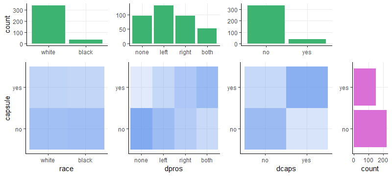
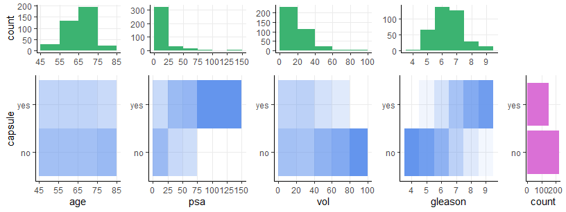
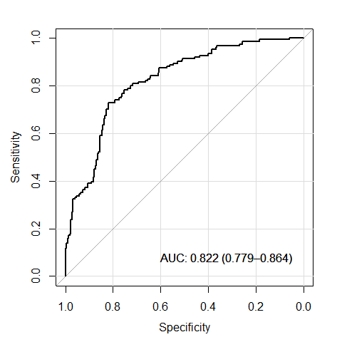

BIOST 2049 - Data Analysis #5
================
Matthew Ragoza
3/25/2022

-   [Prostate cancer study](#prostate-cancer-study)
    -   [Categorical variables](#categorical-variables)
    -   [Quantitative variables](#quantitative-variables)
-   [1. Logistic regression
    prediction](#1-logistic-regression-prediction)
    -   [a. Centering the covariates](#a-centering-the-covariates)
    -   [b. Fitting logistic regression
        model](#b-fitting-logistic-regression-model)
    -   [c. ROC curve and c-statistic](#c-roc-curve-and-c-statistic)
    -   [d. Sensitivity and specificity](#d-sensitivity-and-specificity)
-   [2. Multinomial logistic
    regression](#2-multinomial-logistic-regression)
    -   [a. Fitting the full model](#a-fitting-the-full-model)
    -   [b. Interpretation of
        coefficients](#b-interpretation-of-coefficients)
    -   [c. Testing the quality of fit](#c-testing-the-quality-of-fit)
    -   [d. Fitting a reduced model](#d-fitting-a-reduced-model)
    -   [e. Relative risk ratio](#e-relative-risk-ratio)
    -   [f. Retesting the fit quality](#f-retesting-the-fit-quality)

# Prostate cancer study

In this analysis, we will continue to investigate the data set from data
analysis 4. The data originated from a study at an academic cancer
center on the penetration of the prostatic capsule among patients with
prostate cancer. The study involved 374 patients with prostate cancer,
151 of whom had tumors that penetrated the prostatic capsule.

``` r
library('dplyr')
library('reshape2')
library('ggplot2')
library('gridExtra')
library('scales')
library('stats')
requireNamespace('pROC')
requireNamespace('caret')
requireNamespace('nnet')
requireNamespace('generalhoslem')
library('conflicted')

setwd('C:\\Users\\mtr22\\Code\\BIOST2049\\module-5\\data-analysis')
data <- read.csv('DA4.csv')

convert_factors = function(data) {
  data$capsule = factor(data$capsule, levels=0:1, labels=c('no', 'yes'), ordered=FALSE)
  data$race = factor(data$race, levels=1:2, labels=c('white', 'black'), ordered=FALSE)
  data$dpros = factor(data$dpros, levels=1:4, labels=c('none', 'left', 'right', 'both'), ordered=FALSE)
  data$dcaps = factor(data$dcaps, levels=1:2, labels=c('no', 'yes'), ordered=FALSE)
  return(data)
}

data = convert_factors(data)
data
```

    ##      id capsule age  race dpros dcaps    psa   vol gleason
    ## 1     1      no  65 white  left    no   1.40  0.00       6
    ## 2     2      no  72 white right   yes   6.70  0.00       7
    ## 3     3      no  70 white  none   yes   4.90  0.00       6
    ## 4     4      no  76 black  left    no  51.20 20.00       7
    ## 5     5      no  69 white  none    no  12.30 55.90       6
    ## 6     6     yes  71 white right   yes   3.30  0.00       8
    ## 7     7      no  68 black  both   yes  31.90  0.00       7
    ## 8     8      no  61 black  both   yes  66.70 27.20       7
    ## 9     9      no  69 white  none    no   3.90 24.00       7
    ## 10   10      no  68 black  none   yes  13.00  0.00       6
    ## 11   11     yes  68 black  both   yes   4.00  0.00       7
    ## 12   12     yes  72 white  left   yes  21.20  0.00       7
    ## 13   13     yes  72 white  both   yes  22.70  0.00       9
    ## 14   14     yes  65 white  both   yes  39.00  0.00       7
    ## 15   15      no  75 white  none    no   7.50  0.00       5
    ## 16   16      no  73 white  left    no   2.60  0.00       5
    ## 17   17      no  75 black  none    no   2.50  0.00       5
    ## 18   18      no  70 white  left    no   2.60 11.80       5
    ## 19   19      no  54 white  none   yes   2.80  0.00       6
    ## 20   20     yes  67 black right   yes   8.60 25.50       7
    ## 21   21     yes  58 white  left    no   3.10  0.00       7
    ## 22   23     yes  74 white right    no  12.70 27.50       7
    ## 23   24      no  73 white  none    no  12.30 47.30       7
    ## 24   25     yes  77 white  none    no  61.10 58.00       7
    ## 25   26      no  77 white  none    no   8.80  0.00       5
    ## 26   27      no  67 white  left    no   2.80 25.60       7
    ## 27   28      no  73 white right    no   2.90 14.10       5
    ## 28   29      no  64 white right    no   5.60 34.10       5
    ## 29   30      no  58 white  both    no   5.60 22.80       6
    ## 30   31     yes  54 white right    no   8.40 18.30       6
    ## 31   32      no  72 white  left    no   6.50 22.50       7
    ## 32   33      no  77 white  both    no  11.00  0.00       8
    ## 33   34     yes  60 white right   yes   9.50  0.00       7
    ## 34   35      no  65 white  left    no  11.10 17.70       6
    ## 35   36      no  71 white  left    no   7.30 20.00       7
    ## 36   37      no  54 white  left    no   1.00  0.00       6
    ## 37   38     yes  78 white  none   yes  27.20  0.00       8
    ## 38   39     yes  63 white  left    no  35.10 18.70       7
    ## 39   40     yes  73 white right    no   4.50 26.40       7
    ## 40   41     yes  66 white right    no   7.90 20.80       7
    ## 41   42      no  71 white  none    no   2.00  0.00       6
    ## 42   43     yes  71 white  left    no   7.50  0.00       6
    ## 43   44      no  72 white  left    no   5.30  0.00       7
    ## 44   45     yes  65 black right    no  83.70 32.00       9
    ## 45   47      no  69 black  left    no   6.70 59.80       6
    ## 46   48      no  68 white  left    no  12.30 16.30       8
    ## 47   49      no  70 white  left    no   0.40 17.10       5
    ## 48   50      no  67 white  left    no   5.80 14.50       6
    ## 49   51      no  76 white  none    no   7.60  3.70       6
    ## 50   52     yes  72 white  both   yes 124.00 38.60       8
    ## 51   53      no  66 white right    no   8.80 39.90       6
    ## 52   54     yes  61 white right    no  67.60  0.00       7
    ## 53   55      no  70 white right    no  13.90 13.00       7
    ## 54   56     yes  57 white right    no   7.40 18.30       7
    ## 55   57      no  74 white  left    no  23.10  5.90       7
    ## 56   58     yes  70 white right    no  19.30  0.00       7
    ## 57   59      no  60 white right    no   3.00 16.50       6
    ## 58   60      no  58 white right    no   3.70 29.90       6
    ## 59   61      no  59 white  left    no   0.70 96.00       5
    ## 60   62     yes  71 white  left    no   6.00 31.00       6
    ## 61   63      no  76 white  left    no   9.50 14.40       7
    ## 62   64      no  66 white right    no   2.60  0.00       7
    ## 63   65     yes  59 white  both    no  30.70  0.00       7
    ## 64   66     yes  65 white  left    no  10.80  0.00       7
    ## 65   67      no  54 white  left    no  10.50  0.00       6
    ## 66   68      no  78 white  none    no   6.50  0.00       7
    ## 67   69      no  65 white  left    no   1.30  6.80       5
    ## 68   70     yes  68 black right    no   9.60 32.00       6
    ## 69   71      no  68 white  left    no   0.30  0.00       6
    ## 70   72      no  71 white right    no   8.30 17.50       5
    ## 71   73      no  60 white right    no   3.20  0.00       7
    ## 72   74      no  65 white right    no   6.90 23.30       5
    ## 73   75      no  68 white  none    no  11.00  0.00       7
    ## 74   76      no  54 black  none    no  64.30  0.00       7
    ## 75   77      no  73 white right    no   1.60 17.10       6
    ## 76   78     yes  62 white  left    no   1.90  0.00       6
    ## 77   79      no  60 white  left    no   7.90  0.00       5
    ## 78   80     yes  66 white  none    no  25.70 39.10       9
    ## 79   81      no  76 white right    no   4.90  0.00       6
    ## 80   82      no  62 white  none    no  22.10  0.00       7
    ## 81   83      no  74 white  left    no  31.50  0.00       7
    ## 82   84      no  75 white  left    no  11.00 35.00       7
    ## 83   85      no  75 white  none    no   9.90 15.40       7
    ## 84   86     yes  75 white right    no   3.70  0.00       6
    ## 85   87     yes  68 white  both   yes  51.30 47.00       9
    ## 86   88     yes  71 white  left   yes  89.00 24.00       8
    ## 87   89      no  68 white  both    no  17.10 35.00       9
    ## 88   90      no  70 white right    no  12.30 10.30       7
    ## 89   91      no  68 white  none    no   4.40 39.00       6
    ## 90   92      no  66 white  none    no   8.00  0.00       5
    ## 91   93     yes  70 white right    no  15.00  0.00       7
    ## 92   94     yes  65 white right   yes  35.80 29.00       9
    ## 93   95      no  71 white  none    no  13.40 44.20       7
    ## 94   96     yes  75 white  none    no  16.00 18.70       7
    ## 95   97      no  70 white right    no  11.20  0.00       7
    ## 96   98      no  58 white  none    no   7.00  0.00       6
    ## 97   99      no  64 white  none    no  29.10  0.00       6
    ## 98  100     yes  66 white right    no   9.50 28.10       7
    ## 99  101      no  64 white  left    no   6.10  0.00       6
    ## 100 102     yes  72 white right    no   6.30 34.00       7
    ## 101 103      no  62 white  none    no   2.80 44.00       6
    ## 102 104      no  75 white right    no  25.70 87.60       5
    ## 103 105     yes  68 white  left    no   5.70  0.00       7
    ## 104 106      no  56 white right   yes   2.70 37.00       6
    ## 105 107     yes  69 white  none    no   6.00  0.00       7
    ## 106 108      no  67 white right    no  40.40  0.00       7
    ## 107 109      no  66 white right    no  13.20 23.60       6
    ## 108 110     yes  69 white right    no  15.20  0.00       7
    ## 109 111      no  74 white  none    no   8.80  0.00       7
    ## 110 112     yes  79 white right    no   7.80  0.00       6
    ## 111 113     yes  65 white right    no   6.90  4.60       7
    ## 112 114      no  71 white  left    no  17.20 65.60       8
    ## 113 115     yes  57 white right   yes  64.00  0.00       8
    ## 114 116     yes  47 white  none    no  28.00  0.00       9
    ## 115 117     yes  66 black  both    no  45.30  0.00       6
    ## 116 118      no  64 white  left    no  32.80 22.60       6
    ## 117 119      no  74 white  left    no   3.20 44.80       6
    ## 118 120      no  56 white  left    no   5.60 20.20       8
    ## 119 121     yes  77 white  none    no  16.40  0.00       7
    ## 120 122      no  66 white  none    no   6.80 54.50       5
    ## 121 123      no  67 black  both    no  25.20 21.70       7
    ## 122 124     yes  70 white  left    no  12.50  0.00       9
    ## 123 125     yes  70 white  both    no   3.60 21.70       7
    ## 124 126      no  65 white  left    no  11.00 16.00       6
    ## 125 127      no  63 white  left    no   8.10 20.30       6
    ## 126 128      no  59 white  left    no   2.30  0.00       5
    ## 127 129      no  75 white  left    no   1.40  0.00       6
    ## 128 130      no  70 white  none    no   6.70 29.40       6
    ## 129 131      no  73 white  none    no   1.00  0.00       5
    ## 130 132      no  72 white  left    no   4.50 29.90       8
    ## 131 133      no  67 white  left    no   6.20  0.00       5
    ## 132 134     yes  60 white  both    no   4.60 26.30       7
    ## 133 135      no  66 white  none    no   8.90 43.50       7
    ## 134 136      no  63 white  left    no   8.20 17.80       6
    ## 135 137      no  68 white  left    no   5.00  0.00       6
    ## 136 138     yes  66 white  both    no  91.90  0.00       8
    ## 137 139     yes  69 white  both   yes  94.00  0.00       7
    ## 138 140      no  67 white  none    no  13.40  0.00       7
    ## 139 141      no  72 white  none    no   9.10  0.00       6
    ## 140 142     yes  56 black  left    no  41.90  0.00       8
    ## 141 143      no  74 white  left    no  21.60 52.00       7
    ## 142 144     yes  66 white  both   yes  37.70  0.00       8
    ## 143 145      no  61 white  none    no   9.40 34.60       6
    ## 144 146      no  62 black  none    no   9.10 33.10       6
    ## 145 147     yes  68 white  both   yes  55.60  0.00       8
    ## 146 148      no  63 white right    no   3.60 38.00       6
    ## 147 149      no  55 white  both    no   6.20 29.20       6
    ## 148 150      no  70 white  left    no   6.30  0.00       7
    ## 149 151      no  65 black  left    no   4.60  0.00       5
    ## 150 152     yes  66 white  none    no   4.90 16.10       6
    ## 151 153      no  68 white  none    no   2.60 12.80       6
    ## 152 154     yes  55 white  left    no  16.30 21.20       7
    ## 153 155     yes  55 white  left    no   4.39  0.00       6
    ## 154 156      no  76 white  left    no   8.90 87.30       5
    ## 155 157     yes  58 white  left    no  21.20 26.80       7
    ## 156 158     yes  75 white  left    no   7.90  0.00       7
    ## 157 159     yes  70 white  none    no  44.40  0.00       6
    ## 158 160     yes  59 white  left    no  16.10 23.00       7
    ## 159 161     yes  63 black  left    no  26.00 21.30       7
    ## 160 162     yes  62 white right    no   8.80  0.00       6
    ## 161 163     yes  58 white  left    no  20.60  0.00       7
    ## 162 164     yes  62 white right    no  26.70  0.00       6
    ## 163 165      no  69 white right    no   3.50  0.00       5
    ## 164 166     yes  62 white  left   yes  14.80 22.20       7
    ## 165 167     yes  70 white  left    no  11.90 35.50       6
    ## 166 168      no  76 white  both    no   5.70 40.00       6
    ## 167 169     yes  64 white  both    no   2.40  0.00       6
    ## 168 170     yes  73 white  left    no  42.80  0.00       8
    ## 169 171     yes  74 white right    no   7.00  0.00       6
    ## 170 172     yes  71 white right    no   3.30  0.00       6
    ## 171 173     yes  60 white  both    no   7.30  0.00       7
    ## 172 174     yes  62 white  left    no  17.20  0.00       7
    ## 173 175      no  71 white  left    no   3.80 19.00       6
    ## 174 176      no  67 white right    no   5.70 15.40       6
    ## 175 177     yes  68 white  both    no  31.60 18.00       7
    ## 176 178      no  69 white  none    no   5.40 37.30       6
    ## 177 179      no  67 white  none    no  15.00 35.10       7
    ## 178 180     yes  70 white  left    no  22.00  0.00       8
    ## 179 181     yes  68 white right   yes  23.40  0.00       7
    ## 180 182     yes  70 white  none    no  51.90 20.10       8
    ## 181 183     yes  70 white  none    no  20.40 35.00       7
    ## 182 184     yes  60 white  left    no  18.70 23.40       7
    ## 183 185     yes  61 white right    no  12.70 33.40       7
    ## 184 186     yes  57 white right    no  20.10 30.30       8
    ## 185 187     yes  68 white  none    no  85.40 10.00       7
    ## 186 188      no  75 black  left    no   9.30 23.20       6
    ## 187 189     yes  69 white right   yes   8.00 31.20       6
    ## 188 190      no  64 white  both    no   7.50 11.40       6
    ## 189 191      no  62 white right    no   5.00  0.00       6
    ## 190 192      no  61 white  both    no  61.60 21.20       6
    ## 191 193      no  59 white  none    no   8.50 38.30       5
    ## 192 194      no  71 white  none    no  10.00 15.09       6
    ## 193 195     yes  72 white  left    no  12.70  0.00       6
    ## 194 196     yes  73 white right    no  12.30 30.10       8
    ## 195 197      no  66 black  both    no  11.00  0.00       5
    ## 196 198     yes  69 white right    no  17.70 21.00       5
    ## 197 199      no  69 white  left    no   3.90  0.00       6
    ## 198 200      no  70 white right    no   5.00 21.60       7
    ## 199 201      no  57 white  none    no  10.20  0.00       6
    ## 200 202     yes  68 white right    no  19.20  0.00       8
    ## 201 203     yes  61 white  left    no   2.90  0.00       6
    ## 202 204      no  71 white  left    no   1.70  0.00       6
    ## 203 205      no  62 white  left    no   9.00  0.00       6
    ## 204 206     yes  76 white  both   yes  11.70 28.50       7
    ## 205 207      no  65 white  none    no   8.00 54.00       6
    ## 206 208      no  53 white  left    no   9.90 27.00       5
    ## 207 209      no  65 white  left    no  14.70 15.00       7
    ## 208 210      no  57 white right    no   1.50  0.00       5
    ## 209 211      no  62 white  left    no  13.70 33.40       5
    ## 210 212     yes  68 white  left    no   8.60  0.00       8
    ## 211 213     yes  66 white  both    no  45.80  0.00       8
    ## 212 214      no  50 white right    no   1.80  8.70       5
    ## 213 215      no  67 white  left    no   8.00 20.70       7
    ## 214 216      no  56 white  none    no   5.00 29.60       6
    ## 215 217     yes  69 white  both    no  53.90  0.00       6
    ## 216 218     yes  68 white  both   yes  18.80 27.30       9
    ## 217 219      no  68 white right    no   2.40 20.80       6
    ## 218 220      no  74 white  left    no   1.20 21.60       6
    ## 219 221     yes  51 white  left    no   7.40  0.00       6
    ## 220 222     yes  69 white right    no  38.00 32.80       7
    ## 221 223      no  65 white  none    no   9.40 38.40       5
    ## 222 224     yes  58 white right    no   3.10  0.00       7
    ## 223 225      no  71 white  none    no   1.29  0.00       7
    ## 224 226      no  68 white  left    no  12.70  0.00       7
    ## 225 227      no  56 white  none    no   7.30 15.70       6
    ## 226 228      no  59 white  both    no   3.80 13.80       6
    ## 227 229      no  67 white  none    no  10.20  0.00       7
    ## 228 230     yes  54 white right    no   7.00 29.00       6
    ## 229 231     yes  69 black right    no  24.10 24.50       7
    ## 230 232     yes  54 white right    no   9.40 36.80       6
    ## 231 233     yes  68 white right   yes  25.00 20.00       7
    ## 232 234     yes  59 black  both    no 126.00 20.30       8
    ## 233 235     yes  53 black  left    no  16.80 16.90       7
    ## 234 236     yes  68 white  left    no   8.20 38.20       6
    ## 235 237      no  73 white  left    no   3.10 21.90       6
    ## 236 238      no  66 white  left    no  11.00 36.60       6
    ## 237 239      no  71 white  both    no   4.90 15.20       6
    ## 238 240      no  69 black  none    no  15.60 17.90       6
    ## 239 241     yes  68 white  none    no   6.70 16.70       6
    ## 240 242     yes  74 white right    no   8.70 20.40       6
    ## 241 243     yes  58 black  both   yes  20.70  0.00       8
    ## 242 244      no  67 white  none    no   2.10  0.00       6
    ## 243 245      no  70 white  none    no   8.00  0.00       7
    ## 244 246     yes  70 black  both    no  13.20 25.60       7
    ## 245 247      no  66 white  none    no   2.30  0.00       5
    ## 246 248     yes  57 black  none    no  63.30 73.40       7
    ## 247 249      no  62 white  none    no  13.70  0.00       5
    ## 248 250      no  50 white right    no  13.20  0.00       7
    ## 249 251      no  61 white  left   yes   8.40  0.00       6
    ## 250 253     yes  74 white  left    no  17.70  0.00       7
    ## 251 254      no  78 white  left    no   5.90 32.50       6
    ## 252 255      no  65 white  left    no  22.00 60.00       7
    ## 253 256     yes  57 white  left   yes  15.10  0.00       9
    ## 254 257      no  71 white  both   yes  25.10 14.90       7
    ## 255 258      no  70 white  none    no  24.80 16.10       6
    ## 256 259     yes  55 white  left    no   6.70  0.00       6
    ## 257 260      no  71 white  none    no  11.30 32.00       6
    ## 258 261      no  63 white  left    no  17.50 31.20       5
    ## 259 262     yes  62 white  left    no   8.30  0.00       6
    ## 260 263     yes  71 white  left    no   4.80  0.00       7
    ## 261 264      no  59 white  left    no   1.70 17.20       6
    ## 262 265     yes  64 white right    no   7.50 13.70       7
    ## 263 266      no  67 white right    no  20.00 17.50       5
    ## 264 267     yes  65 white right    no   3.40 14.30       7
    ## 265 268      no  62 white  left    no  10.60 42.40       5
    ## 266 269     yes  65 white right    no  18.00 19.30       7
    ## 267 270     yes  71 white  both    no  18.70 21.00       5
    ## 268 271      no  61 white  none    no   5.40 27.50       6
    ## 269 272      no  59 white  none    no   4.60 29.60       5
    ## 270 273     yes  60 white  left    no  28.50  0.00       9
    ## 271 274     yes  59 white  none    no  11.20  0.00       6
    ## 272 275     yes  70 white  none    no   8.90 24.00       6
    ## 273 276     yes  70 white  left    no   1.70 33.80       6
    ## 274 277      no  59 white  left    no   1.40  0.00       6
    ## 275 278     yes  70 white  left    no   8.40 21.80       5
    ## 276 279      no  54 white right    no   8.60  0.00       5
    ## 277 280      no  64 white  left    no  10.90 24.80       6
    ## 278 281      no  62 white right    no  20.10  0.00       7
    ## 279 283      no  66 black  left    no   8.00  0.00       5
    ## 280 284      no  71 white  none    no   2.00  0.00       5
    ## 281 285      no  61 white  left    no  13.10  0.00       7
    ## 282 286     yes  58 white right    no   5.40 55.00       6
    ## 283 287     yes  76 white  left    no   4.10  0.00       8
    ## 284 288     yes  53 white right    no   6.50  0.00       7
    ## 285 289      no  65 white  none    no   6.10 28.90       7
    ## 286 290      no  69 white  none    no   6.20 26.30       5
    ## 287 291      no  64 white right    no   3.80 19.10       5
    ## 288 292     yes  61 white  none    no   6.80 24.60       5
    ## 289 293      no  62 white  left    no   9.50 26.60       6
    ## 290 294     yes  63 white  both    no  20.40  0.00       7
    ## 291 295      no  61 white right    no   4.80  0.00       6
    ## 292 296     yes  63 white  both    no   9.80 17.50       8
    ## 293 297     yes  73 white  both   yes   7.90  0.00       8
    ## 294 298      no  72 white  none    no  22.10  0.00       5
    ## 295 299      no  52 white  left    no   5.50  0.00       5
    ## 296 300      no  73 white  none    no  17.40 14.20       5
    ## 297 301      no  70 white  both    no  10.00 73.80       5
    ## 298 302      no  70 white  left    no   5.80 20.00       6
    ## 299 303     yes  67 white  both   yes 135.00  0.00       7
    ## 300 304      no  64 white  left    no   8.50  0.00       7
    ## 301 305      no  51 white  left    no  13.00  0.00       6
    ## 302 306      no  64 white  none    no   7.20 10.90       6
    ## 303 307      no  68 white right    no  11.80  0.00       5
    ## 304 308     yes  66 white right    no   4.80  8.80       7
    ## 305 309      no  69 white  none    no  14.30 67.10       4
    ## 306 310      no  67 white right    no  18.10  0.00       8
    ## 307 311      no  78 white  none    no   5.20 29.10       5
    ## 308 312     yes  75 white  both    no   9.90 16.30       5
    ## 309 313     yes  59 white right   yes  12.90  0.00       6
    ## 310 314      no  64 white  none    no  22.00  0.00       5
    ## 311 315     yes  74 white right    no   9.00 41.80       7
    ## 312 316     yes  73 white  both    no  14.00  0.00       7
    ## 313 317     yes  57 black right    no   7.80 38.90       7
    ## 314 318      no  71 white  none    no   4.80 14.00       7
    ## 315 319     yes  66 white  left    no  58.60  0.00       7
    ## 316 320      no  64 white  left    no   2.00  0.00       6
    ## 317 321      no  64 white right    no   8.70 17.20       7
    ## 318 322     yes  62 white  both    no   4.60  0.00       6
    ## 319 323      no  63 white right    no   0.70 18.60       5
    ## 320 324     yes  64 white  both    no  24.10  0.00       6
    ## 321 325      no  70 white  none    no   5.30 73.70       5
    ## 322 327     yes  75 white  none    no   4.80 26.30       7
    ## 323 328      no  52 white  left    no   2.20 11.50       6
    ## 324 329      no  62 white  left    no   7.40  0.00       6
    ## 325 330      no  71 white  left    no   4.60 48.70       5
    ## 326 331     yes  60 white  left   yes  11.40  0.00       7
    ## 327 332     yes  68 white right    no  13.70  1.92       7
    ## 328 333      no  73 black  left    no   7.90 18.00       6
    ## 329 334      no  51 white right    no   8.90  0.00       6
    ## 330 335      no  57 black right    no   3.40 30.80       6
    ## 331 336      no  65 white  both    no   6.30  0.00       6
    ## 332 337      no  61 white right    no   1.50  0.00       5
    ## 333 338     yes  56 white  left   yes  58.00  0.00       6
    ## 334 339     yes  72 white  left    no   1.40 24.20       6
    ## 335 340     yes  54 white  left    no  18.00 43.00       9
    ## 336 341     yes  62 white  left    no   7.30  0.00       7
    ## 337 342      no  63 black right    no  14.30 16.00       7
    ## 338 343      no  68 white  none    no   5.40 34.00       5
    ## 339 344      no  65 white right    no   8.40 26.20       6
    ## 340 345     yes  66 white  left    no  75.00  0.00       7
    ## 341 346      no  70 white  left    no   4.50 37.00       5
    ## 342 347      no  64 white  none    no   3.70  0.00       6
    ## 343 348      no  71 white  none    no  11.70 41.20       5
    ## 344 349     yes  61 white  none    no  21.00  0.00       7
    ## 345 350      no  65 white  none    no  18.50  0.00       6
    ## 346 351      no  62 white right    no   6.40  0.00       6
    ## 347 352      no  75 white  both    no   1.00 13.30       6
    ## 348 353      no  54 white right    no  21.60 25.00       7
    ## 349 354     yes  59 white  left   yes   7.90  0.00       7
    ## 350 355      no  71 black  left    no  12.30 97.60       5
    ## 351 356      no  66 white  left    no   4.40  0.00       6
    ## 352 358      no  66 white  none    no   5.40 21.30       6
    ## 353 359      no  56 white  none    no   5.30  0.00       6
    ## 354 360      no  73 white  none    no  10.40  0.00       7
    ## 355 361      no  57 white  none    no   4.40 13.90       6
    ## 356 362      no  65 white  none    no  10.80  0.00       6
    ## 357 363      no  78 white  left   yes  50.30 29.80       7
    ## 358 364     yes  67 white  both    no  15.20 32.00       7
    ## 359 365      no  69 white  left    no   4.20  0.00       5
    ## 360 366      no  55 white  none    no   0.80 21.00       6
    ## 361 367      no  69 black  left    no  11.50  0.00       6
    ## 362 368      no  74 white  left    no  48.00 47.00       7
    ## 363 369      no  53 white  none    no  10.30 16.40       5
    ## 364 370      no  79 white  none    no   4.40 23.70       6
    ## 365 371     yes  74 white right    no   6.00  0.00       5
    ## 366 372      no  73 white  both    no  10.00 27.40       6
    ## 367 373      no  72 white  left    no  11.00 31.00       6
    ## 368 374     yes  65 white  both    no 139.70 29.90       9
    ## 369 375      no  64 white  none    no  32.20 26.60       5
    ## 370 376      no  58 black right    no  18.20 28.60       7
    ## 371 377      no  69 black  none    no   7.90 14.60       5
    ## 372 378     yes  76 white  left    no   5.50 53.90       8
    ## 373 379      no  69 black  left    no   1.50  8.60       5
    ## 374 380      no  69 white  left    no   1.90 20.70       6

## Categorical variables

``` r
data %>%
  group_by(capsule) %>%
  summarize(count=n(), .groups='drop_last') %>%
  mutate(proportion=count/sum(count)) %>%
  mutate_if(is.double, percent_format(accuracy=0.01))
```

    ## # A tibble: 2 x 3
    ##   capsule count proportion
    ##   <fct>   <int> <chr>     
    ## 1 no        223 59.63%    
    ## 2 yes       151 40.37%

``` r
data %>%
  group_by(race) %>%
  summarize(count=n(), .groups='drop_last') %>%
  mutate(proportion=count/sum(count)) %>%
  mutate_if(is.double, percent_format(accuracy=0.01))
```

    ## # A tibble: 2 x 3
    ##   race  count proportion
    ##   <fct> <int> <chr>     
    ## 1 white   338 90.37%    
    ## 2 black    36 9.63%

``` r
data %>%
  group_by(dpros) %>%
  summarize(count=n(), .groups='drop_last') %>%
  mutate(proportion=count/sum(count)) %>%
  mutate_if(is.double, percent_format(accuracy=0.01))
```

    ## # A tibble: 4 x 3
    ##   dpros count proportion
    ##   <fct> <int> <chr>     
    ## 1 none     96 25.67%    
    ## 2 left    131 35.03%    
    ## 3 right    95 25.40%    
    ## 4 both     52 13.90%

``` r
data %>%
  group_by(dcaps) %>%
  summarize(count=n(), .groups='drop_last') %>%
  mutate(proportion=count/sum(count)) %>%
  mutate_if(is.double, percent_format(accuracy=0.01))
```

    ## # A tibble: 2 x 3
    ##   dcaps count proportion
    ##   <fct> <int> <chr>     
    ## 1 no      334 89.30%    
    ## 2 yes      40 10.70%

``` r
blank <- ggplot() + theme_void()

red = 'orchid'
green = 'mediumseagreen'
blue = 'cornflowerblue'

alpha_scale = function(data, x, y){
  cond = data %>%
    group_by({{x}}, {{y}}) %>%
    summarize(n=n(), .groups='drop_last') %>%
    mutate(prob=n/sum(n))
  scale_alpha_continuous(range=range(cond$prob))
}

# histograms

plot_x1 <- data %>%
  ggplot(aes(x=race)) +
  geom_bar(fill=green) +
  theme_classic() +
  theme(panel.grid.major=element_line()) +
  scale_y_continuous(n.breaks=4) +
  xlab(NULL)

plot_x2 <- data %>%
  ggplot(aes(x=dpros)) +
  geom_bar(fill=green) +
  theme_classic() +
  theme(panel.grid.major=element_line()) +
  scale_y_continuous(n.breaks=3) +
  xlab(NULL) +
  ylab(NULL)

plot_x3 <- data %>%
  ggplot(aes(x=dcaps)) +
  geom_bar(fill=green) +
  theme_classic() +
  theme(panel.grid.major=element_line()) +
  scale_y_continuous(n.breaks=4) +
  xlab(NULL) +
  ylab(NULL)

plot_y <- data %>%
  ggplot(aes(y=capsule)) +
  geom_bar(fill=red) +
  theme_classic() +
  theme(panel.grid.major=element_line()) +
  scale_x_continuous(n.breaks=3) +
  ylab(NULL)

# scatter plots

plot_yx1 <- data %>%
  group_by(race, capsule) %>%
  summarize(n=n(), .groups='drop_last') %>% mutate(prop=n/sum(n)) %>%
  ggplot(aes(x=race, y=capsule, alpha=prop)) +
  geom_raster(fill=blue) +
  theme_classic() +
  theme(panel.grid.major=element_line(), legend.position='none') +
  alpha_scale(data, race, capsule)

plot_yx2 <- data %>%
  group_by(dpros, capsule) %>%
  summarize(n=n(), .groups='drop_last') %>% mutate(prop=n/sum(n)) %>%
  ggplot(aes(x=dpros, y=capsule, alpha=prop)) +
  geom_raster(fill=blue) +
  theme_classic() +
  theme(panel.grid.major=element_line(), legend.position='none') +
  alpha_scale(data, dpros, capsule) +
  ylab(NULL)

plot_yx3 <- data %>%
  group_by(dcaps, capsule) %>%
  summarize(n=n(), .groups='drop_last') %>% mutate(prop=n/sum(n)) %>%
  ggplot(aes(x=dcaps, y=capsule, alpha=prop)) +
  geom_raster(fill=blue) +
  theme_classic() +
  theme(panel.grid.major=element_line(), legend.position='none') +
  alpha_scale(data, dcaps, capsule) +
  ylab(NULL)

# arrange plots on grid

grid.arrange(
    plot_x1,  plot_x2,  plot_x3,  blank,
    plot_yx1, plot_yx2, plot_yx3, plot_y,
    ncol=4, widths=c(2, 2, 2, 1),
    nrow=2, heights=c(1, 2)
)
```

<!-- -->

## Quantitative variables

``` r
data %>%
  group_by(id) %>%
  select_if(is.numeric) %>%
  melt(id.vars='id') %>%
  group_by(variable) %>%
  summarize(
    count=n(),
    mean=mean(value),
    std=sd(value),
    min=min(value),
    Q1=quantile(value, 0.25),
    Q2=quantile(value, 0.50),
    Q3=quantile(value, 0.75),
    max=max(value)
  ) %>%
  mutate_if(is.double, round, digits=2)
```

    ## # A tibble: 4 x 9
    ##   variable count  mean   std   min    Q1    Q2    Q3   max
    ##   <fct>    <int> <dbl> <dbl> <dbl> <dbl> <dbl> <dbl> <dbl>
    ## 1 age        374 66.1   6.45  47      62  67    71    79  
    ## 2 psa        374 15.3  19.9    0.3     5   8.8  17.0 140. 
    ## 3 vol        374 16.0  18.4    0       0  14.4  26.6  97.6
    ## 4 gleason    374  6.42  0.99   4       6   6     7     9

``` r
# function for mapping continuous values to bin centers
discretize = function(x, breaks) {
  centers = head(breaks, -1) + diff(breaks)/2
  idxs = cut(x, breaks=breaks, include.lowest=TRUE, labels=FALSE)
  centers[idxs]
}

alpha_scale = function(data, x, y){
  cond = data %>%
    group_by({{x}}, {{y}}) %>%
    summarize(n=n(), .groups='drop_last') %>%
    mutate(prob=n/sum(n))
  scale_alpha_continuous(range=range(cond$prob))
}

# grid settings

# age
x4_breaks = seq(45, 85, 10)
x4_scale = scale_x_continuous(limits=c(45, 85), breaks=x4_breaks)

# psa
x5_breaks = seq(0, 150, 25)
x5_scale = scale_x_continuous(limits=c(0, 150), breaks=x5_breaks)

# vol
x6_breaks = seq(0, 100, 20)
x6_scale = scale_x_continuous(limits=c(0, 100), breaks=x6_breaks)

# gleason
x7_breaks = seq(3.5, 9.5, 1)
x7_scale = scale_x_continuous(limits=c(3.5, 9.5), breaks=seq(3, 9, 1))

# capsule
y_scale = scale_y_continuous(limits=c(0, 1), breaks=seq(0, 1, 0.25))

# histograms

plot_x4 <- data %>%
  ggplot(aes(x=age)) +
  geom_histogram(fill=green, breaks=x4_breaks) +
  theme_classic() +
  theme(panel.grid.major=element_line()) +
  x4_scale +
  xlab(NULL)

plot_x5 <- data %>%
  ggplot(aes(x=psa)) +
  geom_histogram(fill=green, breaks=x5_breaks) +
  theme_classic() +
  theme(panel.grid.major=element_line()) +
  x5_scale +
  xlab(NULL) +
  ylab(NULL)

plot_x6 <- data %>%
  ggplot(aes(x=vol)) +
  geom_histogram(fill=green, breaks=x6_breaks) +
  theme_classic() +
  theme(panel.grid.major=element_line()) +
  x6_scale +
  xlab(NULL) +
  ylab(NULL)

plot_x7 <- data %>%
  ggplot(aes(x=gleason)) +
  geom_histogram(fill=green, breaks=x7_breaks) +
  theme_classic() +
  theme(panel.grid.major=element_line()) +
  x7_scale +
  xlab(NULL) +
  ylab(NULL)

# scatter plots

plot_yx4 <- data %>%
  mutate(age=discretize(age, breaks=x4_breaks)) %>%
  group_by(age, capsule) %>%
  summarize(n=n(), .groups='drop_last') %>% mutate(prop=n/sum(n)) %>%
  ggplot(aes(x=age, y=capsule, alpha=prop)) +
  geom_tile(fill=blue) +
  theme_classic() +
  theme(panel.grid.major=element_line(), legend.position='none') +
  x4_scale + alpha_scale(data, discretize(age, breaks=x4_breaks), capsule)

plot_yx5 <- data %>%
  mutate(psa=discretize(psa, breaks=x5_breaks)) %>%
  group_by(psa, capsule) %>%
  summarize(n=n(), .groups='drop_last') %>% mutate(prop=n/sum(n)) %>%
  ggplot(aes(x=psa, y=capsule, alpha=prop)) +
  geom_tile(fill=blue) + 
  theme_classic() +
  theme(panel.grid.major=element_line(), legend.position='none') +
  x5_scale + alpha_scale(data, discretize(psa, breaks=x5_breaks), capsule) +
  ylab(NULL)

plot_yx6 <- data %>%
  mutate(vol=discretize(vol, breaks=x6_breaks)) %>%
  group_by(vol, capsule) %>%
  summarize(n=n(), .groups='drop_last') %>% mutate(prop=n/sum(n)) %>%
  ggplot(aes(x=vol, y=capsule, alpha=prop)) +
  geom_tile(fill=blue) +
  theme_classic() +
  theme(panel.grid.major=element_line(), legend.position='none') +
  x6_scale + alpha_scale(data, discretize(vol, breaks=x6_breaks), capsule) +
  ylab(NULL)

plot_yx7 <- data %>%
  group_by(gleason, capsule) %>%
  summarize(n=n(), .groups='drop_last') %>% mutate(prop=n/sum(n)) %>%
  ggplot(aes(x=gleason, y=capsule, alpha=prop)) +
  geom_tile(fill=blue) +
  theme_classic() +
  theme(panel.grid.major=element_line(), legend.position='none') +
  x7_scale + alpha_scale(data, gleason, capsule) +
  ylab(NULL)

# arrange plots on grid

grid.arrange(
    plot_x4,  plot_x5,  plot_x6,  plot_x7,  blank,
    plot_yx4, plot_yx5, plot_yx6, plot_yx7, plot_y,
    ncol=5, widths=c(2, 2, 2, 2, 1),
    nrow=2, heights=c(1, 2)
)
```

<!-- -->

# 1. Logistic regression prediction

We will evaluate a binary logistic regression model from the previous
analysis in terms of its discrimination performance using an ROC curve,
c-statistic, and confusion matrix.

## a. Centering the covariates

As in the previous analysis, we will center the continuous independent
variables by subtracting their median to improve the model
interpretability.

``` r
# subtract median from quantitative variables

subtract_median = function(data, train_data) {
  data$age_c = data$age - median(train_data$age)
  data$psa_c = data$psa - median(train_data$psa)
  data$vol_c = data$vol - median(train_data$vol)
  data$gleason_c = data$gleason - median(train_data$gleason)
  return(data)
}
data = subtract_median(data, data)

data %>%
  group_by(id) %>%
  select(c('id', 'age_c', 'psa_c', 'vol_c', 'gleason_c')) %>%
  melt(id.vars='id') %>%
  group_by(variable) %>%
  summarize(
    count=n(),
    mean=mean(value),
    std=sd(value),
    min=min(value),
    Q1=quantile(value, 0.25),
    Q2=quantile(value, 0.50),
    Q3=quantile(value, 0.75),
    max=max(value)
  ) %>%
  mutate_if(is.double, round, digits=2)
```

    ## # A tibble: 4 x 9
    ##   variable  count  mean   std   min    Q1    Q2    Q3   max
    ##   <fct>     <int> <dbl> <dbl> <dbl> <dbl> <dbl> <dbl> <dbl>
    ## 1 age_c       374 -0.93  6.45 -20    -5       0  4     12  
    ## 2 psa_c       374  6.54 19.9   -8.5  -3.8     0  8.22 131. 
    ## 3 vol_c       374  1.62 18.4  -14.4 -14.4     0 12.2   83.2
    ## 4 gleason_c   374  0.42  0.99  -2     0       0  1      3

## b. Fitting logistic regression model

We will fit logistic regression model 3 from the previous analysis,
which predicts penetration of the prostatic capsule based on the
following covariates: `dpros`, `gleason_c`, `psa_c`, and `vol_c`.

``` r
logreg = function(data, formula) {
  glm(formula, family=binomial(link='logit'), data=data)
}

model = logreg(data, capsule ~ dpros + gleason_c + psa_c + vol_c)

summary(model)
```

    ## 
    ## Call:
    ## glm(formula = formula, family = binomial(link = "logit"), data = data)
    ## 
    ## Deviance Residuals: 
    ##     Min       1Q   Median       3Q      Max  
    ## -2.2199  -0.7676  -0.4372   0.8864   2.5027  
    ## 
    ## Coefficients:
    ##              Estimate Std. Error z value Pr(>|z|)    
    ## (Intercept) -1.906367   0.302891  -6.294 3.10e-10 ***
    ## dprosleft    0.749075   0.356821   2.099  0.03579 *  
    ## dprosright   1.546555   0.372887   4.148 3.36e-05 ***
    ## dprosboth    1.386444   0.452779   3.062  0.00220 ** 
    ## gleason_c    0.981361   0.162351   6.045 1.50e-09 ***
    ## psa_c        0.028616   0.009614   2.977  0.00292 ** 
    ## vol_c       -0.013875   0.007676  -1.808  0.07066 .  
    ## ---
    ## Signif. codes:  0 '***' 0.001 '**' 0.01 '*' 0.05 '.' 0.1 ' ' 1
    ## 
    ## (Dispersion parameter for binomial family taken to be 1)
    ## 
    ##     Null deviance: 504.53  on 373  degrees of freedom
    ## Residual deviance: 377.71  on 367  degrees of freedom
    ## AIC: 391.71
    ## 
    ## Number of Fisher Scoring iterations: 5

From the regression summary above, we can see that the model has a
deviance of 377.71 and an AIC of 391.71. All of the predictors are
significantly associated with the outcome at the 0.05 significance
level, adjusting for the other covariates in the model, except for
`vol_c`, the tumor volume. This agrees with the result of the previous
analysis.

## c. ROC curve and c-statistic

Now we will assess the predictive performance of the model in terms of
its discrimination ability using a receiver-operating characteristic
(ROC) curve. The curve below plots the model sensitivity against 1 -
specificity when varying the threshold on the predicted probability that
we use to discriminate between the output classes.

``` r
data$phat = predict(model, type='response')
roc = pROC::roc(
  capsule ~ phat, data, ci=TRUE,
  plot=TRUE, print.auc=TRUE, print.auc.x=0.6, print.auc.y=0.1,
  grid=TRUE, grid.h=0:4/5, grid.v=0:4/5, grid.lty=1, grid.ltx=1
)
```

    ## Setting levels: control = no, case = yes

    ## Setting direction: controls < cases

<!-- -->

``` r
roc
```

    ## 
    ## Call:
    ## roc.formula(formula = capsule ~ phat, data = data, ci = TRUE,     plot = TRUE, print.auc = TRUE, print.auc.x = 0.6, print.auc.y = 0.1,     grid = TRUE, grid.h = 0:4/5, grid.v = 0:4/5, grid.lty = 1,     grid.ltx = 1)
    ## 
    ## Data: phat in 223 controls (capsule no) < 151 cases (capsule yes).
    ## Area under the curve: 0.8215
    ## 95% CI: 0.7789-0.8641 (DeLong)

In addition to generating the curve above, we see that the area under
the curve (AUC) is 0.822, with a DeLong 95% confidence interval of
0.779-0.864. The AUC is equivalent to the c-statistic, which is the
probability that a random pair of positive and negative observations are
ranked correctly using the predicted probability (i.e. that the positive
observation has a higher predicted probability than the negative).
Therefore, our model has an 82.2% probability of correctly ranking a
pair of positive and negative observations.

## d. Sensitivity and specificity

The c-statistic gives an overall measure of the model’s discrimination
ability across all possible thresholds, but if we choose a specific
threshold we can use this to compute additional metrics derived from the
confusion matrix.

``` r
threshold = 0.5
data$yhat = factor(data$phat > threshold, levels=c(FALSE, TRUE), labels=c('no', 'yes'))
caret::confusionMatrix(data$yhat, data$capsule, positive='yes')
```

    ## Confusion Matrix and Statistics
    ## 
    ##           Reference
    ## Prediction  no yes
    ##        no  188  57
    ##        yes  35  94
    ##                                           
    ##                Accuracy : 0.754           
    ##                  95% CI : (0.7071, 0.7968)
    ##     No Information Rate : 0.5963          
    ##     P-Value [Acc > NIR] : 1.019e-10       
    ##                                           
    ##                   Kappa : 0.4768          
    ##                                           
    ##  Mcnemar's Test P-Value : 0.02857         
    ##                                           
    ##             Sensitivity : 0.6225          
    ##             Specificity : 0.8430          
    ##          Pos Pred Value : 0.7287          
    ##          Neg Pred Value : 0.7673          
    ##              Prevalence : 0.4037          
    ##          Detection Rate : 0.2513          
    ##    Detection Prevalence : 0.3449          
    ##       Balanced Accuracy : 0.7328          
    ##                                           
    ##        'Positive' Class : yes             
    ## 

In the confusion matrix above, we have set the discrimination threshold
to 0.5. At this threshold, the model has a sensitivity of 0.623 and
specificity of 0.843. The sensitivity is the probability of a positive
predicted label given a truly positive observation, while the
specificity is the probability of a negative predicted label given a
truly negative observation. Using a threshold of 0.5, our model has a
62.3% probability of assigning a positive label to a positive example
and an 84.3% probability of assigning a negative label to a negative
example.

# 2. Multinomial logistic regression

In the second phase of this analysis, we will investigate a different
prediction task. We want to build a model that predicts the result of
the rectal examination (`dpros`) based on other covariates in the data
set. As this is a categorical variable with more than two levels, we
will use multinomial logistic regression.

## a. Fitting the full model

We will now fit a full multinomial logistic regression model that
predicts `dpros` given all of the other covariates in the data set. The
summary of the model fitting procedure and estimated coefficients are
displayed below.

``` r
model = nnet::multinom(
  dpros ~ race + dcaps + age_c + psa_c + vol_c + gleason_c, data
)
```

    ## # weights:  32 (21 variable)
    ## initial  value 518.474091 
    ## iter  10 value 493.654168
    ## iter  20 value 470.485536
    ## final  value 469.909305 
    ## converged

``` r
m = summary(model)
m
```

    ## Call:
    ## nnet::multinom(formula = dpros ~ race + dcaps + age_c + psa_c + 
    ##     vol_c + gleason_c, data = data)
    ## 
    ## Coefficients:
    ##       (Intercept) raceblack  dcapsyes        age_c       psa_c         vol_c
    ## left    0.2072325 0.3525846 0.2991275 -0.028212298 -0.01332807 -0.0022919710
    ## right  -0.2013313 0.2355521 0.8996798 -0.053985976 -0.01796832 -0.0007363444
    ## both   -1.3313408 0.8409033 1.5217356  0.001776338  0.01305898 -0.0076604923
    ##       gleason_c
    ## left  0.4025373
    ## right 0.4429571
    ## both  0.5470507
    ## 
    ## Std. Errors:
    ##       (Intercept) raceblack  dcapsyes      age_c       psa_c       vol_c
    ## left    0.1513008 0.5082213 0.6432723 0.02182228 0.009856622 0.007324019
    ## right   0.1686105 0.5584712 0.6354744 0.02336204 0.011179204 0.008081669
    ## both    0.2399216 0.5856721 0.6346514 0.03056496 0.009232199 0.010650654
    ##       gleason_c
    ## left  0.1635310
    ## right 0.1767906
    ## both  0.2152705
    ## 
    ## Residual Deviance: 939.8186 
    ## AIC: 981.8186

From the summary, we see that the final residual deviance of the model
is 939.8 and the AIC is 981.8. I used the model coefficients and
standard errors to generate p-values for two-sided t tests on the model
parameters using a null hypothesis value of 0. The p-values are shown
below.

``` r
n = nrow(m$residuals)
k = length(m$coefficients)
t = m$coefficients / m$standard.errors
p = pt(abs(t), df=n-k, lower=FALSE) * 2 # two-tailed
p
```

    ##        (Intercept) raceblack   dcapsyes      age_c     psa_c     vol_c
    ## left  1.716600e-01 0.4882878 0.64221162 0.19691852 0.1771786 0.7545118
    ## right 2.332556e-01 0.6734422 0.15772722 0.02141734 0.1088829 0.9274546
    ## both  5.646888e-08 0.1519471 0.01701495 0.95368848 0.1580954 0.4724622
    ##        gleason_c
    ## left  0.01431197
    ## right 0.01267583
    ## both  0.01147382

From the t-tests on the model parameters, we see that the only covariate
that was signficantly associated with all outcomes of the rectal exam at
a 0.05 significance level was the Gleason score. Age was significantly
associated with the detection of a right nodule during the exam at a
0.05 level, and the detection of capsule involvement during the exam was
significantly associated with the detection of bilobar nodules during
the exam at a 0.05 level. Out of all the remaining covariates, the PSA
level was closest to being significantly associated with the rectal exam
outcome, but was not significant at the 0.05 or even 0.10 level for any
outcome level.

## b. Interpretation of coefficients

The coefficients of a multinomial logistic regression model are
interpretable as the change in the log-odds of the outcome for a given
change in the independent variable. Since there are separate parameters
for the conditional distribution of each level of the outcome, we
interpret each parameter separately as the change in log-odds for a
given outcome level compared to the reference outcome level. In our
case, the reference outcome is the absence of any nodules detected in
the rectal exam. The exponentiated model coefficients are shown below.

``` r
exp(coefficients(model))
```

    ##       (Intercept) raceblack dcapsyes     age_c     psa_c     vol_c gleason_c
    ## left    1.2302685  1.422740 1.348682 0.9721820 0.9867604 0.9977107  1.495615
    ## right   0.8176415  1.265607 2.458816 0.9474454 0.9821921 0.9992639  1.557306
    ## both    0.2641229  2.318460 4.580168 1.0017779 1.0131446 0.9923688  1.728149

The coefficients on the Gleason score are 0.403, 0.443, and 0.547 for
the outcomes `left`, `right`, and `both`, respectively. A unit increase
in the Gleason score thus corresponds to a 0.403 increase in the
log-odds of detecting a left nodule, 0.443 increase in the log-odds of
detecting a right nodule, and 0.547 increase in the log-odds of both,
compared to having no nodules detected during the exam. The coefficient
on `dcapsyes` of 1.527 for the `both` nodules outcome means that
patients who had capsular involvement detected during the rectal exam
have 4.58 times the odds of having bilobar nodules detected than those
who did not have capsular involvement detected.

## c. Testing the quality of fit

We can perform a Hosmer-Lemeshow goodness-of-fit test to assess the
quality of the multinomial logistic model fit. This is a chi-squared
test that compares the predicted probabilities of the outcomes to those
observed in the data set. The null hypothesis is that the observed
outcomes values follow the same probability distribution as predicted by
the model, and the alternative hypothesis is that at least one of the
outcome levels does not follow the predicted probability distribution.
In other words, the alternative hypothesis is that the model is
misspecified. We will now run the test.

``` r
generalhoslem::logitgof(data$dpros, fitted(model))
```

    ## 
    ##  Hosmer and Lemeshow test (multinomial model)
    ## 
    ## data:  data$dpros, fitted(model)
    ## X-squared = 32.59, df = 24, p-value = 0.113

From the test output, we see a chi-squared test statistic of 32.59 with
24 degrees of freedom and a p-value of 0.113. We would observe a
chi-squared statistic this large 11.3% of the time if the null
hypothesis were true. Therefore, we do not reject the null hypothesis at
a 5% significance level. We do not have evidence that the model is
misspecified, which suggests that it fits the data well.

## d. Fitting a reduced model

Despite that the full model passed the goodness-of-fit test, we would
like to simplify it by removing unimportant covariates. We previously
found that the only covariates significantly associated with any result
of the rectal exam were the Gleason score, detection of capsular
involvement during the exam, and the age of the patient. The PSA level
was not significant, but it is a known predictor of prostate cancer, so
we will not remove it. We will now fit a reduced multinomial logistic
regression model using only these four covariates.

``` r
reduced_model = nnet::multinom(
  dpros ~ dcaps + age_c + psa_c + gleason_c, data
)
```

    ## # weights:  24 (15 variable)
    ## initial  value 518.474091 
    ## iter  10 value 483.945467
    ## iter  20 value 471.183149
    ## final  value 471.183076 
    ## converged

``` r
m = summary(reduced_model)
m
```

    ## Call:
    ## nnet::multinom(formula = dpros ~ dcaps + age_c + psa_c + gleason_c, 
    ##     data = data)
    ## 
    ## Coefficients:
    ##       (Intercept)  dcapsyes        age_c       psa_c gleason_c
    ## left    0.2268449 0.3185098 -0.029319006 -0.01269094 0.4027108
    ## right  -0.1869736 0.9006000 -0.054564763 -0.01759103 0.4440499
    ## both   -1.2583520 1.5867725 -0.004591204  0.01458363 0.5356558
    ## 
    ## Std. Errors:
    ##       (Intercept)  dcapsyes      age_c       psa_c gleason_c
    ## left    0.1453441 0.6386075 0.02166545 0.009746907 0.1622367
    ## right   0.1624859 0.6300840 0.02320799 0.011061077 0.1759060
    ## both    0.2283572 0.6296229 0.02995859 0.009187690 0.2124245
    ## 
    ## Residual Deviance: 942.3662 
    ## AIC: 972.3662

The regression summary above shows that the reduced model attained a
deviance of 942.4 and an AIC of 972.4. This is a slight increase in the
deviance compared to the full model (939.8), corresponding to a lower
model likelihood on the data set. However, the AIC improved (from 981.8)
due to the reduction in the number of model parameters, so the model is
more parsimonious and should be preferred according to this criterion.

``` r
n = nrow(m$residuals)
k = length(m$coefficients)
t = m$coefficients / m$standard.errors
p = pt(abs(t), df=n-k, lower=FALSE) * 2 # two-tailed
p
```

    ##        (Intercept)   dcapsyes      age_c     psa_c  gleason_c
    ## left  1.194653e-01 0.61825627 0.17682386 0.1937348 0.01351238
    ## right 2.506190e-01 0.15377804 0.01925713 0.1126351 0.01202137
    ## both  6.842700e-08 0.01216197 0.87828594 0.1133248 0.01211338

The p-values for t-tests on the reduced model coefficients are displayed
above. The same coefficients were found to be significantly associated
with rectal exam outcomes in the reduced model as in the full model.

## e. Relative risk ratio

The exponentiated coefficients of the reduced model are shown below.

``` r
exp(coefficients(reduced_model))
```

    ##       (Intercept) dcapsyes     age_c     psa_c gleason_c
    ## left    1.2546352 1.375077 0.9711066 0.9873893  1.495874
    ## right   0.8294657 2.461079 0.9468972 0.9825628  1.559008
    ## both    0.2841219 4.887948 0.9954193 1.0146905  1.708568

The coefficient on the Gleason score predictor for the detection of
bilobar nodules is 0.0121 in the reduced model, and the exponentiated
coefficient is 1.709. This can be interpretted as meaning that relative
risk of the bilobar nodule results compared to no nodules in the rectal
exam increases by 1.709 for each unit increase in the Gleason score.

## f. Retesting the fit quality

We will now reassess the model fit by applying another Hosmer-Lemeshow
test on the reduced model, comparing its predicted probabilities over
the rectal exam outcomes to those observed in the data set. The null
hypothesis is that the model is correctly specified and the alternative
hypothesis is that it is misspecified.

``` r
generalhoslem::logitgof(data$dpros, fitted(reduced_model))
```

    ## 
    ##  Hosmer and Lemeshow test (multinomial model)
    ## 
    ## data:  data$dpros, fitted(reduced_model)
    ## X-squared = 33.467, df = 24, p-value = 0.0946

The resulting p-value of 0.0946 indicates that we would have a 9.46%
probability of observing a test statistic at least as great as the
obtained value of 33.47 under the null hypothesis. Consequently, we do
not reject the null hypothesis at a 5% significance level, so the model
fits the data

We can further perform a likelihood ratio test to compare the full model
and reduced model. The null hypothesis is that none of the additional
covariates in the full model are significantly associated with the
outcome (i.e. their coefficients are zero). The alternative hypothesis
is that at least one of the added covariates are associated with the
outcome. The result of the test is summarized below.

``` r
anova(model, reduced_model)
```

    ## Likelihood ratio tests of Multinomial Models
    ## 
    ## Response: dpros
    ##                                              Model Resid. df Resid. Dev   Test
    ## 1                dcaps + age_c + psa_c + gleason_c      1107   942.3662       
    ## 2 race + dcaps + age_c + psa_c + vol_c + gleason_c      1101   939.8186 1 vs 2
    ##      Df LR stat.   Pr(Chi)
    ## 1                         
    ## 2     6 2.547543 0.8631094

The p-value of the likelihood ratio test is 0.863, which corresponds to
an 86.3% probability of observing a likelihood ratio this large assuming
the null hypothesis is true. We do not reject the null hypothesis at a
5% significance level. Therefore, we do not have evidence that the extra
predictors in the full model are associated with the outcome, so the
reduced model is the “true” model.

\_
