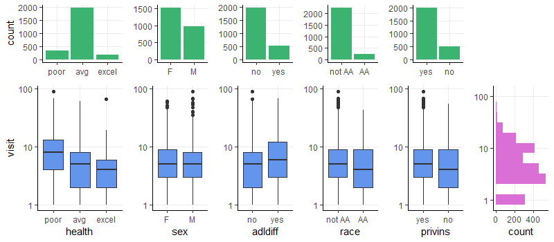
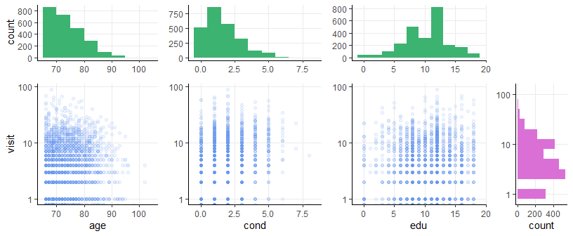
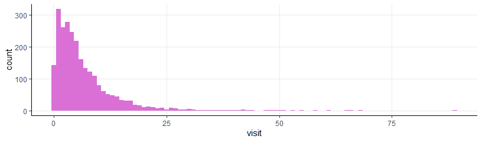
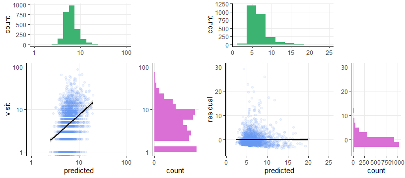
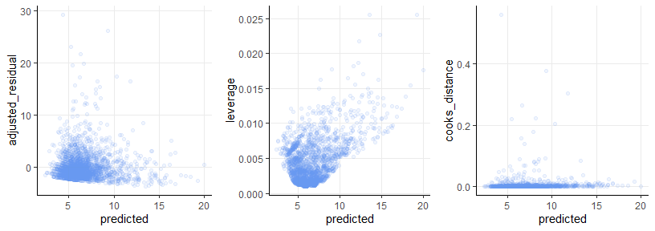

BIOST 2049 - Data Analysis #6
================
Matthew Ragoza
4/7/2022

-   [Physician office visits data
    set](#physician-office-visits-data-set)
    -   [Categorical variables](#categorical-variables)
    -   [Quantitative variables](#quantitative-variables)
    -   [Part 1 - Number of doctor
        visits](#part-1---number-of-doctor-visits)
    -   [Part 2 - Poisson regression
        model](#part-2---poisson-regression-model)
    -   [Part 3 - Assessing univariate
        models](#part-3---assessing-univariate-models)
    -   [Part 4 - Stepwise model
        building](#part-4---stepwise-model-building)
    -   [Part 5 - Poisson regression
        diagnostics](#part-5---poisson-regression-diagnostics)

# Physician office visits data set

The data set in this analysis was sourced from a study on the effects of
demographics, health conditions, and insurance information on the
frequency of doctor visits. The sample size included in the study was
2,500 people in the US. For this analysis, the outcome variable of
interest is the number of physician office visits in the past two years.

``` r
library('dplyr')
library('reshape2')
library('ggplot2')
library('gridExtra')
library('scales')
library('stats')
requireNamespace('glmnet')
requireNamespace('car')
requireNamespace('lrtest')
library('conflicted')

setwd('C:\\Users\\mtr22\\Code\\BIOST2049\\module-6\\data-analysis')
data <- read.csv('da6.csv')

convert_vars = function(data) {
  
  # convert categorical variables to factors
  data$health = factor(data$health, levels=1:3, labels=c('poor', 'avg', 'excel'))
  data$sex = factor(data$sex, levels=0:1, labels=c('F', 'M'))
  data$adldiff = factor(data$adldiff, levels=0:1, labels=c('no', 'yes'))
  data$race = factor(data$race, levels=0:1, labels=c('not AA', 'AA'))
  data$privins = factor(data$privins, level=0:1, labels=c('yes', 'no'))
  
  data$age = data$age * 10 # convert age to years
  
  # reinsert visit so it appears last
  x = data$visit
  data = subset(data, select=-visit)
  data$visit = x
  return(data)
}

data = convert_vars(data)
data
```

    ##      age health sex adldiff   race privins cond edu visit
    ## 1     69    avg   M      no     AA     yes    2   6     5
    ## 2     74    avg   F      no not AA     yes    2  10     1
    ## 3     66   poor   F     yes     AA      no    4  10    13
    ## 4     76   poor   M     yes not AA     yes    2   3    16
    ## 5     79    avg   F     yes not AA     yes    2   6     3
    ## 6     66   poor   F     yes not AA      no    5   7    17
    ## 7     75    avg   F      no not AA     yes    0   8     9
    ## 8     87    avg   F      no not AA     yes    0   8     3
    ## 9     73    avg   F      no not AA     yes    0   8     1
    ## 10    69    avg   F     yes not AA     yes    5  15    44
    ## 11    84    avg   F     yes not AA      no    1   8     2
    ## 12    81   poor   F     yes not AA      no    1   8     1
    ## 13    78    avg   F      no not AA     yes    1  12    19
    ## 14    76    avg   F      no not AA      no    0   8    19
    ## 15    80    avg   F     yes not AA      no    2   8     3
    ## 16    73    avg   M      no     AA      no    3  10     2
    ## 17    74    avg   M      no not AA     yes    4  12    12
    ## 18    67    avg   M      no not AA     yes    1  12     2
    ## 19    73    avg   M      no not AA     yes    2   8     3
    ## 20    75    avg   F      no not AA     yes    1   9     1
    ## 21    71    avg   F      no not AA     yes    2   9     1
    ## 22    89    avg   F      no not AA      no    3   8     5
    ## 23    67    avg   M      no not AA     yes    1   4     1
    ## 24    72   poor   M      no not AA      no    5   6    12
    ## 25    87   poor   F      no not AA     yes    2   8     6
    ## 26    75    avg   F      no not AA      no    0  12     2
    ## 27    96    avg   F     yes not AA     yes    3   8     4
    ## 28    66  excel   F      no not AA     yes    0  16     2
    ## 29    93    avg   F     yes not AA     yes    0   9     2
    ## 30    81    avg   M      no not AA     yes    1   8     1
    ## 31    72    avg   F      no not AA     yes    0  12     1
    ## 32    79    avg   F      no not AA     yes    3   8     4
    ## 33    70    avg   F     yes not AA     yes    2  12    26
    ## 34    69    avg   F      no not AA     yes    0  12     3
    ## 35    83    avg   F      no not AA     yes    0   8     1
    ## 36    72    avg   M      no not AA     yes    0  12     1
    ## 37    70    avg   F      no not AA     yes    1  12     1
    ## 38    67    avg   M      no not AA     yes    1  12     3
    ## 39    78    avg   M      no not AA     yes    3  12    17
    ## 40    75    avg   M      no not AA     yes    3  10     5
    ## 41    70    avg   F      no not AA     yes    2  13     5
    ## 42    66    avg   F      no not AA     yes    0  16     9
    ## 43    77    avg   M      no not AA      no    1  11     2
    ## 44    72    avg   F      no not AA     yes    2   8     1
    ## 45    67    avg   M      no not AA     yes    1  12     9
    ## 46    71    avg   M      no not AA     yes    1  13    11
    ## 47    69    avg   F      no not AA     yes    0  14     3
    ## 48    68    avg   M      no not AA     yes    3   8     1
    ## 49    84    avg   M     yes not AA      no    0   0     1
    ## 50    69    avg   F      no not AA     yes    0  12     3
    ## 51    75    avg   F      no not AA     yes    2   8     2
    ## 52    73    avg   M      no not AA      no    1   8     4
    ## 53    71    avg   F      no not AA      no    1  12     3
    ## 54    76    avg   F      no not AA     yes    1   8     5
    ## 55    90   poor   F     yes not AA     yes    4  13     5
    ## 56    67    avg   F      no not AA     yes    2  11     1
    ## 57    66   poor   M      no not AA     yes    2   8     4
    ## 58    83    avg   F     yes not AA     yes    2  12     8
    ## 59    79   poor   F      no not AA     yes    1   8     8
    ## 60    87    avg   M      no not AA     yes    0  12     1
    ## 61    68    avg   M      no not AA     yes    1  10     5
    ## 62    74    avg   M      no not AA     yes    1   7     4
    ## 63    72    avg   F      no not AA     yes    1   9     3
    ## 64    69    avg   M      no not AA     yes    1   8    11
    ## 65    66   poor   F     yes not AA     yes    1  10    13
    ## 66    69    avg   F      no not AA     yes    2   8     7
    ## 67    66    avg   F      no not AA     yes    3  10     5
    ## 68    67    avg   M      no not AA     yes    2  13     3
    ## 69    76    avg   F      no not AA     yes    3  13     2
    ## 70    71    avg   M      no not AA     yes    1   5    22
    ## 71    72    avg   F      no not AA     yes    2  12     6
    ## 72    79    avg   F      no not AA     yes    1   9     1
    ## 73    78    avg   F      no not AA     yes    2  12     8
    ## 74    72    avg   M      no not AA     yes    1   8     1
    ## 75    76    avg   M      no not AA     yes    2  12     5
    ## 76    75    avg   F      no not AA     yes    1  10     2
    ## 77    71   poor   M      no not AA     yes    5  12     6
    ## 78    68    avg   F      no not AA     yes    0  10    10
    ## 79    71  excel   M      no not AA     yes    1  12     1
    ## 80    72    avg   F      no not AA     yes    1  10     3
    ## 81    71    avg   F      no not AA     yes    0  12     7
    ## 82    74    avg   M      no not AA     yes    2   8    10
    ## 83    67    avg   F      no not AA     yes    2  12    13
    ## 84    72    avg   M      no not AA     yes    0  12     1
    ## 85    78    avg   M      no not AA     yes    2  10    16
    ## 86    86   poor   F     yes not AA     yes    4   6    29
    ## 87    80    avg   M      no not AA     yes    2  12     8
    ## 88    74    avg   F      no not AA     yes    2  12     4
    ## 89    74  excel   M      no not AA     yes    3  12     1
    ## 90    74  excel   F      no not AA     yes    2  12     8
    ## 91    66    avg   M     yes not AA     yes    1  12     9
    ## 92    75   poor   M     yes not AA      no    1   6     1
    ## 93    83    avg   F      no not AA     yes    1  13     7
    ## 94    69   poor   F      no not AA     yes    4   8     8
    ## 95    83    avg   M      no not AA     yes    3   8    22
    ## 96    72    avg   F      no not AA     yes    1   9     4
    ## 97    75    avg   M      no not AA     yes    3   8     3
    ## 98    72    avg   F      no not AA     yes    2  12     1
    ## 99    72    avg   M      no not AA     yes    1  12     3
    ## 100   68    avg   F      no not AA     yes    1  12     7
    ## 101   69    avg   F      no not AA     yes    2  12    11
    ## 102   72    avg   F      no not AA     yes    1  12     3
    ## 103   68    avg   F      no not AA     yes    1   9     7
    ## 104   83    avg   F      no     AA      no    2   6     4
    ## 105   69    avg   F      no     AA     yes    4  12     9
    ## 106   67   poor   M     yes     AA      no    3   3    15
    ## 107   69    avg   M      no not AA      no    3  10     2
    ## 108   79    avg   F      no not AA     yes    0  11     5
    ## 109   67    avg   F      no     AA     yes    1  16     5
    ## 110   84    avg   M      no not AA     yes    1  16    13
    ## 111   72    avg   F     yes not AA     yes    1  12     1
    ## 112   71   poor   F     yes not AA     yes    5  10    10
    ## 113   79    avg   F      no not AA     yes    1   9    10
    ## 114   74    avg   F      no not AA     yes    1  14     9
    ## 115   72    avg   F      no not AA     yes    0  12     4
    ## 116   74    avg   F      no not AA     yes    1  11     7
    ## 117   81    avg   M      no not AA     yes    2  16    29
    ## 118   83    avg   F     yes not AA     yes    1  16    39
    ## 119   72    avg   F     yes not AA     yes    4  12     3
    ## 120   75    avg   F      no not AA     yes    1  16    17
    ## 121   66    avg   F      no not AA     yes    1   0     1
    ## 122   74    avg   F     yes not AA     yes    2  12    14
    ## 123   68  excel   F      no not AA     yes    0  15     1
    ## 124   75    avg   F      no not AA     yes    3  12     6
    ## 125   81    avg   F      no not AA     yes    2   8     4
    ## 126   69    avg   F      no not AA      no    2  12     7
    ## 127   80  excel   F      no not AA     yes    0   8     3
    ## 128   69    avg   M      no not AA     yes    0  12     2
    ## 129   82    avg   M      no not AA     yes    3  14     7
    ## 130   75    avg   F      no not AA     yes    1  12     7
    ## 131   82    avg   M      no not AA     yes    2  18     6
    ## 132   71    avg   F      no not AA     yes    1   8    12
    ## 133   73  excel   M      no not AA     yes    1   7     8
    ## 134   72  excel   F      no not AA     yes    1   9     5
    ## 135   70    avg   F      no not AA     yes    2   9     5
    ## 136   86    avg   F     yes     AA      no    2   5    12
    ## 137   77    avg   M      no not AA     yes    0   7     3
    ## 138   71    avg   F      no not AA     yes    3  10     4
    ## 139   67    avg   M      no not AA      no    0  10     1
    ## 140   78   poor   F      no not AA      no    1   3     2
    ## 141   70    avg   M      no     AA     yes    0  10     2
    ## 142   73   poor   M     yes not AA     yes    5   9    17
    ## 143   72    avg   F      no not AA     yes    1   4    11
    ## 144   70    avg   F     yes     AA      no    4   9     3
    ## 145   81    avg   F      no not AA     yes    1  10     4
    ## 146   83    avg   M      no not AA     yes    0   8     5
    ## 147   79    avg   M      no not AA     yes    1   6     4
    ## 148   83   poor   F     yes not AA     yes    2   8    18
    ## 149   81    avg   M      no not AA     yes    2  14     7
    ## 150   75   poor   F      no not AA     yes    3  13    31
    ## 151   85   poor   F     yes not AA      no    1  12    23
    ## 152   81    avg   F     yes not AA     yes    2  12     9
    ## 153   84   poor   M      no not AA      no    3  16     8
    ## 154   74    avg   F      no not AA      no    2  16    10
    ## 155   79    avg   M      no not AA     yes    2  16    10
    ## 156   76    avg   F      no not AA     yes    0  16     2
    ## 157   76    avg   F      no not AA      no    3  12     6
    ## 158   69    avg   M     yes not AA     yes    1  14     7
    ## 159   74    avg   F      no not AA     yes    1  12     2
    ## 160   69    avg   M      no not AA     yes    1  12     1
    ## 161   70    avg   F      no not AA     yes    3  12     4
    ## 162   70    avg   M      no not AA     yes    2  14    19
    ## 163   68    avg   F     yes not AA     yes    1  12    10
    ## 164   73    avg   M      no not AA     yes    0  16     5
    ## 165   68    avg   F      no not AA     yes    5   8     5
    ## 166   78    avg   F     yes not AA      no    2   7     7
    ## 167   69    avg   M      no not AA      no    1  10     3
    ## 168   72    avg   M      no not AA     yes    0  12     5
    ## 169   78  excel   M      no not AA     yes    1  11     2
    ## 170   74    avg   F      no not AA     yes    0  11     1
    ## 171   77    avg   F     yes not AA      no    2   7     1
    ## 172   68   poor   M      no not AA      no    1   5     1
    ## 173   82    avg   F      no not AA     yes    0  12     3
    ## 174   70    avg   M      no not AA      no    1  12     8
    ## 175   77    avg   F      no not AA      no    1  12     3
    ## 176   79    avg   F     yes not AA     yes    0   8     3
    ## 177   66    avg   M      no not AA     yes    0  12     5
    ## 178   66    avg   F      no not AA     yes    3  16     5
    ## 179   85    avg   M      no not AA      no    3  14     7
    ## 180   72    avg   F      no not AA      no    3  14     3
    ## 181   68    avg   F      no not AA      no    1  12     1
    ## 182   74    avg   F      no not AA     yes    1  10     3
    ## 183   84    avg   F     yes not AA     yes    1  14    18
    ## 184   69  excel   F      no not AA     yes    1  12     3
    ## 185   75    avg   F      no not AA     yes    2  14     1
    ## 186   73  excel   M      no not AA     yes    1  12     1
    ## 187   68  excel   M      no not AA     yes    1  15     3
    ## 188   75    avg   M      no     AA      no    1  10     1
    ## 189   79    avg   M      no     AA      no    1   7     2
    ## 190   71   poor   F      no not AA     yes    2  12     1
    ## 191   76   poor   F      no not AA      no    2   4    17
    ## 192   70    avg   F     yes not AA      no    2   8     1
    ## 193   68    avg   F      no not AA     yes    2  12     3
    ## 194   69    avg   M      no not AA     yes    2  14     2
    ## 195   69    avg   F      no not AA     yes    1  13     8
    ## 196   68    avg   M      no not AA     yes    0  14     3
    ## 197   67    avg   F      no not AA     yes    6  12     5
    ## 198   66    avg   F      no not AA     yes    3  12     2
    ## 199   77    avg   M      no not AA     yes    2  14     7
    ## 200   69    avg   F      no not AA     yes    2  12     1
    ## 201   73    avg   M      no not AA      no    0  15    18
    ## 202   69   poor   F      no not AA     yes    3  12    13
    ## 203   68    avg   M      no not AA     yes    0  12     3
    ## 204   69   poor   F      no not AA     yes    1   7     2
    ## 205   72    avg   M      no not AA     yes    1  12     9
    ## 206   70    avg   F      no not AA      no    0  12     8
    ## 207   78  excel   F      no not AA     yes    1  12     6
    ## 208   70    avg   F      no not AA      no    0   8     2
    ## 209   66  excel   M      no not AA      no    0   6     4
    ## 210   71    avg   M      no not AA     yes    0  14    11
    ## 211   74   poor   M     yes not AA     yes    0  14    14
    ## 212   72    avg   F      no not AA     yes    2   8     4
    ## 213   72    avg   M      no not AA     yes    1   6    12
    ## 214   67    avg   F     yes not AA     yes    2  12     2
    ## 215   66    avg   M      no not AA      no    0  15     2
    ## 216   66    avg   M      no not AA     yes    2  12     1
    ## 217   66    avg   M     yes not AA     yes    2  13    40
    ## 218   73    avg   F      no not AA     yes    2   8    15
    ## 219   73  excel   F      no not AA     yes    2   0     2
    ## 220   68    avg   F      no not AA     yes    0  12     6
    ## 221   78    avg   F      no not AA     yes    1  16     9
    ## 222   70  excel   M      no not AA     yes    0  12     2
    ## 223   71    avg   F      no not AA     yes    0  12     2
    ## 224   74    avg   F      no     AA      no    0   7     3
    ## 225   70    avg   F      no not AA     yes    1  11     8
    ## 226   74    avg   F     yes not AA      no    0  12     5
    ## 227   79    avg   F     yes     AA      no    3  11    27
    ## 228   75    avg   F      no     AA      no    3   8     5
    ## 229   81    avg   M      no not AA     yes    3   0     4
    ## 230   67   poor   F     yes     AA      no    1   6     7
    ## 231   74    avg   M     yes not AA     yes    5  10    14
    ## 232   74    avg   F      no not AA     yes    3   5    17
    ## 233   71    avg   M      no not AA     yes    1  14     4
    ## 234   68   poor   M     yes not AA     yes    2  12     3
    ## 235   70    avg   M      no not AA     yes    2  16     6
    ## 236   66    avg   F      no     AA      no    2  12     1
    ## 237   71    avg   M      no not AA     yes    2  14     5
    ## 238   77    avg   F      no not AA     yes    2  16     4
    ## 239   68    avg   F      no not AA      no    1  10     4
    ## 240   72    avg   F      no not AA     yes    5  10     7
    ## 241   75    avg   F      no not AA     yes    1  10     1
    ## 242   76    avg   M     yes not AA     yes    2  12     2
    ## 243   69    avg   F      no not AA     yes    2  12    15
    ## 244   80    avg   F     yes not AA     yes    2   6     6
    ## 245   70  excel   M      no not AA     yes    1  18     9
    ## 246   68  excel   F      no not AA     yes    1  12     9
    ## 247   89  excel   F     yes not AA     yes    1   7     1
    ## 248   75  excel   M      no not AA     yes    2  12     4
    ## 249   68    avg   M      no not AA     yes    0   8     3
    ## 250   66    avg   M      no not AA      no    2  14     2
    ## 251   76    avg   M      no not AA     yes    3   8     3
    ## 252   75    avg   F      no not AA     yes    3  11     6
    ## 253   75   poor   M     yes not AA     yes    6   8    26
    ## 254   72    avg   F      no not AA     yes    2  12     8
    ## 255   69    avg   M      no not AA     yes    1  10    12
    ## 256   86    avg   F     yes not AA     yes    2   8     9
    ## 257   71    avg   M      no not AA      no    1  10     4
    ## 258   68   poor   F     yes not AA      no    2  12     2
    ## 259   69    avg   M      no not AA     yes    1  12     1
    ## 260   69   poor   F     yes not AA     yes    4  10    20
    ## 261   82    avg   F      no not AA     yes    0   8     1
    ## 262   82   poor   M      no not AA     yes    4   6     7
    ## 263   75    avg   F      no not AA     yes    3  12     5
    ## 264   68    avg   F      no not AA     yes    0  11     5
    ## 265   79    avg   M      no not AA     yes    0   8     1
    ## 266   83    avg   F     yes not AA     yes    1  10     2
    ## 267   81   poor   M      no not AA     yes    2  10     4
    ## 268   76    avg   F      no not AA     yes    2   8     9
    ## 269   72    avg   M      no not AA     yes    1   8    17
    ## 270   66    avg   F      no not AA     yes    0  11     2
    ## 271   66  excel   F      no not AA     yes    2  12     9
    ## 272   69    avg   F      no not AA     yes    2  13     3
    ## 273   68    avg   M      no not AA     yes    1   8     2
    ## 274   67    avg   F      no not AA     yes    3  11     5
    ## 275   71    avg   F      no not AA     yes    0  12    58
    ## 276   74    avg   M      no not AA     yes    3  12     5
    ## 277   69    avg   F      no not AA     yes    0  12     1
    ## 278   77    avg   F      no not AA     yes    0   7     8
    ## 279   75    avg   F     yes not AA     yes    2  12     7
    ## 280   75   poor   M     yes not AA     yes    3  10     4
    ## 281   74    avg   F      no not AA     yes    0   9     1
    ## 282   88    avg   F     yes not AA     yes    1  16     7
    ## 283   71  excel   M      no not AA     yes    1  14     2
    ## 284   85   poor   F      no not AA     yes    5   6    11
    ## 285   74    avg   M      no not AA     yes    1  12    16
    ## 286   89    avg   F      no not AA     yes    0   4     2
    ## 287   69    avg   M      no not AA     yes    3  14    10
    ## 288   70    avg   F      no not AA     yes    3  12    16
    ## 289   66    avg   M      no not AA     yes    0  14     3
    ## 290   68   poor   M      no not AA     yes    4   7     3
    ## 291   70    avg   M      no     AA      no    1   3     4
    ## 292   70    avg   F     yes     AA      no    1  11     2
    ## 293   75    avg   M     yes not AA     yes    5  12    14
    ## 294   74    avg   F     yes not AA     yes    4  10    24
    ## 295   88    avg   F      no not AA     yes    2  14     9
    ## 296   83    avg   F      no not AA     yes    0  16     1
    ## 297   80    avg   F      no not AA     yes    2  13     6
    ## 298   76    avg   M      no not AA     yes    1  18     4
    ## 299   73    avg   F      no not AA     yes    0  17    36
    ## 300   89    avg   F     yes not AA     yes    0  16     6
    ## 301   94    avg   F     yes not AA     yes    3  16     1
    ## 302   69    avg   M      no not AA     yes    2  10    10
    ## 303   71    avg   F      no not AA     yes    2  11     3
    ## 304   69  excel   F      no not AA     yes    3  12    19
    ## 305   71    avg   M      no not AA     yes    3  12    16
    ## 306   76    avg   M      no not AA     yes    1  12     3
    ## 307   68    avg   F      no not AA     yes    1  13     6
    ## 308   71    avg   F     yes not AA     yes    0  12     5
    ## 309   72    avg   M      no not AA     yes    1  16     2
    ## 310   72   poor   F     yes not AA     yes    3  12     4
    ## 311   68    avg   M      no not AA     yes    1  12     5
    ## 312   91    avg   M     yes not AA     yes    1  14     1
    ## 313   67   poor   F      no not AA     yes    5  12     5
    ## 314   84    avg   F      no not AA     yes    4   7     4
    ## 315   90    avg   F      no not AA     yes    1   8     6
    ## 316   66  excel   F      no not AA     yes    0  12     6
    ## 317   73    avg   F      no not AA     yes    1  18     8
    ## 318   75    avg   F      no not AA     yes    3  10    12
    ## 319   78    avg   F      no not AA     yes    3  14     2
    ## 320   83    avg   M      no not AA     yes    2  18    21
    ## 321   80    avg   M      no not AA     yes    0  16     4
    ## 322   77    avg   F      no not AA     yes    1  16     2
    ## 323   69    avg   M     yes not AA     yes    0  18    58
    ## 324   66    avg   F      no not AA     yes    1  18    21
    ## 325   82    avg   F     yes not AA     yes    2  11    11
    ## 326   83    avg   M     yes not AA     yes    2   9     2
    ## 327   80    avg   F     yes not AA     yes    3  12     4
    ## 328   67    avg   F      no not AA     yes    0  14     6
    ## 329   77    avg   F     yes not AA     yes    2  12     9
    ## 330   85    avg   M      no not AA     yes    0  16     7
    ## 331   82    avg   F     yes not AA     yes    3   0     8
    ## 332   77    avg   F      no not AA     yes    1  11    43
    ## 333   77    avg   F      no not AA     yes    0  13     7
    ## 334   73    avg   F      no not AA     yes    0  12     2
    ## 335   84    avg   M      no not AA     yes    5   5    23
    ## 336   72    avg   F      no not AA      no    1  12    10
    ## 337   72    avg   F      no not AA     yes    0  12     6
    ## 338   76  excel   F      no not AA     yes    4  12     3
    ## 339   78    avg   M      no not AA     yes    1  12    17
    ## 340   70   poor   F      no not AA     yes    2  15     9
    ## 341   66    avg   F     yes not AA     yes    3  13     1
    ## 342   71    avg   F      no not AA      no    2   8    16
    ## 343   70  excel   F      no not AA      no    0   5     1
    ## 344   70    avg   F      no not AA     yes    3  10     1
    ## 345   76    avg   F      no not AA      no    2   8     9
    ## 346   78    avg   M      no not AA     yes    2  18     4
    ## 347   76    avg   F      no not AA     yes    1  13     1
    ## 348   89  excel   F      no not AA      no    0  16     2
    ## 349   68    avg   M      no not AA     yes    1  12    17
    ## 350   87   poor   F     yes not AA      no    3  16     1
    ## 351   77    avg   M      no not AA     yes    0  16     8
    ## 352   72    avg   F      no not AA     yes    2  14     4
    ## 353   66  excel   F      no not AA     yes    2  18     4
    ## 354   76    avg   M      no not AA     yes    1  12     2
    ## 355   78  excel   F      no not AA     yes    1  12     8
    ## 356   73    avg   F      no not AA     yes    1  10     1
    ## 357   66    avg   F      no not AA     yes    1  18     2
    ## 358   95    avg   F     yes not AA     yes    3   3    13
    ## 359   73    avg   F      no not AA     yes    4  12     8
    ## 360   85    avg   F     yes not AA     yes    0   8     4
    ## 361   94    avg   F     yes not AA     yes    1  10     3
    ## 362   81    avg   M      no not AA     yes    1  15     3
    ## 363   73    avg   F      no not AA     yes    1  12     4
    ## 364   71    avg   F      no not AA     yes    2  12     2
    ## 365   72    avg   F      no not AA     yes    0   9     3
    ## 366   85    avg   F     yes not AA     yes    2   7     5
    ## 367   79    avg   M      no not AA      no    2   9     6
    ## 368   84   poor   F     yes not AA      no    1   8     5
    ## 369   76    avg   F      no     AA     yes    0   3     4
    ## 370   83    avg   F     yes     AA      no    3   6     2
    ## 371   66    avg   M      no not AA     yes    0  12     2
    ## 372   77    avg   M      no not AA     yes    3  15     9
    ## 373   84    avg   F     yes not AA     yes    4  12    10
    ## 374   81    avg   F      no not AA     yes    1  13     1
    ## 375   66    avg   M      no not AA     yes    2  16     7
    ## 376   87    avg   F      no not AA     yes    5   8     5
    ## 377   86    avg   M      no not AA     yes    1  12     3
    ## 378   86    avg   F      no not AA     yes    1  12     7
    ## 379   77    avg   F      no not AA     yes    3  10    12
    ## 380   78    avg   F      no not AA     yes    1   9     6
    ## 381   73    avg   F      no not AA     yes    2   8     1
    ## 382   68    avg   M      no not AA     yes    1  11     5
    ## 383   66    avg   F      no not AA      no    0  12     1
    ## 384   77    avg   M      no not AA     yes    0   8     1
    ## 385   76    avg   F      no not AA     yes    1   8     8
    ## 386   74   poor   M     yes not AA     yes    6  12    11
    ## 387   76    avg   M      no not AA     yes    3   8     7
    ## 388   76    avg   F      no not AA     yes    0  12     1
    ## 389   84    avg   F      no not AA     yes    3   7    16
    ## 390   66    avg   M      no not AA     yes    0   7    12
    ## 391   66   poor   F      no not AA      no    3   6    18
    ## 392   67    avg   M      no not AA     yes    0  11     6
    ## 393   87    avg   F      no not AA      no    0   0     1
    ## 394   67    avg   F      no not AA     yes    2   8     7
    ## 395   72    avg   M      no not AA     yes    2   8    24
    ## 396   89    avg   F      no not AA     yes    1   6    20
    ## 397   68    avg   M      no not AA     yes    0   6     1
    ## 398   68    avg   F      no not AA     yes    0   6     4
    ## 399   73    avg   F      no not AA      no    1  12    11
    ## 400   82    avg   M      no not AA     yes    2   7    13
    ## 401   79   poor   F     yes not AA     yes    1   5    20
    ## 402   70    avg   F      no not AA     yes    1  16     8
    ## 403   66    avg   M      no not AA     yes    5  12    17
    ## 404   71    avg   F      no not AA     yes    2  12    12
    ## 405   68    avg   F      no     AA      no    1   7     1
    ## 406   66    avg   F      no not AA     yes    1  12     7
    ## 407   66    avg   F     yes not AA     yes    2  10    10
    ## 408   69    avg   M     yes not AA     yes    1  16     1
    ## 409   76    avg   F      no not AA     yes    1  11     5
    ## 410   78    avg   M      no not AA     yes    3   8    24
    ## 411   73    avg   F      no not AA     yes    1  12     3
    ## 412   66    avg   F      no not AA     yes    1  11     4
    ## 413   76    avg   F      no not AA     yes    1   8     2
    ## 414   70    avg   F      no not AA      no    2   8     7
    ## 415   83   poor   F     yes     AA      no    1   7     5
    ## 416   69    avg   M      no     AA     yes    1   8     2
    ## 417   74   poor   F      no     AA     yes    2   9    11
    ## 418   66    avg   F      no     AA      no    0   8     2
    ## 419   91    avg   F     yes     AA      no    1   5     3
    ## 420   87    avg   M      no     AA      no    2   0     1
    ## 421   76    avg   M      no not AA     yes    2   7    13
    ## 422   68    avg   F      no not AA     yes    3   6     7
    ## 423   79   poor   F      no not AA      no    2   4     4
    ## 424   79  excel   M      no not AA     yes    0  12     3
    ## 425   79    avg   F      no not AA     yes    2  16     8
    ## 426   78    avg   M      no not AA     yes    1  16     4
    ## 427   76    avg   F      no not AA     yes    1  12     2
    ## 428   82    avg   F      no not AA     yes    1   8     5
    ## 429   77    avg   F      no not AA     yes    1   9     7
    ## 430   68   poor   F     yes not AA     yes    4  12     9
    ## 431   91    avg   F      no not AA     yes    0   8     1
    ## 432   69    avg   F      no not AA     yes    0  12     4
    ## 433   66    avg   M      no not AA     yes    0   8     8
    ## 434   78  excel   F      no not AA     yes    0  12    17
    ## 435   73    avg   M      no not AA     yes    4  12    17
    ## 436   66    avg   F      no not AA     yes    2  12     3
    ## 437   74    avg   F      no not AA      no    2   8     3
    ## 438   66    avg   F      no not AA     yes    1   8     3
    ## 439   71   poor   M     yes not AA     yes    1   0     2
    ## 440   76   poor   M     yes not AA     yes    4   8     4
    ## 441   72    avg   F      no not AA     yes    1  10     4
    ## 442   72    avg   F      no     AA     yes    0  12     1
    ## 443   67    avg   M      no not AA     yes    2  10     3
    ## 444   83   poor   M      no not AA      no    4   6     2
    ## 445   79    avg   F      no not AA     yes    1  12     2
    ## 446   71    avg   M      no not AA     yes    1  18     5
    ## 447   79    avg   M      no not AA     yes    0  14     3
    ## 448   72    avg   M      no not AA     yes    1  12     5
    ## 449   67    avg   F      no not AA     yes    2  11     3
    ## 450   66   poor   M      no not AA     yes    2  12    27
    ## 451   77   poor   F      no not AA     yes    1   6    30
    ## 452   70    avg   M      no not AA     yes    0   8     1
    ## 453   67    avg   F      no not AA     yes    0   8     7
    ## 454   71    avg   M      no not AA     yes    3  14    12
    ## 455   72    avg   F      no not AA     yes    1  13    21
    ## 456   70    avg   F     yes not AA     yes    2  12    41
    ## 457   70    avg   M      no not AA     yes    1  11     2
    ## 458   68    avg   F      no not AA     yes    5  12    13
    ## 459   69    avg   F      no not AA     yes    3  12     2
    ## 460   79    avg   M      no not AA     yes    2  12     3
    ## 461   75    avg   F      no not AA     yes    0  12     4
    ## 462   80    avg   M      no not AA     yes    1  12     7
    ## 463   78    avg   F      no not AA     yes    2  12     9
    ## 464   73  excel   F      no not AA     yes    1  15    13
    ## 465   66  excel   F      no not AA     yes    2  16     6
    ## 466   71    avg   M      no not AA     yes    1  18     5
    ## 467   70    avg   F      no not AA     yes    0  18     7
    ## 468   68    avg   F      no not AA     yes    1  12    15
    ## 469   80    avg   F     yes     AA      no    2   4     3
    ## 470   67    avg   F      no     AA     yes    1   8     1
    ## 471   76   poor   F      no     AA      no    3   4     9
    ## 472   69   poor   M     yes not AA      no    3   2    12
    ## 473   67   poor   F      no not AA     yes    2  11    16
    ## 474   69   poor   M     yes not AA     yes    2  12     4
    ## 475   83   poor   F     yes not AA     yes    2   9     6
    ## 476   68   poor   F     yes not AA      no    4   0    13
    ## 477   66    avg   F     yes not AA      no    1   5    51
    ## 478   70    avg   M      no not AA     yes    1   9     3
    ## 479   86    avg   M     yes     AA     yes    1  12     4
    ## 480   76    avg   F      no     AA      no    1   6     4
    ## 481   69   poor   F      no not AA      no    5   2    14
    ## 482   79   poor   F      no not AA     yes    6   5    13
    ## 483   83    avg   F     yes not AA      no    1   8     2
    ## 484   66    avg   F      no not AA     yes    0   8     1
    ## 485   75    avg   M     yes not AA      no    4  11     9
    ## 486   76    avg   F      no not AA     yes    1   8     3
    ## 487   67    avg   F      no not AA     yes    1  11     1
    ## 488   75    avg   F     yes not AA     yes    1  10     1
    ## 489   77    avg   F      no not AA     yes    1  12     7
    ## 490   67    avg   M      no not AA     yes    0  18     8
    ## 491   69    avg   F      no not AA     yes    2  14    27
    ## 492   83  excel   M      no not AA     yes    0  18     3
    ## 493   81    avg   M      no not AA     yes    0  12     4
    ## 494   83   poor   M     yes not AA     yes    6   0     5
    ## 495   71    avg   F      no not AA     yes    3   8    13
    ## 496   70    avg   F      no not AA     yes    5   7     7
    ## 497   78    avg   M      no not AA     yes    1  13     4
    ## 498   76    avg   F      no not AA     yes    1  13    15
    ## 499   72   poor   M     yes not AA      no    4   4    19
    ## 500   69    avg   F      no not AA      no    1   7     1
    ## 501   77    avg   F     yes not AA      no    4   7    18
    ## 502   78   poor   M      no not AA      no    1   0     5
    ## 503   76   poor   F     yes not AA      no    1   5     1
    ## 504   73   poor   F     yes not AA      no    4   6    12
    ## 505   76    avg   M     yes not AA     yes    3  12     1
    ## 506   77    avg   F     yes not AA     yes    1  13     7
    ## 507   66    avg   M      no not AA     yes    0   7     4
    ## 508   89    avg   M     yes not AA     yes    1   8     8
    ## 509   67    avg   F      no not AA      no    6   3    34
    ## 510   72   poor   F      no not AA     yes    1   9     4
    ## 511   71   poor   F      no not AA     yes    3   8     7
    ## 512   67    avg   M      no not AA     yes    0   5     3
    ## 513   77    avg   F      no not AA      no    4   5     2
    ## 514   71    avg   M      no not AA     yes    1  10     1
    ## 515   73   poor   F     yes not AA     yes    5   9    14
    ## 516   81    avg   F      no not AA      no    2   5     9
    ## 517   81    avg   M      no not AA      no    1   6     3
    ## 518   68    avg   M      no not AA     yes    3  12    11
    ## 519   77   poor   F      no not AA     yes    3  10     7
    ## 520   74    avg   F      no not AA     yes    1   7     2
    ## 521   79    avg   M      no not AA      no    5  10    55
    ## 522   78    avg   F      no not AA     yes    1   6    14
    ## 523   76    avg   F      no not AA     yes    1  16    61
    ## 524   84   poor   F     yes not AA     yes    3   8     2
    ## 525   76   poor   F      no not AA      no    1   8     6
    ## 526   73    avg   F      no not AA     yes    1  18     5
    ## 527   76    avg   F      no not AA      no    3   3     8
    ## 528   77    avg   F     yes not AA     yes    2  10     2
    ## 529   71    avg   F      no not AA     yes    1  12     4
    ## 530   82    avg   F      no not AA     yes    2  10     3
    ## 531   72   poor   F      no not AA      no    6   8    19
    ## 532   81    avg   F      no not AA     yes    4  10     9
    ## 533   70    avg   F      no not AA     yes    1   7    13
    ## 534   72    avg   M      no not AA     yes    1  12     1
    ## 535   71    avg   F      no not AA     yes    1  12     8
    ## 536   73    avg   F      no not AA     yes    1  12     2
    ## 537   70    avg   F      no     AA     yes    2  10     3
    ## 538   77    avg   M      no not AA     yes    1   7    10
    ## 539   74    avg   F      no not AA     yes    0   7     9
    ## 540   71    avg   F      no not AA     yes    4   9     1
    ## 541   69    avg   M      no not AA     yes    0   9     4
    ## 542   83   poor   F      no not AA      no    2   8     9
    ## 543   68    avg   M      no not AA     yes    0  12     3
    ## 544   68   poor   F     yes not AA     yes    2  12     7
    ## 545   70    avg   F      no not AA     yes    3  14     8
    ## 546   73   poor   M      no not AA     yes    6   6     9
    ## 547   71    avg   F      no not AA     yes    2   8     1
    ## 548   70    avg   M      no not AA     yes    2   8     2
    ## 549   70    avg   F      no not AA     yes    1  11     1
    ## 550   69    avg   F      no not AA     yes    2  12     6
    ## 551   66   poor   F      no not AA     yes    1   0    22
    ## 552   66    avg   M      no not AA     yes    1  12     3
    ## 553   69    avg   F      no not AA     yes    2   7     6
    ## 554   70    avg   M      no not AA      no    3   7     4
    ## 555   66   poor   F     yes not AA      no    1   0    13
    ## 556   70   poor   F      no not AA     yes    1   5     2
    ## 557   71    avg   F     yes not AA     yes    2   8     5
    ## 558   69   poor   M      no     AA     yes    2   7     7
    ## 559   70    avg   F      no     AA     yes    2   8     3
    ## 560   92    avg   F     yes not AA     yes    1  18     1
    ## 561   68    avg   F      no not AA     yes    3  10     2
    ## 562   95    avg   F      no     AA      no    3  12     5
    ## 563   73    avg   F      no     AA      no    5   7     4
    ## 564   93    avg   M      no     AA     yes    3   3     1
    ## 565   77   poor   F     yes     AA      no    2   0     5
    ## 566   67    avg   F      no     AA     yes    1  12     3
    ## 567   81   poor   F     yes     AA     yes    2   2     3
    ## 568   77    avg   F      no     AA      no    1   5     2
    ## 569   67    avg   F     yes not AA     yes    4  11    31
    ## 570   76    avg   M      no not AA     yes    0  12     3
    ## 571   67   poor   F      no not AA     yes    1  10    12
    ## 572   84    avg   F      no not AA      no    3   7     1
    ## 573   74   poor   F     yes not AA     yes    3   7     8
    ## 574   79    avg   M     yes not AA     yes    3  11     4
    ## 575   73    avg   M      no not AA     yes    2  18     1
    ## 576   77   poor   F     yes not AA     yes    2   8     5
    ## 577   66   poor   F      no not AA     yes    3   8     6
    ## 578   70    avg   F      no not AA     yes    0   7    11
    ## 579   77    avg   M      no not AA      no    0  12    16
    ## 580   82    avg   M      no not AA     yes    3  11     6
    ## 581   72   poor   F     yes not AA     yes    5   9     2
    ## 582   79    avg   F     yes not AA     yes    1   8     3
    ## 583   71   poor   M     yes not AA      no    5   7     8
    ## 584   93    avg   F     yes not AA     yes    3  11     1
    ## 585   75    avg   F      no not AA     yes    3  16    47
    ## 586   68    avg   F      no not AA     yes    4   8    14
    ## 587   72    avg   F      no     AA      no    2   9     6
    ## 588   78    avg   F      no not AA     yes    2  16     4
    ## 589   75    avg   F      no not AA     yes    3  12    14
    ## 590   76  excel   F      no not AA     yes    0   9     2
    ## 591   81    avg   F     yes not AA      no    5  10     6
    ## 592   72    avg   F      no not AA     yes    2  12     1
    ## 593   71    avg   F      no     AA      no    1   9     2
    ## 594   88    avg   F     yes not AA     yes    4  12     4
    ## 595   73    avg   F      no not AA     yes    2   7     5
    ## 596   86    avg   F      no not AA     yes    2   9     3
    ## 597   66    avg   F     yes not AA      no    2   5     6
    ## 598   75   poor   F     yes not AA     yes    2  14     1
    ## 599   81    avg   F      no not AA     yes    2  12     7
    ## 600   75    avg   F     yes     AA     yes    2  12    15
    ## 601   76  excel   F     yes     AA     yes    0  15    15
    ## 602   67    avg   M      no     AA      no    1   8     1
    ## 603   69    avg   F      no     AA      no    1   5    10
    ## 604   79    avg   M     yes     AA      no    0   4     3
    ## 605   72    avg   F     yes     AA      no    1   8     1
    ## 606   83    avg   F      no     AA      no    1   8    10
    ## 607   78    avg   M      no     AA     yes    1   6     5
    ## 608   77   poor   F     yes     AA     yes    3   6     4
    ## 609   74   poor   F     yes not AA     yes    6   9    11
    ## 610   71   poor   F      no not AA     yes    2   8    13
    ## 611   72   poor   M     yes not AA      no    3   7     3
    ## 612   70   poor   F      no not AA      no    2   4     4
    ## 613   85  excel   F      no not AA     yes    0   7     1
    ## 614   78   poor   M      no not AA     yes    3   9    10
    ## 615   69    avg   F      no not AA     yes    2   4    15
    ## 616   81    avg   M      no not AA     yes    3  18    11
    ## 617   71  excel   F      no not AA     yes    1  15     2
    ## 618   75   poor   M      no not AA     yes    2  12     1
    ## 619   78    avg   F      no not AA     yes    2  13     1
    ## 620   72    avg   M      no not AA     yes    1  13    17
    ## 621   70    avg   M      no not AA     yes    1  13     3
    ## 622   71    avg   F      no not AA     yes    1  12     1
    ## 623   66    avg   M      no not AA     yes    1  12     3
    ## 624   79    avg   M     yes not AA     yes    3  14     3
    ## 625   68    avg   F      no not AA     yes    2  12     3
    ## 626   75    avg   F      no not AA     yes    1  10     5
    ## 627   78    avg   F      no not AA      no    1  13     1
    ## 628   72  excel   M      no not AA     yes    0   8     3
    ## 629   70   poor   F      no not AA     yes    2   8     4
    ## 630   75    avg   M      no not AA     yes    2  12     9
    ## 631   67    avg   M      no not AA     yes    1   8     2
    ## 632   74    avg   F      no not AA     yes    1  12     4
    ## 633   75    avg   F      no not AA     yes    1  13     6
    ## 634   78    avg   F      no not AA     yes    0   8     2
    ## 635   77    avg   M      no not AA     yes    1  16     4
    ## 636   71    avg   F      no not AA     yes    0  12     8
    ## 637   83    avg   F      no not AA     yes    1  17     1
    ## 638   80    avg   F      no not AA     yes    1   8     1
    ## 639   78    avg   M      no not AA     yes    1   7     3
    ## 640   71    avg   F      no not AA     yes    2  12     3
    ## 641   67    avg   M      no not AA     yes    2  12     3
    ## 642   77   poor   M     yes not AA     yes    1  11     7
    ## 643   68    avg   F      no not AA     yes    3  11     8
    ## 644   82    avg   F     yes not AA     yes    5   6     7
    ## 645   67  excel   M      no not AA     yes    0  12     2
    ## 646   91    avg   M     yes not AA      no    0  12     3
    ## 647   77   poor   F      no not AA     yes    3  12    14
    ## 648   73    avg   M      no not AA     yes    3  13     5
    ## 649   70  excel   F      no not AA     yes    0  15     1
    ## 650   67    avg   M      no not AA     yes    4  13     4
    ## 651   71    avg   M      no not AA     yes    1  12     2
    ## 652   66  excel   F      no not AA     yes    0  12     1
    ## 653   76    avg   F      no not AA     yes    2  14     4
    ## 654   82    avg   F      no not AA     yes    2  12    11
    ## 655   73    avg   F      no not AA      no    2  12     8
    ## 656   72    avg   M      no not AA     yes    0   9    16
    ## 657   68    avg   F      no not AA     yes    1  12     9
    ## 658   82   poor   F      no not AA     yes    3   8     2
    ## 659   73    avg   F      no not AA     yes    2  15    30
    ## 660   81    avg   M      no not AA     yes    3   8    10
    ## 661   79    avg   F     yes not AA     yes    1  12     4
    ## 662   87    avg   F      no not AA     yes    2   9    10
    ## 663   70    avg   M      no not AA     yes    2   5     2
    ## 664   81  excel   M      no not AA     yes    2  11    11
    ## 665   76    avg   F      no not AA     yes    3  15     1
    ## 666   67    avg   F      no not AA     yes    4   8     8
    ## 667   86    avg   F      no not AA      no    3  14     1
    ## 668   72    avg   M      no not AA      no    0   8     3
    ## 669   76    avg   M      no not AA     yes    2  16     4
    ## 670   75    avg   F      no not AA     yes    2  14     1
    ## 671   72    avg   M      no not AA     yes    3  10     2
    ## 672   74    avg   M      no     AA     yes    1  12     8
    ## 673   74    avg   F      no     AA     yes    1  16    13
    ## 674   86    avg   M     yes not AA     yes    3  12    10
    ## 675   74    avg   F     yes not AA     yes    1  14     5
    ## 676   67    avg   F      no not AA     yes    2  10     9
    ## 677   66  excel   M      no not AA     yes    0  16     6
    ## 678   69    avg   F      no not AA      no    1  11     2
    ## 679   84    avg   M     yes not AA     yes    4  11    14
    ## 680   77    avg   M      no not AA     yes    1   8     2
    ## 681   67    avg   F      no not AA     yes    0  10     1
    ## 682   70   poor   M     yes not AA     yes    6  12    11
    ## 683   72   poor   F     yes not AA     yes    2   8     5
    ## 684   72    avg   F      no not AA     yes    2  10     5
    ## 685   69    avg   F      no not AA     yes    1  12     2
    ## 686   70    avg   F      no not AA     yes    2  11    15
    ## 687   77    avg   F      no not AA     yes    2   8     4
    ## 688   84   poor   F     yes not AA     yes    4  11     6
    ## 689   70    avg   M      no not AA     yes    4  12    24
    ## 690   76    avg   F     yes not AA      no    1   4     4
    ## 691   82   poor   M     yes not AA      no    3   8    10
    ## 692   67    avg   M      no not AA     yes    2   8     8
    ## 693   73    avg   F      no not AA     yes    0   6     3
    ## 694   75    avg   F     yes not AA     yes    4  10    17
    ## 695   69    avg   M      no not AA     yes    1  10    16
    ## 696   72    avg   F      no not AA     yes    0  12     3
    ## 697   85   poor   M     yes not AA      no    3  11     8
    ## 698   71    avg   F      no not AA      no    0  10    12
    ## 699   73    avg   F      no not AA     yes    3  15     8
    ## 700   74    avg   F      no not AA     yes    4   9    13
    ## 701   76    avg   F      no     AA     yes    0   5     3
    ## 702   78    avg   M      no not AA     yes    0   7     1
    ## 703   75    avg   F      no not AA     yes    1  11     2
    ## 704   76    avg   F      no not AA     yes    1  13     1
    ## 705   72    avg   M      no not AA     yes    2  17    18
    ## 706   71    avg   F      no not AA     yes    1  12     1
    ## 707   75    avg   F     yes not AA     yes    2   8     4
    ## 708   77    avg   F     yes not AA      no    4  10    16
    ## 709   72  excel   M      no not AA     yes    1  11     1
    ## 710   68    avg   F      no not AA     yes    1  12     7
    ## 711   67  excel   M      no not AA     yes    2  16     6
    ## 712   77    avg   M      no not AA     yes    1   8    12
    ## 713   69    avg   F      no not AA     yes    1  12     5
    ## 714   74  excel   M      no not AA     yes    2  18     4
    ## 715   73    avg   F      no not AA     yes    3  13     6
    ## 716   84    avg   F     yes not AA      no    2   7     6
    ## 717   66    avg   M      no not AA     yes    5   8     4
    ## 718   72    avg   F     yes not AA      no    2  11     2
    ## 719   73   poor   F      no not AA     yes    2   8     9
    ## 720   77    avg   M      no not AA     yes    2  10    10
    ## 721   73    avg   F      no not AA     yes    6   9    23
    ## 722   69    avg   M      no not AA      no    2  13     6
    ## 723   67    avg   F      no not AA      no    3  12     5
    ## 724   66    avg   F      no not AA     yes    0  14     6
    ## 725   73    avg   F      no not AA     yes    1  12     5
    ## 726   72    avg   F      no not AA     yes    3  12     2
    ## 727   76    avg   M      no not AA     yes    1  14     7
    ## 728   69    avg   F      no not AA     yes    0  12     2
    ## 729   70  excel   M      no not AA     yes    1  12     6
    ## 730   70    avg   M      no not AA     yes    4  13    11
    ## 731   69    avg   F      no not AA     yes    2  12     4
    ## 732   72    avg   M      no not AA     yes    3  12     4
    ## 733   73    avg   F      no not AA     yes    2  13     4
    ## 734   79    avg   M      no not AA     yes    1  12     3
    ## 735   66    avg   F      no not AA     yes    1  14     4
    ## 736   84    avg   F      no not AA     yes    2  18    16
    ## 737   77    avg   F      no not AA     yes    2   8     2
    ## 738   81    avg   F      no not AA     yes    1  12     8
    ## 739   70    avg   M      no not AA     yes    2  12     2
    ## 740   67    avg   F      no not AA     yes    0  12    12
    ## 741   69    avg   M      no not AA     yes    1  13     2
    ## 742   66    avg   F      no not AA     yes    1  12     3
    ## 743   67    avg   M      no not AA     yes    2  14     6
    ## 744   74    avg   M      no not AA     yes    1  12     4
    ## 745   71    avg   F      no not AA     yes    1  12     7
    ## 746   77    avg   M      no not AA     yes    3  13    12
    ## 747   78    avg   F      no not AA     yes    0  12     1
    ## 748   74    avg   M      no not AA     yes    2  10     3
    ## 749   77    avg   M      no not AA     yes    1  13     4
    ## 750   75    avg   F      no not AA     yes    2  13     3
    ## 751   69    avg   M      no not AA     yes    0   0     4
    ## 752   68    avg   M      no not AA     yes    1  12     5
    ## 753   70   poor   F      no not AA     yes    3  11    21
    ## 754   73    avg   M      no not AA      no    0  12     3
    ## 755   73    avg   M      no not AA      no    2   5     7
    ## 756   78   poor   M      no not AA      no    1  12    10
    ## 757   75    avg   F      no not AA      no    1  14     9
    ## 758   78   poor   F      no not AA     yes    3  12     8
    ## 759   67    avg   M      no not AA     yes    0  14     4
    ## 760   66    avg   F      no not AA     yes    2  13     9
    ## 761   69    avg   F      no not AA     yes    1  11     7
    ## 762   67   poor   F     yes not AA     yes    2  13    10
    ## 763   74    avg   M      no not AA     yes    0  16     4
    ## 764   73    avg   F      no not AA     yes    0  12     4
    ## 765   71    avg   M      no not AA     yes    1  12     5
    ## 766   72    avg   F     yes not AA     yes    2  15     6
    ## 767   76    avg   M     yes not AA     yes    2  12     3
    ## 768   74    avg   F     yes not AA     yes    3  15     4
    ## 769   78    avg   F      no not AA     yes    1  12     3
    ## 770   69    avg   M     yes not AA     yes    2  12     7
    ## 771   67    avg   F     yes not AA     yes    2  12     1
    ## 772   77    avg   M      no not AA     yes    2  14     5
    ## 773   74    avg   F      no not AA     yes    2  12    11
    ## 774   75    avg   F      no not AA      no    3   4     7
    ## 775   67    avg   M      no not AA     yes    1   8    32
    ## 776   70    avg   F      no not AA     yes    0  11    14
    ## 777   82    avg   M     yes not AA     yes    2   8     5
    ## 778   76    avg   F      no not AA     yes    1  13     6
    ## 779   69    avg   F      no not AA     yes    0  12    10
    ## 780   94   poor   F     yes not AA     yes    4   4     5
    ## 781   76    avg   F      no not AA     yes    5   9    11
    ## 782   77   poor   F     yes     AA      no    2  10     1
    ## 783   74    avg   M      no not AA     yes    2  16     6
    ## 784   74    avg   F      no not AA     yes    2  14     5
    ## 785   67    avg   M      no not AA     yes    1  12     1
    ## 786   74    avg   M      no not AA     yes    1   8     6
    ## 787   68    avg   F      no not AA     yes    2  12     4
    ## 788   71    avg   M      no not AA     yes    1  12    10
    ## 789   68    avg   F      no not AA     yes    0   8     1
    ## 790   72   poor   F      no not AA     yes    5  14     4
    ## 791   73    avg   F      no     AA      no    1   9     3
    ## 792   74    avg   M      no not AA     yes    2  11     6
    ## 793   78    avg   F     yes not AA     yes    0  12    11
    ## 794   73    avg   M      no not AA      no    1   8     5
    ## 795   81    avg   M      no not AA     yes    1  12     6
    ## 796   67    avg   F      no not AA     yes    1   7     8
    ## 797   69    avg   M      no not AA     yes    2  14     1
    ## 798   68    avg   F      no not AA     yes    3  12     4
    ## 799   77    avg   F      no not AA     yes    1  10     1
    ## 800   66    avg   M      no not AA     yes    3  11     3
    ## 801   76    avg   F      no not AA     yes    2   9     9
    ## 802   80    avg   M      no not AA     yes    3   8     5
    ## 803   71  excel   F      no not AA     yes    1  10     5
    ## 804   71    avg   F      no not AA     yes    1  12     6
    ## 805   66    avg   M     yes not AA     yes    5  12     9
    ## 806   66    avg   F      no not AA     yes    2  12     4
    ## 807   82    avg   F     yes not AA     yes    2  12    21
    ## 808   66    avg   F      no not AA      no    2  12    11
    ## 809   68    avg   F      no not AA     yes    0  14    10
    ## 810   90    avg   F     yes     AA      no    5  14    14
    ## 811   74   poor   F     yes not AA     yes    3  14     4
    ## 812   81    avg   F     yes not AA     yes    1  12    13
    ## 813   75    avg   M      no not AA     yes    0   9     2
    ## 814   74    avg   F      no not AA     yes    1  15     6
    ## 815   66    avg   F     yes not AA     yes    2   9     8
    ## 816   69    avg   M      no not AA     yes    1  16     6
    ## 817   66    avg   F      no not AA     yes    1  14     5
    ## 818   67  excel   F      no not AA     yes    0  12     1
    ## 819   68    avg   M      no not AA     yes    2  14    13
    ## 820   66    avg   F      no not AA     yes    0  12     3
    ## 821   72    avg   M      no not AA      no    3   9     4
    ## 822   75    avg   F      no not AA     yes    2  10     4
    ## 823   79  excel   F      no not AA      no    1   6    11
    ## 824   80    avg   M      no not AA      no    3   4     4
    ## 825   77    avg   F     yes not AA      no    5   4     9
    ## 826   80   poor   M     yes not AA     yes    3   8     3
    ## 827   72    avg   F      no not AA     yes    1   8     3
    ## 828   81    avg   F      no not AA     yes    1  12     5
    ## 829   73    avg   M      no not AA     yes    0  12     3
    ## 830   66    avg   F      no not AA     yes    0  12     1
    ## 831   66    avg   M      no     AA      no    2   3    20
    ## 832   76    avg   F     yes not AA     yes    0  10     1
    ## 833   70    avg   M      no not AA     yes    0   6     2
    ## 834   67   poor   F      no not AA      no    0   6     5
    ## 835   86   poor   F     yes not AA     yes    2   3    13
    ## 836   79  excel   M      no not AA     yes    0   6     1
    ## 837   77    avg   F      no not AA     yes    1  12     1
    ## 838   73    avg   F      no     AA     yes    1   8     2
    ## 839   69    avg   M      no not AA     yes    1  12    16
    ## 840   85    avg   M      no not AA     yes    1   8    24
    ## 841   72    avg   F      no not AA     yes    4  12    21
    ## 842   81    avg   M      no not AA     yes    1  10     3
    ## 843   77    avg   F      no not AA     yes    1  10     6
    ## 844   67    avg   M      no not AA     yes    1  16     3
    ## 845   67    avg   F      no not AA     yes    2  14     7
    ## 846   80    avg   M      no not AA      no    2  12     6
    ## 847   79    avg   F     yes not AA      no    3  11     7
    ## 848   70    avg   F      no not AA     yes    2  12    34
    ## 849   80    avg   F      no not AA     yes    3  16     7
    ## 850   79    avg   F      no not AA     yes    1   8     5
    ## 851   74   poor   F     yes not AA     yes    3  12    37
    ## 852   83    avg   M     yes not AA      no    1   9     1
    ## 853   68    avg   F      no not AA     yes    1  12     2
    ## 854   70    avg   M      no not AA     yes    1  12     4
    ## 855   83    avg   M      no not AA     yes    3   8     6
    ## 856   68    avg   F      no not AA     yes    1  12     5
    ## 857   80    avg   F      no not AA     yes    3  12    22
    ## 858   68    avg   M      no not AA     yes    3  12     9
    ## 859   71    avg   F      no not AA     yes    1   8     2
    ## 860   68    avg   M      no not AA     yes    3  12     6
    ## 861   74    avg   F      no not AA      no    1  12     2
    ## 862   75    avg   M      no not AA      no    2  10    35
    ## 863   69    avg   F      no not AA     yes    0  12     7
    ## 864   70    avg   F     yes not AA     yes    2  12     7
    ## 865   67    avg   F      no     AA     yes    3  12     9
    ## 866   71   poor   M      no not AA     yes    1  16     6
    ## 867   69    avg   M      no not AA     yes    1  16    10
    ## 868   69    avg   M      no not AA     yes    0  16     5
    ## 869   66    avg   F      no not AA     yes    1  12     2
    ## 870   69   poor   M      no not AA     yes    1  12     7
    ## 871   73    avg   F      no not AA     yes    2  10     4
    ## 872   72    avg   M      no not AA     yes    2   7     8
    ## 873   68   poor   F      no not AA     yes    1  12     7
    ## 874   69    avg   M      no not AA     yes    4   8     3
    ## 875   66   poor   F      no not AA     yes    3  14     4
    ## 876   75    avg   M      no not AA     yes    0   9    11
    ## 877   73   poor   F     yes     AA      no    1   5    42
    ## 878   73    avg   F      no     AA      no    2   6     1
    ## 879   76    avg   F      no     AA      no    0   9     1
    ## 880   72   poor   M      no     AA      no    1  12    11
    ## 881   77    avg   F      no     AA      no    3  10     5
    ## 882   74    avg   F     yes not AA     yes    0  10    22
    ## 883   78    avg   F      no not AA     yes    3  16    20
    ## 884   79    avg   F     yes not AA     yes    1   8    12
    ## 885   68    avg   F     yes not AA      no    1  15     2
    ## 886   76    avg   F      no not AA      no    2  11     1
    ## 887   77   poor   F      no not AA     yes    1  12     1
    ## 888   78    avg   M      no not AA     yes    4  12    53
    ## 889   84    avg   M      no not AA      no    0  12    13
    ## 890   67    avg   F      no not AA     yes    1  16     3
    ## 891   78    avg   F      no not AA     yes    1  12     3
    ## 892   72  excel   M      no not AA     yes    1  15     2
    ## 893   71    avg   F      no not AA     yes    2  12    12
    ## 894   67  excel   F      no not AA     yes    0  17     1
    ## 895   66    avg   M      no not AA     yes    1  17     3
    ## 896   84    avg   F     yes not AA     yes    4  12    20
    ## 897   68    avg   F      no not AA     yes    1  12    49
    ## 898   74    avg   F      no not AA     yes    0  13     2
    ## 899   75    avg   M     yes not AA     yes    1  17     9
    ## 900   78    avg   M     yes not AA     yes    0   8     5
    ## 901   67    avg   M      no not AA      no    3  16     8
    ## 902   66    avg   F      no not AA     yes    0   8     4
    ## 903   72    avg   F      no not AA     yes    1  12     6
    ## 904   67  excel   M      no not AA     yes    0  15     5
    ## 905   69    avg   M      no not AA      no    1  10     5
    ## 906   66    avg   M      no not AA     yes    1  12    26
    ## 907   76  excel   F      no not AA     yes    0  12     5
    ## 908   72    avg   M      no not AA     yes    0  12     3
    ## 909   70  excel   F      no not AA     yes    1  12     5
    ## 910   66    avg   M      no not AA     yes    5  12    12
    ## 911   69    avg   F      no not AA     yes    2  12     8
    ## 912   67   poor   F      no not AA     yes    4  10     3
    ## 913   69    avg   F      no not AA     yes    1  10     6
    ## 914   66    avg   F      no not AA     yes    1  10     1
    ## 915   77    avg   M      no not AA     yes    3  12     5
    ## 916   75    avg   F      no not AA     yes    0  10     5
    ## 917   85    avg   M     yes not AA     yes    2  11     7
    ## 918   73    avg   F      no not AA     yes    1   8     5
    ## 919   71   poor   M      no not AA      no    3   4    18
    ## 920   79  excel   M      no not AA     yes    1  12     7
    ## 921   75    avg   F      no not AA     yes    1  13     8
    ## 922   67    avg   M      no not AA     yes    0  11     2
    ## 923   80    avg   F      no not AA     yes    2  14    17
    ## 924   78    avg   M      no not AA     yes    1  17     5
    ## 925   78    avg   F      no not AA      no    1  10     3
    ## 926   72    avg   F      no not AA     yes    0  12     5
    ## 927   69    avg   F      no not AA     yes    1   7     1
    ## 928   80    avg   M     yes not AA     yes    3   4     2
    ## 929   82    avg   F      no not AA     yes    0  12     1
    ## 930   79    avg   F      no not AA     yes    3   8     9
    ## 931   78    avg   M     yes not AA      no    1  11     2
    ## 932   77   poor   M      no not AA     yes    2  12     2
    ## 933   70    avg   F      no not AA     yes    1  12     6
    ## 934   82   poor   M      no not AA     yes    0  12    27
    ## 935   67    avg   F      no not AA     yes    1  12     7
    ## 936   77    avg   F      no not AA     yes    0   8     6
    ## 937   72    avg   M      no not AA     yes    1  10     5
    ## 938   66    avg   M      no not AA     yes    3  12     9
    ## 939   88    avg   F      no not AA     yes    2   8     6
    ## 940   67    avg   M      no not AA     yes    0  12     4
    ## 941   71    avg   M      no not AA      no    0  10     3
    ## 942   90    avg   M     yes not AA      no    5   8     7
    ## 943   92  excel   M     yes not AA      no    0  13     2
    ## 944   77   poor   M     yes not AA     yes    3  12     2
    ## 945   73    avg   F      no not AA     yes    1  10     1
    ## 946   68    avg   M      no not AA     yes    1  12     5
    ## 947   67    avg   M      no not AA     yes    2   8     4
    ## 948   69    avg   M      no not AA     yes    1  10     1
    ## 949   79    avg   M      no not AA     yes    1   6     3
    ## 950   75    avg   M      no not AA     yes    1  12     8
    ## 951   76    avg   F      no not AA     yes    1   8     3
    ## 952   80  excel   M      no not AA     yes    1   7     2
    ## 953   77    avg   M      no not AA     yes    1  12     5
    ## 954   84    avg   F      no not AA     yes    1  12     6
    ## 955   72    avg   F     yes not AA     yes    1   9     2
    ## 956   83    avg   F     yes not AA     yes    2   8     5
    ## 957   68  excel   M      no not AA     yes    0  12     3
    ## 958   78    avg   F     yes not AA     yes    0   8     4
    ## 959   69    avg   F      no not AA     yes    1  10     3
    ## 960   72    avg   F      no not AA     yes    1   8     4
    ## 961   92    avg   F     yes not AA      no    1   6     1
    ## 962   81  excel   M     yes not AA     yes    2  12     5
    ## 963   72    avg   F      no not AA     yes    0  12     5
    ## 964   80    avg   M      no not AA      no    1   7     3
    ## 965   76    avg   F      no not AA      no    1   5     4
    ## 966   82    avg   M      no not AA     yes    1   7     1
    ## 967   75    avg   F      no not AA     yes    2   7     2
    ## 968   78    avg   F     yes not AA     yes    1  12     4
    ## 969   77    avg   F      no not AA     yes    0   8     8
    ## 970   72    avg   M      no not AA     yes    3   8     5
    ## 971   74    avg   F     yes not AA      no    1   0     8
    ## 972   77    avg   F      no not AA     yes    3  12     8
    ## 973   71    avg   F      no     AA      no    1  12     3
    ## 974   78   poor   F     yes not AA      no    4   8     5
    ## 975   79    avg   M     yes not AA      no    2   4     2
    ## 976   77   poor   F     yes not AA      no    1   8     5
    ## 977   66    avg   M      no not AA     yes    2   8     2
    ## 978   85   poor   M     yes     AA      no    2   5     3
    ## 979   71    avg   F      no not AA     yes    1  12     3
    ## 980   73    avg   F      no not AA     yes    3  12     2
    ## 981   85    avg   M     yes not AA     yes    1   7     1
    ## 982   88   poor   F     yes     AA      no    3   4    15
    ## 983   83   poor   F     yes not AA     yes    2  10    13
    ## 984   66    avg   M      no     AA      no    1   2    23
    ## 985   67    avg   F      no     AA     yes    0   6     1
    ## 986  102   poor   F     yes     AA      no    2   0     2
    ## 987   71    avg   M      no     AA     yes    1   6     1
    ## 988   75    avg   M      no not AA     yes    2   8    10
    ## 989   72    avg   F      no not AA     yes    1   7     9
    ## 990   69    avg   M      no not AA     yes    0   3     2
    ## 991   83    avg   F      no not AA     yes    1  10     1
    ## 992   79    avg   M     yes not AA     yes    4   8     6
    ## 993   67  excel   F      no not AA     yes    1  12     4
    ## 994   73   poor   M     yes     AA     yes    2   4     9
    ## 995   73    avg   M      no     AA      no    1   1     3
    ## 996   76    avg   M      no     AA     yes    1   6     5
    ## 997   70    avg   F      no not AA     yes    0  12     8
    ## 998   78    avg   F      no not AA     yes    0  12    12
    ## 999   89    avg   F     yes not AA      no    3  12     4
    ## 1000  71    avg   M      no not AA     yes    1  18    11
    ## 1001  75    avg   F      no not AA     yes    2  17     5
    ## 1002  67    avg   F      no not AA     yes    1  12     3
    ## 1003  75    avg   F      no not AA     yes    1  13     2
    ## 1004  81    avg   F      no     AA     yes    4   7    10
    ## 1005  85    avg   F      no     AA      no    3   8     9
    ## 1006  76    avg   M      no     AA      no    2   8     1
    ## 1007  72    avg   M      no not AA     yes    1  18     5
    ## 1008  69    avg   F      no not AA     yes    2  12     4
    ## 1009  70    avg   M     yes not AA     yes    1  14    39
    ## 1010  70    avg   F      no     AA      no    1   6    17
    ## 1011  67    avg   F      no     AA      no    1   8     2
    ## 1012  68    avg   F      no     AA     yes    0  15     2
    ## 1013  81   poor   F     yes     AA      no    3   8    23
    ## 1014  67    avg   F      no     AA      no    3   2     3
    ## 1015  71    avg   M      no not AA      no    3  12     1
    ## 1016  79    avg   M      no not AA     yes    2  17     7
    ## 1017  67    avg   M      no not AA     yes    0  16     4
    ## 1018  89   poor   F     yes not AA     yes    4  12     5
    ## 1019  73    avg   M      no not AA     yes    3  16     5
    ## 1020  84    avg   F     yes not AA     yes    1   9     3
    ## 1021  78    avg   F      no not AA     yes    2  13     4
    ## 1022  69    avg   M      no not AA     yes    0  12     1
    ## 1023  68    avg   F      no not AA     yes    1  10     9
    ## 1024  84    avg   F     yes not AA     yes    2   6     2
    ## 1025  70    avg   M      no not AA     yes    0   9     1
    ## 1026  88   poor   F     yes not AA     yes    2   8     6
    ## 1027  74   poor   M     yes not AA     yes    3  12     6
    ## 1028  77    avg   F     yes not AA     yes    3   8     3
    ## 1029  85    avg   M     yes not AA      no    4   8     2
    ## 1030  67    avg   F      no not AA      no    1  10    11
    ## 1031  74    avg   M      no not AA     yes    1   9     2
    ## 1032  72    avg   M      no     AA     yes    0  15    17
    ## 1033  79    avg   M      no     AA     yes    4   7    14
    ## 1034  80    avg   F      no not AA     yes    4  16    17
    ## 1035  70    avg   M      no not AA     yes    1  16     1
    ## 1036  69    avg   F      no not AA     yes    0  17     1
    ## 1037  84    avg   M     yes not AA     yes    3   9    16
    ## 1038  79    avg   F      no not AA     yes    0  12     4
    ## 1039  89    avg   F      no not AA      no    3  12     3
    ## 1040  67    avg   F      no not AA     yes    0  13     2
    ## 1041  75    avg   M      no not AA     yes    2   9     5
    ## 1042  68   poor   F      no not AA     yes    1  12     3
    ## 1043  82    avg   M      no not AA     yes    1  10     5
    ## 1044  82    avg   F      no not AA     yes    0  14     2
    ## 1045  73    avg   F      no     AA      no    4   8    42
    ## 1046  72    avg   F     yes     AA      no    0  13     2
    ## 1047  86    avg   F      no     AA      no    1  10     3
    ## 1048  85    avg   M      no     AA      no    2   2     5
    ## 1049  66    avg   F      no not AA     yes    2  12     1
    ## 1050  89   poor   F     yes not AA      no    5  12     1
    ## 1051  66    avg   F      no     AA      no    1   8     1
    ## 1052  74   poor   F      no not AA     yes    5  12    26
    ## 1053  78   poor   M      no not AA     yes    4   4    25
    ## 1054  70    avg   M      no not AA     yes    0   3    10
    ## 1055  67   poor   F     yes not AA     yes    5   8     7
    ## 1056  73    avg   M      no not AA     yes    1   5     1
    ## 1057  73    avg   F      no not AA     yes    1   5     4
    ## 1058  67    avg   M      no not AA     yes    2  12     1
    ## 1059  74    avg   M      no not AA      no    1  12     1
    ## 1060  74   poor   F      no not AA     yes    2   6     9
    ## 1061  72    avg   F      no not AA     yes    1  12    15
    ## 1062  67    avg   M      no not AA     yes    1   7    19
    ## 1063  68    avg   F      no     AA      no    2   8     6
    ## 1064  70    avg   F      no     AA      no    1   7    10
    ## 1065  77    avg   M      no not AA      no    1   8     4
    ## 1066  67    avg   F      no not AA     yes    1   7     4
    ## 1067  82    avg   F     yes     AA      no    2   4     2
    ## 1068  66    avg   F      no     AA      no    5   2     4
    ## 1069  82    avg   F     yes not AA     yes    1  12     8
    ## 1070  69   poor   F     yes not AA      no    4  12    19
    ## 1071  67    avg   M      no not AA     yes    0  12     7
    ## 1072  83   poor   F     yes     AA      no    2   5    10
    ## 1073  88    avg   M     yes     AA      no    1   2     1
    ## 1074  85    avg   F     yes     AA      no    4   3     4
    ## 1075  82  excel   M      no     AA      no    2   4     5
    ## 1076  79    avg   M      no     AA      no    0   3     2
    ## 1077  69    avg   F      no     AA      no    2   3     6
    ## 1078  84    avg   F      no     AA      no    0   9     9
    ## 1079  71    avg   F      no     AA      no    1  12     4
    ## 1080  66   poor   F      no     AA     yes    1  12     4
    ## 1081  68   poor   F      no not AA      no    3   5    17
    ## 1082  80    avg   F     yes     AA      no    3   4    10
    ## 1083  86   poor   F      no not AA     yes    5  14    16
    ## 1084  70    avg   F     yes not AA     yes    1  12     3
    ## 1085  76   poor   F      no not AA     yes    5   9    12
    ## 1086  77    avg   M     yes not AA     yes    1   8     6
    ## 1087  74    avg   F      no not AA     yes    2   3     2
    ## 1088  72    avg   M      no     AA      no    3  11     7
    ## 1089  75   poor   F      no not AA     yes    2   6     3
    ## 1090  82   poor   F     yes not AA      no    3   7     3
    ## 1091  66    avg   F      no not AA     yes    2  11     5
    ## 1092  86    avg   F      no not AA      no    1   6     4
    ## 1093  75    avg   M      no     AA     yes    1   8    10
    ## 1094  73    avg   M      no not AA     yes    1   8     8
    ## 1095  71    avg   F      no not AA     yes    0  18     2
    ## 1096  77  excel   F      no not AA     yes    4   8     4
    ## 1097  91    avg   F     yes not AA      no    3  14     2
    ## 1098  67    avg   F      no not AA      no    0  12     4
    ## 1099  73    avg   F      no not AA     yes    1  11     4
    ## 1100  75    avg   M      no not AA     yes    0  16    10
    ## 1101  76    avg   F      no not AA     yes    1  17     8
    ## 1102  81    avg   F      no not AA     yes    2  14     4
    ## 1103  80    avg   M      no not AA     yes    4   0     5
    ## 1104  70    avg   M      no not AA     yes    4  12    13
    ## 1105  67    avg   F      no not AA     yes    1  15     6
    ## 1106  87    avg   F     yes not AA      no    2  12    13
    ## 1107  71    avg   M      no not AA     yes    2  18     3
    ## 1108  67    avg   F      no not AA     yes    2  15    14
    ## 1109  69    avg   M      no not AA     yes    2  10     1
    ## 1110  77    avg   M      no not AA     yes    2  12     8
    ## 1111  74    avg   F      no not AA     yes    2  15     1
    ## 1112  78    avg   M      no not AA     yes    4  12     6
    ## 1113  66    avg   M     yes not AA     yes    5   8     3
    ## 1114  70    avg   M      no not AA      no    1   9    11
    ## 1115  82    avg   M      no not AA     yes    3  18    10
    ## 1116  74  excel   F      no not AA     yes    1  14     5
    ## 1117  72  excel   M      no not AA     yes    0  12     3
    ## 1118  85    avg   F      no not AA     yes    3  14     9
    ## 1119  93    avg   F      no not AA     yes    3  14    15
    ## 1120  68    avg   M      no not AA     yes    1  12     4
    ## 1121  69    avg   F      no not AA     yes    2  12    14
    ## 1122  77    avg   F     yes not AA     yes    5  12     7
    ## 1123  85    avg   M     yes not AA     yes    1  14     3
    ## 1124  75   poor   M      no not AA     yes    4   0     8
    ## 1125  73    avg   F      no not AA     yes    1  14     4
    ## 1126  74    avg   M      no not AA     yes    5  13    14
    ## 1127  68    avg   F      no not AA     yes    4  12    17
    ## 1128  82    avg   F     yes not AA      no    1   9     8
    ## 1129  66   poor   F     yes not AA     yes    2  10    22
    ## 1130  78    avg   M      no not AA     yes    1  12     5
    ## 1131  78    avg   F      no not AA      no    1   6     3
    ## 1132  72    avg   F      no not AA     yes    2  10     2
    ## 1133  80    avg   M      no not AA     yes    1  14    24
    ## 1134  71   poor   F     yes     AA      no    3  11     1
    ## 1135  67    avg   M      no not AA     yes    3  12     1
    ## 1136  82    avg   F      no not AA     yes    2  11    12
    ## 1137  74    avg   F      no not AA     yes    2  14     7
    ## 1138  86   poor   F     yes not AA     yes    2  12    17
    ## 1139  92    avg   M     yes not AA     yes    1  14     8
    ## 1140  78  excel   F      no not AA     yes    0  14    17
    ## 1141  68    avg   F      no not AA     yes    3  12     2
    ## 1142  79    avg   M      no not AA     yes    2  12     3
    ## 1143  72    avg   F      no not AA     yes    0  14     1
    ## 1144  68    avg   F      no not AA     yes    3  14    11
    ## 1145  70    avg   M      no not AA     yes    4  10     2
    ## 1146  77    avg   M      no not AA     yes    0  18     2
    ## 1147  67    avg   F      no not AA     yes    1  12     1
    ## 1148  66    avg   F      no not AA     yes    0  12     4
    ## 1149  68   poor   F     yes not AA     yes    2  12     4
    ## 1150  66    avg   M      no not AA     yes    0  12     6
    ## 1151  67    avg   F     yes not AA     yes    1  18     1
    ## 1152  74    avg   M     yes not AA     yes    1  15     1
    ## 1153  66    avg   M      no not AA     yes    0  12    15
    ## 1154  69  excel   M      no not AA      no    0  15     5
    ## 1155  88    avg   F     yes not AA      no    6   7     1
    ## 1156  66    avg   F      no not AA     yes    0  12     4
    ## 1157  70    avg   F      no not AA     yes    1  12     5
    ## 1158  66    avg   M      no not AA     yes    2  12     7
    ## 1159  66    avg   F      no not AA     yes    2  12     5
    ## 1160  82    avg   M      no not AA     yes    2  12    13
    ## 1161  73    avg   F      no not AA     yes    1  12    18
    ## 1162  72    avg   M      no not AA     yes    0  14    15
    ## 1163  69    avg   F      no not AA     yes    3  14     5
    ## 1164  73   poor   F     yes not AA      no    2   8    16
    ## 1165  76    avg   M      no not AA     yes    1   8     1
    ## 1166  85   poor   F     yes not AA     yes    5  10     2
    ## 1167  76    avg   F      no     AA      no    1  10     1
    ## 1168  83   poor   F     yes not AA     yes    4   8    12
    ## 1169  79   poor   M      no not AA     yes    1   6    16
    ## 1170  73    avg   F      no not AA     yes    1  16     1
    ## 1171  85    avg   M      no     AA      no    1   4     3
    ## 1172  74    avg   M      no not AA     yes    2   9    13
    ## 1173  66    avg   F      no not AA     yes    2  12    27
    ## 1174  72   poor   M      no not AA     yes    3  12    16
    ## 1175  66   poor   M     yes not AA      no    5  12     7
    ## 1176  71    avg   M      no not AA     yes    0   6     2
    ## 1177  76    avg   M      no     AA      no    1   4     1
    ## 1178  76    avg   F      no     AA      no    2   8    13
    ## 1179  87    avg   F     yes     AA      no    1   5     5
    ## 1180  75    avg   M      no     AA      no    2   7     4
    ## 1181  66   poor   F     yes     AA      no    3   3    11
    ## 1182  84   poor   M      no     AA      no    1   3     3
    ## 1183  78    avg   F      no not AA     yes    1  10    13
    ## 1184  74    avg   M      no     AA      no    1   2     4
    ## 1185  67    avg   F      no     AA      no    1   9     6
    ## 1186  80    avg   F     yes     AA     yes    3   1     8
    ## 1187  74    avg   F     yes not AA     yes    2  12    12
    ## 1188  83    avg   M     yes not AA      no    4   4    24
    ## 1189  83    avg   M      no     AA     yes    5   4     4
    ## 1190  86    avg   M      no not AA     yes    1  13     5
    ## 1191  82    avg   F      no not AA     yes    0  13     1
    ## 1192  69    avg   M      no not AA     yes    1   8     6
    ## 1193  81  excel   F     yes not AA      no    0   8     1
    ## 1194  67   poor   F     yes not AA      no    2   6    25
    ## 1195  82    avg   M     yes not AA     yes    1   6     8
    ## 1196  73    avg   F     yes not AA     yes    0  10     6
    ## 1197  69    avg   F      no not AA     yes    2  15    21
    ## 1198  70    avg   M      no     AA     yes    0  11     1
    ## 1199  81    avg   F     yes not AA     yes    1  12     2
    ## 1200  76   poor   M      no     AA      no    1   0     9
    ## 1201  70    avg   M      no not AA      no    3   8     8
    ## 1202  69    avg   F     yes     AA      no    2   4     7
    ## 1203  82   poor   F     yes     AA      no    1   7     8
    ## 1204  82    avg   F      no not AA     yes    2  18     5
    ## 1205  69    avg   F      no     AA     yes    0  12     3
    ## 1206  72   poor   M      no     AA      no    3  12     9
    ## 1207  69   poor   F      no     AA      no    1   9    17
    ## 1208  83    avg   M     yes not AA     yes    3  12     1
    ## 1209  76    avg   F      no not AA     yes    1  11     3
    ## 1210  82   poor   M      no not AA     yes    2  13    19
    ## 1211  77    avg   F     yes not AA     yes    2  13     4
    ## 1212  71    avg   M      no not AA     yes    0   8     3
    ## 1213  73    avg   F      no not AA      no    4   0     9
    ## 1214  73    avg   M     yes not AA     yes    5  12     2
    ## 1215  68    avg   F     yes not AA     yes    2   7     8
    ## 1216  66  excel   M      no not AA     yes    0  16     7
    ## 1217  72    avg   F     yes not AA     yes    2  13     2
    ## 1218  72    avg   F      no not AA     yes    0  10     2
    ## 1219  67    avg   M      no not AA      no    0   5     8
    ## 1220  70    avg   M      no not AA     yes    2  12     5
    ## 1221  67  excel   F      no not AA     yes    0   8     1
    ## 1222  68    avg   F      no not AA     yes    1  12    11
    ## 1223  84   poor   F      no not AA     yes    2  14     3
    ## 1224  67    avg   F      no not AA     yes    2   8     1
    ## 1225  72   poor   M      no not AA     yes    2  12    10
    ## 1226  68    avg   F      no not AA     yes    1  14     4
    ## 1227  77  excel   F      no not AA      no    0   5     8
    ## 1228  67    avg   F      no not AA     yes    0  12     2
    ## 1229  73    avg   M      no not AA     yes    0  12     3
    ## 1230  73  excel   F      no not AA     yes    1  10     3
    ## 1231  67  excel   M      no not AA     yes    0  17     6
    ## 1232  67  excel   F      no not AA     yes    1  17     4
    ## 1233  73    avg   M      no not AA     yes    1  11     2
    ## 1234  70    avg   F      no not AA     yes    3   4     1
    ## 1235  76    avg   M      no not AA      no    1   8     2
    ## 1236  67    avg   M      no not AA     yes    1   6     2
    ## 1237  74  excel   M      no not AA     yes    2  14    14
    ## 1238  71    avg   F      no not AA     yes    0  13    15
    ## 1239  75    avg   F      no not AA      no    1  12     5
    ## 1240  89    avg   M      no not AA     yes    0  12    10
    ## 1241  70    avg   F      no not AA     yes    1  14     9
    ## 1242  74    avg   M      no not AA     yes    1  17     3
    ## 1243  72    avg   F      no not AA     yes    0  13     5
    ## 1244  67    avg   F      no not AA      no    1   8     2
    ## 1245  69  excel   F      no not AA     yes    1   4     1
    ## 1246  84    avg   F      no not AA     yes    2   8     3
    ## 1247  76    avg   M      no not AA     yes    1  10     4
    ## 1248  74    avg   F      no not AA     yes    1  12     1
    ## 1249  78    avg   F      no not AA     yes    1   9     2
    ## 1250  71    avg   F      no not AA     yes    2  12     7
    ## 1251  73    avg   M      no     AA     yes    0   5     7
    ## 1252  75    avg   F     yes     AA     yes    1   3    19
    ## 1253  75    avg   F      no     AA      no    1   8     2
    ## 1254  84    avg   F      no     AA      no    2   5    13
    ## 1255  85    avg   M      no not AA     yes    0  12     7
    ## 1256  83    avg   F      no not AA     yes    0   5     3
    ## 1257  68    avg   M      no not AA     yes    0  14     1
    ## 1258  67    avg   F      no not AA     yes    1  14     1
    ## 1259  73    avg   F      no not AA     yes    1   8     6
    ## 1260  76    avg   M      no not AA     yes    1  12     5
    ## 1261  72   poor   F      no not AA     yes    2  12     5
    ## 1262  66    avg   M      no not AA     yes    0  12     2
    ## 1263  90    avg   M      no not AA      no    1  10     5
    ## 1264  74   poor   F      no not AA      no    2   8    17
    ## 1265  67    avg   M      no not AA     yes    3   8     4
    ## 1266  66    avg   M      no not AA     yes    2  18    12
    ## 1267  87   poor   F     yes not AA     yes    2   9     3
    ## 1268  84    avg   F      no not AA     yes    1   8    15
    ## 1269  71    avg   F     yes not AA     yes    2  12    50
    ## 1270  75  excel   F      no not AA     yes    1  14     7
    ## 1271  74    avg   M      no not AA     yes    1  14     6
    ## 1272  70    avg   F      no not AA     yes    1  12     1
    ## 1273  75    avg   M      no not AA     yes    2   9     6
    ## 1274  70    avg   M      no not AA     yes    1  10     2
    ## 1275  74    avg   M      no not AA     yes    0   6     1
    ## 1276  67  excel   F      no not AA     yes    0   6     1
    ## 1277  69    avg   M      no not AA     yes    0   7     1
    ## 1278  71    avg   M      no not AA     yes    0  14     1
    ## 1279  66   poor   M     yes not AA     yes    2  16    68
    ## 1280  76    avg   F      no not AA     yes    0  16     4
    ## 1281  75    avg   M      no not AA     yes    2  12     4
    ## 1282  69    avg   M      no not AA     yes    2  18     6
    ## 1283  78    avg   M      no not AA     yes    0  16     7
    ## 1284  69  excel   M      no not AA     yes    1  10    65
    ## 1285  67    avg   F      no not AA     yes    1  12     2
    ## 1286  83    avg   F      no not AA     yes    3  16     4
    ## 1287  67    avg   F      no not AA     yes    1  12     9
    ## 1288  82    avg   M      no not AA      no    1   4     3
    ## 1289  83    avg   F      no not AA      no    1   8     5
    ## 1290  78    avg   F     yes not AA     yes    4   8    26
    ## 1291  86    avg   F     yes not AA     yes    0   7    12
    ## 1292  75    avg   F      no not AA     yes    2   9    12
    ## 1293  77    avg   M      no not AA     yes    0  12     1
    ## 1294  73    avg   F      no not AA     yes    0  12     1
    ## 1295  69    avg   M      no not AA     yes    1  12     5
    ## 1296  76    avg   F      no not AA     yes    2   9     1
    ## 1297  79    avg   M      no not AA     yes    1   8     7
    ## 1298  71    avg   F      no not AA     yes    3   7     8
    ## 1299  90    avg   F      no not AA     yes    1   8     3
    ## 1300  85    avg   F      no not AA     yes    0   8     3
    ## 1301  73    avg   F      no not AA     yes    1  12     3
    ## 1302  82    avg   M      no not AA     yes    1   8     3
    ## 1303  71    avg   F      no not AA     yes    2   8     2
    ## 1304  76    avg   F     yes not AA     yes    1  12    13
    ## 1305  73    avg   M      no not AA     yes    3  12     6
    ## 1306  73    avg   F      no not AA     yes    1   8    10
    ## 1307  66    avg   F      no not AA     yes    1  12     8
    ## 1308  68    avg   M      no not AA     yes    1  12     5
    ## 1309  68    avg   F      no not AA     yes    0   2     4
    ## 1310  72    avg   F      no not AA     yes    4  12     4
    ## 1311  77    avg   F      no not AA     yes    3  12    16
    ## 1312  80    avg   F      no not AA     yes    1  12     6
    ## 1313  75    avg   M      no not AA     yes    0   8     1
    ## 1314  78   poor   M      no not AA     yes    3  12     8
    ## 1315  74    avg   F      no not AA     yes    1  12     5
    ## 1316  80    avg   F     yes not AA     yes    1  13     6
    ## 1317  82    avg   M     yes not AA     yes    0  14     6
    ## 1318  82   poor   F     yes not AA     yes    2   3    13
    ## 1319  66    avg   F      no     AA     yes    2  12     1
    ## 1320  73    avg   F      no not AA     yes    4  12     5
    ## 1321  79    avg   M     yes not AA     yes    6   7     7
    ## 1322  70    avg   M      no not AA     yes    2  12     2
    ## 1323  69   poor   F      no not AA     yes    3  10    10
    ## 1324  78    avg   M     yes not AA     yes    3  18     5
    ## 1325  77    avg   F      no not AA     yes    0  14     9
    ## 1326  79  excel   F      no not AA     yes    1  12     2
    ## 1327  80    avg   M      no not AA     yes    1  16     1
    ## 1328  66   poor   F     yes not AA     yes    3  12    12
    ## 1329  68   poor   M      no not AA     yes    2  12    89
    ## 1330  86    avg   F      no not AA     yes    0   9     3
    ## 1331  87   poor   M     yes not AA     yes    4   6    19
    ## 1332  82   poor   M     yes not AA     yes    4   6    14
    ## 1333  83    avg   F     yes not AA     yes    2   6    12
    ## 1334  77    avg   M      no not AA     yes    2   8     3
    ## 1335  80   poor   M     yes not AA     yes    1   6     3
    ## 1336  74    avg   F      no not AA     yes    0   8     3
    ## 1337  74   poor   F      no not AA     yes    6   4    17
    ## 1338  78   poor   M     yes not AA     yes    4  16    10
    ## 1339  76   poor   F     yes not AA     yes    2  16     6
    ## 1340  78    avg   F      no not AA     yes    3  18     4
    ## 1341  68    avg   M      no not AA     yes    0  18     6
    ## 1342  66    avg   F      no not AA     yes    0  12     5
    ## 1343  70    avg   F      no not AA     yes    2  12    13
    ## 1344  67    avg   F      no not AA     yes    2  11     1
    ## 1345  68    avg   M      no not AA     yes    1  11     3
    ## 1346  68    avg   F      no not AA      no    0  10     3
    ## 1347  70    avg   F      no not AA     yes    0   9     1
    ## 1348  66    avg   M      no not AA     yes    1  12     2
    ## 1349  66   poor   F     yes not AA     yes    1  12     9
    ## 1350  78    avg   F     yes not AA     yes    1   8     5
    ## 1351  68    avg   M      no not AA     yes    2  12     3
    ## 1352  67    avg   F      no not AA     yes    0  12     1
    ## 1353  82   poor   M     yes not AA     yes    3  12     5
    ## 1354  82    avg   F      no not AA     yes    0  10    11
    ## 1355  71    avg   M      no not AA     yes    0  12     6
    ## 1356  76    avg   F      no not AA     yes    2  10     9
    ## 1357  78    avg   F      no not AA      no    1   8     4
    ## 1358  72    avg   M      no not AA     yes    4  18    24
    ## 1359  77    avg   M      no not AA     yes    1  14     6
    ## 1360  78    avg   F     yes not AA     yes    1  16     3
    ## 1361  71    avg   M      no not AA     yes    2  14    14
    ## 1362  69    avg   F      no not AA     yes    1  14     7
    ## 1363  70    avg   M      no not AA     yes    4  10     8
    ## 1364  67    avg   F      no not AA     yes    1   8     2
    ## 1365  79  excel   M      no not AA     yes    1   8     4
    ## 1366  82    avg   F     yes not AA     yes    3  11    21
    ## 1367  74    avg   F      no not AA     yes    1  15     5
    ## 1368  74    avg   M      no not AA     yes    1  11     4
    ## 1369  71    avg   F      no not AA     yes    2  12     8
    ## 1370  71    avg   F      no not AA     yes    1  10     3
    ## 1371  71    avg   F      no not AA     yes    3  12     8
    ## 1372  72    avg   F      no not AA     yes    1   7     2
    ## 1373  68   poor   M      no not AA     yes    2   8     8
    ## 1374  69    avg   F      no not AA     yes    1  10     8
    ## 1375  70    avg   F     yes not AA     yes    1  10    13
    ## 1376  73    avg   F      no not AA     yes    1   8     9
    ## 1377  80    avg   M      no not AA     yes    0   8     4
    ## 1378  80    avg   M      no not AA     yes    1  12     3
    ## 1379  77    avg   F      no not AA     yes    0   7     3
    ## 1380  71    avg   F      no not AA     yes    1   7     6
    ## 1381  69   poor   M     yes not AA     yes    3  11    14
    ## 1382  74  excel   M      no not AA      no    0   7     4
    ## 1383  66    avg   F      no not AA      no    0  11     3
    ## 1384  87    avg   F      no not AA      no    2   7     2
    ## 1385  84    avg   F     yes not AA      no    0   5     3
    ## 1386  67    avg   F      no not AA     yes    3  12     4
    ## 1387  82   poor   F     yes not AA     yes    2  10    11
    ## 1388  73    avg   F      no not AA     yes    0  13     2
    ## 1389  67    avg   F      no not AA     yes    3  12     5
    ## 1390  70    avg   F      no not AA     yes    4  12    10
    ## 1391  68    avg   M     yes not AA     yes    2  12    14
    ## 1392  82   poor   M      no not AA     yes    4  11    10
    ## 1393  66    avg   M      no not AA     yes    1  12    15
    ## 1394  83    avg   M     yes     AA     yes    2   7     5
    ## 1395  82    avg   F     yes     AA     yes    1   5     4
    ## 1396  74    avg   M      no     AA     yes    4  12     3
    ## 1397  71    avg   M      no not AA     yes    0  12     2
    ## 1398  73  excel   M     yes not AA     yes    1   9     9
    ## 1399  73  excel   M      no not AA      no    0  16     3
    ## 1400  73    avg   F      no not AA      no    0  16     4
    ## 1401  69    avg   F      no not AA     yes    0  13     3
    ## 1402  75    avg   M      no not AA     yes    2  14     6
    ## 1403  78    avg   F      no not AA      no    1  13     3
    ## 1404  78    avg   M      no not AA     yes    3  13     5
    ## 1405  76    avg   F      no not AA     yes    2  11    11
    ## 1406  71    avg   F      no     AA     yes    3  12     2
    ## 1407  67   poor   F     yes     AA      no    2  12    25
    ## 1408  69    avg   F      no not AA      no    0   6     2
    ## 1409  76    avg   M      no not AA     yes    1  15     6
    ## 1410  76    avg   F      no not AA     yes    1  16    18
    ## 1411  72    avg   F      no not AA     yes    2  15    13
    ## 1412  74    avg   M      no not AA     yes    1  14     4
    ## 1413  77    avg   F      no not AA     yes    1  16    20
    ## 1414  74    avg   M      no not AA     yes    3  16     3
    ## 1415  80    avg   M      no not AA     yes    1  16     4
    ## 1416  72    avg   F      no not AA     yes    0  14    31
    ## 1417  75    avg   M      no not AA     yes    0  16     5
    ## 1418  74    avg   F      no not AA     yes    1  18    11
    ## 1419  74    avg   F      no not AA     yes    2  17     5
    ## 1420  72    avg   M      no not AA     yes    1  18     5
    ## 1421  69    avg   F      no not AA     yes    2  15     3
    ## 1422  75    avg   M     yes not AA     yes    2  12     6
    ## 1423  83    avg   M      no not AA      no    1   7     4
    ## 1424  68  excel   F      no not AA     yes    0  12     3
    ## 1425  81    avg   F      no not AA     yes    0  16     2
    ## 1426  66    avg   F      no not AA     yes    1  12     4
    ## 1427  69    avg   M      no not AA     yes    1  12     3
    ## 1428  67    avg   M      no not AA      no    3  12    13
    ## 1429  67    avg   M      no not AA     yes    1  12     3
    ## 1430  67    avg   F      no not AA     yes    1  12     2
    ## 1431  75    avg   F      no not AA     yes    2   7    14
    ## 1432  92  excel   M      no not AA      no    1   0     1
    ## 1433  76    avg   M      no not AA     yes    2   8     9
    ## 1434  73    avg   F      no not AA     yes    0   8     6
    ## 1435  76    avg   F      no not AA     yes    4  14    12
    ## 1436  68    avg   M      no not AA     yes    2  12     7
    ## 1437  66    avg   F      no not AA     yes    2  12     3
    ## 1438  85    avg   M      no not AA     yes    2   8    10
    ## 1439  69    avg   F      no not AA     yes    2  12    10
    ## 1440  89   poor   F     yes not AA      no    2  13     1
    ## 1441  77    avg   F      no not AA      no    2   6     1
    ## 1442  76    avg   F      no not AA     yes    2   5     3
    ## 1443  75    avg   F     yes not AA      no    2   9     6
    ## 1444  74    avg   M      no not AA      no    2  10     2
    ## 1445  82    avg   F      no not AA     yes    1   2     4
    ## 1446  68   poor   M      no not AA      no    5  11    16
    ## 1447  66    avg   F     yes not AA     yes    1  16     5
    ## 1448  80    avg   F      no not AA     yes    1  12     3
    ## 1449  69    avg   M      no     AA     yes    1  11     1
    ## 1450  83    avg   F     yes not AA     yes    3   8     4
    ## 1451  67    avg   F      no not AA     yes    1  11     3
    ## 1452  67    avg   M      no not AA     yes    3  12    16
    ## 1453  70    avg   M      no not AA     yes    2  11     7
    ## 1454  67    avg   M      no not AA     yes    1  12    14
    ## 1455  66    avg   F      no not AA     yes    2  12     7
    ## 1456  74    avg   M      no not AA     yes    1  11     4
    ## 1457  66    avg   F      no not AA     yes    2   9     5
    ## 1458  67    avg   F      no not AA     yes    1  14     5
    ## 1459  85    avg   M     yes     AA      no    2   8     1
    ## 1460  79    avg   F      no     AA     yes    3   9     9
    ## 1461  66    avg   M      no not AA     yes    0   9     7
    ## 1462  70    avg   M      no     AA     yes    4  10     1
    ## 1463  66    avg   F      no     AA      no    4  10     4
    ## 1464  69    avg   M      no not AA     yes    1  10     2
    ## 1465  75    avg   M      no not AA     yes    3  13     3
    ## 1466  72    avg   F      no not AA     yes    1  12     4
    ## 1467  72    avg   M      no not AA     yes    1  15     4
    ## 1468  78    avg   F      no not AA     yes    2  16     9
    ## 1469  79    avg   M      no not AA     yes    2  14     4
    ## 1470  79    avg   F      no not AA     yes    2  16     2
    ## 1471  74    avg   F      no     AA     yes    1   9     4
    ## 1472  80   poor   F      no     AA      no    1   4     2
    ## 1473  71    avg   F      no not AA      no    2  12     1
    ## 1474  77    avg   M      no not AA     yes    0  12     1
    ## 1475  68    avg   M      no not AA      no    3   9    10
    ## 1476  66    avg   F      no not AA     yes    1   8     5
    ## 1477  66    avg   F      no not AA     yes    0  11     5
    ## 1478  77   poor   M      no not AA     yes    5  12     3
    ## 1479  70    avg   M      no not AA     yes    2  12     4
    ## 1480  70    avg   F      no not AA     yes    2  12     9
    ## 1481  84   poor   F      no not AA     yes    1   8     4
    ## 1482  80   poor   M      no not AA     yes    2  16     6
    ## 1483  80    avg   F      no not AA     yes    1  14     6
    ## 1484  70    avg   F      no not AA     yes    0  10     3
    ## 1485  67    avg   F      no not AA     yes    0  14     1
    ## 1486  70    avg   M     yes not AA     yes    2  12     4
    ## 1487  69  excel   M      no not AA     yes    0  16     6
    ## 1488  73    avg   M      no not AA     yes    1  12     1
    ## 1489  68   poor   M     yes not AA     yes    0   6    10
    ## 1490  75    avg   F      no not AA     yes    3   6     9
    ## 1491  66    avg   F      no not AA     yes    1  12     1
    ## 1492  68    avg   M      no not AA     yes    0  14     4
    ## 1493  75    avg   F      no not AA     yes    1  13    11
    ## 1494  81    avg   M      no not AA     yes    3  12     4
    ## 1495  81  excel   F      no not AA     yes    1  13     4
    ## 1496  66   poor   F     yes not AA     yes    5  11    28
    ## 1497  70    avg   M      no not AA     yes    1   8     3
    ## 1498  67    avg   F      no not AA     yes    2   7     2
    ## 1499  66   poor   M      no not AA     yes    2   6     8
    ## 1500  72    avg   F      no not AA     yes    1   8     8
    ## 1501  85    avg   M      no not AA     yes    1  12     3
    ## 1502  81    avg   F      no not AA      no    5   7     9
    ## 1503  71    avg   M      no not AA     yes    1  16     3
    ## 1504  67    avg   F      no not AA     yes    1  16     3
    ## 1505  67    avg   M      no not AA     yes    2  12     7
    ## 1506  81    avg   M      no not AA     yes    1   6     5
    ## 1507  79    avg   F      no not AA     yes    1  12     1
    ## 1508  74    avg   M      no not AA     yes    1  14     2
    ## 1509  78  excel   M      no not AA     yes    1   0    11
    ## 1510  69   poor   F     yes not AA      no    5  10    12
    ## 1511  74    avg   F     yes not AA     yes    3   8     9
    ## 1512  76    avg   F     yes not AA     yes    1   8    11
    ## 1513  74   poor   M      no not AA     yes    5   8     9
    ## 1514  69    avg   M      no not AA     yes    0  14     2
    ## 1515  66    avg   F      no not AA     yes    3  12    30
    ## 1516  66    avg   M      no not AA     yes    1  12     2
    ## 1517  67  excel   M      no not AA     yes    1  12     4
    ## 1518  69    avg   F      no     AA     yes    1  12    10
    ## 1519  82    avg   F     yes     AA     yes    0   7     4
    ## 1520  69    avg   F      no     AA     yes    0  12     1
    ## 1521  88    avg   F      no not AA     yes    1   6     6
    ## 1522  77    avg   F      no not AA     yes    1   8    15
    ## 1523  66    avg   F      no not AA     yes    0  11     1
    ## 1524  76    avg   F     yes not AA     yes    2   8     5
    ## 1525  82    avg   F      no not AA     yes    2  12     6
    ## 1526  78    avg   F      no not AA     yes    1  14     9
    ## 1527  81  excel   F      no not AA     yes    1  10     1
    ## 1528  75    avg   M      no not AA     yes    2  12     4
    ## 1529  76    avg   M      no not AA     yes    3  12    14
    ## 1530  71    avg   F      no not AA     yes    5  12     9
    ## 1531  71  excel   F      no not AA     yes    0  12     3
    ## 1532  73    avg   F      no not AA     yes    1  16     3
    ## 1533  72    avg   F     yes     AA      no    0   8    14
    ## 1534  79    avg   F      no not AA     yes    1   8     7
    ## 1535  81    avg   F     yes not AA     yes    3  12    18
    ## 1536  66   poor   M     yes     AA     yes    3  12     4
    ## 1537  72   poor   M      no not AA     yes    6  10     5
    ## 1538  71   poor   F      no not AA     yes    2   8     9
    ## 1539  78    avg   F      no not AA     yes    1  12    14
    ## 1540  71    avg   M      no not AA     yes    4  10     5
    ## 1541  73    avg   F     yes not AA     yes    3  12     9
    ## 1542  70    avg   F      no not AA     yes    2  10    38
    ## 1543  76    avg   M      no not AA     yes    2   8    10
    ## 1544  78    avg   F      no not AA     yes    1  12    16
    ## 1545  79    avg   M      no not AA     yes    1  12     7
    ## 1546  67   poor   M      no not AA      no    5  12     3
    ## 1547  75    avg   M     yes not AA     yes    5   8    20
    ## 1548  72  excel   F      no not AA     yes    1  12     2
    ## 1549  67    avg   F      no not AA     yes    2  12    29
    ## 1550  78    avg   M      no not AA     yes    0   8     6
    ## 1551  66  excel   M      no not AA     yes    0   8     5
    ## 1552  77    avg   F      no not AA     yes    0   9    10
    ## 1553  86   poor   M     yes not AA     yes    4   8     3
    ## 1554  77   poor   F     yes not AA     yes    7  10    22
    ## 1555  77    avg   M      no not AA     yes    1  14     1
    ## 1556  68    avg   F      no not AA     yes    0  12     7
    ## 1557  68    avg   F      no not AA     yes    1   8     3
    ## 1558  73    avg   M      no not AA     yes    0  12     2
    ## 1559  72    avg   F      no not AA     yes    6  13    15
    ## 1560  76    avg   F      no not AA     yes    2  12     8
    ## 1561  69    avg   F      no not AA     yes    3   8     8
    ## 1562  81  excel   F     yes not AA     yes    1  16     5
    ## 1563  73    avg   M      no not AA     yes    2  12    14
    ## 1564  77    avg   M      no not AA      no    0  12     8
    ## 1565  73    avg   F      no not AA     yes    0  12    15
    ## 1566  69    avg   M      no not AA     yes    0  12     7
    ## 1567  81    avg   F     yes not AA      no    1   9     5
    ## 1568  79    avg   F     yes not AA      no    4   9     6
    ## 1569  71    avg   M      no not AA     yes    1  12    12
    ## 1570  66    avg   F      no not AA     yes    0  12     1
    ## 1571  78  excel   M      no not AA     yes    2  18     9
    ## 1572  75  excel   F      no not AA     yes    2  15     4
    ## 1573  66    avg   M      no not AA     yes    0  12     6
    ## 1574  75    avg   M      no not AA      no    2   8     1
    ## 1575  74    avg   F      no not AA      no    2   8     1
    ## 1576  88   poor   M     yes not AA     yes    3   8     6
    ## 1577  84    avg   F     yes not AA     yes    5   5     1
    ## 1578  82    avg   F     yes not AA      no    1   6     8
    ## 1579  76    avg   F     yes not AA      no    3   6    15
    ## 1580  90    avg   F     yes not AA     yes    0   8     4
    ## 1581  76    avg   M      no not AA     yes    0  11     3
    ## 1582  74    avg   F      no not AA     yes    0  11     3
    ## 1583  82    avg   M      no not AA     yes    0   8     2
    ## 1584  77    avg   F      no not AA     yes    0   8     4
    ## 1585  85    avg   M      no not AA     yes    3  10     4
    ## 1586  76    avg   F      no not AA     yes    1  12     6
    ## 1587  85    avg   F      no not AA      no    0   9     1
    ## 1588  68    avg   F      no not AA     yes    2  15     4
    ## 1589  70    avg   F      no not AA     yes    3   6     4
    ## 1590  78   poor   F     yes not AA     yes    1   2    11
    ## 1591  67    avg   F      no not AA     yes    2   8     2
    ## 1592  71    avg   F      no not AA     yes    1  12     6
    ## 1593  71   poor   M      no not AA     yes    1  12     7
    ## 1594  75    avg   F      no not AA     yes    0  15    28
    ## 1595  72    avg   M      no not AA     yes    0  16     5
    ## 1596  69    avg   F      no not AA     yes    0  12     1
    ## 1597  77    avg   M      no not AA     yes    3  11    10
    ## 1598  72    avg   M      no not AA     yes    3   8     6
    ## 1599  70    avg   F      no not AA     yes    1  12     6
    ## 1600  69    avg   F      no not AA     yes    1  12     5
    ## 1601  72    avg   M      no not AA      no    0  10     1
    ## 1602  80    avg   M      no not AA     yes    0  14     4
    ## 1603  79   poor   F      no not AA     yes    3  13     2
    ## 1604  72    avg   F      no not AA      no    1   7     5
    ## 1605  66    avg   M      no not AA     yes    2  12    11
    ## 1606  95    avg   M     yes not AA     yes    5   3     5
    ## 1607  75    avg   F     yes not AA     yes    3   8    14
    ## 1608  66    avg   M      no not AA     yes    0  16     4
    ## 1609  73    avg   F     yes not AA     yes    2  11     5
    ## 1610  74    avg   M      no not AA     yes    1  13     4
    ## 1611  81    avg   M     yes not AA      no    0   5     2
    ## 1612  71    avg   F     yes not AA     yes    2  12    13
    ## 1613  66    avg   M      no not AA     yes    1  11    14
    ## 1614  83    avg   F     yes not AA     yes    1  16     8
    ## 1615  76   poor   F     yes not AA      no    3  11    14
    ## 1616  70  excel   F      no not AA     yes    0  12     2
    ## 1617  66    avg   F      no not AA     yes    3  14    13
    ## 1618  73   poor   F     yes not AA     yes    5  12     5
    ## 1619  81    avg   F      no not AA      no    3   7     4
    ## 1620  90    avg   M      no not AA     yes    2   6     5
    ## 1621  77    avg   M      no not AA     yes    2  12     7
    ## 1622  75    avg   F     yes not AA     yes    0  12     7
    ## 1623  71    avg   F      no not AA     yes    0   8     1
    ## 1624  78    avg   F      no not AA     yes    0   6     1
    ## 1625  82   poor   M      no not AA     yes    1   8     7
    ## 1626  72    avg   F      no not AA     yes    2  12     7
    ## 1627  71    avg   M      no not AA     yes    1  18     1
    ## 1628  70    avg   M      no not AA     yes    5  16    17
    ## 1629  70    avg   M      no     AA     yes    4  14     1
    ## 1630  66    avg   F      no     AA     yes    1  12     9
    ## 1631  69    avg   M      no not AA     yes    3  16     2
    ## 1632  68    avg   F      no not AA     yes    1  12     3
    ## 1633  74    avg   F      no not AA     yes    1  12    11
    ## 1634  85    avg   F      no not AA      no    3  12     1
    ## 1635  84    avg   F      no not AA     yes    1   7     1
    ## 1636  85    avg   F      no not AA     yes    1  11     3
    ## 1637  75    avg   F     yes not AA     yes    1  12     1
    ## 1638  74   poor   F     yes not AA     yes    2  12    15
    ## 1639  79    avg   F      no not AA     yes    1   8     8
    ## 1640  86   poor   M     yes not AA      no    0  12     1
    ## 1641  79    avg   F      no not AA      no    1  12     1
    ## 1642  72    avg   M      no     AA     yes    0   5     1
    ## 1643  71   poor   M      no     AA      no    2   3    10
    ## 1644  80    avg   F      no not AA     yes    1   8     5
    ## 1645  75  excel   F      no not AA     yes    0  11    10
    ## 1646  67    avg   M      no not AA     yes    0  16     3
    ## 1647  71    avg   F      no not AA      no    0  12     4
    ## 1648  67    avg   M      no not AA     yes    1   8    11
    ## 1649  72    avg   F      no     AA     yes    2  16     5
    ## 1650  75    avg   F     yes not AA     yes    3  10    12
    ## 1651  77    avg   F      no not AA     yes    1  12     6
    ## 1652  73    avg   M      no not AA     yes    3  13     5
    ## 1653  71    avg   F      no not AA     yes    1  15     6
    ## 1654  78    avg   F      no not AA     yes    2  14     1
    ## 1655  66    avg   F      no not AA     yes    1  13     2
    ## 1656  82    avg   F      no not AA     yes    2   7     7
    ## 1657  72   poor   M     yes not AA     yes    3  14    11
    ## 1658  69  excel   F      no not AA     yes    1  13     4
    ## 1659  66    avg   M      no not AA     yes    0  10     8
    ## 1660  68    avg   F      no not AA     yes    1  12     5
    ## 1661  75    avg   F      no not AA     yes    1  12     2
    ## 1662  69    avg   M      no not AA     yes    5  13     4
    ## 1663  68    avg   F      no not AA     yes    0  13     1
    ## 1664  66    avg   M      no not AA      no    1  11     1
    ## 1665  68    avg   M      no not AA     yes    1  11     8
    ## 1666  66  excel   M      no not AA      no    0  16     5
    ## 1667  67  excel   F      no not AA     yes    0  16     1
    ## 1668  84    avg   F      no not AA     yes    1  14     9
    ## 1669  76    avg   F     yes not AA     yes    3   9     8
    ## 1670  75   poor   F      no not AA     yes    2  11     8
    ## 1671  70  excel   M      no not AA     yes    1  18     2
    ## 1672  80    avg   M      no not AA     yes    1  10     2
    ## 1673  76    avg   F      no not AA     yes    0  12     3
    ## 1674  73    avg   F      no not AA     yes    4   8    10
    ## 1675  69    avg   M      no not AA      no    0   8     3
    ## 1676  67    avg   F      no not AA     yes    1  12    10
    ## 1677  69    avg   M      no not AA     yes    0  12     3
    ## 1678  85   poor   M     yes not AA     yes    1   8     7
    ## 1679  68    avg   M      no not AA     yes    1  12     9
    ## 1680  72    avg   M      no not AA     yes    0  12     1
    ## 1681  71    avg   F      no not AA     yes    1  12     9
    ## 1682  67   poor   F      no not AA     yes    4  12    21
    ## 1683  82    avg   F      no     AA     yes    1   8     3
    ## 1684  66    avg   F      no not AA     yes    1  17     1
    ## 1685  76    avg   F      no not AA     yes    0  16     1
    ## 1686  72    avg   M      no not AA     yes    2  12     1
    ## 1687  69    avg   M      no not AA     yes    0   9    11
    ## 1688  67    avg   F      no not AA     yes    1  12     4
    ## 1689  66    avg   M      no not AA     yes    2  18    48
    ## 1690  66    avg   F      no not AA     yes    1  17     2
    ## 1691  75   poor   M      no not AA     yes    5   5     4
    ## 1692  67    avg   M      no not AA     yes    0  11     2
    ## 1693  66    avg   F      no not AA     yes    3   6     6
    ## 1694  70    avg   M      no     AA     yes    1  10     5
    ## 1695  67    avg   F      no     AA     yes    1  11     1
    ## 1696  67    avg   M      no     AA     yes    2  12     0
    ## 1697  71    avg   M      no not AA     yes    1   0     4
    ## 1698  73    avg   F      no not AA     yes    2   7     1
    ## 1699  73  excel   F      no not AA     yes    0   9     0
    ## 1700  66    avg   F      no not AA     yes    1  12     3
    ## 1701  75  excel   F      no not AA     yes    2   9     5
    ## 1702  76    avg   M      no not AA     yes    1  18     1
    ## 1703  67    avg   F      no not AA     yes    4  12     5
    ## 1704  75    avg   F      no not AA     yes    2   9     4
    ## 1705  72    avg   M      no not AA     yes    2   8     5
    ## 1706  69    avg   F      no not AA     yes    1  10     6
    ## 1707  66    avg   F      no not AA      no    1   0     1
    ## 1708  67    avg   M      no not AA      no    0  12     0
    ## 1709  73    avg   F      no not AA     yes    1  12     0
    ## 1710  76    avg   F      no not AA      no    1   0     0
    ## 1711  71   poor   F     yes not AA      no    1   0    13
    ## 1712  94  excel   F     yes not AA      no    0   0     1
    ## 1713  77   poor   F     yes not AA      no    5   0     7
    ## 1714  94    avg   M     yes not AA      no    2   1     4
    ## 1715  81    avg   F      no not AA      no    1   5     8
    ## 1716  73    avg   F      no not AA     yes    2   5     2
    ## 1717  80    avg   F      no not AA      no    2   2     5
    ## 1718  70    avg   F      no not AA      no    0  11     5
    ## 1719  72    avg   F     yes not AA      no    1   9     3
    ## 1720  76   poor   F      no not AA     yes    3  12     2
    ## 1721  72    avg   F      no not AA      no    0   3     0
    ## 1722  66    avg   M      no not AA      no    1  12     4
    ## 1723  71    avg   M      no not AA     yes    1  12     4
    ## 1724  67    avg   M      no not AA      no    1   0     1
    ## 1725  68    avg   M      no not AA     yes    5  12     9
    ## 1726  71    avg   M      no not AA     yes    0  12     2
    ## 1727  72    avg   M      no not AA      no    3  14    22
    ## 1728  72    avg   F      no not AA      no    0  12     5
    ## 1729  69   poor   M      no not AA      no    4  10    11
    ## 1730  80    avg   M      no not AA      no    2   0     2
    ## 1731  73    avg   M      no not AA     yes    1   9     2
    ## 1732  72    avg   F     yes not AA     yes    3  12    11
    ## 1733  77    avg   M      no not AA     yes    1   8     1
    ## 1734  71    avg   F      no not AA     yes    1  12     1
    ## 1735  74    avg   M      no not AA     yes    3  16     1
    ## 1736  68    avg   F      no not AA     yes    3  12     9
    ## 1737  67    avg   M      no not AA     yes    1  13    21
    ## 1738  70    avg   F      no not AA     yes    1  13     8
    ## 1739  71    avg   M      no not AA     yes    4  13    14
    ## 1740  73    avg   F      no not AA     yes    0  17     2
    ## 1741  73    avg   M      no not AA     yes    0  16     2
    ## 1742  73    avg   F      no not AA     yes    4  14     0
    ## 1743  67    avg   M      no not AA     yes    0   9     5
    ## 1744  80   poor   F      no not AA     yes    5  14     7
    ## 1745  72    avg   M      no not AA     yes    1  15     5
    ## 1746  74    avg   F      no not AA     yes    1   9     2
    ## 1747  66    avg   M      no not AA     yes    3  18     6
    ## 1748  79    avg   M      no not AA     yes    1  16     7
    ## 1749  79  excel   F      no not AA     yes    1  16     0
    ## 1750  71    avg   M      no not AA     yes    4   7     6
    ## 1751  79  excel   F      no not AA     yes    1   9     9
    ## 1752  78   poor   F     yes not AA     yes    4  14     5
    ## 1753  74   poor   F      no not AA     yes    2   8     8
    ## 1754  74    avg   F      no     AA      no    0  12     3
    ## 1755  81    avg   M      no     AA     yes    2   9     1
    ## 1756  74    avg   F      no     AA     yes    0   5     4
    ## 1757  67    avg   F      no     AA     yes    3   9    10
    ## 1758  79   poor   F      no     AA     yes    3   3    42
    ## 1759  68    avg   M      no     AA     yes    0  11     0
    ## 1760  68    avg   F      no     AA     yes    1   9     2
    ## 1761  76    avg   F      no     AA      no    1   6     0
    ## 1762  82    avg   M      no     AA     yes    1  12     1
    ## 1763  82    avg   F      no     AA     yes    0  17    10
    ## 1764  75  excel   F      no     AA     yes    2   7     2
    ## 1765  67    avg   M      no not AA      no    1   9     2
    ## 1766  78    avg   M      no not AA     yes    2  13     5
    ## 1767  74   poor   F     yes not AA      no    2  12     4
    ## 1768  66    avg   M     yes not AA      no    3  11     3
    ## 1769  73    avg   M      no not AA     yes    2  11     8
    ## 1770  68    avg   F      no not AA     yes    0  12     5
    ## 1771  71    avg   F      no not AA     yes    4  12     9
    ## 1772  67    avg   M      no not AA     yes    3  12     6
    ## 1773  78    avg   M     yes not AA     yes    1   8     6
    ## 1774  70    avg   F     yes not AA     yes    3   7     9
    ## 1775  73    avg   M      no not AA     yes    3  12     7
    ## 1776  79    avg   F      no not AA      no    2   4     2
    ## 1777  72   poor   F     yes not AA     yes    4  12     4
    ## 1778  74    avg   M      no not AA     yes    3  12     6
    ## 1779  74    avg   F     yes not AA      no    2   3     0
    ## 1780  76    avg   F      no not AA     yes    1  14     1
    ## 1781  70    avg   F      no not AA     yes    1  16     4
    ## 1782  85    avg   F      no not AA     yes    1  16     0
    ## 1783  75  excel   F      no not AA      no    0  13     1
    ## 1784  75    avg   F      no not AA     yes    3   7     8
    ## 1785  77    avg   F     yes not AA      no    4   7     3
    ## 1786  77  excel   M     yes not AA     yes    1  18     3
    ## 1787  67  excel   F      no not AA     yes    1  17     1
    ## 1788  73    avg   F      no not AA     yes    2   6     8
    ## 1789  81    avg   F      no     AA     yes    0  10    11
    ## 1790  74   poor   F      no not AA     yes    2  10     9
    ## 1791  70  excel   M      no not AA     yes    1  14     4
    ## 1792  79    avg   M      no not AA     yes    1  12     2
    ## 1793  77    avg   F      no not AA     yes    1  12    15
    ## 1794  69    avg   M      no not AA     yes    2  12     3
    ## 1795  66    avg   F      no not AA     yes    0  12     4
    ## 1796  66  excel   F      no not AA     yes    1   8     3
    ## 1797  86    avg   M      no not AA     yes    1  12     2
    ## 1798  78    avg   F     yes not AA     yes    2  12     2
    ## 1799  77    avg   M      no not AA      no    0   0     0
    ## 1800  69    avg   F      no not AA     yes    0   6     0
    ## 1801  68    avg   M      no not AA      no    1   8     0
    ## 1802  70   poor   F      no not AA     yes    4  12     5
    ## 1803  75    avg   M      no not AA     yes    1  12     7
    ## 1804  74    avg   F      no not AA     yes    2  12     9
    ## 1805 102  excel   M     yes not AA     yes    2   8     4
    ## 1806  71    avg   F     yes not AA      no    1  12     1
    ## 1807  81    avg   F      no not AA     yes    1  12     5
    ## 1808  75    avg   F      no not AA     yes    1  10     4
    ## 1809  70    avg   M      no not AA     yes    3   9     7
    ## 1810  83    avg   F      no not AA     yes    2   7    16
    ## 1811  75    avg   F      no not AA     yes    1  12     2
    ## 1812  75    avg   M      no not AA     yes    1   8     2
    ## 1813  68    avg   F      no not AA     yes    1  10     5
    ## 1814  84    avg   F      no not AA      no    0   8     0
    ## 1815  67    avg   F      no not AA     yes    0   8     3
    ## 1816  78    avg   F      no not AA     yes    2   8    11
    ## 1817  67    avg   M      no not AA     yes    2   8     6
    ## 1818  75  excel   F      no not AA     yes    0  12     1
    ## 1819  71    avg   M      no not AA     yes    2  14     6
    ## 1820  69    avg   M      no not AA     yes    0   8     1
    ## 1821  76    avg   M      no not AA     yes    8  11     6
    ## 1822  72    avg   F      no not AA     yes    3   8     9
    ## 1823  72    avg   M      no not AA     yes    0   9    12
    ## 1824  72    avg   F      no not AA     yes    0  12     1
    ## 1825  66    avg   F      no not AA     yes    0  16     1
    ## 1826  73    avg   M      no not AA     yes    2  12    12
    ## 1827  73    avg   F      no not AA     yes    2   8    14
    ## 1828  78    avg   M      no not AA     yes    2  12     1
    ## 1829  76    avg   F      no not AA      no    0  12    10
    ## 1830  77    avg   M      no not AA     yes    2  12     0
    ## 1831  78    avg   F      no not AA     yes    1   8     1
    ## 1832  68  excel   F      no not AA     yes    1  12     5
    ## 1833  91    avg   M      no not AA     yes    0  18    19
    ## 1834  76    avg   F      no not AA     yes    0  15    11
    ## 1835  82   poor   F     yes not AA      no    3   0     0
    ## 1836  80    avg   F      no not AA     yes    3   8     9
    ## 1837  78    avg   M     yes not AA     yes    1   8     0
    ## 1838  77    avg   F     yes not AA     yes    5   7     3
    ## 1839  77    avg   M      no not AA     yes    1   8     6
    ## 1840  81    avg   F      no not AA     yes    1  14    10
    ## 1841  83    avg   F     yes not AA     yes    1   7     2
    ## 1842  66    avg   F      no not AA      no    1  12     0
    ## 1843  67    avg   F      no not AA     yes    1  12    11
    ## 1844  73    avg   F      no not AA      no    1   8     7
    ## 1845  66    avg   F      no not AA     yes    1  12     5
    ## 1846  72    avg   F      no not AA     yes    2   8     6
    ## 1847  82    avg   F      no not AA     yes    3  12     3
    ## 1848  81    avg   M      no not AA     yes    1  12     6
    ## 1849  71    avg   F      no not AA     yes    0  10     5
    ## 1850  80    avg   F      no not AA     yes    0   8     2
    ## 1851  71    avg   F     yes not AA      no    2  12     6
    ## 1852  66    avg   M      no not AA     yes    1  12     0
    ## 1853  69    avg   M      no not AA     yes    1  12     1
    ## 1854  71    avg   M      no not AA     yes    0   7     1
    ## 1855  71    avg   F      no not AA     yes    1   8     1
    ## 1856  71    avg   M      no not AA     yes    0   8     3
    ## 1857  75    avg   M      no not AA     yes    4   8     3
    ## 1858  76    avg   F      no not AA     yes    1  12    12
    ## 1859  79    avg   F      no not AA     yes    2  12    14
    ## 1860  68    avg   F      no not AA     yes    1  12     6
    ## 1861  83    avg   M     yes not AA     yes    1   8     1
    ## 1862  89    avg   M      no not AA      no    3  12     9
    ## 1863  72    avg   M      no not AA      no    0  12     0
    ## 1864  70    avg   F      no not AA     yes    2  12    20
    ## 1865  73    avg   F      no not AA     yes    0  12     0
    ## 1866  74    avg   M      no not AA     yes    3  10     3
    ## 1867  69    avg   M      no not AA     yes    0   6    11
    ## 1868  70    avg   F      no not AA     yes    1  12     3
    ## 1869  70    avg   F      no not AA     yes    0  12     4
    ## 1870  75    avg   M      no not AA     yes    2  14    12
    ## 1871  98   poor   M     yes not AA     yes    0   8     0
    ## 1872  81   poor   F     yes not AA     yes    2  14     0
    ## 1873  74    avg   M      no not AA     yes    2  15     2
    ## 1874  69    avg   F      no not AA     yes    0  11     4
    ## 1875  79    avg   F      no not AA     yes    2  14    16
    ## 1876  85    avg   F      no not AA     yes    0  12     1
    ## 1877  73    avg   M      no not AA     yes    1  12     2
    ## 1878  70    avg   F      no not AA     yes    2  12     5
    ## 1879  78    avg   F      no not AA     yes    1  12     8
    ## 1880  67    avg   M      no not AA     yes    0  15     1
    ## 1881  77    avg   M      no not AA     yes    1   7     0
    ## 1882  75    avg   F      no not AA     yes    3  12     7
    ## 1883  67    avg   F     yes not AA     yes    2  10     6
    ## 1884  66    avg   F      no not AA     yes    3  16     3
    ## 1885  74    avg   M      no not AA     yes    2  12     3
    ## 1886  69    avg   F      no not AA     yes    1  12     0
    ## 1887  77    avg   F      no not AA     yes    1  12     4
    ## 1888  76    avg   F     yes not AA     yes    1  12    12
    ## 1889  83   poor   M      no not AA     yes    3   8     8
    ## 1890  81    avg   F      no not AA     yes    1   8     4
    ## 1891  77    avg   M     yes not AA     yes    1   3     1
    ## 1892  76    avg   F      no not AA     yes    2  11    16
    ## 1893  79    avg   M      no not AA     yes    2  16     9
    ## 1894  77    avg   F      no not AA     yes    1  15    12
    ## 1895  67    avg   F      no not AA     yes    1  12     3
    ## 1896  71    avg   M      no not AA     yes    1  12     3
    ## 1897  82    avg   F      no not AA     yes    2  11     4
    ## 1898  69   poor   F     yes not AA     yes    5  12     4
    ## 1899  66    avg   F      no not AA      no    0  14     1
    ## 1900  73    avg   F      no not AA      no    4   8     1
    ## 1901  72    avg   F     yes not AA      no    3   0     1
    ## 1902  70    avg   M      no     AA     yes    3  12     0
    ## 1903  73    avg   F     yes     AA      no    3   8     8
    ## 1904  70    avg   F     yes not AA      no    4  12     0
    ## 1905  67  excel   F      no not AA     yes    1  10     7
    ## 1906  82    avg   F      no not AA     yes    2   7     5
    ## 1907  76    avg   F      no     AA      no    1   9     5
    ## 1908  82    avg   F      no not AA     yes    3   8     8
    ## 1909  89    avg   M     yes not AA     yes    0   8     2
    ## 1910  67    avg   M      no not AA     yes    1  12     2
    ## 1911  71    avg   M      no not AA      no    2  12     9
    ## 1912  72    avg   M      no not AA      no    0   9     0
    ## 1913  78    avg   F     yes not AA      no    1   8     8
    ## 1914  73    avg   F      no not AA     yes    2  12     7
    ## 1915  75    avg   M      no not AA     yes    3  14     4
    ## 1916  73    avg   F      no not AA      no    2  12     1
    ## 1917  84    avg   F      no not AA     yes    1   6     2
    ## 1918  71    avg   F      no not AA     yes    2  11     4
    ## 1919  69    avg   F      no not AA     yes    1  10     0
    ## 1920  66    avg   F      no not AA     yes    1   9     2
    ## 1921  67    avg   M      no not AA     yes    2   5     1
    ## 1922  77    avg   F      no not AA     yes    1   8    10
    ## 1923  69  excel   M      no not AA     yes    0  11     1
    ## 1924  68    avg   F      no not AA     yes    2  12     3
    ## 1925  71    avg   F      no not AA     yes    2  13     5
    ## 1926  70    avg   M      no not AA     yes    4  11     9
    ## 1927  72    avg   F     yes     AA     yes    0   8     3
    ## 1928  78   poor   F     yes not AA     yes    5  12     8
    ## 1929  68  excel   M      no not AA     yes    0  16     3
    ## 1930  66  excel   F      no not AA     yes    1  13     5
    ## 1931  68    avg   M      no not AA     yes    5  18    10
    ## 1932  67    avg   F      no not AA     yes    2  12    13
    ## 1933  72    avg   F      no not AA     yes    1  14     1
    ## 1934  70    avg   M      no not AA     yes    1  11     3
    ## 1935  67    avg   F     yes not AA     yes    3  12     5
    ## 1936  85    avg   M     yes not AA     yes    1   9     0
    ## 1937  69    avg   M      no not AA     yes    0  11     0
    ## 1938  67    avg   F      no not AA     yes    1  10     3
    ## 1939  69  excel   M      no not AA     yes    0  13     3
    ## 1940  71  excel   F      no not AA     yes    1  13     1
    ## 1941  68    avg   M      no not AA     yes    2  13     0
    ## 1942  90   poor   M     yes not AA      no    0   0    22
    ## 1943  73    avg   M      no not AA      no    2   6     2
    ## 1944  66    avg   M      no not AA     yes    2  12     2
    ## 1945  67    avg   F      no not AA     yes    2  12     4
    ## 1946  87  excel   F      no not AA      no    0   0     0
    ## 1947  73    avg   M      no not AA     yes    3  16     6
    ## 1948  72    avg   F      no not AA     yes    2  12    11
    ## 1949  86   poor   M      no not AA      no    3   7     0
    ## 1950  74    avg   F      no not AA     yes    1  18    15
    ## 1951  67    avg   F      no not AA     yes    1  12    13
    ## 1952  68    avg   M      no not AA      no    1  11     2
    ## 1953  74    avg   M      no not AA     yes    3  12     5
    ## 1954  73    avg   F      no not AA      no    2   9     7
    ## 1955  70    avg   F     yes not AA     yes    1  14     6
    ## 1956  78    avg   F      no not AA      no    0   9     0
    ## 1957  66    avg   M      no not AA     yes    1  12     1
    ## 1958  83    avg   F      no not AA     yes    0   8     4
    ## 1959  70    avg   M      no     AA     yes    0  15     6
    ## 1960  70    avg   F      no     AA     yes    0  16     3
    ## 1961  70    avg   F     yes     AA     yes    1  12     6
    ## 1962  68    avg   M      no not AA     yes    3  18     8
    ## 1963  67    avg   M      no not AA     yes    4  14     7
    ## 1964  76    avg   M      no not AA     yes    0  15     2
    ## 1965  69    avg   F      no not AA     yes    1  11     0
    ## 1966  70    avg   F      no not AA     yes    2   8     2
    ## 1967  72    avg   M      no not AA     yes    0   8     1
    ## 1968  73    avg   F     yes not AA     yes    3   9     2
    ## 1969  87    avg   F     yes not AA     yes    1   7     0
    ## 1970  70    avg   M      no not AA     yes    0  12     2
    ## 1971  81    avg   F      no not AA     yes    1   8     2
    ## 1972  67    avg   F      no not AA     yes    0  10     0
    ## 1973  68    avg   M      no not AA     yes    4  14     6
    ## 1974  66    avg   F      no not AA     yes    1  12    11
    ## 1975  73    avg   F      no not AA     yes    5   9     3
    ## 1976  77    avg   F      no not AA      no    0   9     0
    ## 1977  90    avg   F     yes not AA     yes    0  12     0
    ## 1978  69    avg   M     yes not AA     yes    3   8     5
    ## 1979  69    avg   M      no not AA     yes    1  16     2
    ## 1980  74  excel   F      no not AA     yes    0  18     1
    ## 1981  72    avg   M      no not AA     yes    2  13     2
    ## 1982  72    avg   F      no not AA     yes    1  12     1
    ## 1983  82    avg   F      no not AA     yes    2  15    16
    ## 1984  91    avg   F      no not AA     yes    2  14     8
    ## 1985  76    avg   F      no not AA     yes    2  14     3
    ## 1986  75    avg   M      no not AA     yes    3  14     5
    ## 1987  68    avg   F      no not AA     yes    3  17    12
    ## 1988  66  excel   M      no not AA     yes    0  17     5
    ## 1989  66    avg   M      no not AA     yes    2  14     5
    ## 1990  77   poor   M      no not AA     yes    5  16    10
    ## 1991  71   poor   F      no not AA     yes    1  12     7
    ## 1992  71   poor   M      no not AA     yes    3  10     7
    ## 1993  68    avg   F      no not AA      no    1   9     1
    ## 1994  70    avg   M      no not AA     yes    1  12     5
    ## 1995  66    avg   F      no not AA     yes    3  13     7
    ## 1996  66    avg   M     yes not AA     yes    3  16     3
    ## 1997  85   poor   F     yes not AA      no    1  13     9
    ## 1998  75    avg   M      no not AA     yes    2  12     5
    ## 1999  74    avg   F      no not AA     yes    3  12     1
    ## 2000  81   poor   M     yes not AA     yes    4  16     1
    ## 2001  77   poor   F     yes not AA     yes    5  12     4
    ## 2002  70    avg   F      no not AA     yes    0  14     0
    ## 2003  96   poor   F     yes not AA     yes    3  14     3
    ## 2004  75   poor   F     yes not AA     yes    4  14     9
    ## 2005  78    avg   F      no not AA     yes    3   8    22
    ## 2006  75   poor   M     yes not AA     yes    2  14     2
    ## 2007  73    avg   F      no not AA     yes    1  12     2
    ## 2008  89    avg   M     yes not AA     yes    2   8     3
    ## 2009  72    avg   M      no not AA     yes    0  12     3
    ## 2010  68    avg   F      no not AA     yes    0  12     2
    ## 2011  76   poor   F     yes not AA     yes    5   8     8
    ## 2012  87    avg   F      no not AA     yes    2  18     4
    ## 2013  67    avg   F      no not AA     yes    1  18     7
    ## 2014  80   poor   F     yes not AA     yes    2  12    14
    ## 2015  71    avg   M      no not AA      no    1   8     0
    ## 2016  66  excel   M      no not AA     yes    1  16     0
    ## 2017  75    avg   F      no not AA     yes    1  12     1
    ## 2018  71  excel   F      no not AA     yes    1  11     6
    ## 2019  79   poor   M     yes not AA     yes    3  10     9
    ## 2020  68    avg   M      no not AA      no    2  10     0
    ## 2021  69    avg   F      no not AA     yes    4  14     1
    ## 2022  82   poor   F     yes not AA      no    2  12     7
    ## 2023  72    avg   F      no not AA     yes    2  18     9
    ## 2024  67    avg   M      no     AA     yes    3  18    33
    ## 2025  79    avg   F     yes     AA      no    1  10     0
    ## 2026  83   poor   M      no     AA      no    1  15     0
    ## 2027  79    avg   F     yes     AA      no    1   7     0
    ## 2028  67    avg   M      no not AA     yes    2   7     2
    ## 2029  80    avg   F     yes not AA     yes    2  10    12
    ## 2030  67    avg   M      no not AA      no    1  14     0
    ## 2031  67    avg   M      no not AA     yes    0  16     0
    ## 2032  77  excel   M      no not AA     yes    0  18     1
    ## 2033  75  excel   F      no not AA     yes    1  16     2
    ## 2034  69  excel   F      no not AA     yes    2  16     6
    ## 2035  68    avg   M      no not AA     yes    3  18     0
    ## 2036  68    avg   F      no not AA     yes    0  16     0
    ## 2037  66    avg   F      no not AA     yes    0  12     4
    ## 2038  73   poor   F     yes not AA      no    2  10     3
    ## 2039  69  excel   F      no not AA     yes    0  12     2
    ## 2040  69    avg   M      no     AA     yes    1   8     0
    ## 2041  66    avg   F      no     AA     yes    0  12     0
    ## 2042  77    avg   F     yes not AA     yes    3  12    10
    ## 2043  80    avg   M     yes not AA      no    8   8     0
    ## 2044  91   poor   F     yes not AA     yes    2   7     6
    ## 2045  80    avg   F      no     AA     yes    1   6     6
    ## 2046  68    avg   F      no     AA      no    0  12     0
    ## 2047  83  excel   F     yes not AA      no    2   0     1
    ## 2048  69    avg   F      no not AA     yes    0   8     2
    ## 2049  67    avg   F     yes not AA     yes    2   2     8
    ## 2050  78   poor   F     yes not AA     yes    1  16     0
    ## 2051  66    avg   F      no not AA     yes    0  14     1
    ## 2052  75    avg   F      no not AA     yes    1   7    10
    ## 2053  68  excel   F      no not AA     yes    1   8     2
    ## 2054  77    avg   F     yes not AA     yes    1  12    10
    ## 2055  70    avg   M      no not AA     yes    0  12     0
    ## 2056  69    avg   F      no not AA     yes    0  12     0
    ## 2057  73    avg   M     yes not AA     yes    0  18     7
    ## 2058  76    avg   F      no not AA     yes    0  12     3
    ## 2059  67    avg   F      no not AA     yes    0   8     3
    ## 2060  72    avg   F      no not AA      no    2   6     4
    ## 2061  78    avg   F      no not AA     yes    4  10    15
    ## 2062  77   poor   F     yes not AA      no    3   7    17
    ## 2063  66    avg   M      no     AA      no    0   6     0
    ## 2064  76    avg   F      no     AA     yes    3  12     5
    ## 2065  88    avg   F      no     AA      no    1   6     3
    ## 2066  74    avg   M      no     AA      no    1  12     2
    ## 2067  71    avg   F      no     AA      no    2   2    10
    ## 2068  69    avg   F      no     AA     yes    1  10     0
    ## 2069  67    avg   F      no     AA      no    0  10     2
    ## 2070  74    avg   M      no not AA     yes    4  10    14
    ## 2071  69    avg   F      no not AA     yes    1   8    12
    ## 2072  74    avg   F      no not AA     yes    1  12     8
    ## 2073  83    avg   F     yes not AA     yes    3  12     7
    ## 2074  67    avg   M      no not AA     yes    0   8     0
    ## 2075  84    avg   F      no not AA     yes    3  12     7
    ## 2076  84   poor   M     yes not AA      no    5  10     1
    ## 2077  72    avg   F     yes not AA      no    2  12     6
    ## 2078  80    avg   M      no not AA      no    1  10     9
    ## 2079  77    avg   F      no not AA      no    2   8     2
    ## 2080  70    avg   M      no not AA     yes    3  18    14
    ## 2081  66    avg   F      no not AA     yes    0   9     5
    ## 2082  69    avg   M      no not AA     yes    0   9     4
    ## 2083  70    avg   M      no not AA     yes    0  10     5
    ## 2084  83    avg   F      no     AA     yes    1   8     0
    ## 2085  79    avg   F      no not AA     yes    2   5     1
    ## 2086  90    avg   F      no not AA      no    1   8    18
    ## 2087  68    avg   F      no not AA     yes    0  16    13
    ## 2088  81    avg   F      no not AA      no    2   8    12
    ## 2089  73    avg   M      no not AA     yes    1  13     0
    ## 2090  73    avg   F      no not AA     yes    1  12    30
    ## 2091  71    avg   F      no not AA     yes    2  12     1
    ## 2092  67    avg   F      no not AA     yes    1   8    15
    ## 2093  84    avg   M      no not AA     yes    2   9     1
    ## 2094  69    avg   F      no not AA     yes    0  12     0
    ## 2095  92    avg   F      no not AA     yes    2  12     5
    ## 2096  71    avg   F      no not AA     yes    0  12     3
    ## 2097  87    avg   M     yes not AA     yes    0  14     1
    ## 2098  70    avg   F      no not AA     yes    2  12     8
    ## 2099  78    avg   M      no not AA     yes    0  18     5
    ## 2100  77    avg   F      no not AA     yes    1   9     3
    ## 2101  70    avg   M      no not AA     yes    1  16     2
    ## 2102  71    avg   F      no not AA     yes    1  16     9
    ## 2103  73    avg   F     yes not AA     yes    0  12     0
    ## 2104  83    avg   F     yes not AA      no    3   8     2
    ## 2105  66    avg   M      no not AA      no    0  12     9
    ## 2106  72    avg   M      no not AA     yes    1  11     7
    ## 2107  93    avg   F      no not AA     yes    2   8     9
    ## 2108  75    avg   F     yes not AA     yes    3  12    14
    ## 2109  69    avg   F      no not AA     yes    1  11     3
    ## 2110  78    avg   F      no not AA     yes    2  10     3
    ## 2111  75    avg   F      no not AA     yes    1   8     0
    ## 2112  73   poor   M      no not AA     yes    5   8    21
    ## 2113  72   poor   F      no not AA     yes    1  11     5
    ## 2114  71    avg   M      no not AA     yes    2   9     3
    ## 2115  73    avg   M      no     AA     yes    1   7    10
    ## 2116  71    avg   F      no     AA     yes    1   9     5
    ## 2117  66    avg   M      no not AA     yes    1   8     1
    ## 2118  71    avg   M      no not AA      no    1   5     0
    ## 2119  66    avg   M      no not AA     yes    2   7     6
    ## 2120  80    avg   F      no not AA     yes    1   8     5
    ## 2121  85    avg   M      no not AA     yes    3   6     7
    ## 2122  78    avg   F      no not AA     yes    1   9     6
    ## 2123  72    avg   F      no not AA     yes    0  15     2
    ## 2124  90    avg   M     yes not AA     yes    0   8     3
    ## 2125  89    avg   F     yes not AA     yes    0   8     1
    ## 2126  79    avg   F      no not AA     yes    0   8     3
    ## 2127  86    avg   F      no not AA     yes    1   8     3
    ## 2128  84    avg   F      no not AA     yes    3  12     5
    ## 2129  78   poor   M      no not AA     yes    4   3     8
    ## 2130  84    avg   M     yes not AA     yes    1  16     0
    ## 2131  82    avg   F     yes not AA     yes    0  11     1
    ## 2132  71    avg   F      no not AA     yes    1  12    12
    ## 2133  72    avg   F      no not AA      no    1   9     0
    ## 2134  66    avg   F      no not AA     yes    1  10     1
    ## 2135  69    avg   F      no not AA     yes    1  13     2
    ## 2136  76    avg   F      no not AA      no    0  12     0
    ## 2137  83    avg   F      no not AA     yes    0  16     2
    ## 2138  92  excel   F      no not AA      no    2   8     0
    ## 2139  75    avg   M      no not AA     yes    1  17     1
    ## 2140  76   poor   F      no not AA     yes    5  13    26
    ## 2141  73    avg   F     yes not AA     yes    3  16     1
    ## 2142  86    avg   F      no not AA     yes    2   6    18
    ## 2143  81    avg   F      no not AA     yes    2  12     3
    ## 2144  70    avg   F      no     AA     yes    1   6     5
    ## 2145  74   poor   F     yes not AA      no    1   8    18
    ## 2146  84    avg   F      no     AA      no    0   7     4
    ## 2147  76  excel   F     yes     AA      no    2   4     0
    ## 2148  86    avg   F     yes     AA      no    1   6     0
    ## 2149  81   poor   F     yes     AA      no    5   8    26
    ## 2150  70   poor   F     yes     AA      no    3   8     9
    ## 2151  67    avg   F     yes     AA      no    2   8    10
    ## 2152  67    avg   M      no     AA      no    2  11     1
    ## 2153  85    avg   F     yes     AA      no    0  11     0
    ## 2154  72    avg   F      no     AA     yes    2   8     0
    ## 2155  72    avg   M      no not AA     yes    0  12     2
    ## 2156  68    avg   F      no not AA     yes    0  12     0
    ## 2157  66  excel   M      no not AA     yes    0  16     3
    ## 2158  83    avg   F     yes not AA     yes    2  13     0
    ## 2159  70    avg   M      no     AA     yes    3   7     4
    ## 2160  79    avg   M      no not AA      no    0  10     1
    ## 2161  85  excel   F      no not AA      no    0  12     3
    ## 2162  79    avg   F      no not AA     yes    1  11     5
    ## 2163  85    avg   F      no not AA     yes    0  12     3
    ## 2164  87    avg   F     yes not AA      no    1  12     0
    ## 2165  80  excel   M     yes not AA     yes    1  15    15
    ## 2166  79    avg   F     yes not AA     yes    1  16     2
    ## 2167  66    avg   M      no not AA     yes    0  18     3
    ## 2168  76    avg   M      no not AA     yes    1  16     0
    ## 2169  78    avg   F      no not AA     yes    2  16     0
    ## 2170  66    avg   M      no not AA     yes    1  18    14
    ## 2171  72    avg   M      no not AA     yes    2  12     3
    ## 2172  67    avg   F      no not AA     yes    1  12     3
    ## 2173  82   poor   M      no not AA     yes    1  18    10
    ## 2174  82    avg   F      no not AA     yes    2  17     4
    ## 2175  74    avg   M      no not AA     yes    0  18     2
    ## 2176  73    avg   M      no not AA     yes    0  16     2
    ## 2177  69    avg   F      no not AA     yes    2  16     4
    ## 2178  82  excel   F      no not AA     yes    2  16     4
    ## 2179  73    avg   F      no not AA     yes    4  12     7
    ## 2180  81    avg   M      no not AA     yes    1  13     4
    ## 2181  69    avg   F      no not AA     yes    1  12     1
    ## 2182  76    avg   F      no not AA     yes    0  12     1
    ## 2183  79    avg   F      no not AA     yes    1  13     8
    ## 2184  73    avg   M      no not AA     yes    1  13    18
    ## 2185  73    avg   F      no not AA     yes    3  15     8
    ## 2186  70    avg   F      no not AA     yes    0  13    17
    ## 2187  71    avg   F      no     AA     yes    2  14     8
    ## 2188  78   poor   M      no     AA     yes    4  13     7
    ## 2189  66    avg   F      no     AA     yes    1  12     1
    ## 2190  69    avg   F      no     AA     yes    2  12     2
    ## 2191  75    avg   M      no not AA     yes    2   0     6
    ## 2192  71    avg   F      no not AA      no    2  12    10
    ## 2193  77   poor   F     yes     AA      no    4  12     2
    ## 2194  82    avg   F      no not AA      no    1   6    11
    ## 2195  70    avg   F     yes     AA      no    3  12     5
    ## 2196  87    avg   M      no not AA     yes    2   6     8
    ## 2197  69    avg   F      no not AA     yes    0   7     0
    ## 2198  74    avg   M      no not AA     yes    1   6     0
    ## 2199  72   poor   M      no not AA     yes    2   8     5
    ## 2200  70   poor   M     yes not AA     yes    3   5     0
    ## 2201  67   poor   F      no not AA     yes    3   8     6
    ## 2202  75    avg   M      no not AA     yes    3  11     1
    ## 2203  71    avg   F      no not AA     yes    0   8     0
    ## 2204  74    avg   M      no not AA     yes    1   8     0
    ## 2205  71    avg   F      no not AA      no    2   8     0
    ## 2206  71    avg   F      no not AA     yes    1  12     4
    ## 2207  69   poor   M      no not AA     yes    1  12     9
    ## 2208  71  excel   M      no not AA     yes    2  18     3
    ## 2209  73    avg   F      no not AA     yes    2  17     3
    ## 2210  72    avg   M      no not AA     yes    2  12    19
    ## 2211  69    avg   F      no not AA     yes    0  11     4
    ## 2212  74  excel   M      no not AA     yes    2  16     5
    ## 2213  78  excel   F      no not AA     yes    1  16     0
    ## 2214  85    avg   M     yes not AA     yes    0   5     3
    ## 2215  76    avg   F      no not AA     yes    1  12     2
    ## 2216  72   poor   M     yes not AA     yes    2  12    66
    ## 2217  67    avg   F      no not AA     yes    0  10     0
    ## 2218  82  excel   M      no not AA      no    1   9     2
    ## 2219  84    avg   F      no not AA      no    1   9     4
    ## 2220  83    avg   M      no not AA     yes    2   3     9
    ## 2221  67    avg   F      no not AA     yes    0  14     2
    ## 2222  70    avg   F     yes not AA     yes    2  12    13
    ## 2223  73   poor   F      no not AA      no    5   8     3
    ## 2224  71    avg   M      no not AA      no    2   7     5
    ## 2225  67    avg   F      no not AA      no    0   9     0
    ## 2226  81   poor   M     yes not AA      no    3  11     2
    ## 2227  74    avg   M      no not AA     yes    0   8     3
    ## 2228  74    avg   F      no not AA     yes    2  12     7
    ## 2229  78   poor   F      no not AA     yes    3  12     6
    ## 2230  68   poor   M     yes not AA      no    3  12     4
    ## 2231  81    avg   F      no not AA     yes    1   8     6
    ## 2232  72    avg   F      no not AA     yes    1  12     3
    ## 2233  82    avg   F     yes not AA     yes    3  10     7
    ## 2234  82   poor   M     yes not AA     yes    2  12     4
    ## 2235  67    avg   F      no not AA     yes    1   8     5
    ## 2236  72    avg   M      no not AA     yes    0  12     1
    ## 2237  76    avg   M      no not AA     yes    3   5     8
    ## 2238  92    avg   F     yes not AA      no    1   6     3
    ## 2239  78    avg   M      no not AA     yes    1  12     7
    ## 2240  72    avg   F      no not AA     yes    1  12     1
    ## 2241  68    avg   M     yes not AA     yes    2   5     5
    ## 2242  72   poor   F     yes not AA     yes    5  12    37
    ## 2243  83    avg   F      no not AA     yes    2   9     6
    ## 2244  78    avg   F      no not AA     yes    2   6     6
    ## 2245  68   poor   F     yes not AA     yes    5   8    17
    ## 2246  95    avg   F     yes not AA     yes    3   4     4
    ## 2247  68    avg   F      no not AA      no    1  11     3
    ## 2248  72  excel   F      no not AA     yes    0  12     0
    ## 2249  69    avg   M      no not AA     yes    3   8     7
    ## 2250  66    avg   F      no not AA     yes    0  10     6
    ## 2251  70    avg   M      no not AA     yes    0   8     3
    ## 2252  68    avg   F      no not AA     yes    2   8     0
    ## 2253  81    avg   M      no not AA     yes    2   7    15
    ## 2254  78    avg   F     yes not AA     yes    0   9    14
    ## 2255  66    avg   M      no not AA     yes    1   7     7
    ## 2256  77    avg   F      no not AA     yes    4  12     4
    ## 2257  69    avg   F      no not AA     yes    1   8     7
    ## 2258  85    avg   M      no not AA      no    0   4     0
    ## 2259  73    avg   F      no not AA     yes    3  13     2
    ## 2260  73   poor   F      no not AA      no    2   8    12
    ## 2261  78    avg   F     yes not AA     yes    2   8     2
    ## 2262  71   poor   F      no not AA      no    1  11     3
    ## 2263  72    avg   F      no not AA      no    1   5     7
    ## 2264  67   poor   M      no not AA     yes    4  12    13
    ## 2265  66    avg   F      no not AA     yes    1  10    10
    ## 2266  91    avg   F     yes not AA     yes    1  13     7
    ## 2267  76    avg   M      no not AA      no    3  16    12
    ## 2268  66   poor   M     yes not AA      no    2   6     0
    ## 2269  74    avg   F     yes not AA     yes    1   8     1
    ## 2270  69    avg   M      no not AA     yes    3   7     5
    ## 2271  67    avg   F      no not AA     yes    2   7     6
    ## 2272  75    avg   F      no not AA     yes    1   7     6
    ## 2273  66    avg   F      no not AA      no    1   8     0
    ## 2274  85   poor   M     yes not AA     yes    3   3     2
    ## 2275  78    avg   M      no not AA     yes    0  10     0
    ## 2276  74   poor   M      no not AA     yes    4  11    28
    ## 2277  69    avg   F      no not AA      no    0   8    13
    ## 2278  69   poor   M     yes not AA      no    2   2    10
    ## 2279  73    avg   M      no not AA     yes    1   5     0
    ## 2280  75   poor   F     yes not AA     yes    0   8     0
    ## 2281  69   poor   F      no not AA     yes    3   6    10
    ## 2282  73    avg   M     yes not AA     yes    2  10     4
    ## 2283  67    avg   F      no not AA     yes    0   7     3
    ## 2284  79    avg   F     yes not AA     yes    2   7     5
    ## 2285  66    avg   F      no not AA     yes    0  16     7
    ## 2286  76    avg   F      no not AA     yes    2  12     0
    ## 2287  72    avg   M      no not AA     yes    0   7     0
    ## 2288  69    avg   M      no not AA     yes    4   6     6
    ## 2289  66    avg   F      no not AA      no    1  11     4
    ## 2290  84   poor   F     yes not AA      no    2   8     0
    ## 2291  77    avg   F     yes not AA     yes    1   8     2
    ## 2292  69   poor   F     yes not AA      no    4   7    19
    ## 2293  75    avg   M     yes not AA     yes    2   8     6
    ## 2294  74    avg   F      no not AA     yes    0  11     0
    ## 2295  84    avg   M      no not AA     yes    2  16     2
    ## 2296  82  excel   F      no not AA     yes    2  14     4
    ## 2297  72   poor   F      no not AA     yes    1  15    24
    ## 2298  78   poor   M      no not AA     yes    6  12     3
    ## 2299  69    avg   M      no not AA     yes    0   5     0
    ## 2300  66  excel   M      no not AA     yes    0   8     0
    ## 2301  66    avg   F      no not AA     yes    0  13     1
    ## 2302  72  excel   F      no not AA     yes    0  12     0
    ## 2303  76   poor   F     yes not AA      no    2   8    17
    ## 2304  66    avg   M      no not AA     yes    3   9     4
    ## 2305  73    avg   F      no not AA     yes    3  15     8
    ## 2306  86    avg   M      no not AA     yes    1  12     2
    ## 2307  66   poor   F     yes not AA      no    7  10     8
    ## 2308  70    avg   F      no not AA     yes    1   8    10
    ## 2309  77   poor   M     yes not AA     yes    3   9     1
    ## 2310  66  excel   M      no not AA      no    0  13     2
    ## 2311  68    avg   M      no not AA     yes    1  10     7
    ## 2312  68    avg   F      no not AA     yes    0  12     0
    ## 2313  72    avg   M      no not AA     yes    1  12     0
    ## 2314  81    avg   F      no not AA     yes    0  18     0
    ## 2315  77   poor   F     yes not AA      no    5  14    18
    ## 2316  73    avg   M      no not AA      no    2  10     2
    ## 2317  86   poor   F      no not AA      no    3  14     6
    ## 2318  71  excel   M      no not AA     yes    3  18    16
    ## 2319  78    avg   F      no not AA     yes    4   8    13
    ## 2320  95  excel   M     yes not AA     yes    0   6     1
    ## 2321  73    avg   F      no not AA      no    1   9     8
    ## 2322  81    avg   M      no     AA      no    2  11     7
    ## 2323  77    avg   F      no     AA      no    1   0     4
    ## 2324  77    avg   M      no not AA      no    1   2     0
    ## 2325  74    avg   M      no not AA     yes    0  12     0
    ## 2326  82    avg   F      no not AA     yes    2   8     6
    ## 2327  88   poor   F     yes not AA     yes    1   8     4
    ## 2328  71   poor   F     yes not AA     yes    5  11    18
    ## 2329  74   poor   F     yes not AA     yes    4   8     4
    ## 2330  90    avg   M      no not AA     yes    2   7     9
    ## 2331  86    avg   F     yes not AA      no    2  10     5
    ## 2332  69    avg   F      no not AA     yes    0  10     3
    ## 2333  88    avg   F     yes not AA      no    0   4     8
    ## 2334  79   poor   M     yes not AA     yes    2  10    12
    ## 2335  76    avg   F     yes not AA     yes    1   8     0
    ## 2336  66    avg   F      no not AA     yes    1  12    11
    ## 2337  73  excel   M      no not AA     yes    0  10     3
    ## 2338  78    avg   F     yes not AA     yes    2  16     8
    ## 2339  84    avg   F     yes not AA     yes    3  11     2
    ## 2340  66  excel   F      no not AA     yes    0  11     0
    ## 2341  77    avg   F      no not AA     yes    3  11     4
    ## 2342  66    avg   M     yes not AA     yes    1  12    12
    ## 2343  67    avg   M      no not AA     yes    2   8     6
    ## 2344  73    avg   F      no not AA     yes    1  11     0
    ## 2345  85   poor   F     yes not AA      no    4  14     6
    ## 2346  68    avg   F      no not AA     yes    2  12     4
    ## 2347  85    avg   M     yes not AA      no    5   5    15
    ## 2348  75    avg   F      no not AA      no    4  10    14
    ## 2349  70    avg   F     yes not AA      no    3   8     2
    ## 2350  67    avg   M      no not AA     yes    0  10     2
    ## 2351  66    avg   F      no not AA     yes    0   8     0
    ## 2352  67   poor   M      no not AA      no    1   3    21
    ## 2353  73   poor   M      no not AA     yes    5   7    22
    ## 2354  76    avg   F      no     AA      no    2   5     9
    ## 2355  73    avg   M      no     AA     yes    0   6     4
    ## 2356  68    avg   M      no     AA      no    1   8     3
    ## 2357  68    avg   F      no     AA      no    1   8     2
    ## 2358  69    avg   M      no     AA     yes    1   8     0
    ## 2359  67    avg   F      no     AA      no    1   8     0
    ## 2360  85    avg   F     yes     AA      no    2   9     1
    ## 2361  69   poor   M      no     AA      no    3   8     1
    ## 2362  84    avg   F     yes     AA      no    2   0     1
    ## 2363  77  excel   M      no     AA      no    0   8     1
    ## 2364  68    avg   F      no     AA     yes    2   9    10
    ## 2365  76    avg   M      no not AA     yes    1   8    18
    ## 2366  73  excel   F      no not AA     yes    1  12     5
    ## 2367  88    avg   M     yes not AA     yes    3  12    26
    ## 2368  76    avg   F      no not AA     yes    1  14     1
    ## 2369  67    avg   F      no not AA     yes    1  12     0
    ## 2370  66    avg   F     yes not AA      no    0  12     0
    ## 2371  68    avg   F      no not AA     yes    1  12     1
    ## 2372  78    avg   M      no not AA     yes    2   8     4
    ## 2373  82    avg   F      no not AA     yes    1   8     1
    ## 2374  71    avg   F      no not AA      no    0  11     0
    ## 2375  74    avg   F      no not AA     yes    0  11     4
    ## 2376  77   poor   M     yes not AA     yes    4   6     5
    ## 2377  72    avg   M      no not AA      no    2   6     3
    ## 2378  67    avg   F      no not AA      no    3  12    10
    ## 2379  75    avg   F     yes not AA     yes    5  11    12
    ## 2380  77    avg   M      no not AA     yes    2   9     3
    ## 2381  72   poor   F      no not AA     yes    3   5     5
    ## 2382  69   poor   F     yes not AA     yes    3  16     3
    ## 2383  75    avg   F      no not AA      no    0   8     1
    ## 2384  73    avg   F     yes not AA      no    0  12     3
    ## 2385  73    avg   F      no     AA      no    1   4     5
    ## 2386  75   poor   M      no     AA     yes    1   6     0
    ## 2387  69   poor   F      no     AA     yes    0  14    11
    ## 2388  67  excel   M      no     AA     yes    1   6     0
    ## 2389  86    avg   M     yes     AA     yes    1   0     6
    ## 2390  70  excel   M      no     AA      no    1   9     1
    ## 2391  72    avg   F      no     AA      no    1  11     0
    ## 2392  67    avg   M      no     AA      no    3   0     0
    ## 2393  96    avg   F     yes     AA      no    1   0     4
    ## 2394  81    avg   F     yes not AA     yes    4   8    16
    ## 2395  70    avg   F      no not AA      no    0  16     0
    ## 2396  66   poor   M      no not AA     yes    2  16     7
    ## 2397  69  excel   F      no not AA     yes    1  12     7
    ## 2398  76  excel   M      no not AA     yes    2  16     5
    ## 2399  74    avg   M     yes not AA     yes    2   7     6
    ## 2400  66    avg   F      no not AA     yes    0   7     3
    ## 2401  68    avg   F      no not AA     yes    1   7     3
    ## 2402  70    avg   M      no not AA     yes    2  15    27
    ## 2403  67    avg   F      no not AA     yes    2  12    11
    ## 2404  70    avg   F      no not AA     yes    1  18     8
    ## 2405  73    avg   M      no not AA      no    1   0     0
    ## 2406  71  excel   F      no not AA      no    0  10     0
    ## 2407  91    avg   F     yes not AA     yes    0  13     2
    ## 2408  85    avg   M      no not AA     yes    1  12     4
    ## 2409  80    avg   F      no not AA     yes    3  13     6
    ## 2410  67    avg   M      no not AA     yes    0  16     1
    ## 2411  66    avg   F      no not AA     yes    1  16     6
    ## 2412  77    avg   M      no not AA     yes    2  12     3
    ## 2413  74  excel   M      no not AA     yes    2  16     8
    ## 2414  74    avg   F      no not AA     yes    2  16     9
    ## 2415  70    avg   F      no not AA     yes    2  12    11
    ## 2416  73    avg   M      no not AA     yes    1  12     6
    ## 2417  83    avg   F      no not AA     yes    4  15    13
    ## 2418  71  excel   M      no not AA     yes    1  14     5
    ## 2419  78    avg   F      no not AA     yes    1  12    16
    ## 2420  80    avg   F      no not AA     yes    0  10     1
    ## 2421  67    avg   M      no not AA     yes    3   7     4
    ## 2422  68    avg   F      no not AA     yes    3  18     9
    ## 2423  70  excel   M     yes not AA     yes    3  18     4
    ## 2424  80   poor   M     yes not AA     yes    2  13    13
    ## 2425  79    avg   F      no not AA     yes    1  14     5
    ## 2426  67    avg   M      no not AA     yes    2  16    15
    ## 2427  86    avg   M      no not AA     yes    1  18     8
    ## 2428  83   poor   F     yes not AA      no    1   8    14
    ## 2429  72    avg   M      no not AA      no    0   8     0
    ## 2430  72   poor   M     yes not AA     yes    1  11    12
    ## 2431  80    avg   M     yes not AA     yes    3  12     8
    ## 2432  76   poor   F     yes not AA     yes    3  11    10
    ## 2433  74   poor   F      no not AA     yes    3   8    23
    ## 2434  66  excel   F      no not AA      no    2   8     2
    ## 2435  73    avg   M      no not AA      no    1   9     0
    ## 2436  70    avg   F      no     AA      no    0   0     0
    ## 2437  76    avg   F      no not AA     yes    1   0     1
    ## 2438  89    avg   F      no not AA     yes    3  12     2
    ## 2439  74    avg   F     yes not AA     yes    1  12    15
    ## 2440  73    avg   M      no not AA     yes    0  18    19
    ## 2441  67    avg   M      no not AA     yes    1  16     4
    ## 2442  74  excel   F      no not AA     yes    1  16     4
    ## 2443  68    avg   F      no not AA     yes    1  16     4
    ## 2444  68    avg   F      no not AA     yes    1  18     0
    ## 2445  68  excel   M      no not AA     yes    0  16     0
    ## 2446  78    avg   F      no not AA     yes    1  15     1
    ## 2447  77    avg   F      no not AA     yes    0  12     2
    ## 2448  70   poor   F      no     AA      no    2   8     8
    ## 2449  66   poor   F     yes     AA      no    2  11    20
    ## 2450  75   poor   M      no     AA     yes    6   4     0
    ## 2451  73    avg   F      no not AA     yes    1  12    20
    ## 2452  67    avg   M      no not AA     yes    2  10     9
    ## 2453  72    avg   M      no not AA     yes    3   8     9
    ## 2454  73    avg   F      no not AA     yes    2  13    10
    ## 2455  84   poor   F      no     AA     yes    2  10     6
    ## 2456  68    avg   F      no     AA     yes    1  10     1
    ## 2457  79    avg   F      no     AA      no    3  12     7
    ## 2458  66  excel   F      no     AA      no    0  10     0
    ## 2459  68  excel   F      no     AA      no    1   6     0
    ## 2460  68    avg   F      no     AA      no    2  12     0
    ## 2461  75    avg   M      no not AA      no    1   3     0
    ## 2462  68   poor   F      no     AA      no    5  12    11
    ## 2463  76    avg   F      no not AA     yes    1   9     2
    ## 2464  85    avg   F     yes not AA     yes    1  11     1
    ## 2465  73    avg   M      no not AA     yes    0  12     3
    ## 2466  67    avg   F      no not AA     yes    1  12     2
    ## 2467  71    avg   M      no not AA     yes    1  12     4
    ## 2468  67    avg   F      no not AA     yes    1  12     2
    ## 2469  68    avg   F      no not AA     yes    0  14    17
    ## 2470  66    avg   M      no not AA      no    2   8     0
    ## 2471  71    avg   M      no not AA     yes    4  10     6
    ## 2472  70    avg   F      no not AA     yes    2  12     3
    ## 2473  83   poor   M      no not AA     yes    2  12     5
    ## 2474  94  excel   F     yes not AA     yes    1   8     1
    ## 2475  78    avg   M      no not AA     yes    0  18     3
    ## 2476  75    avg   F      no not AA     yes    1  12     6
    ## 2477  76    avg   M      no not AA     yes    0  10     0
    ## 2478  75    avg   M      no not AA     yes    0  12     1
    ## 2479  67    avg   F      no not AA     yes    1  18    11
    ## 2480  76   poor   F     yes     AA      no    3   5     9
    ## 2481  91    avg   M      no     AA     yes    0   7     3
    ## 2482  82    avg   F      no     AA     yes    1  12     6
    ## 2483  74    avg   M      no not AA     yes    2   6     0
    ## 2484  71    avg   M      no not AA      no    2   9     7
    ## 2485  85    avg   F     yes not AA     yes    0   6     5
    ## 2486  79    avg   F     yes not AA     yes    1   7    14
    ## 2487  73    avg   M      no not AA     yes    0  12     0
    ## 2488  70   poor   F     yes not AA     yes    2  12    15
    ## 2489  71    avg   M      no not AA     yes    0   9     8
    ## 2490  80  excel   F      no not AA     yes    4  18     8
    ## 2491  71    avg   M     yes not AA     yes    1   8     3
    ## 2492  70    avg   F      no not AA     yes    0  12     4
    ## 2493  67    avg   M      no not AA     yes    1  13     9
    ## 2494  70    avg   M      no not AA     yes    1  12    19
    ## 2495  67    avg   F      no not AA     yes    0   8     3
    ## 2496  71    avg   M      no not AA     yes    0  14     3
    ## 2497  70   poor   F     yes not AA     yes    2  12    15
    ## 2498  76    avg   F      no not AA     yes    0  16     6
    ## 2499  69    avg   M      no not AA     yes    0  16     4
    ## 2500  79    avg   F     yes not AA     yes    1  10     1

## Categorical variables

Five categorical variables were included in the data set, which were
self-reported health condition, sex, presence of disability limiting
daily living, race, and whether the subject had private health
insurance. The self-reported health condition was coded as a three-level
categorical variables with 13.6% of the sample reporting poor health,
79.6% reporting average health, and 6.9% reporting excellent health. The
sample was 60.9% female and 39.1% male. 20.7% of the participants had a
limiting disability. Race was coded as binary indicator such that 90.0%
of the sample were not African American and 10% were. Furthermore, 80.1%
of the sample had private health insurance and the remainder did not.

``` r
data %>%
  group_by(health) %>%
  summarize(count=n(), .groups='drop_last') %>%
  mutate(proportion=count/sum(count)) %>%
  mutate_if(is.double, percent_format(accuracy=0.1))
```

    ## # A tibble: 3 x 3
    ##   health count proportion
    ##   <fct>  <int> <chr>     
    ## 1 poor     339 13.6%     
    ## 2 avg     1989 79.6%     
    ## 3 excel    172 6.9%

``` r
data %>%
  group_by(sex) %>%
  summarize(count=n(), .groups='drop_last') %>%
  mutate(proportion=count/sum(count)) %>%
  mutate_if(is.double, percent_format(accuracy=0.1))
```

    ## # A tibble: 2 x 3
    ##   sex   count proportion
    ##   <fct> <int> <chr>     
    ## 1 F      1523 60.9%     
    ## 2 M       977 39.1%

``` r
data %>%
  group_by(adldiff) %>%
  summarize(count=n(), .groups='drop_last') %>%
  mutate(proportion=count/sum(count)) %>%
  mutate_if(is.double, percent_format(accuracy=0.1))
```

    ## # A tibble: 2 x 3
    ##   adldiff count proportion
    ##   <fct>   <int> <chr>     
    ## 1 no       1983 79.3%     
    ## 2 yes       517 20.7%

``` r
data %>%
  group_by(race) %>%
  summarize(count=n(), .groups='drop_last') %>%
  mutate(proportion=count/sum(count)) %>%
  mutate_if(is.double, percent_format(accuracy=0.1))
```

    ## # A tibble: 2 x 3
    ##   race   count proportion
    ##   <fct>  <int> <chr>     
    ## 1 not AA  2249 90.0%     
    ## 2 AA       251 10.0%

``` r
data %>%
  group_by(privins) %>%
  summarize(count=n(), .groups='drop_last') %>%
  mutate(proportion=count/sum(count)) %>%
  mutate_if(is.double, percent_format(accuracy=0.1))
```

    ## # A tibble: 2 x 3
    ##   privins count proportion
    ##   <fct>   <int> <chr>     
    ## 1 yes      2003 80.1%     
    ## 2 no        497 19.9%

``` r
blank <- ggplot() + theme_void()

red = 'orchid'
green = 'mediumseagreen'
blue = 'cornflowerblue'

# visit
y_scale = scale_y_continuous(trans='log10')

# histograms

plot_x1 <- data %>%
  ggplot(aes(x=health)) +
  geom_bar(fill=green) +
  theme_classic() +
  theme(panel.grid.major=element_line()) +
  xlab(NULL)

plot_x2 <- data %>%
  ggplot(aes(x=sex)) +
  geom_bar(fill=green) +
  theme_classic() +
  theme(panel.grid.major=element_line()) +
  xlab(NULL) +
  ylab(NULL)

plot_x3 <- data %>%
  ggplot(aes(x=adldiff)) +
  geom_bar(fill=green) +
  theme_classic() +
  theme(panel.grid.major=element_line()) +
  xlab(NULL) +
  ylab(NULL)

plot_x4 <- data %>%
  ggplot(aes(x=race)) +
  geom_bar(fill=green) +
  theme_classic() +
  theme(panel.grid.major=element_line()) +
  xlab(NULL) +
  ylab(NULL)

plot_x5 <- data %>%
  ggplot(aes(x=privins)) +
  geom_bar(fill=green) +
  theme_classic() +
  theme(panel.grid.major=element_line()) +
  xlab(NULL) +
  ylab(NULL)

plot_y <- data %>%
  ggplot(aes(y=visit)) +
  geom_histogram(fill=red, binwidth=0.2) +
  theme_classic() +
  theme(panel.grid.major=element_line()) +
  y_scale +
  ylab(NULL)

# scatter plots

plot_yx1 <- data %>%
  ggplot(aes(x=health, y=visit)) +
  geom_boxplot(fill=blue) +
  theme_classic() +
  theme(panel.grid.major=element_line(), legend.position='none') +
  y_scale

plot_yx2 <- data %>%
  ggplot(aes(x=sex, y=visit)) +
  geom_boxplot(fill=blue) +
  theme_classic() +
  theme(panel.grid.major=element_line(), legend.position='none') +
  y_scale +
  ylab(NULL)

plot_yx3 <- data %>%
  ggplot(aes(x=adldiff, y=visit)) +
  geom_boxplot(fill=blue) +
  theme_classic() +
  theme(panel.grid.major=element_line(), legend.position='none') +
  y_scale +
  ylab(NULL)

plot_yx4 <- data %>%
  ggplot(aes(x=race, y=visit)) +
  geom_boxplot(fill=blue) +
  theme_classic() +
  theme(panel.grid.major=element_line(), legend.position='none') +
  y_scale +
  ylab(NULL)

plot_yx5 <- data %>%
  ggplot(aes(x=privins, y=visit)) +
  geom_boxplot(fill=blue) +
  theme_classic() +
  theme(panel.grid.major=element_line(), legend.position='none') +
  y_scale +
  ylab(NULL)

# arrange plots on grid

grid.arrange(
    plot_x1,  plot_x2,  plot_x3,  plot_x4,  plot_x5,  blank,
    plot_yx1, plot_yx2, plot_yx3, plot_yx4, plot_yx5, plot_y,
    ncol=6, widths=c(3, 2, 2, 2, 2, 2),
    nrow=2, heights=c(1, 2)
)
```

<!-- -->

## Quantitative variables

There were four quantitative variables in the data set, including the
outcome variable, which was the number of physician office visits in the
past two years. The other quantitative covariates were age (originally
in decades, but I rescaled to years), number of chronic health
conditions, and number of years of education. The age range of the
participants was 66 to 102 with a median of 73. They had between 0 and 8
chronic health conditions, with a median of 1. The median number of
years of education was 12, but the range was 0 to 18. We will examine
the outcome variable in more detail in the next section.

``` r
data %>%
  mutate(id=1:n()) %>%
  group_by(id) %>%
  select_if(is.numeric) %>%
  melt(id.vars='id') %>%
  group_by(variable) %>%
  summarize(
    count=n(),
    mean=mean(value),
    std=sd(value),
    min=min(value),
    Q1=quantile(value, 0.25),
    Q2=quantile(value, 0.50),
    Q3=quantile(value, 0.75),
    max=max(value)
  ) %>%
  mutate_if(is.double, round, digits=2)
```

    ## # A tibble: 4 x 9
    ##   variable count  mean   std   min    Q1    Q2    Q3   max
    ##   <fct>    <int> <dbl> <dbl> <dbl> <dbl> <dbl> <dbl> <dbl>
    ## 1 age       2500 74.2   6.31    66    69    73    78   102
    ## 2 cond      2500  1.61  1.35     0     1     1     2     8
    ## 3 edu       2500 10.5   3.64     0     8    12    12    18
    ## 4 visit     2500  6.55  7.25     0     2     5     9    89

``` r
# grid settings

# age
x6_breaks = seq(65, 105, 5)
x6_scale = scale_x_continuous(limits=c(65, 105))

# cond
x7_breaks = seq(-0.5, 8.5, 1)
x7_scale = scale_x_continuous(limits=c(-0.5, 8.5))

# edu
x8_breaks = seq(-1, 19, 2)
x8_scale = scale_x_continuous(limits=c(-1, 19))

# histograms

plot_x6 <- data %>%
  ggplot(aes(x=age)) +
  geom_histogram(fill=green, breaks=x6_breaks) +
  theme_classic() +
  theme(panel.grid.major=element_line()) +
  xlab(NULL) +
  x6_scale

plot_x7 <- data %>%
  ggplot(aes(x=cond)) +
  geom_histogram(fill=green, breaks=x7_breaks) +
  theme_classic() +
  theme(panel.grid.major=element_line()) +
  xlab(NULL) +
  ylab(NULL) +
  x7_scale

plot_x8 <- data %>%
  ggplot(aes(x=edu)) +
  geom_histogram(fill=green, breaks=x8_breaks) +
  theme_classic() +
  theme(panel.grid.major=element_line()) +
  xlab(NULL) +
  ylab(NULL) +
  x8_scale

# scatter plots

plot_yx6 <- data %>%
  ggplot(aes(x=age, y=visit)) +
  geom_point(color=blue, alpha=0.1) +
  theme_classic() +
  theme(panel.grid.major=element_line(), legend.position='none') +
  x6_scale +
  y_scale

plot_yx7 <- data %>%
  ggplot(aes(x=cond, y=visit)) +
  geom_point(color=blue, alpha=0.1) +
  theme_classic() +
  theme(panel.grid.major=element_line(), legend.position='none') +
  ylab(NULL) +
  x7_scale + 
  y_scale

plot_yx8 <- data %>%
  ggplot(aes(x=edu, y=visit)) +
  geom_point(color=blue, alpha=0.1) +
  theme_classic() +
  theme(panel.grid.major=element_line(), legend.position='none') +
  ylab(NULL) + 
  x8_scale +
  y_scale

# arrange plots on grid

grid.arrange(
    plot_x6,  plot_x7,  plot_x8, blank,
    plot_yx6, plot_yx7, plot_yx8,   plot_y,
    ncol=4, widths=c(2, 2, 2, 1),
    nrow=2, heights=c(1, 2)
)
```

<!-- -->

## Part 1 - Number of doctor visits

As seen in the previous table, the median number of doctor visits over
the past two years in this sample was 5. However, the range was from 0
to 89, and the first and third quartile were 2 and 9. These descriptive
statistics imply an extremely right-skewed distribution.

``` r
data %>%
  ggplot(aes(x=visit)) +
  geom_histogram(fill=red, binwidth=1) +
  theme_classic() +
  theme(panel.grid.major=element_line())
```

<!-- -->

As can be seen from the histogram above, the distribution of the number
of doctor visits is highly right-skewed. Furthermore, the domain
contains only non-negative integers, since it represents a form of count
data. These observations contradict the assumptions of linear
regression, which relies on normality in the conditional expectation of
the outcome variable, and allows for negative and non-integer values. A
more appropriate model would be Poisson regression, which is able to
model the conditional expectation of a Poisson random variable. The
support of the Poisson distribution are the non-negative integers, which
represent the number of occurences of an event (e.g. doctor visits) in a
given time interval.

## Part 2 - Poisson regression model

We will now fit a Poisson regression model to predict the number of
doctor visits in the past two years. We will include all 8 available
covariates as predictors in the model. Then we will check the model
assumptions, goodness-of-fit, and assess the estimated coefficients.

``` r
full_model = glm(
  visit ~ health + sex + adldiff + race + privins + age + cond + edu,
  data, family='poisson'
)
full_model
```

    ## 
    ## Call:  glm(formula = visit ~ health + sex + adldiff + race + privins + 
    ##     age + cond + edu, family = "poisson", data = data)
    ## 
    ## Coefficients:
    ## (Intercept)    healthavg  healthexcel         sexM   adldiffyes       raceAA  
    ##    2.276253    -0.303845    -0.578324    -0.036828     0.129884    -0.066327  
    ##   privinsno          age         cond          edu  
    ##   -0.126695    -0.008108     0.142288     0.021805  
    ## 
    ## Degrees of Freedom: 2499 Total (i.e. Null);  2490 Residual
    ## Null Deviance:       14490 
    ## Residual Deviance: 12890     AIC: 21000

The assumptions behind the Poisson regression model are that the
conditional distribution of the outcome variable follows a Poisson
distribution, that the variance of the outcome equals the mean
(conditional on the predictors), that the log of the outcome variable is
a linear function of the predictors, and that the data are independently
sampled. We can assume from the study design that the participants were
independently sampled. The rest of the assumptions can be assessed by
viewing the diagnostic plots below.

``` r
predicted = predict(full_model, type='response')
residual = residuals(full_model, type='pearson')

# grid settings

p_breaks = 10^((0:24)/8)
p_scale = scale_x_continuous(limits=c(1, 100), trans='log10')

y_breaks = 10^((0:24)/8)
y_scale = scale_y_continuous(limits=c(1, 100), trans='log10')

p_breaks2 = seq(1, 25, 2.5)
p_scale2 = scale_x_continuous(limits=c(1, 25))

r_breaks = seq(-5, 30, 2)
r_scale = scale_y_continuous(limits=c(-5, 30))

# histograms

plot_p <- data %>%
  ggplot(aes(x=predicted)) +
  geom_histogram(fill=green, breaks=p_breaks) +
  theme_classic() +
  theme(panel.grid.major=element_line()) +
  xlab(NULL) +
  p_scale

plot_y <- data %>%
  ggplot(aes(y=visit)) +
  geom_histogram(fill=red, breaks=y_breaks) +
  theme_classic() +
  theme(panel.grid.major=element_line()) +
  ylab(NULL) +
  y_scale + scale_x_continuous(breaks=c(0, 1000, 2000))


plot_p2 <- data %>%
  ggplot(aes(x=predicted)) +
  geom_histogram(fill=green, breaks=p_breaks2) +
  theme_classic() +
  theme(panel.grid.major=element_line()) +
  xlab(NULL) +
  p_scale2

plot_r <- data %>%
  ggplot(aes(y=residual)) +
  geom_histogram(fill=red, breaks=r_breaks) +
  theme_classic() +
  theme(panel.grid.major=element_line()) +
  ylab(NULL) +
  r_scale

# scatter plots

plot_yp <- data %>%
  ggplot(aes(x=predicted, y=visit)) +
  geom_point(color=blue, alpha=0.1) +
  geom_smooth(method='lm', color='black') +
  theme_classic() +
  theme(panel.grid.major=element_line(), legend.position='none') +
  p_scale + y_scale

plot_rp <- data %>%
  ggplot(aes(x=predicted, y=residual)) +
  geom_point(color=blue, alpha=0.1) +
  geom_smooth(method='lm', color='black') +
  theme_classic() +
  theme(panel.grid.major=element_line(), legend.position='none') +
  p_scale2 + r_scale

# arrange plots on grid

grid.arrange(
    plot_p,  blank,  plot_p2,  blank,
    plot_yp, plot_y, plot_rp, plot_r,
    ncol=4, widths=c(2, 1, 2, 1),
    nrow=2, heights=c(1, 2)
)
```

    ## `geom_smooth()` using formula 'y ~ x'
    ## `geom_smooth()` using formula 'y ~ x'

<!-- -->

The left plot above shows the true outcome plotted against the predicted
outcome on a log scale, with a linear model. The slope of the
relationship is very nearly identity. The model failed to predict any
extremely high numbers of doctor visits (i.e. above 25), even though
these were present in the true data. However, there is a moderate
correlation for the bulk of the data. This would support the choice of
the Poisson regression model by validating the assumption that the
outcome is log-linearly related to the predictors.

In the plot on the right, the Pearson residuals are plotted with respect
to the predicted outcomes with another linear model, this time using
linearly scaled axes. The marginal distribution of the Pearson residuals
appears somewhat skewed, which is concerning. The Pearson residuals are
normalized by the conditional variance, which in a Poisson model is
simply the conditional expectation (i.e. predicted value). The residuals
are centered at zero, but there are more high outliers than low
outliers. We would expect the Pearson residuals to have constant
variance, and they should ideally be much smaller in scale if the model
is fit well.

``` r
# perform chi-squared gof test
chi2 = sum(residuals(full_model, type='pearson')**2)
df = full_model$df.residual
pchisq(chi2, df=df, lower.tail=FALSE)
```

    ## [1] 0

We can perform a Pearson chi-squared goodness-of-fit test on the model.
The null hypothesis is that the predicted counts followed the same
distribution as the observed counts of doctor visits. The test statistic
is simply the sum of the squared Pearson residuals, and the degrees of
freedom is
.
We observed a p-value of 0, indicating that there is no chance of
observing a test statistic this large if the null hypothesis is true.
Therefore we reject the null hypothesis and conclude that the predicted
counts are not from the same distribution as the observed counts.

One caveat for this test is that the counts only follow a chi-squared
distribution asymptotically as the sample size increases, and if there
are observed cell counts of zero then this assumption may not be valid.
Overall it is difficult to say so far whether the Poisson model fits
this data set.

## Part 3 - Assessing univariate models

We will now fit univariate Poisson regression models on each of the
covariates separately and assess their predictive power for the number
of doctor visits in the last two years. Likelihood ratio tests for each
univariate model compared to a null model are shown in the table below.

``` r
poireg = function(data, formula) {
  glm(formula, family='poisson', data=data)
}

models = list()
models[[1]] = poireg(data, visit ~ health)
models[[2]] = poireg(data, visit ~ sex)
models[[3]] = poireg(data, visit ~ adldiff)
models[[4]] = poireg(data, visit ~ race)
models[[5]] = poireg(data, visit ~ privins)
models[[6]] = poireg(data, visit ~ age)
models[[7]] = poireg(data, visit ~ cond)
models[[8]] = poireg(data, visit ~ edu)
m0 = poireg(data, visit ~ 1)

predictors = function(model) {
  paste(model$formula)[3]
}

metrics = data.frame(id=1:length(models))
metrics$predictors = sapply(models, predictors)
metrics$loglik = sapply(models, function(m){ lmtest::lrtest(m0, m)[2,'LogLik'] })
metrics$df = sapply(models, function(m){ lmtest::lrtest(m0, m)[2,'Df'] })
metrics$chisq = sapply(models, function(m){ lmtest::lrtest(m0, m)[2,'Chisq'] })
metrics$pvalue = sapply(models, function(m){ lmtest::lrtest(m0, m)[2,'Pr(>Chisq)'] })

metrics %>% mutate_if(is.double, signif, digits=4)
```

    ##   id predictors loglik df    chisq     pvalue
    ## 1  1     health -10930  2  729.900 3.186e-159
    ## 2  2        sex -11290  1    4.050  4.416e-02
    ## 3  3    adldiff -11180  1  229.800  6.517e-52
    ## 4  4       race -11280  1   31.430  2.070e-08
    ## 5  5    privins -11270  1   35.330  2.788e-09
    ## 6  6        age -11290  1    8.238  4.101e-03
    ## 7  7       cond -10740  1 1101.000 1.989e-241
    ## 8  8        edu -11270  1   41.940  9.390e-11

We see from the table that all eight covariates achieved p-values less
than 0.05, meaning that every covariate increased the likelihood of the
model when compared to the null model. The predictors ranked by
likelihood are the number of health conditions, the self-reported
perception of overall health rating, the ADL disability status, the
number of years of education, whether they had private insurance, race,
age, and sex.

## Part 4 - Stepwise model building

We will now fit a multivariable model using a backwards stepwise
elimination procedure. Since all of the covariates turned out to be
significantly associated with the outcome in the univariate models, we
will start the stepwise procedure with the full set of covariates.

``` r
reduced_model <- step(full_model, direction='backward')
```

    ## Start:  AIC=20996.56
    ## visit ~ health + sex + adldiff + race + privins + age + cond + 
    ##     edu
    ## 
    ##           Df Deviance   AIC
    ## <none>          12888 20997
    ## - race     1    12893 21000
    ## - sex      1    12893 21000
    ## - privins  1    12920 21027
    ## - age      1    12926 21032
    ## - adldiff  1    12927 21034
    ## - edu      1    12971 21078
    ## - health   2    13133 21238
    ## - cond     1    13471 21578

``` r
summary(reduced_model)
```

    ## 
    ## Call:
    ## glm(formula = visit ~ health + sex + adldiff + race + privins + 
    ##     age + cond + edu, family = "poisson", data = data)
    ## 
    ## Deviance Residuals: 
    ##     Min       1Q   Median       3Q      Max  
    ## -5.1966  -1.8367  -0.6828   0.6503  15.5548  
    ## 
    ## Coefficients:
    ##              Estimate Std. Error z value Pr(>|z|)    
    ## (Intercept)  2.276253   0.105647  21.546  < 2e-16 ***
    ## healthavg   -0.303845   0.022258 -13.651  < 2e-16 ***
    ## healthexcel -0.578324   0.043254 -13.370  < 2e-16 ***
    ## sexM        -0.036828   0.016198  -2.274   0.0230 *  
    ## adldiffyes   0.129884   0.020500   6.336 2.36e-10 ***
    ## raceAA      -0.066327   0.029364  -2.259   0.0239 *  
    ## privinsno   -0.126695   0.022390  -5.659 1.53e-08 ***
    ## age         -0.008108   0.001326  -6.117 9.53e-10 ***
    ## cond         0.142288   0.005768  24.670  < 2e-16 ***
    ## edu          0.021805   0.002394   9.107  < 2e-16 ***
    ## ---
    ## Signif. codes:  0 '***' 0.001 '**' 0.01 '*' 0.05 '.' 0.1 ' ' 1
    ## 
    ## (Dispersion parameter for poisson family taken to be 1)
    ## 
    ##     Null deviance: 14493  on 2499  degrees of freedom
    ## Residual deviance: 12888  on 2490  degrees of freedom
    ## AIC: 20997
    ## 
    ## Number of Fisher Scoring iterations: 5

The stepwise elimination procedure did not eliminate any variables from
the model. As can be verified again from the summary output, all of the
predictors were identified as significantly associated with the log of
the expected number of doctor visits.

The final estimated regression coefficients are shown in the output
above, as well. From this we can predict the estimated ratio of the
number of doctor’s office visits for those who reported excellent health
compared to those who reported poor health. The regression coefficient
of -0.578 on the “excellent” level of the health condition variable
implies that a person reporting excellent health is expected to have
0.264 times that number of doctor visits in the past two years as
someone reporting poor health condition.

``` r
10**-0.578
```

    ## [1] 0.2642409

## Part 5 - Poisson regression diagnostics

Since none of the variables in the full model were eliminated, our
“reduced” model is the same as the previously assessed full model.
Therefore, the model checks and goodness-of-fit test from earlier still
apply. However, we can perform an additional likelihood ratio test
comparing the model to a null model.

``` r
lmtest::lrtest(m0, reduced_model)
```

    ## Likelihood ratio test
    ## 
    ## Model 1: visit ~ 1
    ## Model 2: visit ~ health + sex + adldiff + race + privins + age + cond + 
    ##     edu
    ##   #Df LogLik Df  Chisq Pr(>Chisq)    
    ## 1   1 -11291                         
    ## 2  10 -10488  9 1605.7  < 2.2e-16 ***
    ## ---
    ## Signif. codes:  0 '***' 0.001 '**' 0.01 '*' 0.05 '.' 0.1 ' ' 1

The null hypothesis is that the models have the same likelihood. The
p-value of 2.2e-16 indicates that there is a vanishingly small
probability of observing a p-value this large if the null hypothesis
were true. Therefore, we reject the null hypothesis and conclude that
this set of covariates are associated with the count of doctor visits in
the past two years.

We can now investigate whether there are any observations that were
predicted poorly, were high leverage, or were highly influential to the
model. We can use adjusted residuals to measure poor prediction
performance, leverage as a measure of extremity in covariate space, and
Cook’s distance to measure influential observations. These three
diagnostics are plotted against the predicted values in the scatter
plots below.

``` r
data$predicted = predict(reduced_model, type='response')
data$adjusted_residual = residuals(reduced_model, 'pearson') / sqrt(1 - hatvalues(reduced_model))
data$leverage = hatvalues(reduced_model)
data$cooks_distance = cooks.distance(reduced_model)

plot_rp = data %>%
  ggplot(aes(x=predicted, y=adjusted_residual)) +
  geom_point(color=blue, alpha=0.1) +
  theme_classic() +
  theme(panel.grid.major=element_line(), legend.position='none')

plot_hp = data %>%
  ggplot(aes(x=predicted, y=leverage)) +
  geom_point(color=blue, alpha=0.1) +
  theme_classic() +
  theme(panel.grid.major=element_line(), legend.position='none')

plot_bp = data %>%
  ggplot(aes(x=predicted, y=cooks_distance)) +
  geom_point(color=blue, alpha=0.1) +
  theme_classic() +
  theme(panel.grid.major=element_line(), legend.position='none')

grid.arrange(
  plot_rp, plot_hp, plot_bp,
  ncol=3
)
```

<!-- -->

From these plots we can see that the model’s predictive performance is
subpar, at best. Many of the observations have adjusted residuals
greater than 5 or even 10 standard errors, and almost all of these large
residuals were positive. This seems to imply that the model severely
underestimates the number of hospital visits made by certain individuals
who are in the upper tail of the distribution.

There is also evidence of trend between the leverage of an observation
and the predicted value, with the leverage increasing as the predicted
value increases. Furthermore, many observations are identified as
influential by using the

rule of thumb for Cook’s distance. The severely underestimated counts
are also the most influential points in the data set. All of this seems
to indicate that the model may be mispecified in some way due to the
fact that it predicts poorly and in a consistent pattern.

\_
